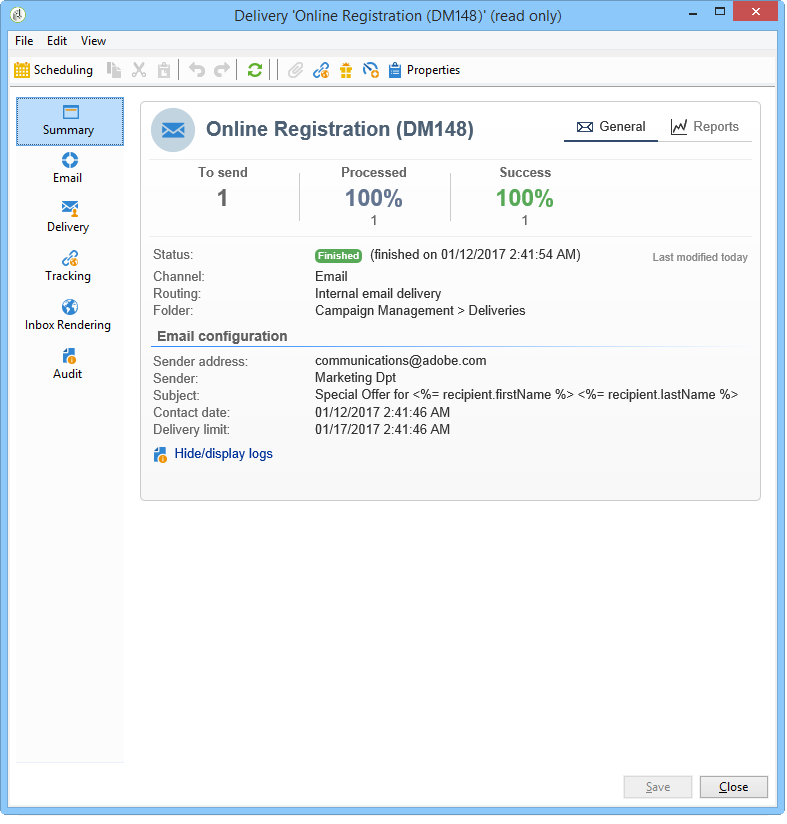

# 监控投放{#monitoring-a-delivery}

传送 **控制板** ，是监控您的传送以及发送消息时遇到的最终问题的关键。

**相关主题**

* [了解投放失败](../../delivery/using/understanding-delivery-failures.md)
* [了解隔离管理](../../delivery/using/understanding-quarantine-management.md)
* [交付最佳实践](https://docs.campaign.adobe.com/doc/AC/getting_started/EN/deliveryBestPractices.html)
* [入门：管理交付性](https://docs.campaign.adobe.com/doc/AC/getting_started/EN/deliverability.html)

## 交付仪表板 {#delivery-dashboard}

要查看分发信息，请编辑该信息，查看功能板，然后单击可用的选项卡。

发送分发后，选项卡内容不再更改。



### 投放摘要 {#delivery-summary}

该 **[!UICONTROL Summary]** 选项卡包含交付的特性：交付状态、已使用的渠道、有关发送方的信息、主题、有关执行的信息。 有关详细信息，请参阅 [发送的消息数](#number-of-messages-sent)。

通过 **[!UICONTROL reports]** 该链接，您可以查看一组与交付操作相关的报告：一般传送报告、详细报告、传送报告、失败消息的分发、打开率、点击量和交易等。 此选项卡的内容可以根据您的要求进行配置。 有关更多信息，请参见[此部分](../../reporting/using/delivery-reports.md)。

### 交付日志和历史记录 {#delivery-logs-and-history}

该选 **[!UICONTROL Delivery]** 项卡提供了此交付中的发生情况的历史记录。 它包含交付日志，即已发送的消息列表及其状态和关联的消息。

对于分发，您只能显示（例如）传送失败或隔离中地址为收件人的收件人。 要执行此操作，请单击按 **[!UICONTROL Filters]** 钮并选择 **[!UICONTROL By state]**。 然后，在下拉列表中选择状态。


此页面上列出了 [各种状态](#delivery-statuses)。

>[!NOTE]
>
>通过 **[!UICONTROL Display the mirror page for this message...]** 该链接，您可以在新窗口中查看从列表中选择的分发内容的镜像页面。 镜像页面仅对已定义HTML内容的分发可用。 有关详细信息，请参阅 [生成镜像页面](../../delivery/using/sending-messages.md#generating-the-mirror-page)。

### Tracking logs {#tracking-logs}

该选 **[!UICONTROL Tracking]** 项卡列出了此交付的跟踪历史记录。 此选项卡显示所发送消息的跟踪数据，即所有受Adobe Campaign跟踪影响的URL。 跟踪数据每小时更新一次。

>[!NOTE]
>
>如果未为分发启用跟踪，则不显示此选项卡。

跟踪配置在交付向导的相应阶段执行。 请参 [阅如何配置跟踪的链接](../../delivery/using/how-to-configure-tracked-links.md)。

**[!UICONTROL Tracking]** 数据会在交付报告中进行解释。 请参 [阅此部分](../../reporting/using/delivery-reports.md)。


### 交付审核 {#delivery-audit-}

该选 **[!UICONTROL Audit]** 项卡包含传送日志以及与校样相关的所有消息。 通过 **[!UICONTROL Refresh]** 该按钮可更新数据。 使用按 **[!UICONTROL Filters]** 钮可定义数据上的过滤器。

通过特殊图标可识别错误或警告。 请参 [阅分析交付](../../delivery/using/steps-validating-the-delivery.md#analyzing-the-delivery)。

通过 **[!UICONTROL Proofs]** 子选项卡可以查看已发送的校样列表。


通过选择要显示的列，可以修改此窗口中显示的信 **[!UICONTROL Delivery]** 息(以 **[!UICONTROL Tracking]** 及该窗口和选项卡的信息)。 为此，请单 **[!UICONTROL Configure list]** 击右下角的图标。 有关配置列表显示的详细信息，请参 [阅此部分](../../platform/using/adobe-campaign-workspace.md#configuring-lists)。

### 交付功能板同步 {#delivery-dashboard-synchronization}

在传送功能板中，您需要检查已处理的消息和传送日志，以确保已成功发送您的传送。

某些指示器或状态可能不正确或不是最新，这可通过以下解决方案解决：

* 如果您的交付状态不正确，请检查是否已为此交付完成所有必要的批准，或者是否正在运行 **[!UICONTROL operationMgt]** 和工 **[!UICONTROL deliveryMgt]** 作流而未出错。 这也可能是因为发送实例上使用未配置的关联进行传送。
* 如果您的交货指标仍为零，并且您处于中间采购配置中，请检查技术工 **[!UICONTROL Mid-sourcing (delivery counters)]** 作流程。 如果状态不是，则启动它 **[!UICONTROL Started]**。 然后，您可以尝试重新计算指示器，方法是在Adobe Campaign资源管理器中右键单击相关交付，然后选择 **[!UICONTROL Actions]** > **[!UICONTROL Recompute delivery and tracking indicators]**。 For more information on tracking indicators, refer to this [section](../../reporting/using/delivery-reports.md#tracking-indicators).
* 如果您的交付计数器与您的交付不匹配，请尝试重新计算指示器，方法是在Adobe Campaign资源管理器中右键单击相关的交付，然后选择 **[!UICONTROL Actions]** > **[!UICONTROL Recompute delivery and tracking indicators]** 重新同步。 For more information on tracking indicators, refer to this [section](../../reporting/using/delivery-reports.md#tracking-indicators).
* 如果您的交货计数器不是中部采购部署的最新状态，请检查技术工 **[!UICONTROL Mid-Sourcing (Delivery counters)]** 作流是否正在运行。 For more on this, refer to this [page](../../installation/using/mid-sourcing-deployment.md).

您还可以通过交付仪表板使用不同的报表跟踪您的交付。 For more on this, refer to this [section](../../reporting/using/delivery-reports.md).

## 性能问题 {#performance-issues}

### 清单 {#checklist-}

如果交付性能不佳，您可以检查：

* **交付的大小**:大型交付可能需要更长的时间才能完成。 MTA子项配置为处理默认的批大小，这适用于大多数情况，但在交付速度持续缓慢时需要检查。
* **交付目标**:交付性能禁止受软弹回错误的影响，软弹回错误根据重试配置进行处理。 错误数越多，需要的重试次数就越多。
* **整体平台负载**:当发送多个大型交付时，整个平台可能会受到影响。 您还可以检查IP信誉和可交付性问题。 有关此内容的详细信息，请参阅Adobe Campaign [可交付性最佳实践指南](https://docs.campaign.adobe.com/doc/AC/getting_started/EN/deliverability.html) ，并 [访问此页](../../delivery/using/about-deliverability.md)。

平台和数据库的维护也会影响交付发送性能。 有关详细信息，请参见[此页面](../../production/using/database-performances.md)。

### 交付缓慢 {#slow-deliveries}

单击该按 **[!UICONTROL Send]** 钮后，您的交付似乎比通常花费的时间更长。 这可能由不同元素引起：

* 某些电子邮件提供商可能已将您的IP地址列入黑名单。 在这种情况下，请检查您的广播并查阅 [此入门指南](https://docs.campaign.adobe.com/doc/AC/getting_started/EN/deliverability.html) 。
* 您的交付量可能太大，无法快速处理，这可能与高JavaScript个性化一起发生，或者如果您的交付量超过60KB。 请参阅Adobe Campaign交付 [最佳实践](https://docs.campaign.adobe.com/doc/AC/getting_started/EN/deliveryBestPractices.html) ，了解内容指南。
* Adobe Campaign MTA中可能已发生限制。 这是由以下原因造成的：

   * 已暂停的消息(**[!UICONTROL quotas met]** 消息):已满足在Campaign中定义的声明性MX规则声明的配额。 For more information about this message, refer to [this page](https://helpx.adobe.com/campaign/kb/acc-deliverability-faq.html#FAQ). 要进一步了解MX规则，请参 [阅本页](../../delivery/using/technical-recommendations.md#mx-rules)。
   * 已暂停的消息(**[!UICONTROL dynamic flow control]** 消息):Campaign MTA在尝试为给定ISP发送消息时遇到错误，这会导致延迟以避免错误密度过大，从而面临潜在黑名单。

* 系统问题可能会阻止服务器进行交互：这会减慢整个发送过程。 检查服务器，以确保在获取个性化数据的过程中不存在可能影响营销活动的内存或资源问题。

### 性能最佳实践 {#best-practices-performance}

* 请勿在实例上将交付保留为失败状态，因为这会维护临时表并影响性能。

* 删除不再需要的提交。

* 过去12个月中处于非活动状态的收件人将从数据库中删除以保持地址质量。

* 请勿尝试将大型交付计划在一起。 在系统上均匀地分布负载有5-10分钟的间隙。 与团队中的其他成员协调交付安排以确保最佳性能。 当营销服务器同时处理许多不同的任务时，它会降低性能。

* 尽可能减少电子邮件的大小。 建议电子邮件的最大大小为35KB左右。 电子邮件发送的大小会在发送服务器中生成一定数量的卷。

* 大型发送（如向超过100万个收件人的发送）需要在发送队列中留出空间。 单单这一点对服务器来说不是问题，但是，如果与数十个其他大型交付同时进行，则会引起发送延迟。

* 电子邮件中的个性化会从每个收件人的数据库中提取数据。 如果存在许多个性化元素，这会增加准备交付所需的数据量。

* 索引地址。 要优化应用程序中使用的SQL查询的性能，可以从数据架构的主元素中声明索引。

>[!NOTE]
>
>ISP会在不活动一段时间后取消激活地址。 弹回的消息将发送给发送方，以通知他们此新状态。

## 交货状态 {#delivery-statuses}

在发送交付时，您可能会在交付仪表板上面临以下状态：

<table> 
 <thead> 
  <tr> 
   <th> 状态<br /> </th> 
   <th> 定义和解决方案<br /> </th> 
  </tr> 
 </thead> 
 <tbody> 
  <tr> 
   <td> 不适用<br /> </td> 
   <td> 服务器(MTA)已考虑交付，但未处理。<br /> </td> 
  </tr> 
  <tr> 
   <td> 已忽略<br /> </td> 
   <td> 由于收件人的地址有错误，发送内容未发送给收件人。 它被列入黑名单、隔离、未提供或重复。 <br /> </td> 
  </tr> 
  <tr> 
   <td> 已发送<br /> </td> 
   <td> 已将发送内容正确发送到消息提供者（但接收者不一定收到）。<br /> </td> 
  </tr> 
  <tr> 
   <td> 失败<br /> </td> 
   <td> 例如，由于地址无效或收件箱已满，无法将传送内容发送给收件人。 它还可以链接到个性化块的问题，因为当架构与交付映射不匹配时，这些块会生成错误。 请参阅 <a href="#failed-status" target="_blank">失败状态</a><br /> </td> 
  </tr> 
  <tr> 
   <td> 由服务提供商考虑<br /> </td> 
   <td> SMS服务提供商收到了发送。<br /> </td> 
  </tr> 
  <tr> 
   <td> 在移动设备上接收<br /> </td> 
   <td> 接收方在其移动设备上收到SMS。<br /> </td> 
  </tr> 
  <tr> 
   <td> 待定<br /> </td> 
   <td> 交付已准备好发送，并且将由交付服务器(MTA)处理。 请参阅 <a href="#pending-status" target="_blank">待定状态</a>。<br /> </td> 
  </tr> 
  <tr> 
   <td> 交付已取消<br /> </td> 
   <td> 运营商取消了交货。<br /> </td> 
  </tr> 
  <tr> 
   <td> 准备好<br /> </td> 
   <td> 中间状态仅用于外部连接器（如移动通道）。 它遵循“待定”状态，是将确定以下状态的外部连接器。<br /> </td> 
  </tr> 
  <tr> 
   <td> 发送给服务提供商<br /> </td> 
   <td> 该交付已发送给SMS服务提供商，但尚未收到。<br /> </td> 
  </tr> 
 </tbody> 
</table>

要了解如何优化Adobe Campaign电子邮件的可交付性，请参阅Adobe Campaign可交付性 [最佳实践指南](https://docs.campaign.adobe.com/doc/AC/getting_started/EN/deliverability.html) ，以 [及本页](../../delivery/using/about-deliverability.md)。

### 待定状态 {#pending-status}

确认交货后，您会看到交货的状态为 **[!UICONTROL Pending]**。 此状态表示执行进程正在等待某些资源的可用性。

状 **[!UICONTROL Pending]** 态可以首先表示您的交货已计划好，并且在指定日期之前一直处于待定状态。 有关详细信息，请参阅“交 [付日程安排](../../delivery/using/steps-sending-the-delivery.md#scheduling-the-delivery-sending) ”部分。

如果未发送您的交货，且其状态 **[!UICONTROL Pending]**&#x200B;保持不变，则可能是以下结果：

* 在传送服务器上运行模块和进程并管理电子邮件发送的MTA（消息传送代理）可能尚未启动或需要重新启动。 要选中此项并根据需要启动模块，请应用以下步骤：

   * 检查您的模 `mta@<instance>` 块是否已在MTA服务器上启动。

   ```
   nlserver pdump
   HH:MM:SS > Application server for Adobe Campaign Classic (X.Y.Z YY.R build nnnn@SHA1) of DD/MM/YYYY
   [...]
   mta@<INSTANCENAME> (9268) - 23.0 Mb
   [...]
   ```

   * 如果未列出MTA，请使用以下命令启动它：

   ```
   nlserver start mta@<INSTANCENAME>
   ```

   >[!NOTE]
   >
   >用 `<INSTANCENAME>` 实例的名称（生产、开发等）替换。 通过配置文件标识实例名称： `[path of application]nl6/conf/config-<INSTANCENAME>.xml`

* 该传送可以使用在发送服务器上未配置的关联。 在这种情况下，请检查流量管理（IP关联）的配置，并使用该字段 **[!UICONTROL Managing affinities with IP addresses]** 将分发链接到管理关联的MTA。 For more information on affinities, refer to [this section](../../installation/using/configuring-campaign-server.md#personalizing-delivery-parameters).
* 当交付准备处于待处理状态时，可能运行的营销活动过多，从而阻止了交付的状态更新。 要解决此问题，请转 **[!UICONTROL Options]** 到并增加的值( **[!UICONTROL NmsOperation_LimitConcurrency]** 默认值为10)。 运行的营销活动数量不要超过分配给此特定选项的值。

### 失败状态 {#failed-status}

如果电子邮件发送的状态 **[!UICONTROL Failed]**&#x200B;为，则可将其链接到个性化基块的问题。 例如，当架构与交付映射不匹配时，交付中的个性化块可能会生成错误。

交付日志是了解交付失败的原因的关键。 以下是您可以从交付日志中检测到的可能错误：

* 如果收件人消息失败，并显示“无法访问”错误，提示：编 **译脚本“content htmlContent”行X时出错：未`[table]`定义。 JavaScript:评估脚本“content htmlContent**”时出错，此问题的原因几乎始终是HTML中的个性化，它试图调用在上游定位或分发的目标映射中尚未定义或映射的表或字段。

   要纠正这一错误，需要检查工作流和交付内容，以明确确定哪些个性化尝试调用相关表以及表是否可以映射。 从此处，删除HTML中对此表的调用或将映射修复到交付将是解决方案的路径。

* 在中间采购部署模型中，交付日志中可能显示以下消息：在 **中间采购服务器上调用方法“AppendDeliveryPart”时出错：“与服务器通信时出错：请检查此配置是否正确。 代码HTTP 408 &#39;服务暂时不可用&#39;**。

   原因与性能问题有关。 这意味着，营销实例在将数据发送到中间来源服务器之前，会花费太多的时间来构建数据。

   为此，我们建议对数据库执行真空和重新索引。 For more information on database maintenance, refer to [this section](../../production/using/recommendations.md).

   您还应使用计划活动重新启动所有工作流，并且所有工作流都处于失败状态。 Refer to [this section](../../workflow/using/scheduler.md).

* 交付失败时，交付日志中可能显示以下错误： **DLV-XXXX准备的消息计数(123)大于要发送的消息数(111)。 请联系支持部门。**

   通常，此错误意味着电子邮件中有一个为收件人提供多个值的个性化字段或块。 正在使用个性化块，它正在为特定收件人获取多个记录。

   要解决此问题，请检查使用的个性化数据，然后检查这些字段中任何一个字段有多个条目的收件人的目标。 在分发活动之 **[!UICONTROL Deduplication]** 前，您还可以在定位工作流中使用活动来检查一次只有一个个性化字段。 For more information on deduplication, refer to [this page](../../workflow/using/deduplication.md).

* 某些交付可能失败，并显示“无法访问”错误，提示：“入站电子邮件弹回（规则“Auto_replies”与此弹回相匹配）。 这意味着交付已成功，但Adobe Campaign从收件人处收到了与“Auto_replies”入站电子邮件规则匹配的自动回复（例如，“不在办公室”回复）。 Adobe Campaign会忽略自动回复电子邮件，收件人的地址不会发送给检疫机构。

**相关主题：**

* [交付日志和历史记录](#delivery-logs-and-history)
* [了解投放失败](../../delivery/using/understanding-delivery-failures.md)
* [交付失败类型和原因](../../delivery/using/understanding-delivery-failures.md#delivery-failure-types-and-reasons)

## 发送的消息数 {#number-of-messages-sent}

您可以通过树的节点从传送列表 **[!UICONTROL Campaign Management > Deliveries]** 访问传送。

默认情况下，提交列表包含在选定节点中创建的提交的名称和状态。 它还显示成功发送、处理和发送的消息数。

* 数量与分 **[!UICONTROL Messages to send]** 析后和交付前的目标收件人数量相对应。
* 列中的消息数与服 **[!UICONTROL success]** 务器发送和接收者接收的消息数相对应。
* 消息数 **[!UICONTROL processed]** 与收到的消息数以及有错误的消息数相对应。

传送功能板可让您跟踪发送的消息数。

>[!NOTE]
>
>对于大型交付，您可能希望更新这些值。 为此，请选择相关传送，然后右键单击它。 选 **[!UICONTROL Action > Recompute delivery and tracking indicators...]** 择，然后使用向导更新此信息。

## 计划的交付 {#scheduled-deliveries-}

如果交付在确切的预定日期不执行，则可能与服务器时区之间的差异有关。 中间采购实例和生产实例可以位于不同的时区。

例如，如果中部采购实例位于布里斯班时区，生产实例位于达尔文时区，两个时区相距半小时，那么在审计日志中，您会清楚地看到，如果中部采购的交付计划在11:56进行生产，那么中部采购的相同交付将在12:26进行，相差半小时。
