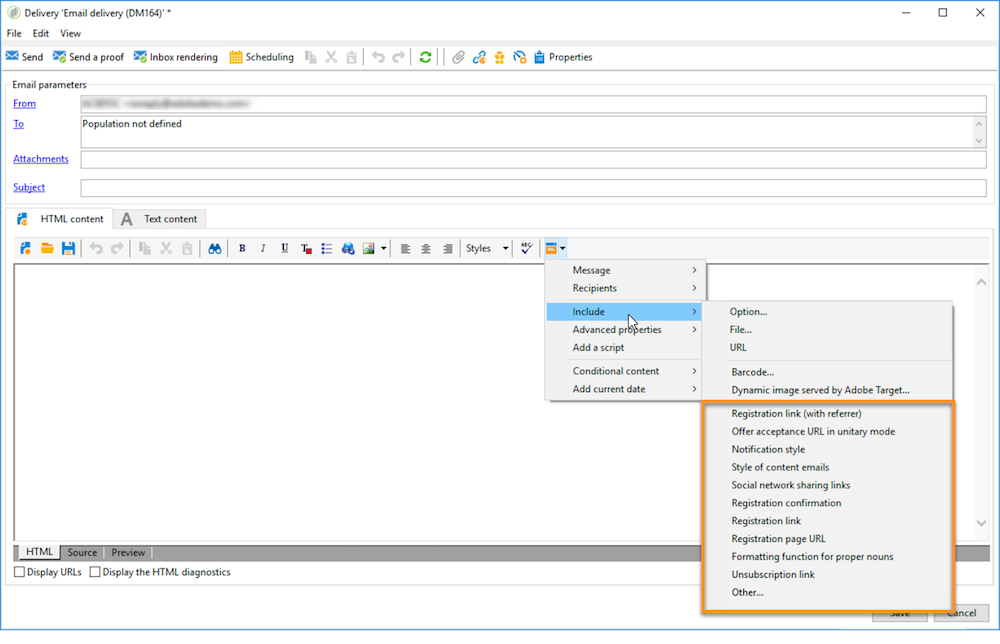
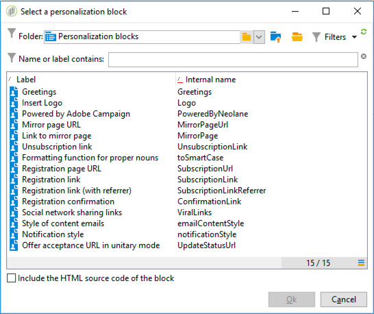

# 个性化块{#personalization-blocks}

个性化块是动态的、个性化的，并包含可插入投放中的特定渲染。 例如，您可以添加徽标、问候语消息或指向镜像页面的链接。 请参阅[插入个性化块](#inserting-personalization-blocks)。

[ 在视频中发现此功能](#personalization-blocks-video)

个性化块可通过Adobe Campaign资源管理器的&#x200B;**[!UICONTROL Resources > Campaign Management > Personalization blocks]**&#x200B;节点访问。 默认情况下，有几个块可用(请参阅[现成个性化块](#out-of-the-box-personalization-blocks))。

您能够定义新的基块，从而优化投放个性化。 有关详细信息，请参阅[定义自定义个性化块](#defining-custom-personalization-blocks)。

>[!NOTE]
>
>个性化块也可从&#x200B;**[!UICONTROL Digital Content Editor (DCE)]**&#x200B;访问。 有关详细信息，请参见[此页面](../../web/using/editing-content.md#inserting-a-personalization-block)。

## 插入个性化块{#inserting-personalization-blocks}

要在消息中插入个性化块，请执行以下步骤：

1. 在投放向导的内容编辑器中，单击个性化字段图标，然后选择&#x200B;**[!UICONTROL Include]**&#x200B;菜单。
1. 从列表中选择一个个性化区块(列表显示最后使用的10个区块)，或单击&#x200B;**[!UICONTROL Other...]**&#x200B;菜单访问完整列表。

   

1. **[!UICONTROL Other...]**&#x200B;菜单允许访问所有现成个性化块和自定义个性化块(请参阅[现成](#out-of-the-box-personalization-blocks)和[定义自定义个性化块](#defining-custom-personalization-blocks))。

   

1. 个性化块随后作为脚本插入。 在生成个性化时，它会自动适应收件人用户档案。

   

1. 单击&#x200B;**[!UICONTROL Preview]**&#x200B;选项卡并选择收件人以视图个性化。

   

您可以在投放内容中包含个性化块的源代码。 要执行此操作，请在选择时选择&#x200B;**[!UICONTROL Include the HTML source code of the block]**。


HTML源代码将插入到投放内容中。 例如，**[!UICONTROL Greetings]**&#x200B;个性化集块显示如下：


## 个性化块示例{#personalization-blocks-example}

在此示例中，我们会创建一封电子邮件，在该电子邮件中，我们使用个性化块使收件人能够视图镜像页面、在社交网络上共享新闻稿以及取消订阅将来的投放。

为此，我们需要插入以下个性化块:

* **[!UICONTROL Link to mirror page]** .
* **[!UICONTROL Social network sharing links]** .
* **[!UICONTROL Unsubscription link]** .

>[!NOTE]
>
>有关镜像页面生成的详细信息，请参阅[生成镜像页面](../../delivery/using/sending-messages.md#generating-the-mirror-page)。

1. 创建新投放或打开现有电子邮件类型投放。
1. 在投放向导中，单击&#x200B;**[!UICONTROL Subject]**&#x200B;编辑邮件的主题并输入主题。
1. 在邮件正文中插入个性化块。 要执行此操作，请单击消息内容中的个性化字段图标，然后选择&#x200B;**[!UICONTROL Include]**&#x200B;菜单。
1. 选择要插入的第一个块。 续订过程以包括另外两个块。

   

1. 单击&#x200B;**[!UICONTROL Preview]**&#x200B;选项卡以视图个性化结果。 必须选择收件人才能显示该收件人的消息。

   

1. 确认块内容显示正确。

## 现成个性化块{#out-of-the-box-personalization-blocks}

默认情况下提供一列表个性化块，帮助您个性化信息内容。

>[!NOTE]
>
>个性化块的列表取决于实例中已安装的模块和选项。



* **[!UICONTROL Greetings]** :插入收件人姓名的问候语。示例：“你好，约翰·多伊。”
* **[!UICONTROL Insert logo]** :插入在配置实例时已定义的现成徽标。
* **[!UICONTROL Powered by Adobe Campaign]** :插入“Powered by Adobe Campaign”徽标。
* **[!UICONTROL Mirror page URL]** :插入镜像页面URL，使投放设计者能够检查链接。

   >[!NOTE]
   >
   >有关镜像页面生成的详细信息，请参阅[生成镜像页面](../../delivery/using/sending-messages.md#generating-the-mirror-page)。

* **[!UICONTROL Link to mirror page]** :插入指向镜像页面的链接：&quot;如果无法正确视图此消息，请单击此处&quot;。
* **[!UICONTROL Unsubscription link]** :插入一个链接，允许取消订阅所有投放阻止列表()。
* **[!UICONTROL Formatting function for proper nouns]** :生成 **[!UICONTROL toSmartCase]** Javascript函数，该函数将每个单词的第一个字母更改为大写。此块必须插入投放的源代码中，并插入&#x200B;**`<script>...</script>`**&#x200B;标签中。

   在以下示例中，该函数用于将元素“My header”替换为每个单词的大写字母：

   ```
   <h1 id="sample">My header</h1>
   <script><%@ include view='toSmartCase'%>;
   document.getElementById("sample").innerHTML = toSmartCase("My new header");
   </script>
   ```

   

* **[!UICONTROL Registration page URL]** :插入订阅URL(请参阅 [关于服务和订阅](../../delivery/using/about-services-and-subscriptions.md))。
* **[!UICONTROL Registration link]** :插入订阅链接。在配置实例时定义的。
* **[!UICONTROL Registration link (with referrer)]** :插入订阅链接，以识别访客和投放。配置实例时已定义链接。

   >[!NOTE]
   >
   >此块只能用于投放定位访客。

* **[!UICONTROL Registration confirmation]** :插入一个链接，可启用该链接以确认订阅。
* **[!UICONTROL Social network sharing links]** :插入使收件人能够与电子邮件客户端、Facebook、Twitter和LinkedIn共享指向镜像页面内容的链接的按钮(请参 [阅病毒营销：转给朋友](../../delivery/using/viral-and-social-marketing.md#viral-marketing--forward-to-a-friend))。
* **[!UICONTROL Style of content emails]** 和 **[!UICONTROL Notification style]** :生成使用预定义HTML样式设置电子邮件格式的代码。这些块必须插入投放的源代码（位于&#x200B;**[!UICONTROL ...]**&#x200B;部分）中的&#x200B;**`<style>...</style>`**&#x200B;标签中。
* **[!UICONTROL Offer acceptance URL in unitary mode]** :插入一个URL，用于将“交互”优惠设 **[!UICONTROL Accepted]** 置为( [请参阅](../../interaction/using/offer-analysis-report.md)此部分)。

## 定义自定义个性化块{#defining-custom-personalization-blocks}

您可以通过&#x200B;**[!UICONTROL Include...]**&#x200B;菜单从个性化字段图标定义要插入的新个性化字段。 这些字段在个性化块中定义。

要创建个性化基块，请转至资源管理器并应用以下步骤：

1. 单击&#x200B;**[!UICONTROL Resources > Campaign Management > Personalization blocks]**&#x200B;节点。
1. 右键单击块的列表，然后选择&#x200B;**[!UICONTROL New]**。
1. 填写个性化基块的设置：

   

   * 输入块的标签。 此标签将显示在个性化字段插入窗口中。
   * 选择&#x200B;**[!UICONTROL Visible in the customization menus]**&#x200B;以从个性化字段插入图标访问此块。
   * 如有必要，选择&#x200B;**[!UICONTROL The content of the personalization block depends upon the format]**&#x200B;以为HTML格式和文本格式的电子邮件定义两个单独的块。

      然后，在此编辑器的下半部分（HTML内容和文本内容）中显示两个选项卡以定义相应的内容。

      

   * 输入内容（HTML、文本、JavaScript等） ，然后单击&#x200B;**[!UICONTROL Save]**。

## 教程视频{#personalization-blocks-video}

了解如何创建动态内容块以及如何使用它们个性化您的电子邮件投放的内容。

>[!VIDEO](https://video.tv.adobe.com/v/24924?quality=12)

其他Campaign Classic操作视频[此处](https://experienceleague.adobe.com/docs/campaign-classic-learn/tutorials/overview.html?lang=zh-Hans)可用。
