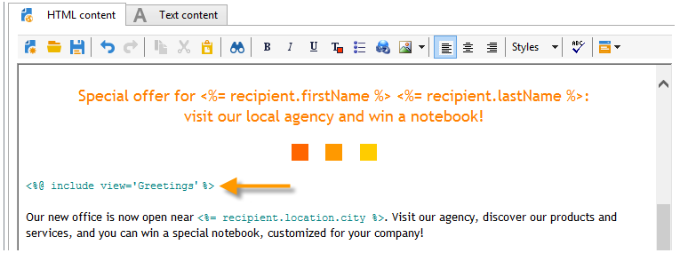

# 个性化块{#personalization-blocks}

个性化块是动态的、个性化的，并包含可插入投放中的特定渲染。 例如，您可以添加徽标、问候语消息或指向镜像页面的链接。 请参阅 [插入个性化块](#inserting-personalization-blocks).

[ 在视频中发现此功能](#personalization-blocks-video)

通过 **[!UICONTROL Resources > Campaign Management > Personalization blocks]** Adobe Campaign资源管理器的节点。 默认情况下，有多个块可用(请参阅 [开箱即用的个性化块](#out-of-the-box-personalization-blocks))。

您能够定义新块，以优化个性化投放。 有关更多信息，请参阅 [定义自定义个性化块](#defining-custom-personalization-blocks).

>[!NOTE]
>
>个性化基块也可从 **[!UICONTROL Digital Content Editor (DCE)]** . 有关详细信息，请参见[此页面](../../web/using/editing-content.md#inserting-a-personalization-block)。

## 插入个性化块 {#inserting-personalization-blocks}

要在消息中插入个性化块，请执行以下步骤：

1. 在投放向导的内容编辑器中，单击个性化字段图标，然后选择 **[!UICONTROL Include]** 菜单。
1. 从列表中选择一个个性化块（列表显示最近使用的10个块），或单击 **[!UICONTROL Other...]** 菜单访问完整列表。

   

1. 的 **[!UICONTROL Other...]** 菜单允许访问所有现成和自定义的个性化块(请参阅 [开箱即用的个性化块](#out-of-the-box-personalization-blocks) 和 [定义自定义个性化块](#defining-custom-personalization-blocks))。

   

1. 然后，个性化块将作为脚本插入。 在生成个性化时，会自动将其调整为收件人用户档案。

   

1. 单击 **[!UICONTROL Preview]** 选项卡，然后选择收件人以查看个性化。

   

您可以在投放内容中包含个性化块的源代码。 要执行此操作，请选择 **[!UICONTROL Include the HTML source code of the block]** 选择它时。

HTML源代码会插入到投放内容中。 例如， **[!UICONTROL Greetings]** 个性化区块如下所示：

## 个性化块示例 {#personalization-blocks-example}

在此示例中，我们创建了一封电子邮件，在其中，我们使用个性化块使收件人能够查看镜像页面、在社交网络上共享新闻稿，以及取消订阅将来的投放。

为此，我们需要插入以下个性化块：

* **[!UICONTROL Link to mirror page]** .
* **[!UICONTROL Social network sharing links]** .
* **[!UICONTROL Unsubscription link]** .

>[!NOTE]
>
>有关镜像页面生成的详细信息，请参阅 [生成镜像页面](sending-messages.md#generating-the-mirror-page).

1. 创建新投放或打开现有电子邮件类型投放。
1. 在投放向导中，单击 **[!UICONTROL Subject]** 编辑消息的主题并输入主题。
1. 在消息正文中插入个性化块。 为此，请单击消息内容中的，单击个性化字段图标，然后选择 **[!UICONTROL Include]** 菜单。
1. 选择要插入的第一个块。 续订该过程以包含另外两个块。

   

1. 单击 **[!UICONTROL Preview]** 选项卡来查看个性化结果。 您必须选择一个收件人以显示该收件人的消息。

   

1. 确认块内容显示正确。

## 开箱即用的个性化块 {#out-of-the-box-personalization-blocks}

默认情况下，会提供个性化块列表，以帮助您个性化消息的内容。

>[!NOTE]
>
>个性化块的列表取决于您的实例中已安装的模块和选项。

* **[!UICONTROL Greetings]** :插入带有收件人姓名的问候语。 示例：“你好，无名氏”。
* **[!UICONTROL Insert logo]** :插入配置实例时定义的现成徽标。
* **[!UICONTROL Powered by Adobe Campaign]** :插入“Powered by Adobe Campaign”徽标。
* **[!UICONTROL Mirror page URL]** :插入镜像页面URL，使交付设计人员能够检查该链接。

   >[!NOTE]
   >
   >有关镜像页面生成的详细信息，请参阅 [生成镜像页面](sending-messages.md#generating-the-mirror-page).

* **[!UICONTROL Link to mirror page]** :插入指向镜像页面的链接：“如果您无法正确查看此消息，请单击此处”。
* **[!UICONTROL Unsubscription link]** :插入一个链接，以取消所有投放的订阻止列表阅()。
* **[!UICONTROL Formatting function for proper nouns]** :生成 **[!UICONTROL toSmartCase]** Javascript函数，该函数将每个单词的第一个字母更改为大写。
* **[!UICONTROL Registration page URL]** :插入订阅URL(请参阅 [关于服务和订阅](about-services-and-subscriptions.md))。
* **[!UICONTROL Registration link]** :插入订阅链接。 在配置实例时定义的规则集。
* **[!UICONTROL Registration link (with referrer)]** :插入订阅链接，以识别访客和投放。 配置实例时已定义链接。

   >[!NOTE]
   >
   >此块可用于仅定位访客的投放。

* **[!UICONTROL Registration confirmation]** :插入用于确认订阅的链接。
* **[!UICONTROL Social network sharing links]** :插入按钮，使收件人能够与电子邮件客户端、Facebook、Twitter和LinkedIn共享指向镜像页面内容的链接(请参阅 [病毒式营销：转向朋友](viral-and-social-marketing.md#viral-marketing--forward-to-a-friend))。
* **[!UICONTROL Style of content emails]** 和 **[!UICONTROL Notification style]** :生成代码，以使用预定义的HTML样式设置电子邮件的格式。 这些块必须插入到投放的源代码中，即 **[!UICONTROL ...]** 部分输入 **``** 标记。
* **[!UICONTROL Offer acceptance URL in unitary mode]** :插入一个URL，以便将交互选件设置为 **[!UICONTROL Accepted]** (请参阅 [此部分](../../interaction/using/offer-analysis-report.md))。

## 定义自定义个性化块 {#defining-custom-personalization-blocks}

您可以通过 **[!UICONTROL Include...]** 菜单。 这些字段在个性化块中定义。

要创建个性化块，请转到资源管理器并应用以下步骤：

1. 单击 **[!UICONTROL Resources > Campaign Management > Personalization blocks]** 节点。
1. 右键单击块列表，然后选择 **[!UICONTROL New]** .
1. 填写个性化块的设置：

   

   * 输入块的标签。 此标签将显示在个性化字段插入窗口中。
   * 选择 **[!UICONTROL Visible in the customization menus]** 使此块可从个性化字段插入图标访问。
   * 如有必要，请选择 **[!UICONTROL The content of the personalization block depends upon the format]** 为HTML格式的电子邮件和文本格式的电子邮件定义两个单独的块。

      然后，在此编辑器的下部分(HTML内容和文本内容)中显示两个选项卡，以定义相应的内容。

      

   * 输入内容(HTML、文本、JavaScript等) ，然后单击 **[!UICONTROL Save]**.

## 教程视频 {#personalization-blocks-video}

了解如何创建动态内容块以及如何使用动态内容块将电子邮件投放的内容个性化。

>[!VIDEO](https://video.tv.adobe.com/v/24924?quality=12)

提供了其他Campaign Classic操作方法视频 [此处](https://experienceleague.adobe.com/docs/campaign-classic-learn/tutorials/overview.html?lang=zh-Hans).
