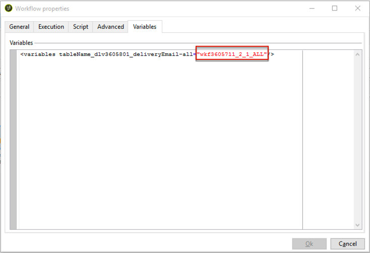

# 个性化字段{#personalization-fields}

个性化字段用于投放消息内容的一级个性化。在主内容中插入的字段显示插入选定数据源中数据的位置。

例如，语法为&#x200B;**&lt;%= recipient.LastName %>**&#x200B;的个性化字段告知Adobe Campaign将收件人的名称插入到数据库（收件人表）。

 [通过观看视频了解此功能](#personalization-fields-video)

>[!CAUTION]
>
>个性化字段内容不能超过1024个字符。

## 数据源 {#data-sources}

根据所选的投放模式，个性化字段可以来自两种类型的数据源：

* Adobe Campaign数据库是数据源。 这是最常见的情况，例如“收件人个性化字段”。 这些是在收件人表中定义的所有字段，无论是标准字段（通常为：姓氏、名字、地址、城镇、出生日期等）还是用户定义的字段。
* 外部文件是数据源。 这些是在使用外部文件中的数据进行投放期间作为输入呈现的文件列中定义的所有字段。

>[!NOTE]
>
>Adobe Campaign个性化标记始终具有以下形式&#x200B;**&lt;%=table.field%>**。

## 插入个性化字段 {#inserting-a-personalization-field}

要插入个性化字段，请单击可从任何标题、主题或邮件正文编辑字段访问的下拉图标。

在选择数据源（收件人字段或文件字段）后，此插入采用命令形式，该命令将由Adobe Campaign解释并替换为给定收件人的字段值。 随后可以在&#x200B;**[!UICONTROL Preview]**&#x200B;选项卡中查看物理替换。

## 个性化字段示例 {#personalization-fields-example}

我们将创建一封电子邮件，其中首先插入收件人的姓名，然后在邮件正文中添加用户档案创建日期。 操作步骤：

1. 创建新投放或打开现有的电子邮件类型投放。
1. 在传递助理中，单击&#x200B;**[!UICONTROL Subject]**&#x200B;编辑邮件的主题并输入主题。
1. 输入“ **[!UICONTROL Special offer for]**”并使用工具栏中的按钮插入个性化字段。 选择 **[!UICONTROL Recipients>Title]**。

   

1. 重复操作以插入收件人的名称。 在所有个性化字段之间插入空格。
1. 单击&#x200B;**[!UICONTROL OK]**&#x200B;进行验证。
1. 在消息正文中插入个性化设置。 要执行此操作，请单击消息内容，然后单击字段插入按钮。
1. 选择 **[!UICONTROL Recipient>Other...]**。

   

1. 选择要显示信息的字段，然后单击&#x200B;**[!UICONTROL OK]**。

   

1. 单击&#x200B;**[!UICONTROL Preview]**&#x200B;选项卡以查看个性化结果。 您必须选择一个收件人以显示该收件人的消息。

   

   >[!NOTE]
   >
   >当投放属于工作流的一部分时，您可以使用临时工作流表中的数据。 此数据在&#x200B;**[!UICONTROL Target extension]**&#x200B;菜单中分组。 如需详细信息，请参阅[此小节](../../workflow/using/data-life-cycle.md#target-data)。

## 优化个性化 {#optimizing-personalization}

您可以使用投放属性的&#x200B;**[!UICONTROL Prepare the personalization data with a workflow]**&#x200B;选项卡中提供的专用选项&#x200B;**[!UICONTROL Analysis]**&#x200B;来优化个性化。 有关分析投放的详细信息，请参阅[此部分](steps-validating-the-delivery.md#analyzing-the-delivery)。

在投放分析期间，此选项会自动创建和执行工作流，该工作流会将链接到目标的所有数据（包括来自FDA中链接的表的数据）存储在临时表中。

选中此选项可以极大地改进处理大量数据时的投放分析性能，尤其是当个性化数据通过FDA来自外部表时。 有关详细信息，请参阅[访问外部数据库(FDA)](../../installation/using/about-fda.md)。

例如，如果在向大量收件人投放消息时，并在消息内容中使用大量个性化字段和/或个性化块时遇到性能问题，则此选项可以加快个性化处理，从而加快消息的投放。

要使用此选项，请执行以下步骤：

1. 创建营销策划。 如需详细信息，请参阅[此小节](../../campaign/using/setting-up-marketing-campaigns.md#creating-a-campaign)。
1. 在营销活动的&#x200B;**[!UICONTROL Targeting and workflows]**&#x200B;选项卡中，将&#x200B;**查询**&#x200B;活动添加到您的工作流。 有关使用此活动的详细信息，请参阅[此部分](../../workflow/using/query.md)。
1. 将&#x200B;**[!UICONTROL Email delivery]**&#x200B;活动添加到工作流并打开它。 有关使用此活动的详细信息，请参阅[此部分](../../workflow/using/delivery.md)。
1. 转到&#x200B;**[!UICONTROL Analysis]**&#x200B;的&#x200B;**[!UICONTROL Delivery properties]**&#x200B;选项卡并选择&#x200B;**[!UICONTROL Prepare the personalization data with a workflow]**&#x200B;选项。

   

1. 配置投放并启动工作流以启动分析。

分析完成后，个性化数据会通过分析期间动态创建的临时技术工作流存储在临时表中。

此工作流在Adobe Campaign界面中不可见。 它仅用于作为快速存储和处理个性化数据的技术手段。

分析完成后，转到工作流&#x200B;**[!UICONTROL Properties]**&#x200B;并选择&#x200B;**[!UICONTROL Variables]**&#x200B;选项卡。 在这里，您可以看到可用于进行SQL调用的临时表的名称，以显示它包含的ID。

## 个性化阶段超时 {#timing-out-personalization}

要改进投放保护，您可以为个性化阶段设置超时期限。

在&#x200B;**[!UICONTROL Delivery]**&#x200B;的&#x200B;**[!UICONTROL Delivery properties]**&#x200B;选项卡中，为&#x200B;**[!UICONTROL Maximum personalization run time]**&#x200B;选项选择最大值（以秒为单位）。

在预览或发送期间，如果个性化阶段超过您在此字段中设置的最大时间，则流程将中止，并出现错误消息，投放将失败。

默认值为5秒。

如果将此选项设置为0，则个性化阶段将没有时间限制。

## Personalization选项卡 {#personalization-tab}

在投放属性中，您具有Personalization选项卡。

您可以通过单击&#x200B;**“编辑收件人配置文件加载查询”**，将数据添加到定向维度的配置文件查询中。 您可以使用直接在表达式中提取的数据来提取您真正需要的内容。 这些数据将被添加到上下文中。

{zoomable="yes"}

如果要添加的数据不在定向维度中，您可以单击&#x200B;**“在脚本的执行上下文中添加对象”**。

{zoomable="yes"}

您可以在此处选择所需的对象架构，然后在Javascript代码中使用这些数据，这些数据将在投放准备期间执行。

{zoomable="yes"}

通过添加对象架构，您可以选择要添加到上下文的字段：

{zoomable="yes"}

## 教程视频 {#personalization-fields-video}

了解如何在主题行中添加个性化字段，以及如何添加电子邮件投放的内容。

>[!VIDEO](https://video.tv.adobe.com/v/27467?quality=12&captions=chi_hans)

[此处](https://experienceleague.adobe.com/docs/campaign-classic-learn/tutorials/overview.html?lang=zh-Hans)提供了其他 Campaign Classic 操作方法视频。
