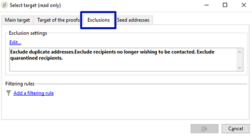

# 个性化优惠券{#personalized-coupons}

向投放添加优惠券可为收件人提供更高的产品和服务价值。 您可以使用促销活动优惠券模块创建一组要添加到即将推出的营销选件的优惠券。 准备好创建投放时，分配适用的优惠券。 由于优惠券在选定时段内有效，因此分配的优惠券将唯一地链接到其投放消息。 此外，Campaign会确认在发送投放之前有足够的优惠券接收消息数量。

>[!NOTE]
>
>优惠券管理是必须安装的包。 要确认您具有优惠券管理，请检查&#x200B;**[!UICONTROL Administration > Configuration > Package management > Installed packages.]**
>
>优惠券数据可以使用CSV和XML格式导入和导出。 有关导入和导出的详细信息，请参阅[此部分](../../platform/using/get-started-data-import-export.md)。

## 创建优惠券{#creating-a-coupon}

在创建优惠券时，优惠券模块为您提供两个选项：

* **匿名**:选定收件人或收件人列表的通用优惠券。
* **个人**:针对选定收件人的个性化优惠券。

在执行以下步骤之前，请确保您知道要创建的优惠券类型。

1. 在营销活动树中，转到&#x200B;**[!UICONTROL Resources > Campaign management > Coupons]**。

   

1. 单击 **[!UICONTROL New]** 按钮。
1. 在&#x200B;**[!UICONTROL Label]**&#x200B;字段中输入优惠券的名称。 已在&#x200B;**[!UICONTROL Coupon code]**&#x200B;中自动输入唯一代码。 您可以保留代码或输入新代码。

   

1. 选择&#x200B;**[!UICONTROL Start date]**&#x200B;和&#x200B;**[!UICONTROL End date]**&#x200B;以设置优惠券的有效期。
1. 在&#x200B;**[!UICONTROL Coupon type]**&#x200B;中，选择“匿名”或“个人”。

   **[!UICONTROL Anonymous coupons]** :所有收件人的匿名优惠券都相同。确认在&#x200B;**优惠券类型**&#x200B;菜单中选择了匿名，然后单击&#x200B;**保存**&#x200B;以生成优惠券。

   **[!UICONTROL Individual coupons]** :单个优惠券可以进一步使用附加优惠券代码进行个性化。例如，在体育用品商店为销售创建单个优惠券。 然而，受训者名单很长，他们对一项体育运动的热情并不相同。 您可以根据体育运动（例如足球、足球、棒球等）为单个优惠券添加代码名称 并将每个代码发送给适用的收件人。

   1. 选择“个人”时，左下角会显示一个新选项卡“优惠券”。 转到&#x200B;**[!UICONTROL Coupons]**&#x200B;选项卡，然后单击&#x200B;**[!UICONTROL Add]**。
   1. 在弹出窗口提示时，为单个优惠券输入唯一代码。
   1. 单击&#x200B;**[!UICONTROL Save]**&#x200B;以生成优惠券。

   有关“优惠券”选项卡的更多详细信息，请参阅[配置单个优惠券](#configuring-individual-coupons)。

   >[!NOTE]
   >
   >可以批量导入单个优惠券。 有关导入和导出的详细信息，请参阅[此部分](../../platform/using/get-started-data-import-export.md)。

### 配置单个优惠券{#configuring-individual-coupons}

“优惠券”选项卡仅可用于“单个优惠券”。 将优惠券与投放关联后，“优惠券”选项卡提供以下详细信息：

* **[!UICONTROL Status]** :优惠券的可用性。
* **[!UICONTROL Redeemed on]** :票息兑换日期。
* **[!UICONTROL Channel]** :用于发送优惠券的渠道。
* **[!UICONTROL Address]** :收件人的电子邮件地址。

**[!UICONTROL status]**、**[!UICONTROL channel]**&#x200B;和&#x200B;**[!UICONTROL address]**&#x200B;的值会自动完成。 但是，Campaign无法恢复&#x200B;**[!UICONTROL redeemed on]**&#x200B;的值。 可通过导入包含优惠券兑换详细信息的文件来完成这些操作。

## 将优惠券插入电子邮件投放{#inserting-a-coupon-into-an-email-delivery}

在以下示例中，从主页创建投放。 有关如何创建投放的详细说明，请参阅[此部分](../../delivery/using/about-email-channel.md)。 您还可以在工作流中向投放添加优惠券。

1. 转到&#x200B;**[!UICONTROL Campaigns]**&#x200B;并选择&#x200B;**[!UICONTROL Deliveries]**。
1. 单击 **[!UICONTROL Create]**。

   

1. 在&#x200B;**[!UICONTROL Label]**&#x200B;中输入名称，然后单击&#x200B;**[!UICONTROL Continue]**。
1. 单击&#x200B;**[!UICONTROL To]**&#x200B;以添加收件人。
1. 单击&#x200B;**[!UICONTROL Add]**&#x200B;以选择投放的收件人。 选择收件人后，单击&#x200B;**[!UICONTROL Ok]**&#x200B;返回投放。

   

1. 输入主题并向消息中添加内容。

   

1. 在工具栏中，单击&#x200B;**[!UICONTROL Properties]** ，然后选择&#x200B;**[!UICONTROL Advanced]**&#x200B;选项卡。
1. 单击&#x200B;**[!UICONTROL Coupon management]**&#x200B;的文件夹图标。

   

1. 选择优惠券并单击&#x200B;**[!UICONTROL Ok]**。 再次单击&#x200B;**[!UICONTROL Ok]**。

   

1. 单击消息以选择要将优惠券放置到的位置。

   

1. 单击个性化图标，根据优惠券类型选择以下选项之一：

   * 匿名优惠券：**[!UICONTROL Coupon > Coupon code]**

      

   * 单个优惠券：**[!UICONTROL Coupon value > Coupon code]**

      

      优惠券将作为代码而不是您指定的名称插入到消息中。 该代码在Campaign Ootb数据模型中使用。
   

1. 运行测试以确认您分配给优惠券的名称。 转到&#x200B;**[!UICONTROL Preview]**&#x200B;选项卡，然后单击&#x200B;**[!UICONTROL Test personalization]**。 选择测试的收件人。

   

   测试后，优惠券应显示为分配的名称，而不是代码。

   

1. 在工具栏中，单击&#x200B;**[!UICONTROL Send]**（左上角），然后选择发送投放的方式。

   

1. 单击 **[!UICONTROL Analyze]**。如果分析日志确认所有收件人都有足够的优惠券，请单击&#x200B;**[!UICONTROL Confirm delivery]**&#x200B;发送。

   

>[!NOTE]
>
>有关如何管理投放的优惠券不足的说明，请参阅[管理优惠券不足](#managing-insufficient-coupons)

确认投放成功：

1. 转到&#x200B;**[!UICONTROL Explorer > Resources > Campaign management > Coupons]**。
1. 单击&#x200B;**[!UICONTROL Deliveries]**&#x200B;选项卡。

   

   成功投放的状态将显示为&#x200B;**[!UICONTROL Finished]**。

>[!NOTE]
>
>默认情况下，优惠券管理模块使用&#x200B;**nms:recipient**&#x200B;表。 有关如何使用其他表的说明，请参阅[编辑架构](../../configuration/using/data-schemas.md)。

## 管理优惠券不足{#managing-insufficient-coupons}

如果优惠券数少于消息数，投放分析会停止。 在这种情况下，您可以导入更多优惠券或限制消息数量。 如果要限制消息数量，请按照以下说明操作。

1. 转到电子邮件投放窗口。
1. 单击 **[!UICONTROL To]**。
1. 在&#x200B;**[!UICONTROL Select target]**&#x200B;中，转到&#x200B;**[!UICONTROL Exclusions]**&#x200B;选项卡。

   

1. 在排除设置部分中，单击&#x200B;**[!UICONTROL Edit]**。
1. 输入要在&#x200B;**[!UICONTROL Limit delivery to...messages]**&#x200B;中发送的消息数，然后单击&#x200B;**[!UICONTROL Ok]**。 您可以发送投放。

   

>[!NOTE]
>
>在管理有限数量的优惠券时，通过投放工作流，您可以根据标准对投放进行拆分。 如果要向选定的群体发送优惠券而不限制目标，则此选项是一个不错的选项。
