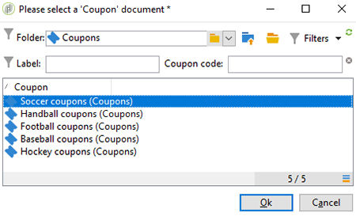
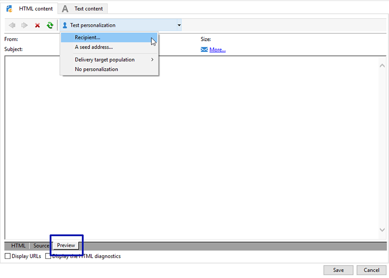

# 个性化优惠券{#personalized-coupons}

向投放添加优惠券可以为收件人提供更高的产品和服务价值。 您可以使用活动优惠券模块创建一组优惠券，您希望将这些优惠券添加到即将到来的营销优惠。 当您准备好创建投放时，请分配适用的优惠券。 由于优惠券在选择的时间段内有效，所分配的优惠券将唯一链接到其投放消息。 此外，活动确认在发送投放之前有足够的优惠券来容纳邮件数。

>[!NOTE]
>
>优惠券管理是必须安装的包。 要确认您有优惠券管理，请检查&#x200B;**[!UICONTROL Administration > Configuration > Package management > Installed packages.]**
>
>优惠券数据可以使用CSV和XML格式导入和导出。 有关导入和导出的详细信息，请参阅[本节](../../platform/using/get-started-data-import-export.md)。

## 创建优惠券{#creating-a-coupon}

优惠券模块在创建优惠券时提供两种选项：

* **匿名**:用于选择收件人或列表收件人的通用优惠券。
* **个人**:针对特定收件人的个性化优惠券。

在执行以下步骤之前，请确保您知道要创建的优惠券类型。

1. 在活动树中，转到&#x200B;**[!UICONTROL Resources > Campaign management > Coupons]**。

   

1. 单击 **[!UICONTROL New]** 按钮。
1. 在&#x200B;**[!UICONTROL Label]**&#x200B;字段中输入优惠券的名称。 已在&#x200B;**[!UICONTROL Coupon code]**&#x200B;中自动输入唯一代码。 您可以保留代码或输入新代码。

   

1. 选择&#x200B;**[!UICONTROL Start date]**&#x200B;和&#x200B;**[!UICONTROL End date]**&#x200B;以设置优惠券有效期。
1. 在&#x200B;**[!UICONTROL Coupon type]**&#x200B;中，选择“匿名”或“个人”。

   **[!UICONTROL Anonymous coupons]** :匿名优惠券对于所有收件人都是相同的。确认在&#x200B;**优惠券类型**&#x200B;菜单中选择了“匿名”，然后单击&#x200B;**保存**&#x200B;以生成优惠券。

   **[!UICONTROL Individual coupons]** :可以利用额外的优惠券代码进一步个性化单个优惠券。例如，在体育设备商店为销售创建单个优惠券。 然而，收件人的列表很长，他们对一项运动没有同样的热情。 您可以根据体育运动（例如足球、足球、棒球等）为单个优惠券添加代码名称 并将每个代码发送给相应的收件人。

   1. 选择“个人”时，左下角会显示一个新选项卡“优惠券”。 转到&#x200B;**[!UICONTROL Coupons]**&#x200B;选项卡并单击&#x200B;**[!UICONTROL Add]**。
   1. 在弹出窗口提示时，为单个优惠券输入唯一代码。
   1. 单击&#x200B;**[!UICONTROL Save]**&#x200B;以生成优惠券。

   有关“优惠券”选项卡的详细信息，请参阅[配置单个优惠券](#configuring-individual-coupons)。

   >[!NOTE]
   >
   >可以批量导入单个优惠券。 有关导入和导出的详细信息，请参阅[本节](../../platform/using/get-started-data-import-export.md)。

### 配置单个优惠券{#configuring-individual-coupons}

“优惠券”标签仅对“单个优惠券”提供。 在优惠券与投放关联后，优惠券选项卡提供以下详细信息：

* **[!UICONTROL Status]** :优惠券的发行。
* **[!UICONTROL Redeemed on]** :优惠券的兑换日期。
* **[!UICONTROL Channel]** :用于发送优惠券的渠道。
* **[!UICONTROL Address]** :收件人的电子邮件地址。

**[!UICONTROL status]**、**[!UICONTROL channel]**&#x200B;和&#x200B;**[!UICONTROL address]**&#x200B;的值将自动完成。 但是，**[!UICONTROL redeemed on]**&#x200B;的值不会由活动恢复。 可通过导入包含优惠券兑换详细信息的文件来完成这些操作。

## 将优惠券插入电子邮件投放{#inserting-a-coupon-into-an-email-delivery}

在以下示例中，投放是从主页创建的。 有关如何创建投放的详细说明，请参阅[本节](../../delivery/using/about-email-channel.md)。 您还可以在工作流中向投放添加优惠券。

1. 转到&#x200B;**[!UICONTROL Campaigns]**&#x200B;并选择&#x200B;**[!UICONTROL Deliveries]**。
1. 单击 **[!UICONTROL Create]**。

   

1. 在&#x200B;**[!UICONTROL Label]**&#x200B;中输入名称，然后单击&#x200B;**[!UICONTROL Continue]**。
1. 单击&#x200B;**[!UICONTROL To]**&#x200B;添加收件人。
1. 单击&#x200B;**[!UICONTROL Add]**&#x200B;以选择收件人作为投放。 选择收件人后，单击&#x200B;**[!UICONTROL Ok]**&#x200B;返回投放。

   

1. 输入主题并向邮件中添加内容。

   

1. 在工具栏中，单击&#x200B;**[!UICONTROL Properties]**&#x200B;并选择&#x200B;**[!UICONTROL Advanced]**&#x200B;选项卡。
1. 单击&#x200B;**[!UICONTROL Coupon management]**&#x200B;的文件夹图标。

   

1. 选择优惠券并单击&#x200B;**[!UICONTROL Ok]**。 再次单击&#x200B;**[!UICONTROL Ok]**。

   

1. 单击消息以选择要放置优惠券的位置。

   

1. 单击个性化图标，根据优惠券类型选择以下选项之一：

   * 匿名优惠券：**[!UICONTROL Coupon > Coupon code]**

      

   * 个人优惠券：**[!UICONTROL Coupon value > Coupon code]**

      

      优惠券将作为代码而非您指定的名称插入到消息中。 该代码在活动otb数据模型内使用。
   

1. 运行测试以确认您分配给优惠券的名称。 转到&#x200B;**[!UICONTROL Preview]**&#x200B;选项卡并单击&#x200B;**[!UICONTROL Test personalization]**。 选择测试收件人。

   

   测试后，优惠券应显示为指定的名称，而非代码。

   

1. 在工具栏中，单击&#x200B;**[!UICONTROL Send]**（左上方），然后选择要发送投放的方式。

   

1. 单击 **[!UICONTROL Analyze]**。如果分析日志确认所有收件人都有足够的优惠券，请单击&#x200B;**[!UICONTROL Confirm delivery]**&#x200B;发送。

   

>[!NOTE]
>
>有关如何管理投放票证不足的说明，请参阅[管理票证不足](#managing-insufficient-coupons)

确认投放成功：

1. 转到&#x200B;**[!UICONTROL Explorer > Resources > Campaign management > Coupons]**。
1. 单击&#x200B;**[!UICONTROL Deliveries]**&#x200B;选项卡。

   

   成功投放时，状态将显示为&#x200B;**[!UICONTROL Finished]**。

>[!NOTE]
>
>默认情况下，优惠券管理模块使用&#x200B;**nms:收件人**&#x200B;表。 有关如何使用其他表的说明，请参阅[编辑模式](../../configuration/using/data-schemas.md)。

## 管理票据不足{#managing-insufficient-coupons}

如果优惠券数少于消息数，投放分析将停止。 在这种情况下，您可以导入更多优惠券或限制消息数。 如果要限制消息数，请按照以下说明操作。

1. 转到电子邮件投放窗口。
1. 单击 **[!UICONTROL To]**。
1. 在&#x200B;**[!UICONTROL Select target]**&#x200B;中，转到&#x200B;**[!UICONTROL Exclusions]**&#x200B;选项卡。

   

1. 在排除设置部分，单击&#x200B;**[!UICONTROL Edit]**。
1. 输入要在&#x200B;**[!UICONTROL Limit delivery to...messages]**&#x200B;中发送的消息数，然后单击&#x200B;**[!UICONTROL Ok]**。 您可以发送投放。

   

>[!NOTE]
>
>在管理有限数量的优惠券时，投放工作流允许您根据您的条件拆分投放。 如果您希望将优惠券发送到选定人群而不限制目标，则这是一个不错的选项。
