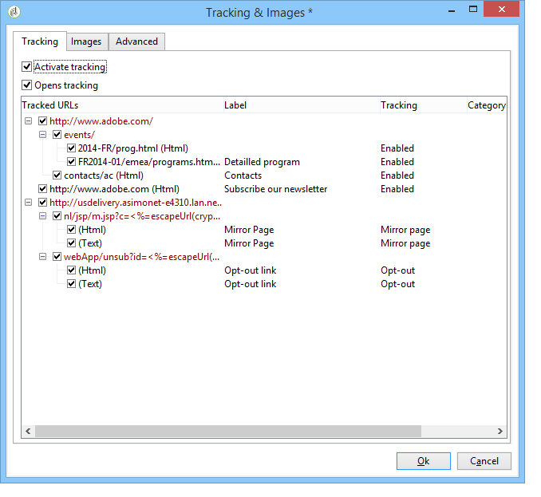

# 配置 URL 跟踪选项{#personalizing-url-tracking}

高级消息跟踪设置可通过 **[!UICONTROL Tracking & Images]** 图标。

>[!NOTE]
>
>The management of images in emails is also configured in this window. 请参阅 [添加图像](defining-the-email-content.md#adding-images).

You can configure the tracking options:

* 激活/取消激活所有消息的URL跟踪。

   >[!CAUTION]
   >
   >在投放上未激活跟踪时(例如， **[!UICONTROL Activate tracking]** 选项)，与跟踪相关的报表和数据将不可用：打开、热点点击和跟踪的URL报表将不显示任何数据，并且 **[!UICONTROL Tracking logs]** 此投放不显示选项卡。

* 将打开用于消息的激活/取消激活跟踪。

跟踪的URL以树形形式列在中心窗口中。

您可以为消息的每个URL单独激活或取消激活跟踪。 如需详细信息，请参阅[此部分](how-to-configure-tracked-links.md)。

的 **[!UICONTROL Advanced]** 选项卡，可将跟踪的URL和开始URL的计算公式个性化。

>[!CAUTION]
>
>Settings in this tab can only be modified by expert users.
