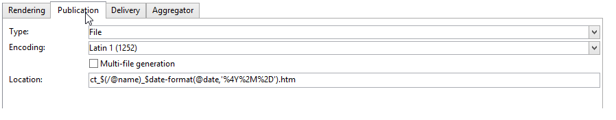

# 发布模板{#publication-templates}


## 关于发布模板 {#about-publication-templates}

发布模板是要发布的内容的标识卡。 它引用了发布过程中使用的资源，即：

* 数据模式，
* 输入表，
* 每个输出文档的转换模板。

## 发布模板的标识 {#identification-of-a-publication-template}

发布模板通过其名称和命名空间进行标识。

样式表的标识键是由命名空间和名称以冒号分隔的字符串；例如： **cus:newsletter**.

>[!NOTE]
>
>实际上，建议对架构、表单和发布模板使用相同的键。

## 创建和配置模板 {#creating-and-configuring-the-template}

默认情况下，发布模板存储在 **[!UICONTROL Administration > Configuration > Publication templates]** 节点。 要创建新模板，请单击 **[!UICONTROL New]** 按钮。

要配置发布模板，请填充模板的名称（即由名称和命名空间组成的标识键）、其标签、数据架构以及链接到的输入表单。


>[!NOTE]
>
>每当基于此发布模板创建内容时，都会显示标签。

的 **检查状态以验证内容生成** 选项强制检查内容实例的“已验证”状态，以授权文件生成。 有关更多信息，请参阅 [发布](#publication).

必须为每个输出文档添加转换模板。 您可以创建所需数量的转换模板。

的 **[!UICONTROL Name of template]** 字段是一个自由标签，用于描述输出中渲染的类型。 对于每个转换模板，发布设置都位于选项卡中。

### 渲染 {#rendering}

的 **[!UICONTROL Rendering]** 选项卡，选择

* 用于投影输出文档的呈现类型：XSL样式表或JavaScript模板，
* 输出文档的格式：HTML、文本、XML或RTF，
* 包含构建数据的模板，即要使用的样式表或JavaScript模板。

### 发布 {#publication}

发布包括以文件形式生成输出文档(如果所选类型为 **[!UICONTROL File]**.



以下发布选项可用：

* 可以通过 **[!UICONTROL Encoding]** 字段。 默认使用拉丁文1(1252)字符集。
* 的 **[!UICONTROL Multi-file generation]** 选项可激活特殊的文档发布模式。 此选项包括在输出文档每个页面的开头填充分区标记。 生成内容将为每个填充的分区标记生成一个文件。 此模式用于从内容块生成微型站点。 有关更多信息，请参阅 [多文件生成](#multi-file-generation).
* 的 **[!UICONTROL Location]** 字段包含输出文件的名称。 该名称可由变量组成，以便生成自动文件名。

   变量会使用以下格式填充： **`$(<xpath>)`**，其中 **`<xpath>`** 是发布模板数据架构的字段路径。

   文件名称可以由日期类型字段组成。 要正确设置此字段的格式，请使用 **$date-format** 函数，使用字段的路径和输出格式作为参数。

   默认情况下，文件名的构造格式使用“@name”和“@date”字段中的变量：

   ```
   ct_$(@name)_$date-format(@date,'%4Y%2M%2D').htm
   ```

   生成的文件名将如下所示：ct_news12_20110901.htm.

   >[!NOTE]
   >
   >有关内容生成的更多信息，请参阅 [创建内容实例](using-a-content-template.md#creating-a-content-instance).

### 投放 {#delivery}

利用此选项卡，可选择方案以直接在内容上启动投放。 将根据输出格式(HTML或文本)自动填充电子邮件的内容。


>[!NOTE]
>
>有关基于内容创建投放的示例，请参阅 [交付内容实例](using-a-content-template.md#delivering-a-content-instance).

### 聚合器 {#aggregator}

通过从脚本或查询列表聚合数据，可以使用内容数据扩充XML文档。 其目的是补充链接所引用的某些信息或从数据库中添加元素。

### 多文件生成 {#multi-file-generation}

要激活多个文件生成，请选择 **[!UICONTROL Multi-file generation]** 选项。 此选项允许您在样式表中为输出文档的每个页面的开头指定分区标记。 内容的生成将针对遇到的每个分区标记生成一个文件。

要在样式表中集成的分区标记如下：

**`<xsl:comment> #nl:output_replace(<name_of_file>) </xsl:comment>`** where **`<name_of_file>`** 是要生成的页面的文件名。

**示例：** 使用“cus:book”模式生成多个文件。

其原则是生成一个列出章节的主页，并可在外部页面中显示章节的详细信息。


相应的样式表(&quot;cus:book.xsl&quot;)如下所示：

```
<?xml version="1.0" encoding="ISO-8859-1" ?>
<xsl:stylesheet xmlns:xsl="http://www.w3.org/1999/XSL/Transform" version="1.0">
  <xsl:output encoding="ISO-8859-1" method="html"/>

  <!-- Style sheet entry point -->
  <xsl:template match="/book">
    <html>
      <body>
        <h1><xsl:value-of select="@name"/></h1>
        <lu>
          <xsl:for-each select="chapter">
            <li><a target="_blank" href="chapter{@id}.htm"><xsl:value-of select="@name"/></a></li>  
          </xsl:for-each>
       </lu>
      </body>
    </html>
   </xsl:template>
</xsl:stylesheet>
```

需要第二个样式表(&quot;cus:chapter.xsl&quot;)来生成章节的详细信息：

```
<?xml version="1.0" encoding="ISO-8859-1" ?>
<xsl:stylesheet xmlns:xsl="http://www.w3.org/1999/XSL/Transform" version="1.0">
  <xsl:output encoding="ISO-8859-1" method="html"/>

  <!-- Detail of a chapter -->
  <xsl:template match="chapter">
    <!-- Cut tag -->   
    <xsl:comment> #nl:output_replace($(path)/chapter<xsl:value-of select="@id"/>.htm)</xsl:comment>
    
    <html>
      <body>
        <h1><xsl:value-of select="@name"/></h1>
        <xsl:value-of select="page" disable-output-escaping="yes"/>
      </body>
    </html>
  </xsl:template>

  <!-- Style sheet entry point -->
  <xsl:template match="/book">
    <xsl:apply-templates/>
   </xsl:template>
</xsl:stylesheet>
```

分区标记填充在要包含在要生成的文件中的页面开头。

```
<xsl:comment> #nl:output_replace($(path)/<xsl:value-of select="@id"/>.htm)</xsl:comment>
```

文件名的构造方式为 **$(path)** 包含发布路径和的变量 **`<xsl:value-of select="@id" />`**，与输入文档中章节的标识符匹配。

必须使用两个样式表“cus:book.xsl”和“cus:chapter.xsl”填充发布模型。

的 **[!UICONTROL Multi-file generation]** 选项必须在章节转换模型上处于活动状态：


的 **[!UICONTROL Location]** 字段，但是您仍必须填充此字段，以避免在发布时出错。
