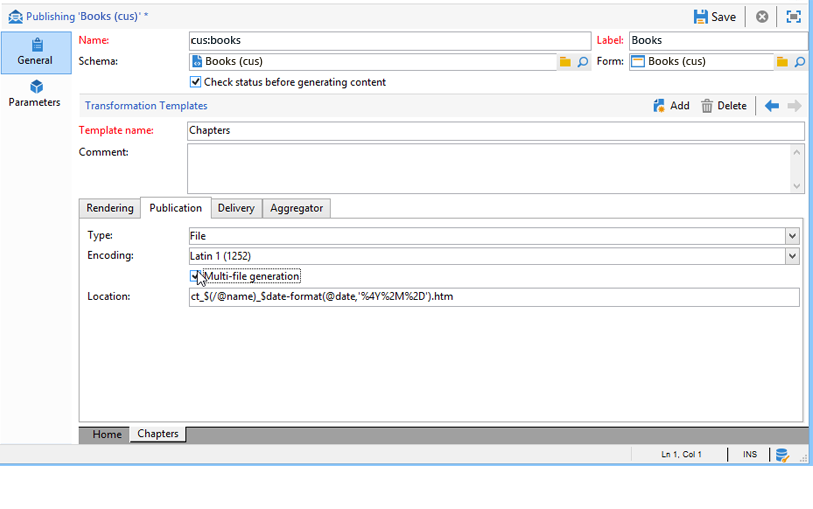

# 发布模板{#publication-templates}

## 关于发布模板 {#about-publication-templates}

发布模板是要发布的内容的标识卡。 它引用发布过程中使用的资源，即：

* 数据模式,
* 输入表，
* 每个输出转换模板的文档。

## 发布模板 {#identification-of-a-publication-template}

发布模板由其名称和命名空间标识。

样式表的标识键是由命名空间和用冒号分隔的名称组成的字符串；例如： **cus:newsletter**。

>[!NOTE]
>
>在实践中，建议对模式、表单和发布模板使用相同的键。

## Creating and configuring the template {#creating-and-configuring-the-template}

发布模板默认存储在节 **[!UICONTROL Administration > Configuration > Publication templates]** 点中。 要创建新模板，请单击 **[!UICONTROL New]** 模板列表上方的按钮。

要配置发布模板，请填充模板的名称(即由名称和命名空间组成的标识键)、其标签、数据模式以及链接到的输入表单。


>[!NOTE]
>
>每当根据此发布模板创建内容时，都会显示标签。

“检 **查状态以验证内容生成** ”选项强制检查内容实例的“已验证”状态以授权文件生成。 For more on this, refer to [Publication](#publication).

必须为每个输出转换模板添加文档。 您可以创建任意所需数量的转换模板。

该 **[!UICONTROL Name of template]** 字段是一个免费标签，用于描述输出时的渲染类型。 对于每个转换模板，发布设置都位于选项卡中。

### 渲染 {#rendering}

在选 **[!UICONTROL Rendering]** 项卡中，选择：

* 用于投影输出文档的渲染类型：XSL样式表或JavaScript模板，
* 输出文档的格式：HTML、文本、XML或RTF、
* 包含构造数据的模板，即要使用的样式表或JavaScript模板。

### 发布 {#publication}

发布包括以文件形式生成输出文档（如果所选类型为） **[!UICONTROL File]**。


提供以下发布选项：

* 输出文件编码字符集可以通过字段强制 **[!UICONTROL Encoding]** 使用。 默认情况下使用拉丁文1(1252)字符集。
* 该选 **[!UICONTROL Multi-file generation]** 项可激活特殊的文档发布模式。 此选项包括在输出文档的每页开头填充分区标签。 生成内容将为每个已填充的分区标签生成一个文件。 此模式用于从内容块生成微型站点。 for more on this, refer to [Multi-file generation](#multi-file-generation).
* 字 **[!UICONTROL Location]** 段包含输出文件的名称。 该名称可由变量组成，以生成自动文件名。

   变量会填充以下格式： **`$(<xpath>)`**，其 **`<xpath>`** 中是发布模板数据模式字段的路径。

   文件的名称可以由日期类型字段组成。 要正确设置此字段的格 **式** ，请使用$date-format函数，将字段的路径和输出格式用作参数。

   默认情况下，文件名的构造格式使用“@name”和“@date”字段上的变量：

   ```
   ct_$(@name)_$date-format(@date,'%4Y%2M%2D').htm
   ```

   生成的文件名如下所示：ct_news12_20110901.htm。

   >[!NOTE]
   >
   >有关内容生成的详细信息，请 [参阅创建内容实例](../../delivery/using/using-a-content-template.md#creating-a-content-instance)。

### 投放 {#delivery}

通过此选项卡，您可以选择方案，以便直接在内容上启动投放。 将根据输出格式（HTML或文本）自动填充电子邮件内容。


>[!NOTE]
>
>有关基于内容创建投放的示例，请参 [阅提交内容实例](../../delivery/using/using-a-content-template.md#delivering-a-content-instance)。

### 聚合器 {#aggregator}

从脚本或查询列表聚集数据，可以用内容数据丰富XML文档。 其目的是补充链接所引用的某些信息或添加数据库中的元素。

### 多文件生成 {#multi-file-generation}

要激活多个文件生成，请在发 **[!UICONTROL Multi-file generation]** 布模型中选择选项。 此选项允许您在样式表中为输出文档的每页的开头指定分区标记。 内容的生成将为遇到的每个分区标签生成一个文件。

要在样式表中集成的分区标记如下：

**`<xsl:comment> #nl:output_replace(<name_of_file>) </xsl:comment>`** 其中 **`<name_of_file>`** 是要生成的页面的文件名。

**示例：** 使用“cus:book”模式生成多个文件。

其原则是生成一个主页，其中列出章节，并有可能在外部页面中显示章节的详细信息。


相应的样式表(“cus:book.xsl”)如下所示：

```
<?xml version="1.0" encoding="ISO-8859-1" ?>
<xsl:stylesheet xmlns:xsl="http://www.w3.org/1999/XSL/Transform" version="1.0">
  <xsl:output encoding="ISO-8859-1" method="html"/>

  <!-- Style sheet entry point -->
  <xsl:template match="/book">
    <html>
      <body>
        <h1><xsl:value-of select="@name"/></h1>
        <lu>
          <xsl:for-each select="chapter">
            <li><a target="_blank" href="chapter{@id}.htm"><xsl:value-of select="@name"/></a></li>  
          </xsl:for-each>
       </lu>
      </body>
    </html>
   </xsl:template>
</xsl:stylesheet>
```

需要另一个样式表(“cus:chapter.xsl”)来生成章节的详细信息：

```
<?xml version="1.0" encoding="ISO-8859-1" ?>
<xsl:stylesheet xmlns:xsl="http://www.w3.org/1999/XSL/Transform" version="1.0">
  <xsl:output encoding="ISO-8859-1" method="html"/>

  <!-- Detail of a chapter -->
  <xsl:template match="chapter">
    <!-- Cut tag -->   
    <xsl:comment> #nl:output_replace($(path)/chapter<xsl:value-of select="@id"/>.htm)</xsl:comment>
    
    <html>
      <body>
        <h1><xsl:value-of select="@name"/></h1>
        <xsl:value-of select="page" disable-output-escaping="yes"/>
      </body>
    </html>
  </xsl:template>

  <!-- Style sheet entry point -->
  <xsl:template match="/book">
    <xsl:apply-templates/>
   </xsl:template>
</xsl:stylesheet>
```

分区标签填充在要包含在文件中的页面开始处以生成。

```
<xsl:comment> #nl:output_replace($(path)/<xsl:value-of select="@id"/>.htm)</xsl:comment>
```

文件名是使用包含发 **布路径和的$** (path)变量构建的 **`<xsl:value-of select="@id" />`**，该变量与输入文档中章节的标识符相匹配。

发布模型必须填充两个样式表“cus:book.xsl”和“cus:chapter.xsl”。

在章 **[!UICONTROL Multi-file generation]** 节转换模型上，此选项必须处于活动状态：



该字 **[!UICONTROL Location]** 段不用于生成多个文件，但您仍必须填充此字段，以避免在发布时出错。
