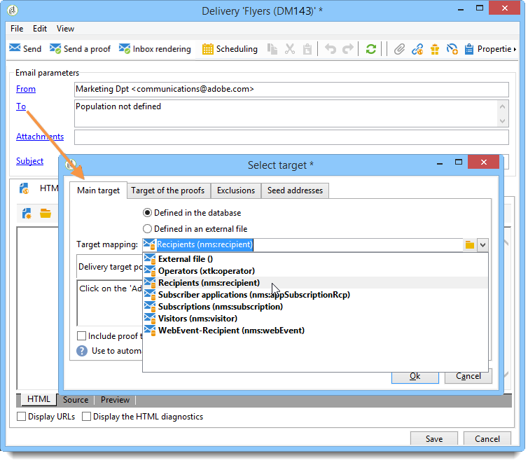

# 选择目标映射{#selecting-a-target-mapping}

默认情况下，投放模板以&#x200B;**[!UICONTROL Recipients]**&#x200B;为目标。 因此，它们的目标映射使用&#x200B;**nms:recipient**&#x200B;表的字段。 Adobe Campaign为您的投放提供了其他目标映射，可根据您的需求使用。

这些映射如下所示：

| 名称 | 使用 | 标准架构 |
|---|---|---|
| 收件人 | 投放给Adobe Campaign数据库的收件人 | nms:recipient |
| 访客 | 向通过反向链接（病毒式营销）或社交网络（例如Facebook、X — 以前称为Twitter）收集用户档案的访客投放。 | mns:visitor |
| 订阅 | 发送给订阅了新闻稿等信息服务的收件人 | nms:subscription |
| 访客订阅 | 向订阅了信息服务的访客投放 | nms:visitorSub |
| 服务 | 发布到X帐户或Facebook页面 | nms:service |
| 运算符 | 交付给Adobe Campaign操作员 | nms:operator |
| 外部文件 | 通过包含投放所需所有信息的文件投放 | 无链接架构，未输入目标 |

>[!NOTE]
>
>您还可以创建新的目标映射。 此操作是为专家用户保留的。 有关更多信息，请参见[此章节](../../configuration/using/target-mapping.md)。
