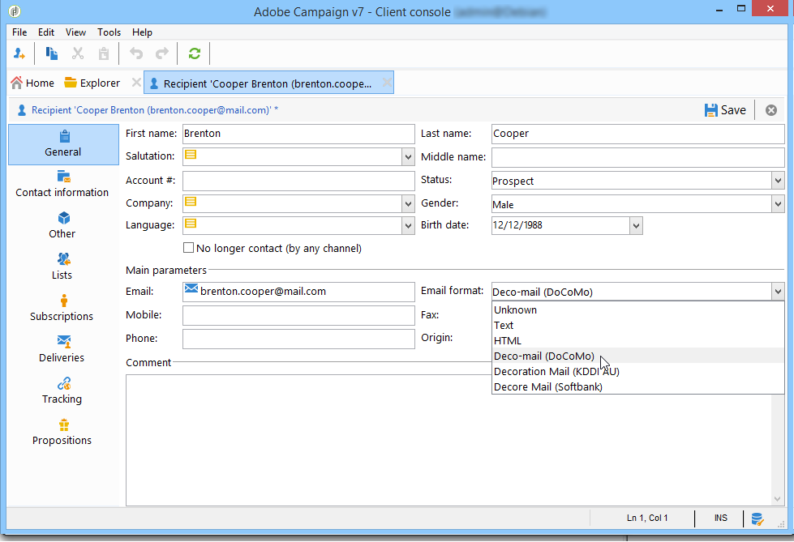

# 在日本手机上发送电子邮件 {#sending-emails-on-japanese-mobiles}

## 日语手机的电子邮件格式 {#email-formats-for-japanese-mobiles}

Adobe Campaign为手机上的电子邮件管理三种特定的日语格式： **装饰邮件** （DoCoMo手机）， **装饰邮件** (Softbank mobile)和 **修饰邮件** （KDDI AU手机）。 这些格式施加特定的编码、结构和大小限制。 了解中有关限制和建议的更多信息 [本节](#limitations-and-recommendations).

为了让收件人正确接收采用上述某种格式的邮件，我们建议选择 **[!UICONTROL Deco-mail (DoCoMo)]**， **[!UICONTROL Decore Mail (Softbank)]** 或 **[!UICONTROL Decoration Mail (KDDI AU)]** 在相应的配置文件中：

但是，如果您将 **[!UICONTROL Email format]** option as **[!UICONTROL Unknown]**， **[!UICONTROL HTML]** 或 **[!UICONTROL Text]**，Adobe Campaign将自动检测（发送电子邮件时）要使用的日语格式，以便正确显示消息。

此自动检测系统基于 **[!UICONTROL Management of Email Formats]** 邮件规则集。 有关管理电子邮件格式的详细信息，请参阅 [此页面](../../installation/using/email-deliverability.md#managing-email-formats).

## 限制和建议 {#limitations-and-recommendations}

对于发送将在日本供应商(Softbank、DoCoMo、KDDI AU)运营的移动设备上读取的电子邮件，适用一定数量的限制。

因此，您必须：

* 仅使用JPEG或GIF格式的图像
* 创建一个包含严格小于10 000字节的文本和HTML部分的投放（对于KDDI AU和DoCoMo）
* 使用总大小（编码前）小于100 KB的图像
* 每条消息使用的图像不超过20个
* 使用缩减大小的HTML格式（每个运算符可用的标记数量有限）

>[!NOTE]
>
>创建消息时，要考虑特定于每个操作员的限制。 请参阅:
>
>* 对于DoCoMo，请参阅 [此页面](https://www.nttdocomo.co.jp/service/developer/make/content/deco_mail/index.html)
>* 对于KDDI AU，请参见 [此页面](https://www.au.com/ezfactory/tec/spec/decorations/template.html)
>* 对于Softbank，请参阅 [此页面](https://www.support.softbankmobile.co.jp/partner/home_tech3/index.cfm)

## 测试电子邮件内容 {#testing-the-email-content}

### 预览消息 {#previewing-the-message}

Adobe Campaign允许您检查消息格式是否适合发送到日本移动设备。

定义内容并输入电子邮件主题后，您可以在创建消息时检查显示和格式。

在 **[!UICONTROL Preview]** 内容编辑窗口的选项卡，单击 **[!UICONTROL More... > Deco-mail diagnostic]** 允许您：

* 检查HTML内容标签是否符合日文格式限制
* 检查消息中的图像数量是否未超过格式规定的限制（20个图像）
* 检查邮件总大小（小于100kB）

   

### 运行分类规则 {#running-typology-rule}

除了预览诊断之外，在发送证明或投放时还会执行第二次检查：特定类型规则、 **[!UICONTROL Deco-mail check]**，会在分析期间启动。

>[!IMPORTANT]
>
>仅当至少有一个收件人配置为在中接收电子邮件时，才会执行此分类规则 **[!UICONTROL Deco-mail (DoCoMo)]**， **[!UICONTROL Decore Mail (Softbank)]** 或 **[!UICONTROL Decoration Mail (KDDI AU)]** 格式。

此分类规则允许您确保投放遵守 [格式约束](#limitations-and-recommendations) 由日语运算符定义，尤其是关于电子邮件的总大小、HTML和文本部分的大小、消息中的图像数量以及HTML内容中的标记。

###   发送验证 {#sending-proofs}

您可以发送校样以测试您的投放。 在发送验证时，如果您使用的是替换地址，请输入与所用用户档案的电子邮件格式对应的地址。

例如，如果事先定义了用户档案的电子邮件格式，则可以用test@softbank.ne.jp替换该用户档案的地址 **[!UICONTROL Decore Mail (Softbank)]**.

## 发送消息 {#sending-messages}

要使用Campaign向日语电子邮件格式的收件人发送电子邮件，可以使用两个选项：

* 创建两个投放：一个仅用于日本收件人，另一个用于其他收件人 — 请参阅 [本节](#designing-a-specific-delivery-for-japanese-formats).
* 创建一个投放，Adobe Campaign将自动检测要使用的格式 — 请参阅 [本节](#designing-a-delivery-for-all-formats).

### 设计日语格式的特定投放 {#designing-a-specific-delivery-for-japanese-formats}

您可以创建一个包含两个投放的工作流：一个是在日语移动设备上读取，另一个是适用于具有标准电子邮件格式的收件人的投放。

要执行此操作，请使用 **[!UICONTROL Split]** 活动，并将日语电子邮件格式（装饰邮件、装饰邮件和装饰邮件）定义为筛选条件。

### 为所有格式设计投放 {#designing-a-delivery-for-all-formats}

当Adobe Campaign根据域动态管理格式时(具有定义为 **[!UICONTROL Unknown]**， **[!UICONTROL HTML]** 或 **[!UICONTROL Text]** )，您可以向所有收件人发送相同的投放。

与标准收件人一样，消息联系人将在日本手机上正确显示给用户。

>[!IMPORTANT]
>
>确保遵守与每种日语电子邮件格式（装饰邮件、装饰邮件和装饰邮件）关联的特殊功能。 有关限制的更多信息，请参阅 [本节](#limitations-and-recommendations).
