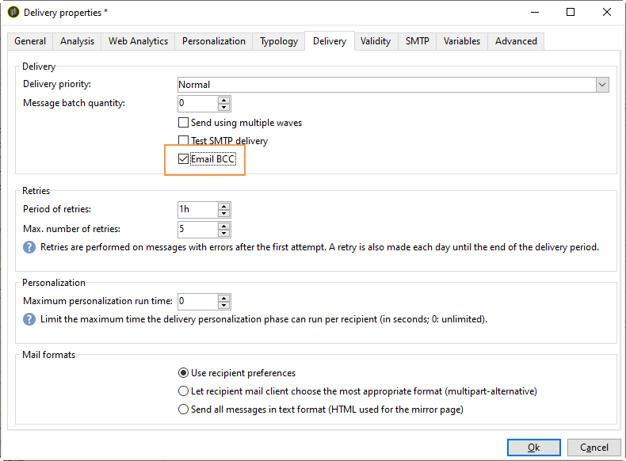

# 发送电子邮件{#sending-an-email}

要批准您的电子邮件并将其发送给要创建的分发的收件人，请单击 **[!UICONTROL Send]**。

验证和发送交付时的详细过程在以下各节中介绍：

* [验证交付](../../delivery/using/steps-validating-the-delivery.md)
* [发送交付](../../delivery/using/steps-sending-the-delivery.md)

以下各节详细介绍了特定于传送电子邮件的参数。

## 存档电子邮件 {#archiving-emails}

Adobe Campaign允许您通过密送将密送电子邮件地址添加到邮件目标，从而将电子邮件存储在外部系统上。 激活该选项后，将保留所有已发送消息的精确副本以用于此传送。

有关配置电子邮件密送的详细信息，请参阅 [此部分](../../installation/using/email-archiving.md)。

>[!NOTE]
>
>此功能是可选的。 请检查您的许可协议，并联系您的帐户管理员以激活它。

在创建新的分发或分发模板时，默认情况下不启用电子邮件密送，即使已购买此选项也是如此。 您必须在要使用它的每个分发或模板中手动启用它。

为此请执行以下操作步骤：

1. 转到 **[!UICONTROL Campaign Management]** > **[!UICONTROL Deliveries]** 或 **[!UICONTROL Resources]** > **[!UICONTROL Templates]** > **[!UICONTROL Delivery templates]**。
1. 选择您选择的分发或复制现成的电子邮件分发模 **板** ，然后选择复制的模板。
1. Click the **Properties** button.
1. 选择选 **[!UICONTROL Delivery]** 项卡。
1. 选中“ **存档电子邮件** ”框，保留此分发或基于此模板的每个分发的所有已发送消息的副本。

   

   >[!NOTE]
   >
   >如果打开并点进发送到密件抄送地址的电子邮件，则在发送分析中和发送分析中会考虑这一问题， **[!UICONTROL Total opens]****[!UICONTROL Clicks]** 这可能会导致一些计算错误。

## 生成镜像页面 {#generating-the-mirror-page}

镜像页面是可通过Web浏览器在线访问的HTML页面。 其内容与电子邮件相同。

默认情况下，如果链接已插入邮件内容中，则会生成镜像页面。 有关个性化基块插入的更多信息，请参 [阅个性化基块](../../delivery/using/personalization-blocks.md)。

在分发属性中，选 **[!UICONTROL Mode]** 项卡的字 **[!UICONTROL Validity]** 段允许您修改此页面的生成模式。

>[!CAUTION]
>
>必须为要创建的镜像页面的分发定义HTML内容。

除了默认模式之外，还提供以下选项：

* **[!UICONTROL Force the generation of the mirror page]** :即使传送中未插入指向镜像页面的链接，也会创建镜像页面。
* **[!UICONTROL Do not generate the mirror page]** :不会生成镜像页面，即使该链接存在于交付中也是如此。
* **[!UICONTROL Generates a mirror page accessible using only the message identifier]** :通过此选项，您可以在分发日志窗口中访问包含个性化信息的镜像页面的内容。 为此，在分发结束后，单击选项卡， **[!UICONTROL Delivery]** 然后选择您要查看其镜像页面的收件人的行。 单击链 **[!UICONTROL Display the mirror page for this message...]** 接。

   

## 管理弹回电子邮件 {#managing-bounce-emails}

传送 **[!UICONTROL SMTP]** 参数的选项卡允许您配置弹回邮件的管理。

默认情况下，退回的电子邮件会在平台的默认错误框中接收，但您可以为分发定义特定的错误地址。

您还可以从此屏幕定义特定地址，以调查在应用程序无法自动限定弹出邮件的原因。 对于每个字段，“添加个性化字段”图标可让您添加个性化参数。

## 字符编码 {#character-encoding}

在传送 **[!UICONTROL SMTP]** 参数的选项卡中，该部 **[!UICONTROL Character encoding]** 分允许您设置特定的编码。

默认编码为UTF-8。 如果某些收件人的电子邮件提供者不支持UTF-8标准编码，您可能希望设置特定编码以向电子邮件收件人正确显示特殊字符。

例如，您希望发送包含日文字符的电子邮件。 要确保所有字符都正确显示给日本收件人，您可能希望使用支持日文字符的编码，而不是标准UTF-8。

为此，请选择部 **[!UICONTROL Force the encoding used for messages]** 分中的选 **[!UICONTROL Character encoding]** 项，然后从显示的下拉列表中选择编码。

## 添加SMTP头 {#adding-smtp-headers}

可以将SMTP头添加到您的分发中。 为此，请使用交付中标签的相 **[!UICONTROL SMTP]** 关部分。

在此窗口中输入的脚本必须在以下表单中引用每行一个标题： **name:value**。

值会根据需要自动编码。

>[!CAUTION]
>
>为高级用户保留添加用于插入其他SMTP头的脚本。
>
>此脚本的语法必须符合以下内容类型的要求：没有未使用的空间，没有空行等。
