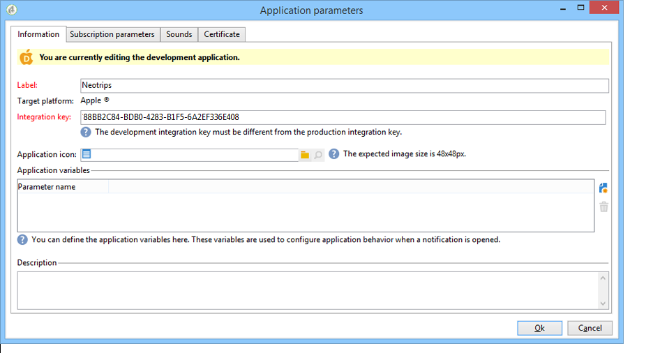
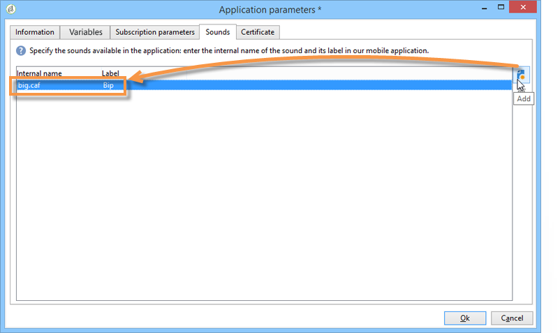

# 设置移动应用程序渠道{#setting-up-mobile-app-channel}

## 简介 {#introduction}

>[!CAUTION]
>
>移动应用程序渠道实施必须由专家用户执行。 如果需要协助，请与您的Adobe客户主管或专业服务合作伙伴联系。

您可以创建多个版本的移动应用程序(iOS、Android):移动应用程序渠道选项允许您向已安装应用程序的终端发送通知。

要使用Adobe Campaign移动应用程序渠道的功能，您需要更改／调整移动应用程序，以将其集成到Adobe Campaign平台中。

提供两个Campaign Classic SDK，一个用于Android，另一个用于iOS，以便将移动应用程序与Adobe Campaign轻松集成。 需要对Java和Objective-C有深入的技术知识。 有关Campaign SDK的详细说明，请参阅将Campaign SDK [集成到移动应用程序中](#integrating-campaign-sdk-into-the-mobile-application)。

>[!NOTE]
>
>Adobe Campaign提供的库设计为与Xcode(iOS)和Android Studio(Android)一起使用。

## 连接器 {#connectors}

### iOS连接器 {#ios-connectors}

对于iOS，提供两个连接器：

* iOS二进制连接器在传统二进制APNS服务器上发送通知。
* iOS HTTP/2连接器向HTTP/2 APNS发送通知。

要选择要使用的连接器，请执行以下步骤：

1. 转到 **[!UICONTROL Administration > Platform > External accounts]**。
1. 选择iOS路由外部帐户。
1. 在选项卡 **[!UICONTROL Connector]** 中，填写以下字 **[!UICONTROL Access URL of the connector]** 段：

   对于iOS二进制：https://localhost:8080/nms/jsp/ios.jsp

   对于iOS HTTP2:http://localhost:8080/nms/jsp/iosHTTP2.jsp

   

### Android连接器 {#android-connectors}

对于Android，有两个连接器可用：

* V1连接器，允许每个MTA子项连接一个。
* V2连接器允许与FCM服务器同时连接以提高吞吐量。

要选择要使用的连接器，请执行以下步骤：

1. 转到 **[!UICONTROL Administration > Platform > External accounts]**。
1. 选择外 **[!UICONTROL Android routing]** 部帐户。
1. 在选项卡 **[!UICONTROL Connector]** 中，填写以下字 **[!UICONTROL JavaScript used in the connector]** 段：

   对于Android V1:https://localhost:8080/nms/jsp/androidPushConnector.js

   对于Android V2:https://localhost:8080/nms/jsp/androidPushConnectorV2.js

   

1. 对于Android V2,Adobe服务器配置文件(serverConf.xml)中还有一个额外的参数：

   * **maxGCMConnectPerChild**:每个子服务器启动的对FCM的并行HTTP请求的最大限制（默认为8）。

## 配置步骤 {#configuration-steps}

### 创建应用程序 {#creating-the-application}

如果您没有移动应用程序（应用程序），则应用程序开发人员需要创建它并集成SDK。 如果移动应用程序存在，开发人员需要通过集成Adobe Campaign SDK并添加特定于服务的设置来调整它。 有关SDK的说明，请参阅将Campaign SDK [集成到移动应用程序中](#integrating-campaign-sdk-into-the-mobile-application)。

>[!CAUTION]
>
>在将应用程序集成到Adobe Campaign SDK之前，必须为推送操作配置了该应用程序。
>
>如果不是这种情况，请参阅 [本页](https://developer.apple.com/library/archive/documentation/NetworkingInternet/Conceptual/RemoteNotificationsPG/)。

### 收集信息 {#collecting-information-}

要配置应用程序，您必须收集技术规范，这些规范定义了使Adobe Campaign和移动应用程序能够通信的参数集。 这些参数包括：

* **集成密钥**:每个应用程序都有一个唯一的密钥。 通过此键可链接Adobe Campaign服务和移动应用程序。 请参阅一 [般信息](#general-information)。
* **变量**:在激活通知时定义应用程序的行为。 请参阅一 [般信息](#general-information)。
* **订阅设置**:默认情况下，Adobe Campaign会恢复 **@userKey** 字段，该字段允许您将移动设备与数据库中的收件人进行协调。 如果要收集其他数据（如复杂的对帐密钥），您可以定义订阅设置。 请参阅 [订阅设置](#subscription-settings)。
* **音效** （仅限iOS）:如果所选音效不是系统音效，则音效文件必须嵌入到手机应用程序中。 请参阅应 [用程序声音](#application-sounds)。
* **营销服务器和跟踪服务器的URL**:adobe Campaign管理员必须向应用程序开发人员提供营销服务器的URL和跟踪服务器的URL。 有关详细信息，请参阅：将 [Campaign SDK集成到移动应用程序中](#integrating-campaign-sdk-into-the-mobile-application)。

### 创建服务 {#creating-the-service}

Adobe Campaign管理员需要创建和配置链接到移动应用程序的服务。 有关详细信息，请参 [阅在Adobe Campaign中配置移动应用程序](#configuring-the-mobile-application-in-adobe-campaign)。

### 测试应用程序 {#testing-the-application}

在iOS上，您需要创建一个使用沙箱模式进行测试和批准的应用程序。 然后，在同一Adobe Campaign服务中，创建一个新的生产类型应用程序并输入相关证书。 有关详细信息，请参阅Apple通知服务的相关文档。

在Android上，您只需创建一个应用程序。 在将应用程序公开之前，在应用程序上测试完整的订阅和交付收集过程。

## 数据路径 {#data-path}

以下架构详细介绍了使移动应用程序能够与Adobe Campaign交换数据的步骤。 此过程涉及三个实体：

* 移动应用程序
* 通知服务：适用于Apple的APNS（Apple推送通知服务）和适用于Android的FCM(Firebase Cloud Messaging)
* Adobe Campaign

通知过程的三个主要步骤是：在Adobe Campaign中注册应用程序（订阅集合）、提交和跟踪。

### 第1步：订阅集合 {#step-1--subscription-collection}

移动应用程序由用户从App Store或Google Play下载。 此应用程序包含连接设置（iOS证书和Android项目密钥）和集成密钥。 首次打开应用程序时（取决于配置），可要求用户输入注册信息(@userKey:电子邮件或帐号)。 同时，应用程序询问通知服务以收集通知ID（推送ID）。 所有这些信息（连接设置、集成密钥、通知标识符、userKey）都将发送到Adobe Campaign。


### 第2步：交付 {#step-2--delivery}

营销人员瞄准应用程序订阅者。 交付进程将连接设置发送到通知服务（iOS证书和Android项目密钥）、通知ID（推送ID）和通知内容。 通知服务向目标终端发送通知。

Adobe Campaign中提供以下信息：

* 仅限Android:显示通知的设备数（展示次数）
* Android和iOS:单击通知的次数


Adobe Campaign服务器必须能够通过以下端口与APNS服务器联系：

* 适用于iOS二进制连接器的2195（发送）和2186（反馈服务）
* 443 for iOS HTTP/2 connector

要检查其是否正常工作，请使用以下命令：

* 对于测试：

   ```
   telnet gateway.sandbox.push.apple.com
   ```

* 生产中：

   ```
   telnet gateway.push.apple.com
   ```

如果使用iOS二进制连接器，则MTA和Web服务器必须能够在端口2195（发送）上与APNS联系，那么工作流服务器必须能够在端口2196（反馈服务）上与APNS联系。

如果使用iOS HTTP/2连接器，则MTA、Web服务器和工作流服务器必须能够在端口443上与APNS联系。

## 将Campaign SDK集成到移动应用程序 {#integrating-campaign-sdk-into-the-mobile-application}

适用于iOS和Android的Campaign SDK是移动应用程序渠道模块的组件之一。

>[!NOTE]
>
>要获取Campaign SDK（以前称为Neolane SDK），请与Adobe客户关怀联系。

SDK的目标是促进将移动应用程序集成到Adobe Campaign平台中。

要了解有关支持的不同Android和iOS版本的更多信息，请参阅兼容性 [表](https://helpx.adobe.com/campaign/kb/compatibility-matrix.html#MobileSDK) 。

### 加载Campaign SDK {#loading-campaign-sdk}

* **在Android中**:必须 **** 将neolane_sdk-release.aar文件链接到项目。

   以下权限授予对Adobe Campaign服务器的访问权限：

   ```
   Neolane.getInstance().setIntegrationKey("your Adobe mobile app integration key");
   Neolane.getInstance().setMarketingHost("https://yourMarketingHost:yourMarketingPort/");
   Neolane.getInstance().setTrackingHost("https://yourTrackingHost:yourTrackingPort/");
   ```

   以下权限允许您恢复电话的唯一ID:

   ```
   <uses-permission android:name="android.permission.READ_PHONE_STATE" /> 
   ```

   从SDK版本1.0.24开始，此权限仅用于Android 6.0以前的版本。

   从SDK版本1.0.26开始，不再使用此权限。

* **在iOS中**:必须 **将libNeolaneSDK.a和****** Neolane_SDK.h文件链接到项目。 从SDK的1.0.24版中，将激活 **ENABLE_BITCODE** 选项。

   >[!NOTE]
   >
   >对于SDK版本1.0.25,Neolane_SDK.h文件中提供了这四 **个架构** 。

### 声明集成设置 {#declaring-integration-settings}

要将Campaign SDK集成到移动应用程序中，职能管理员必须向开发人员提供以下信息：

* **集成密钥**:使Adobe Campaign平台能够识别移动应用程序。

   >[!NOTE]
   >
   >此集成密钥在Adobe Campaign控制台中移动应用程序专用 **[!UICONTROL Information]** 服务的选项卡中输入。 请参阅一 [般信息](#general-information)。

* **跟踪URL**:与Adobe Campaign跟踪服务器的地址匹配。
* **营销URL**:以启用订阅集合。

* **在Android中**:

   ```
   Neolane.getInstance().setIntegrationKey("your Adobe mobile app integration key");
   Neolane.getInstance().setMarketingHost("https://yourMarketingHost:yourMarketingPort/");
   Neolane.getInstance().setTrackingHost("https://yourTrackingHost:yourTrackingPort/"); 
   ```

* **在iOS中**:

   ```
   Neolane_SDK *nl = [Neolane_SDK getInstance];
   [nl setMarketingHost:strMktHost];
   [nl setTrackingHost:strTckHost];
   [nl setIntegrationKey:strIntegrationKey];
   ```

### 注册功能 {#registration-function}

注册功能允许您：

* 将通知ID或推送ID（iOS的deviceToken和Android的注册ID）发送到Adobe Campaign。
* 恢复对帐密钥或userKey（例如，电子邮件或帐号）

* **在Android中**:

   ```
   void registerInNeolane(String registrationId, String userKey, Context context)
   {
    try{
     Neolane.getInstance().registerDevice(registrationToken, userKey, null, context);
    } catch (NeolaneException e){
     //...
    } catch (IOException e){
     //...
    }
   }
   ```

   如果您使用FCM(Firebase Cloud Messaging)，我们建议您在调用 **onTokenRefresh** 函数时使用registerDevice **** 函数，以通知Adobe Campaign用户移动设备令牌的更改。

   ```
   public class NeoTripFirebaseInstanceIDService extends FirebaseInstanceIdService {
     @Override
     public void onTokenRefresh() {
       String registrationToken = FirebaseInstanceId.getInstance().getToken();
       NeolaneAsyncRunner neolaneAs = new NeolaneAsyncRunner(Neolane.getInstance());
       ...
       ...
       // Neolane Registration
       neolaneAs.registerDevice(registrationToken, userKey, additionnalParam, this, new NeolaneAsyncRunner.RequestListener() {
       public void onComplete(String e, Object state) { ... }
       public void onNeolaneException(NeolaneException e, Object state) { ... }
       public void onIOException(IOException e, Object state) { ... }
       });
       ...
       ...
     }
   }
   ```

* **在iOS中**:

   ```
   // Callback called on successful registration to the APNS
   - (void)application:(UIApplication*)application didRegisterForRemoteNotificationsWithDeviceToken:(NSData*)deviceToken
   {
       // Pass the token to Adobe Campaign
       Neolane_SDK *nl = [Neolane_SDK getInstance];
       [nl registerDevice:tokenString:self.userKey:dic];
   }
   ```

### 跟踪函数 {#tracking-function}

* **在Android中**:

   跟踪功能允许您跟踪通知激活（打开）和通知显示（屏幕截图）。

   要跟踪通知显示(通过调用SDK的 **notifyReceive** 函数完成)，请遵循以下实施。 请注意，如果您使用FCM(Firebase Cloud Messaging)，我们建议您在Android系统调用 **onMessageReceived****** 函数时使用notifyReceive函数。

   ```
   package com.android.YourApplication;
   
   import android.content.Context;
   import android.content.SharedPreferences;
   import android.os.Bundle;
   import android.util.Log;
   
   import com.google.firebase.messaging.FirebaseMessagingService;
   import com.google.firebase.messaging.RemoteMessage;
   
   import java.util.Iterator;
   import java.util.Map;
   import java.util.Map.Entry;
   
   public class YourApplicationFirebaseMessagingService extends FirebaseMessagingService {
     private static final String TAG = "MyFirebaseMsgService";
   
     @Override
     public void onMessageReceived(RemoteMessage message) {
       Log.d(TAG, "Receive message from: " + message.getFrom());
       Map<String,String> payloadData = message.getData();
       final Bundle extras = new Bundle();
       final Iterator<Entry<String, String>> iter = payloadData.entrySet().iterator();
       while(iter.hasNext())
       {
         final Entry<String, String>  entry =iter.next();
         extras.putString(entry.getKey(), entry.getValue());
       }
   
       SharedPreferences settings = this.getSharedPreferences(YourApplicationActivity.APPLICATION_PREF_NAME, Context.MODE_PRIVATE);
       String mesg = payloadData.get("_msg");
       String title = payloadData.get("title");
       String url = payloadData.get("url");
       String messageId = payloadData.get("_mId");
       String deliveryId = payloadData.get("_dId");
       YourApplicationActivity.handleNotification(this, mesg, title, url, messageId, deliveryId, extras);
     }
   }
   ```

   ```
   public static void handleNotification(Context context, String message, String title, String url, String messageId, String deliveryId, Bundle extras){
       if( message == null ) message = "No Content";
       if( title == null )   title = "No title";
       if( url == null )     url = "https://www.tripadvisor.fr";
       int iconId = R.drawable.notif_neotrip;
   
       // notify Neolane that a notification just arrived
       NeolaneAsyncRunner nas = new NeolaneAsyncRunner(Neolane.getInstance());
       nas.notifyReceive(Integer.valueOf(messageId), deliveryId, new NeolaneAsyncRunner.RequestListener() {
         public void onNeolaneException(NeolaneException arg0, Object arg1) {}
         public void onIOException(IOException arg0, Object arg1) {}
         public void onComplete(String arg0, Object arg1){}
       });
       if (yourApplication.isActivityVisible())
       {
         Log.i("INFO", "The application has the focus" );
         ...
       }
       else
       {
         // notification creation :
         NotificationManager notificationManager = (NotificationManager) context.getSystemService(Context.NOTIFICATION_SERVICE);
         Notification notification;
   
         // Activity to start :
         Intent notifIntent = new Intent(context.getApplicationContext(), NotificationActivity.class);
         notifIntent.putExtra("notificationText", message);
         notifIntent.putExtra(NotificationActivity.NOTIFICATION_URL_KEYNAME, url);
         notifIntent.putExtra("_dId", deliveryId);
         notifIntent.putExtra("_mId", messageId);
         notifIntent.addFlags(Intent.FLAG_ACTIVITY_NEW_TASK);
         PendingIntent contentIntent = PendingIntent.getActivity(context, 1, notifIntent, PendingIntent.FLAG_UPDATE_CURRENT);
   
         notification = new Notification.Builder(context)
                 .setContentTitle(title)
                 .setContentText(message)
                 .setSmallIcon(iconId)
                 .setContentIntent(contentIntent)
                 .build();
   
         // launch the notification :
         notification.flags |= Notification.FLAG_AUTO_CANCEL;
         notificationManager.notify(Integer.valueOf(messageId), notification);
       }
   }
   ```

   以下是一个用于跟踪通知打开的实现示例(通过调用SDK的 **notifyOpening** 函数执行)。 NotificationActivity **类与上一个示例中用于创建** notifIntent **** 对象的类相对应。

   ```
   public class NotificationActivity extends Activity {
    public static final String NOTIFICATION_URL_KEYNAME = "NotificationUrl";
    .....
    public void onCreate(Bundle savedBundle) {
     super.onCreate(savedBundle);
     setContentView(R.layout.notification_viewer);  
     .....  
     Bundle extra = getIntent().getExtras();  
     .....  
     //get the messageId and the deliveryId to do the tracking  
     String deliveryId = extra.getString("_dId");
     String messageId = extra.getString("_mId");
     if (deliveryId != null && messageId != null) {
      NeolaneAsyncRunner neolaneAs = new NeolaneAsyncRunner(Neolane.getInstance());
      neolaneAs.notifyOpening(Integer.valueOf(messageId), deliveryId, new NeolaneAsyncRunner.RequestListener() {
       public void onNeolaneException(NeolaneException arg0, Object arg1) {}
       public void onIOException(IOException arg0, Object arg1) {}
       public void onComplete(String arg0, Object arg1) {}
       });
     }
    }
   }
   ```

* **在iOS中**:

   跟踪功能允许您跟踪通知激活（打开）的时间。

   ```
   (void)application:(UIApplication *)application didReceiveRemoteNotification:(NSDictionary *)launchOptions
   fetchCompletionHandler:(void (^)(UIBackgroundFetchResult))completionHandler
   {
   if( launchOptions ) { // Retrieve notification parameters here ... // Track application opening Neolane_SDK
   *nl = [Neolane_SDK getInstance]; [nl track:launchOptions:NL_TRACK_CLICK]; } 
   ...  
   completionHandler(UIBackgroundFetchResultNoData);
   }
   ```

   >[!NOTE]
   >
   >从版本7.0开始，在实 **现application:didReceiveRemoteNotification:fetchCompletionHandler** 函数后，操作系统只调用此函数。 因 **此不调用application:didReceiveRemoteNotification** 函数。

### 无提示通知跟踪 {#silent-notification-tracking}

iOS允许您发送静默通知、通知或数据，这些通知或数据将直接发送到移动应用程序，而不显示。 Adobe Campaign允许您跟踪它们。

要跟踪您的无提示通知，请按照以下示例操作：

```
// AppDelegate.m
...
...
#import "AppDelegate.h"
#import "Neolane_SDK.h"
...
...
// Callback called when the application is already launched (whether the application is running foreground or background)
- (void)application:(UIApplication *)application didReceiveRemoteNotification:(NSDictionary *)launchOptions fetchCompletionHandler:(void (^)(UIBackgroundFetchResult))completionHandler
{
 NSLog(@"IN didReceiveRemoteNotification:fetchCompletionHandler");
 if (launchOptions) NSLog(@"IN launchOptions: %@", [launchOptions description]);
 NSLog(@"Application state: %ld", (long)application.applicationState);

 // Silent Notification (specific case, can use NL_TRACK_RECEIVE as the user doesn't have click/open the notification)
 if ([launchOptions[@"aps"][@"content-available"] intValue] == 1 )
       {
  NSLog(@"Silent Push Notification");
  ...  
  ...
  //Call receive tracking
        Neolane_SDK *nl = [Neolane_SDK getInstance];
  [nl track:launchOptions:NL_TRACK_RECEIVE];

  completionHandler(UIBackgroundFetchResultNoData); //Do not show notification
  return;
 }  
 ...
 ...
        completionHandler(UIBackgroundFetchResultNoData);
}
```

### RegisterDeviceStatus委托 {#registerdevicestatus-delegate}

>[!NOTE]
>
>请注意，iOS专有此功能。

在iOS中，委托协议允许您获得registerDevice **调用的结果** ，并可用于了解注册过程中是否发生错误。

registerDeviceStatus **原型是** :

```
- (void) registerDeviceStatus: (ACCRegisterDeviceStatus) status:(NSString *) errorReason;
```

**状态** ，允许您了解注册是否成功或是否出错。

**ErrorReason** 为您提供有关所发生错误的更多信息。 有关可用错误及其说明的详细信息，请参阅下表。

<table> 
 <thead>
  <tr>
   <th> 状态<br /> </th>
   <th> 说明<br /> </th>
   <th> ErrorReason<br /> </th>
  </tr>
 </thead>
 <tbody>
  <tr>
   <td> ACCRegisterDeviceStatusSuccess <br /> </td>
   <td> 注册成功<br /> </td>
   <td> 空<br /> </td>
  </tr>
  <tr> 
   <td> ACCRegisterDeviceStatusFailureMarketingServerHostnameEmpty <br /> </td>
   <td> ACC营销服务器主机名为空或未设置。<br /> </td>
   <td> 空<br /> </td>
  </tr>
  <tr> 
   <td> ACCRegisterDeviceStatusFailureIntegrationKeyEmpty <br /> </td>
   <td> 集成密钥为空或未设置。<br /> </td>
   <td> 空<br /> </td>
  </tr>
  <tr> 
   <td> ACCRegisterDeviceStatusFailureConnectionIssue<br /> </td>
   <td> ACC的连接问题<br /> </td>
   <td> 更多信息（使用操作系统当前语言）<br /> </td>
  </tr>
  <tr> 
   <td> ACCRegisterDeviceStatusFailureUnknownUUID<br /> </td>
   <td> 提供的UUID（集成密钥）未知。<br /> </td>
   <td> 空<br /> </td>
  </tr>
  <tr> 
   <td> ACCRegisterDeviceStatusFailureUnexpectedError<br /> </td>
   <td> ACC服务器返回意外错误。<br /> </td>
   <td> 返回到ACC的错误消息。<br /> </td>
  </tr>
 </tbody>
</table>

**Neolane_SDKelegate协议和** registerDeviceStatus **** delegate定义如下：

```
//  Neolane_SDK.h
//  Neolane SDK
..
.. 
// Register Device Status Enum
typedef NS_ENUM(NSUInteger, ACCRegisterDeviceStatus) {
 ACCRegisterDeviceStatusSuccess,                               // Resistration Succeed
 ACCRegisterDeviceStatusFailureMarketingServerHostnameEmpty,   // The ACC marketing server hostname is Empty or not set
 ACCRegisterDeviceStatusFailureIntegrationKeyEmpty,            // The integration key is empty or not set
 ACCRegisterDeviceStatusFailureConnectionIssue,                // Connection issue with ACC, more information in errorReason
 ACCRegisterDeviceStatusFailureUnknownUUID,                    // The provided UUID (integration key) is unknown
 ACCRegisterDeviceStatusFailureUnexpectedError                 // Unexpected error returned by ACC server, more information in errorReason
};
// define the protocol for the registerDeviceStatus delegate
@protocol Neolane_SDKDelegate <NSObject>
@optional
- (void) registerDeviceStatus: (ACCRegisterDeviceStatus) status :(NSString *) errorReason;
@end
@interface Neolane_SDK: NSObject {
} 
...
...
// registerDeviceStatus delegate
@property (nonatomic, weak) id <Neolane_SDKDelegate> delegate;
...
...
@end
```

要实施 **registerDeviceStatus委托** ，请执行以下步骤：

1. 在SDK初始 **化过程中** ，实施setDelegate。

   ```
   // AppDelegate.m
   ...
   ... 
   - (BOOL)application:(UIApplication *)application didFinishLaunchingWithOptions:(NSDictionary *)launchOptions
   {
   ...
   ...
    // Get the stored settings
   
    NSUserDefaults *defaults = [NSUserDefaults standardUserDefaults];
    NSString *strMktHost = [defaults objectForKey:@"mktHost"];
    NSString *strTckHost = [defaults objectForKey:@"tckHost"];
    NSString *strIntegrationKey = [defaults objectForKey:@"integrationKey"];
    userKey = [defaults objectForKey:@"userKey"];
   
    // Configure Neolane SDK on first launch
    Neolane_SDK *nl = [Neolane_SDK getInstance];
    [nl setMarketingHost:strMktHost];
    [nl setTrackingHost:strTckHost];
    [nl setIntegrationKey:strIntegrationKey];
    [nl setDelegate:self];    // HERE
   ...
   ...
   }
   ```

1. 在类的 **@interface** 中添加协议。

   ```
   //  AppDelegate.h
   
   #import <UIKit/UIKit.h>
   #import <CoreLocation/CoreLocation.h>
   #import "Neolane_SDK.h"
   
   @class LandingPageViewController;
   
   @interface AppDelegate : UIResponder <UIApplicationDelegate, CLLocationManagerDelegate, Neolane_SDKDelegate> {
       CLLocationManager *locationManager;
       NSString *userKey;
       NSString *mktServerUrl;
       NSString *tckServerUrl;
       NSString *homeURL;
       NSString *strLandingPageUrl;
       NSTimer *timer;
   }
   ```

1. 在 **AppDelegate中实施委托**。

   ```
   //  AppDelegate.m
   
   #import "AppDelegate.h"
   #import "Neolane_SDK.h"
   #import "LandingPageViewController.h"
   #import "RootViewController.h"
   ...
   ...
   - (void) registerDeviceStatus: (ACCRegisterDeviceStatus) status :(NSString *) errorReason
   {
       NSLog(@"registerStatus: %lu",status);
   
       if ( errorReason != nil )
           NSLog(@"errorReason: %@",errorReason);
   
       if( status == ACCRegisterDeviceStatusSuccess )
       {
           // Registration successful
           ...
           ...
       }
       else { // An error occurred
           NSString *message;
           switch ( status ){
               case ACCRegisterDeviceStatusFailureUnknownUUID:
                   message = @"Unkown IntegrationKey (UUID)";
                   break;
               case ACCRegisterDeviceStatusFailureMarketingServerHostnameEmpty:
                   message = @"Marketing URL not set or Empty";
                   break;
               case ACCRegisterDeviceStatusFailureIntegrationKeyEmpty:
                   message = @"Integration Key not set or empty";
                   break;
               case ACCRegisterDeviceStatusFailureConnectionIssue:
                   message = [NSString stringWithFormat:@"%@ %@",@"Connection issue:",errorReason];
                   break;
               case ACCRegisterDeviceStatusFailureUnexpectedError:
               default:
                   message = [NSString stringWithFormat:@"%@ %@",@"Unexpected Error",errorReason];
                   break;
           }
    ...
    ...
       }
   }
   @end
   ```

### 变量 {#variables}

这些变量允许您在收到通知后定义手机应用程序行为。 这些变量必须在移动应用程序代码中和Adobe Campaign控制台中，在专用移动应用程序服务的选 **[!UICONTROL Variables]** 项卡中定义(请参阅一 [般信息](#general-information))。 下面是一个允许移动应用程序收集通知中任何添加变量的代码示例。 在我们的示例中，我们使用“VAR”变量。

* **在Android中**:

   ```
   public void onReceive(Context context, Intent intent) {
        ...
       String event = intent.getStringExtra("VAR");
        ...
   }
   ```

* **在iOS中**:

   ```
   - (BOOL)application:(UIApplication *)application didFinishLaunchingWithOptions:(NSDictionary *)launchOptions
   {
       ....
       if( launchOptions )
       {
           // When application is not already launched, the notification data if any are stored in the key 'UIApplicationLaunchOptionsRemoteNotificationKey'
           NSDictionary *localLaunchOptions = [launchOptions objectForKey:@"UIApplicationLaunchOptionsRemoteNotificationKey"];
           if( localLaunchOptions )
           {
            ...
            [localLaunchOptions objectForKey:@"VAR"];
           ...
           }
      }
   }
   
   // Callback called when the application is already launched (whether the application is running foreground or background)
   - (void)application:(UIApplication *)application didReceiveRemoteNotification:(NSDictionary *)launchOptions
   {
       if( launchOptions )
       {
        ...
           [launchOptions objectForKey:@"VAR"];
       }
   }
   ```

>[!CAUTION]
>
>Adobe建议选择短变量名称，因为iOS和Android的通知大小限制为4kB。

## 在Adobe Campaign中配置移动应用程序 {#configuring-the-mobile-application-in-adobe-campaign}

您可以根据销售在线假日套餐的公司找到以下配置示例。 他的移动应用程序(Neotrips)有两种版本可供客户使用：适用于Android的Neotrips和适用于iOS的Neotrips。 要在Adobe Campaign中配置移动应用程序，您需要：

1. 为Neotrips移 **[!UICONTROL Mobile application]** 动应用 [程序创建类型信息服务](#creating-the-service-and-collecting-subscriptions) 。
1. 将应用程序的iOS和Android版本添加到此服务。


>[!NOTE]
>
>转到服务 **[!UICONTROL Subscriptions]** 的选项卡以查看服务的订阅者列表，即在其移动设备上安装应用程序并同意接收通知的所有用户。

### 创建服务和收集订阅 {#creating-the-service-and-collecting-subscriptions}

1. 转到节 **[!UICONTROL Profiles and Targets > Services and subscriptions]** 点并单击 **[!UICONTROL New]**。

   

1. 定义 **[!UICONTROL Label]** 和 **[!UICONTROL Internal name]**。
1. 转到字段 **[!UICONTROL Type]** 并选择 **[!UICONTROL Mobile application]**。

   >[!NOTE]
   >
   >默认目 **[!UICONTROL Subscriber applications (nms:appSubscriptionRcp)]** 标映射链接到收件人表。 如果要使用其他目标映射，则需要创建新的目标映射，并在服务的字 **[!UICONTROL Target mapping]** 段中输入它。 有关创建目标映射的详细信息，请参阅配 [置指南](../../configuration/using/about-custom-recipient-table.md)。

1. 然后，单 **[!UICONTROL Add]** 击该按钮以定义移动应用程序(iOS、Android)的各个版本。

   

有关每个版本的配置步骤的详细演示，请参见下文。

>[!NOTE]
>
>创建iOS应用程序时，向导会邀请您配置应用程序的开发版本（沙箱）和生产版本。 创建后，将添加两个版本的应用程序。

### 一般信息 {#general-information}



1. 首先输入 **[!UICONTROL Label]**。
1. 确保在Adobe Campaign和 **[!UICONTROL Integration key]** 应用程序代码中（通过SDK）定义相同的内容。 有关详细信息，请参阅：将 [Campaign SDK集成到移动应用程序中](#integrating-campaign-sdk-into-the-mobile-application)。 此集成密钥是每个应用程序特有的，它允许您将移动应用程序链接到Adobe Campaign平台。
1. 如果应用程序处理应用程序图标（通知的左上角），您可以在此处添加它，以便预览更符合交付的实际样式。 要在内容（富通知）中添加图像，请参阅富通 [知部分](#rich-notifications) 。

   >[!CAUTION]
   >
   >iOS的预期图像分辨率为48x48像素。

1. 对于Android，输入应用程序的连接设置：输入由移动应用程序开发人员提供的项目密钥。
1. 然后输入应用程序变量。

   

   变量允许您在收到通知后定义应用程序行为：例如，您可以配置特定于应用程序的屏幕，以便用户激活通知时显示该屏幕。 这些变量必须在手机应用程序的代码中定义。 单击该 **[!UICONTROL Add]** 按钮可将其添加到Adobe Campaign。

   传送向导允许您定义这些变量的值。 请参阅创 [建通知](../../delivery/using/creating-notifications.md)。

### 订阅设置 {#subscription-settings}

>[!NOTE]
>
>仅当要收集其他数据时，此选项卡才需要配置。


默认情况下，Adobe Campaign会在表的 **[!UICONTROL User identifier]** (@userKey)字段中保存一 **[!UICONTROL Subscriber applications (nms:appSubscriptionRcp)]** 个键。 此密钥允许您将订阅链接到收件人。 要收集其他数据（如复杂的对帐密钥），您需要应用以下配置：

1. 创建架构的扩展 **[!UICONTROL Subscriber applications (nms:appsubscriptionRcp)]** 名并定义新字段。
1. 在选项卡中定义映 **[!UICONTROL Subscription parameters]** 射。

   >[!CAUTION]
   >
   >确保选项卡中的配置名 **[!UICONTROL Subscription parameters]** 称与手机应用程序代码中的配置名称相同。 请参阅将Campaign SDK [集成到移动应用程序部分](#integrating-campaign-sdk-into-the-mobile-application) 。

### 应用程序音效 {#application-sounds}

>[!NOTE]
>
>此选项卡仅适用于iOS版本的应用程序。



如果您的iOS应用程序已嵌入声音，请使用此选项卡添加声音。 然后，您可以使用传送向导选择接收通知时要播放的声音之一。 有关此问题的详细信息，请参 [阅在iOS上发送通知](../../delivery/using/creating-notifications.md#sending-notifications-on-ios)。

>[!NOTE]
>
>此屏幕中还可以定义系统声音。

在屏 **[!UICONTROL Application setting]** 幕中，字 **[!UICONTROL Internal name]** 段必须包含应用程序中嵌入的文件的名称或系统声音的名称。 在字段中输 **[!UICONTROL Label]** 入的值将显示在分 **[!UICONTROL Play a sound]** 发向导的下拉列表中。

### 证书 {#certificate}

>[!NOTE]
>
>此选项卡仅适用于iOS版本的应用程序。

在此屏幕中，输入应用程序连接设置。


单击链 **[!UICONTROL Enter the certificate...]** 接，然后选择身份验证证书并输入由移动应用程序开发人员提供的口令。

>[!NOTE]
>
>确保不将同一证书用于应用程序的开发版本（沙箱）和生产版本。

## 富通知 {#rich-notifications}

富通知允许您将其他类型的媒体包括到通知中，如图像、视频等。

### Android {#android}

Adobe Campaign允许您除定义内容外定义应用程序变量(请参阅在Android [上发送通知](../../delivery/using/creating-notifications.md#sending-notifications-on-android))。 这些变量可用于向移动应用程序提供图像URL等信息。 然后，移动应用程序可以生成自定义通知。

您首先需要在Adobe Campaign中创建移动应用程序，然后为该应用程序定义应用程序变量。

1. 转到 **[!UICONTROL Profiles and Targets]** > **[!UICONTROL Services and Subscriptions]**。
1. 单击 **[!UICONTROL New]** 以创建服务。
1. 在选 **[!UICONTROL Edit]** 项卡中，选 **[!UICONTROL Mobile application]** 择 **[!UICONTROL Type]** 作为，并选 **[!UICONTROL Subscriber application]** 择(nms:appSubscriptionRcp)作为 **[!UICONTROL Target mapping]**。
1. 在中，添 **[!UICONTROL List of mobile applications that use the service]**&#x200B;加一个新的应用程序并选择 **[!UICONTROL Create an Android application]**。
1. 单击 **[!UICONTROL Next]**.
1. 在创建 **[!UICONTROL Information]** 向导的选项卡中，输入标签。
1. 在字 **[!UICONTROL Application variables]** 段中，添加要用于发送富推送的参数：

   * 标题
   * sub
   * 有效性
   * imageURL
   * webpageURL

1. 单击 **[!UICONTROL Finish]** 并保存服务。

   

然后，您需要创建一个新的分发模板并将其链接到您创建的移动应用程序。

1. 转到 **[!UICONTROL Resources]** > **[!UICONTROL Templates]** > **[!UICONTROL Delivery templates]**。
1. 复制模 **[!UICONTROL Deliver on Android]** 板。
1. 更改标签并单击 **[!UICONTROL Continue]**。
1. 单击链 **[!UICONTROL To]** 接以定位应用程序的订阅者。
1. 将更改 **[!UICONTROL Target mapping]** 为 **[!UICONTROL Subscriber applications (nms:appSubscriptionRcp)]**。

   

1. 单击 **[!UICONTROL Add]**，选择 **[!UICONTROL Subscribers of an Android mobile application]** 并单击 **[!UICONTROL Next]**。
1. 输入标签，选择您创建的服务以及在此服务中创建的手机应用程序。

   

1. 单击 **[!UICONTROL Finish]**.

您在手机应用程序中创建的参数将显示在“应用程序变量” **字段中** 。


最后，创建一个新的Android交付并添加您希望为您在手机应用程序中定义的参数设置的值。

1. 转到 **[!UICONTROL Campaign management]** > **[!UICONTROL Deliveries]**。
1. 单击 **[!UICONTROL New]**.
1. 选择您刚刚创建的分发模板，然后单击 **[!UICONTROL Continue]**。
1. 在字 **[!UICONTROL Application variables]** 段中，为不同参数添加您选择的值。

   

1. 单击 **[!UICONTROL Save]** 并发送您的分发。

当在用户的移动Android设备上收到图像和网页时，该图像和网页应显示在推送通知中。

### iOS {#ios}

在iOS 10或更高版本中，可以生成富通知。 Adobe Campaign可以使用变量发送通知，这些变量将允许设备显示丰富的通知。

>[!NOTE]
>
>如果要使用富通知，则需要使用iOS HTTP/2连接器。 请参阅“ [Connectors](#connectors) （连接器）”部分。

在Adobe Campaign中，以下参数必须发送到移动应用程序：

* 选中编 **[!UICONTROL Mutable content]** 辑通知窗口中的复选框。 这将允许移动应用程序下载媒体内容。
* 必须 **[!UICONTROL Category]** 设置字段。 该值必须与某个移动应用程序的内容扩展(参数 **UNNotificationExtensionCategory**)匹配。
* 在应用程序变量中，添加您希望移动应用程序下载和显示的媒体文件的URL。

   

要在移动应用程序中实现富通知，您需要在项目中添加以下扩展：

* 通知服务扩展
* 通知内容扩展（根据您的实施，一个或多个）

**通知服务扩展**

必须在通知服务扩展级别下载媒体。

```
#import "NotificationService.h"

@interface NotificationService ()

@property (nonatomic, strong) void (^contentHandler)(UNNotificationContent *contentToDeliver);
@property (nonatomic, strong) UNMutableNotificationContent *bestAttemptContent;

@end

@implementation NotificationService

- (void)didReceiveNotificationRequest:(UNNotificationRequest *)request withContentHandler:(void (^)(UNNotificationContent * _Nonnull))contentHandler {
    NSDictionary *userInfo = nil;
    NSString *url = nil;

    self.contentHandler = contentHandler;
    self.bestAttemptContent = [request.content mutableCopy];

    userInfo = request.content.userInfo;
    if ( userInfo != nil )
    {
        url = userInfo[@"mediaUrl"];  // Get the url of the media to download (Adobe Campaign additional variable)
    }
    ...
    // Perform the download to local storage
```

**通知内容扩展**

在此级别上，您需要：

* 将您的内容扩展关联到Adobe Campaign发送的类别：

   如果您希望移动应用程序显示图像，您可以在Adobe Campaign中将类别值设置为“image”，在移动应用程序中，创建通知扩展并将 **UNNotificationExtensionCategory** 参数设置为“image”。 当在设备上接收推送通知时，根据定义的类别值调用扩展。

* 定义通知布局

   您需要使用相关构件定义布局。 对于图像，该构件名为 **UIImageView**。

* 显示媒体

   您需要添加代码以将媒体数据馈送到构件。 以下是图像的代码示例：

   ```
   #import "NotificationViewController.h"
   #import <UserNotifications/UserNotifications.h>
   #import <UserNotificationsUI/UserNotificationsUI.h>
   
   @interface NotificationViewController () <UNNotificationContentExtension>
   
   @property (strong, nonatomic) IBOutlet UIImageView *imageView;
   @property (strong, nonatomic) IBOutlet UILabel *notifContent;
   @property (strong, nonatomic) IBOutlet UILabel *label;
   
   @end
   
   @implementation NotificationViewController
   
   - (void)viewDidLoad {
       [super viewDidLoad];
       // Do any required interface initialization here.
   }
   
   - (void)didReceiveNotification:(UNNotification *)notification {
       self.label.text = notification.request.content.title;
       self.notifContent.text = notification.request.content.body;
       UNNotificationAttachment *attachment = [notification.request.content.attachments objectAtIndex:0];
       if ([attachment.URL startAccessingSecurityScopedResource])
       {
         NSData * imageData = [[NSData alloc] initWithContentsOfURL:attachment.URL];
         self.imageView.image =[UIImage imageWithData: imageData];
         [attachment.URL stopAccessingSecurityScopedResource];
       }
   }
   @end
   ```
