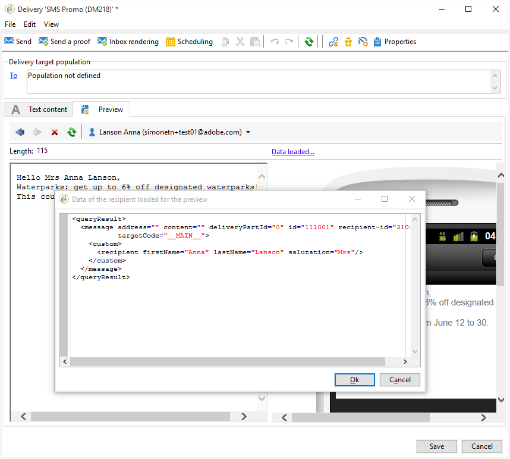

# SMS 渠道{#sms-channel}

Adobe Campaign允许您对SMS消息执行大量个性化投放。 收件人用户档案必须至少包含移动电话号码。

>[!NOTE]
>
>Adobe Campaign还允许您通过其&#x200B;**Adobe Campaign移动应用程序渠道(NMAC)**&#x200B;选项在移动终端上提交通知。
> 
>有关详细信息，请参阅[关于移动应用程序渠道](../../delivery/using/about-mobile-app-channel.md)部分。

以下部分提供特定于SMS渠道的信息。 有关如何创建投放的全局信息，请参阅[本节](../../delivery/using/steps-about-delivery-creation-steps.md)。

## 设置SMS渠道{#setting-up-sms-channel}

要发送到移动电话，您需要：

1. 指定连接器和消息类型的外部帐户。

   请注意，从20.2版开始，将弃用以下连接器：通用SMPP（支持二进制模式的SMPP版本3.4）、Sybase365(SAP SMS 365)、CLX Communications、Tele2、O2和iOS。 已弃用的功能仍然可用，但是不会进一步增强，也不支持它们。 有关详细信息，请参见此 [ 页面](https://helpx.adobe.com/cn/campaign/kb/deprecated-and-removed-features.html)。

1. 引用此外部帐户的投放模板。

### 创建SMPP外部帐户{#creating-an-smpp-external-account}

要将SMS发送到移动电话，您首先需要创建SMPP外部帐户。
有关短信协议和设置的更多信息，请参阅此[技术说明](https://helpx.adobe.com/cn/campaign/kb/sms-connector-protocol-and-settings.html)。

为此请执行以下操作步骤：

1. 在树的&#x200B;**[!UICONTROL Platform]** > **[!UICONTROL External accounts]**&#x200B;节点中，单击&#x200B;**[!UICONTROL New]**&#x200B;图标。
1. 将帐户类型定义为&#x200B;**路由**，将渠道定义为&#x200B;**移动(SMS)**，将投放模式定义为&#x200B;**批量投放**。

   

1. 选中&#x200B;**[!UICONTROL Enabled]**&#x200B;框。
1. 在&#x200B;**[!UICONTROL Mobile]**&#x200B;选项卡中，从&#x200B;**[!UICONTROL Connector]**&#x200B;下拉列表中选择&#x200B;**[!UICONTROL Extended generic SMPP]**。

   

   >[!CAUTION]
   >
   > 从20.2版开始，旧版连接器已弃用，不支持。 建议使用&#x200B;**[!UICONTROL Extended generic SMPP]**&#x200B;连接器。 有关如何迁移到推荐连接器的详细信息，请参阅此[页面](https://helpx.adobe.com/cn/campaign/kb/sms-connector.html)。

1. **[!UICONTROL Enable verbose SMPP traces in the log file]**&#x200B;选项允许您转储日志文件中的所有SMPP通信。 必须启用此选项才能对连接器进行故障诊断，并与提供商的通信记录进行对比。

1. 请联系您的SMS服务提供商，该将向您说明如何从&#x200B;**[!UICONTROL Connection settings]**&#x200B;选项卡中完成不同的外部帐户字段。

   然后，根据所选的提供者，与您的提供者联系，该提供者将为您提供输入&#x200B;**[!UICONTROL SMSC implementation name]**&#x200B;字段的值。

   您可以为每个MTA子级定义与提供程序的连接数。 默认情况下，它设置为1。

1. 默认情况下，SMS中的字符数符合GSM标准。

   使用 GSM 编码的短信消息长度上限为 160 个字符，而对于分段发送的消息，每段短信的长度上限为 153 个字符。

   >[!NOTE]
   >
   >某些字符会被计为两个字符（大括号、方括号、欧元符号等）。
   >
   >以下是可用GSM字符的列表。

   如果需要，您可通过勾选对应的方框来授权字符音译。

   

   如需详细信息，请参阅[此部分](#about-character-transliteration)。

1. 在&#x200B;**[!UICONTROL Throughput and delays]**&#x200B;选项卡中，可以指定每秒MT的出站消息（“MT”，已终止移动）的最大吞吐量。 如果在对应的字段中输入“0”，则吞吐量将没有限制。

   对应于持续时间的所有字段值，都必须填写以秒为单位的值。

1. 在&#x200B;**[!UICONTROL Mapping of encodings]**&#x200B;选项卡中，可以定义编码。

   如需详细信息，请参阅[此部分](#about-text-encodings)。

1. 在&#x200B;**[!UICONTROL SMSC specificities]**&#x200B;选项卡中，默认情况下禁用&#x200B;**[!UICONTROL Send full phone number]**&#x200B;选项。 如果要遵守SMPP协议并仅将数字传输到SMS提供商(SMSC)的服务器，请不要启用它。

   但是，鉴于某些提供者需要使用“+”前缀，建议您与提供者进行核对，他们将建议您在必要时启用此选项。

   **[!UICONTROL Enable TLS over SMPP]**&#x200B;复选框允许您加密SMPP通信。 有关详细信息，请参阅此[技术说明](https://helpx.adobe.com/campaign/kb/sms-connector-protocol-and-settings.html)。

1. 如果要配置&#x200B;**[!UICONTROL Extended generic SMPP]**&#x200B;连接器，则可以设置自动回复。

   如需详细信息，请参阅[此部分](#automatic-reply)。

### 关于字符音译{#about-character-transliteration}

可以在SMPP移动投放外部帐户的&#x200B;**[!UICONTROL Mobile]**&#x200B;选项卡下设置字符音译。

音译指的是，如果 GSM 标准无法识别某个短信字符，则会用另一个字符替换该字符。

* 如果音译为&#x200B;**[!UICONTROL authorized]**，则在发送消息时，未考虑的每个字符将替换为GSM字符。 例如，字母“ë”会被替换为“e”。因此，消息会有些微变化，但字符限制将保持不变。
* 当音译为&#x200B;**[!UICONTROL not authorized]**&#x200B;时，包含未考虑的字符的每条消息都以二进制格式(Unicode)发送：因此，所有字符都按原样发送。 但是，使用 Unicode 的短信消息长度上限为 70 个字符（对于分段发送的消息，每段短信的长度上限为 67 个字符）。如果超过最大字符数，则会分段发送多条消息，这可能会产生额外的费用。

>[!IMPORTANT]
>
>将个性化字段插入短信消息内容，可能会引入 GSM 编码无法识别的字符。

默认情况下，字符音译处于禁用状态。如果您希望将短信消息中的所有字符都按原样保留，以免名称等内容被错误地更改，我们建议您不要启用此选项。

但是，如果短信消息包含大量会生成 Unicode 消息的字符，则可以选择加入此选项以限制发送消息的成本。

下表显示了GSM标准中考虑的字符。 除下方所列的字符外，插入消息正文的所有其他字符都会导致整个消息被转换为二进制格式 (Unicode)，从而使其长度限制变成 70 个字符。

**基本字符**

<table> 
 <tbody> 
  <tr> 
   <td> @ </td> 
   <td>  </td> 
   <td> SP </td> 
   <td> 0 </td> 
   <td> “ </td> 
   <td> P </td> 
   <td> ? </td> 
   <td> p </td> 
  </tr> 
  <tr> 
   <td> 英镑 </td> 
   <td> _ </td> 
   <td> ! </td> 
   <td> 1 </td> 
   <td> A </td> 
   <td> Q </td> 
   <td> a </td> 
   <td> q </td> 
  </tr> 
  <tr> 
   <td> $ </td> 
   <td>  </td> 
   <td> ” </td> 
   <td> 2 </td> 
   <td> B </td> 
   <td> R </td> 
   <td> b </td> 
   <td> r </td> 
  </tr> 
  <tr> 
   <td> ¥ </td> 
   <td>  </td> 
   <td> # </td> 
   <td> 3 </td> 
   <td> C </td> 
   <td> S </td> 
   <td> c </td> 
   <td> s </td> 
  </tr> 
  <tr> 
   <td> è </td> 
   <td>  </td> 
   <td> " </td> 
   <td> 4 </td> 
   <td> D </td> 
   <td> T </td> 
   <td> d </td> 
   <td> t </td> 
  </tr> 
  <tr> 
   <td> é </td> 
   <td>  </td> 
   <td> % </td> 
   <td> 5 </td> 
   <td> E </td> 
   <td> U </td> 
   <td> e </td> 
   <td> u </td> 
  </tr> 
  <tr> 
   <td> ù </td> 
   <td>  </td> 
   <td> &amp; </td> 
   <td> 6 </td> 
   <td> F </td> 
   <td> V </td> 
   <td> f </td> 
   <td> v </td> 
  </tr> 
  <tr> 
   <td> ì </td> 
   <td>  </td> 
   <td> ' </td> 
   <td> 7 </td> 
   <td> G </td> 
   <td> W </td> 
   <td> g </td> 
   <td> w </td> 
  </tr> 
  <tr> 
   <td> ò </td> 
   <td>  </td> 
   <td> ( </td> 
   <td> 8 </td> 
   <td> H </td> 
   <td> X </td> 
   <td> h </td> 
   <td> x </td> 
  </tr> 
  <tr> 
   <td> Ç </td> 
   <td>  </td> 
   <td> ) </td> 
   <td> 9 </td> 
   <td> I </td> 
   <td> Y </td> 
   <td> i </td> 
   <td> y </td> 
  </tr> 
  <tr> 
   <td> LF </td> 
   <td>  </td> 
   <td> * </td> 
   <td> : </td> 
   <td> J </td> 
   <td> Z </td> 
   <td> j </td> 
   <td> z </td> 
  </tr> 
  <tr> 
   <td> Ø </td> 
   <td> ESC </td> 
   <td> + </td> 
   <td> ; </td> 
   <td> K </td> 
   <td> Ä </td> 
   <td> k </td> 
   <td> ä </td> 
  </tr> 
  <tr> 
   <td> ø </td> 
   <td> Æ </td> 
   <td> , </td> 
   <td> &lt;&gt; </td> 
   <td> L </td> 
   <td> Ö </td> 
   <td> l </td> 
   <td> ö </td> 
  </tr> 
  <tr> 
   <td> CR </td> 
   <td> æ </td> 
   <td> - </td> 
   <td> = </td> 
   <td> M </td> 
   <td> Ñ </td> 
   <td> m </td> 
   <td> ñ </td> 
  </tr> 
  <tr> 
   <td> Å </td> 
   <td> ß </td> 
   <td> 。 </td> 
   <td> &gt; </td> 
   <td> N </td> 
   <td> Ü </td> 
   <td> n </td> 
   <td> ü </td> 
  </tr> 
  <tr> 
   <td> å </td> 
   <td> É </td> 
   <td> / </td> 
   <td> ? </td> 
   <td> O </td> 
   <td> § </td> 
   <td> o </td> 
   <td> à </td> 
  </tr> 
 </tbody> 
</table>

SP：空格键

ESC：Escape 键

LF：换行

CR：回车

**高级字符（计为两个字符）**

^ { } `[ ~ ]` | €

### 关于文本编码{#about-text-encodings}

发送短信消息时，Adobe Campaign 可以使用一个或多个文本编码。每个编码都有属于自己的特定字符集，可确定其适合短信消息的字符数。

配置新的SMPP移动投放外部帐户时，您可以在&#x200B;**[!UICONTROL Mobile]**&#x200B;选项卡中定义&#x200B;**[!UICONTROL Mapping of encodings]**:**[!UICONTROL data_coding]**&#x200B;字段允许Adobe Campaign通信SMSC使用的编码。

>[!NOTE]
>
>**Data_coding** 值与实际使用的编码之间的映射，经过标准化处理。然而，某些中小型企业有自己的具体图表：在这种情况下，您的&#x200B;**Adobe Campaign**&#x200B;管理员需要声明此映射。 有关更多信息，请咨询您的提供商。

您可以声明&#x200B;**data_codings**&#x200B;并在必要时强制进行编码：为此，请在表中指定单个编码。

* 未定义编码映射时，连接器采用一种通用行为：

   * 它会尝试将 GSM 编码用于分配值 **data_coding = 0**。
   * 如果 GSM 编码失败，则会将 **UCS2** 编码用于分配值 **data_coding = 8**。

* 当您定义要使用的编码以及链接的&#x200B;**[!UICONTROL data_coding]**&#x200B;字段值时，Adobe Campaign将尝试使用列表中的第一个编码，然后是下面的编码（如果第一个编码证明不可能）。

>[!IMPORTANT]
>
>声明的顺序很重要：建议您按照&#x200B;**成本**&#x200B;的升序方式排列编码列表，以选出可尽量减少短信消息发送条数的编码。
>
>仅声明您要使用的编码。如果SMSC提供的某些编码不应与您的使用目的相对应，请不要在列表中声明。

### 自动回复{#automatic-reply}

在设置扩展通用SMPP连接器时，可以配置自动回复。

当用户回复通过Adobe Campaign发送给他们的SMS消息时，其消息包含诸如“STOP”的关键字，您可以在&#x200B;**[!UICONTROL Automatic reply sent to the MO]**&#x200B;部分中配置自动发回给他们的消息。

>[!NOTE]
>
>关键字不区分大小写。

对于每个关键字，指定一个短代码，该代码是通常用于发送投放并用作发送者姓名的数字，然后输入将发送给订阅者的消息。

您还可以将操作链接到自动响应：**[!UICONTROL Send to quarantine]**&#x200B;或&#x200B;**[!UICONTROL Remove from quarantine]**。 例如，如果收件人发送关键字“STOP”，则他们将自动收到退订确认并发送给隔离。


如果将&#x200B;**[!UICONTROL Remove from quarantine]**&#x200B;操作链接到自动响应，则发送相应关键字的收件人会自动从隔离中删除。

收件人列在可通过&#x200B;**[!UICONTROL Administration]** > **[!UICONTROL Campaign Management]** > **[!UICONTROL Non deliverables Management]**&#x200B;菜单访问的&#x200B;**[!UICONTROL Non deliverables and addresses]**&#x200B;表中。

* 要发送相同的回复，无论使用什么短代码，请将&#x200B;**[!UICONTROL Short code]**&#x200B;列留空。
* 要发送相同的回复，无论关键字是什么，请将&#x200B;**[!UICONTROL Keyword]**&#x200B;列留空。
* 要执行操作而不发送响应，请将&#x200B;**[!UICONTROL Response]**&#x200B;列留空。 例如，这允许您从隔离中删除用“STOP”以外的消息回复的用户。

如果您使用具有相同提供者帐户的扩展通用SMPP连接器具有多个外部帐户，则可能会出现以下问题：在向短代码发送回复时，可能会在您的任何外部帐户连接上收到该回复。 因此，发送的自动回复不能是预期消息。
要避免这种情况，请根据您所使用的提供商，应用以下解决方案之一：

* 为每个外部帐户创建一个提供程序帐户。
* 使用&#x200B;**[!UICONTROL Mobile]** > **[!UICONTROL Connection settings]**&#x200B;选项卡中的&#x200B;**[!UICONTROL System type]**&#x200B;字段区分每个短代码。 为每个帐户向提供商询问不同的值。

   

使用扩展通用SMPP连接器设置外部帐户的步骤在[创建SMPP外部帐户](../../delivery/using/sms-channel.md#creating-an-smpp-external-account)一节中有详细说明。

### 更改投放模板{#changing-the-delivery-template}

Adobe Campaign为您提供了用于传送到移动设备的模板。 此模板在&#x200B;**[!UICONTROL Resources > Templates > Delivery templates]**&#x200B;节点中可用。 有关详细信息，请参阅[关于模板](../../delivery/using/about-templates.md)部分。

要通过SMS渠道传送，您必须创建一个模板，其中引用了渠道连接器。

为了保留本机投放模板，我们建议您重复它，然后对其进行配置。

在以下示例中，我们创建了一个模板，以通过之前启用的SMPP帐户传送消息。 操作步骤：

1. 转到&#x200B;**[!UICONTROL Delivery templates]**&#x200B;节点。
1. 右键单击&#x200B;**[!UICONTROL Send to mobiles]**&#x200B;模板，然后选择&#x200B;**[!UICONTROL Duplicate]**。

   

1. 更改模板的标签，例如&#x200B;**发送到移动设备(SMPP)**。

   

1. 单击 **[!UICONTROL Properties]**.
1. 在&#x200B;**[!UICONTROL General]**&#x200B;选项卡中，选择与您在前面的步骤中创建的路由相对应的外部帐户模式。

   

1. 单击&#x200B;**[!UICONTROL Save]**&#x200B;以创建模板。

   

您现在有了外部帐户和投放模板，可通过SMS进行投放

## 创建SMS投放{#creating-a-sms-delivery}

### 选择投放渠道{#selecting-the-delivery-channel}

要创建新的SMS投放，请按照以下步骤操作：

>[!NOTE]
>
>[本节](../../delivery/using/steps-about-delivery-creation-steps.md)介绍了有关创建投放的全局概念。

1. 创建新投放，例如从投放仪表板创建。
1. 选择您之前创建的投放模板&#x200B;**发送到移动设备(SMPP)**。 有关详细信息，请参阅[更改投放模板](#changing-the-delivery-template)部分。

   

1. 用标签、代码和说明识别投放。 如需详细信息，请参阅[此部分](../../delivery/using/steps-create-and-identify-the-delivery.md#identifying-the-delivery)。
1. 单击&#x200B;**[!UICONTROL Continue]**&#x200B;确认此信息并显示消息配置窗口。

## 定义SMS内容{#defining-the-sms-content}

要创建SMS内容，请执行以下步骤：

1. 在向导的&#x200B;**[!UICONTROL Text content]**&#x200B;部分输入消息的内容。 工具栏按钮允许您导入、保存或搜索内容。 最后一个按钮用于插入个性化字段。

   

   [关于个性化](../../delivery/using/about-personalization.md)部分介绍了个性化字段的使用。

1. 单击页面底部的&#x200B;**[!UICONTROL Preview]**&#x200B;以视图消息的呈现及其个性化。 要启动预览，请使用工具栏中的&#x200B;**[!UICONTROL Test personalization]**&#x200B;按钮选择收件人。 您可以从定义的收件人中选择一个目标或选择其他收件人。

   

   您可以批准SMS消息。 您还可以视图内容编辑器右侧显示的手机屏幕上SMS的内容。 单击屏幕，然后使用鼠标滚动浏览内容。

   

1. 单击&#x200B;**[!UICONTROL Data loaded]**&#x200B;链接以视图有关收件人的信息。

   

   >[!NOTE]
   >
   >如果使用拉丁文–1(ISO-8859-1)代码页，则SMS消息的长度限制为160个字符。 如果消息以Unicode编写，则不得超过70个字符。 某些特殊字符会影响消息长度。 有关消息长度的详细信息，请参阅[关于字符音译](#about-character-transliteration)部分。
   >
   >当存在个性化字段或条件内容字段时，消息的大小因收件人而异。 在进行个性化时，必须评估消息的长度。
   >
   >启动分析时，将检查消息的长度，并在溢出事件中显示警告。

1. 如果您使用NetSize连接器或SMPP连接器，则可以个性化投放发送者的名称。 有关详细信息，请参阅[高级参数](#advanced-parameters)部分。

## 选择目标填充{#selecting-the-target-population}

在[本节](../../delivery/using/steps-defining-the-target-population.md)中显示了选择投放的目标种群的详细过程。

有关使用个性化字段的详细信息，请参阅[关于个性化](../../delivery/using/about-personalization.md)。

有关包含种子列表的详细信息，请参阅[关于种子地址](../../delivery/using/about-seed-addresses.md)。

## 发送SMS消息{#sending-sms-messages}

要批准您的邮件并将其发送到所创建投放的收件人，请单击&#x200B;**[!UICONTROL Send]**。

验证和发送投放时的详细过程将在以下各节中介绍：

* [验证投放](../../delivery/using/steps-validating-the-delivery.md)
* [发送投放](../../delivery/using/steps-sending-the-delivery.md)

### 高级参数 {#advanced-parameters}

**[!UICONTROL Properties]**&#x200B;按钮允许访问高级投放参数。 特定于SMS投放的参数位于&#x200B;**[!UICONTROL Delivery]**&#x200B;选项卡的&#x200B;**[!UICONTROL SMS parameters]**&#x200B;部分。

可以使用以下选项：

* **发件人地址**:允许您使用限制为11个字符的字母数字字符串个性化投放发送者的名称。该领域不能只由数字组成。 您可以定义一个条件来显示，例如，根据收件人的区域代码显示不同的名称：

   ```
   <% if( String(recipient.mobilePhone).indexOf("+1") == 0){ %>NeoShopUS<%} else %>
   ```

   >[!IMPORTANT]
   >
   >请查阅您所在国家/地区有关编辑发件人姓名的法律。 您还应询问操作员是否优惠了此功能。

* **传输模式**:短信发送
* **优先级**:为消息分配的重要级别。**[!UICONTROL Normal]** 默认情况下，优先级处于选中状态。询问您的服务提供商关于以&#x200B;**[!UICONTROL High]**&#x200B;优先级发送的SMS的成本。
* **应用程序类型**:选择要分配给您的SMS投放的应用程序。默认情况下，**[!UICONTROL Direct Marketing]**&#x200B;选项处于选中状态，是最常用的选项。

**特定于NetSize连接器的参数**


* **对单条消息使用多条短信**:这样，您就可以通过多个SMS消息发送一条长度超过160个字符的消息。

**特定于SMPP连接器的参数**


* **每条消息的最大短信数**:此选项允许您设置用于发送消息的SMS数。如果数字设置为0，则可以使用SMS来传送消息。 如果SMS的数量设置为1或2（例如），并且消息超过此阈值，则不会发送该消息。

## 监视和跟踪SMS投放{#monitoring-and-tracking-sms-deliveries}

发送消息后，您可以监视和跟踪投放。 有关更多信息，请参阅一下章节。

* [监控投放](../../delivery/using/about-delivery-monitoring.md)
* [了解投放失败](../../delivery/using/understanding-delivery-failures.md)
* [关于邮件跟踪](../../delivery/using/about-message-tracking.md)

## 正在处理入站消息{#processing-inbound-messages}

**nlserver sms**&#x200B;模块定期查询SMS路由器。 这使Adobe Campaign能够跟踪投放进度并处理状态报告和收件人退订请求。

* **状态报告**:视图投放日志，以检查消息的状态。

   >[!NOTE]
   >
   >发送的每条短信都链接到一个外部帐户的主键。 这样：
   >
   > * 未正确处理已删除外部SMS帐户的状态报告。
   > * SMS帐户只能链接到单个外部帐户，以确保状态报告归于正确的帐户


* **退订**:希望停止接收SMS投放的收件人可以返回包含STOP字样的消息。如果您的提供商根据合同条款允许该收件人，您可以通过&#x200B;**入站SMS**&#x200B;工作流活动检索消息，然后创建查询以为相关收件人启用&#x200B;**不再与此**&#x200B;选项。

   请参阅[工作流](../../workflow/using/architecture.md)指南。

## InSMS模式{#insms-schema}

InSMS模式包含与传入SMS相关的信息。 可通过desc属性描述这些字段。

* **消息**:收到的短信内容。
* **来源**:消息来源的移动号码。
* **providerId**:SMSC（消息中心）返回的消息的标识符。
* **created**:将传入消息插入Adobe Campaign。
* **extAccount**:Adobe Campaign外部帐户。

   >[!IMPORTANT]
   >
   >以下字段特定于NetSize。
   >
   >如果使用的运算符不是NetSize，则这些字段被视为空。

* **alias**:传入消息的别名。
* **分隔符**:别名和消息正文之间的分隔符。
* **messageDate**:运算符给出的消息日期。
* **receivalDate**:SMSC（消息中心）接收了来自运营商的日期消息。
* **deliveryDate**:SMSC（消息中心）发送的日期消息。
* **largeAccount**:链接到传入SMS的客户帐户代码
* **countryCode**:运营商国家代码。
* **operatorCode**:运营商网络代码。
* **linkedSmsId**:Adobe Campaign标识符(broadlogId)，链接到传出SMS，其中此SMS是响应。

## 管理自动回复（美国法规）{#managing-automatic-replies--american-regulation-}

当用户回复通过Adobe Campaign发送给他们的SMS消息时，他们使用STOP、HELP或YES等关键字，在美国市场中必须配置自动返回的消息。

例如，如果收件人发送关键字STOP，则他们会自动收到一条确认消息，说明他们已取消订阅。

此类消息的发件人姓名是用于发送投放的短代码。

>[!IMPORTANT]
>
>以下详细过程仅对SMPP连接器有效，扩展通用SMPP连接器除外。 有关详细信息，请参阅[创建SMPP外部帐户](#creating-an-smpp-external-account)部分。
>
>它是美国运营商为美国营销活动进行的认证过程的一部分。 在从用户接收到消息后，必须立即将这些对包含关键词的用户SMS消息的回复发回给用户。

1. 创建此类型的XML文件：

   ```
   <autoreply>
     <shortcode name="12345">
       <reply keyword="STOP" text="You will not receive SMS anymore" />
       <reply keyword="HELP" text="Powered by Adobe Campaign" />
     </shortcode>
     <shortcode name="43115">
       <reply keyword="STOP" text="Vous ne recevrez plus de SMS" />
       <reply keyword="HELP" text="Service rendu par Adobe Campaign" />
     </shortcode>
     <shortcode name="*">
       <reply keyword="ADOBE" text="This text is replied when you send ADOBE to any short code" />
     </shortcode>
   </autoreply>
   ```

1. 对于&#x200B;**`<shortcode>`**&#x200B;标记的&#x200B;**name**&#x200B;属性，指定将在消息发送者名称的位置显示的短代码。

   在每个&#x200B;**`<reply>`**&#x200B;标记中，输入&#x200B;**关键字**&#x200B;属性和&#x200B;**文本**&#x200B;属性，并输入要为此关键字发送的消息。

   >[!NOTE]
   >
   >每个关键字都必须用大写字母书写。

   如果要为多个关键字发送相同的消息，请重复相应的行。

   例如：

   ```
   <reply keyword="STOP" text="You will not receive SMS anymore" />
   <reply keyword="QUIT" text="You will not receive SMS anymore" />
   ```

1. 完成后，以&#x200B;**smsAutoReply.xml**&#x200B;名称保存此文件。

   请注意，在Linux中，文件名区分大小写。

1. 将此文件复制到Adobe Campaign中的&#x200B;**conf**&#x200B;目录中，与Web服务器位于同一位置。

>[!IMPORTANT]
>
>这类自动消息不会保留历史记录。 因此，它们不会出现在[投放仪表板](../../delivery/using/delivery-dashboard.md)中。
>
>这些消息不被视为[商业压力规则](../../campaign/using/pressure-rules.md)的一部分。
