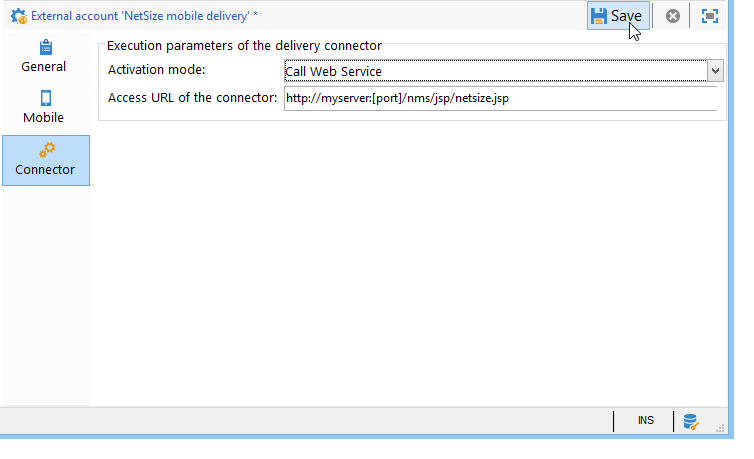
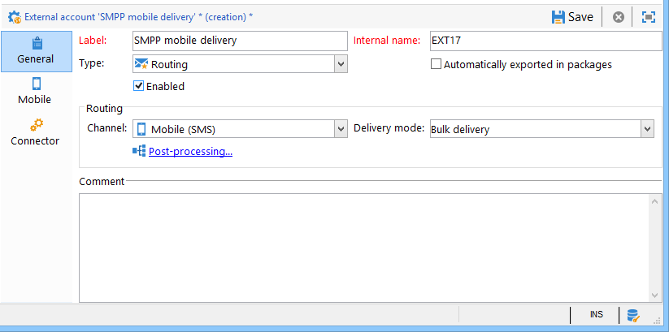

# SMS频道{#sms-channel}

Adobe Campaign可帮您大规模个性化地发送SMS消息。 收件人配置文件必须至少包含一个移动电话号码。

>[!NOTE]
>
>Adobe Campaign还允许您通过其 **Adobe Campaign移动应用程序渠道(NMAC)选项在移动终端上提交通知** 。
> 
>有关此方面的详细信息，请参阅关于 [移动应用程序渠道部分](../../delivery/using/about-mobile-app-channel.md) 。

以下各节提供特定于SMS渠道的信息。 有关如何创建交付的全局信息，请参阅[此部分](../../delivery/using/steps-about-delivery-creation-steps.md)。

## 设置SMS通道 {#setting-up-sms-channel}

要发送到手机，您需要：

1. 指定连接器和消息类型的外部帐户。

   可用连接器包括：NetSize、通用SMPP（支持二进制模式的SMPP版本3.4）、Sybase365(SAP SMS 365)、CLX Communications、Tele2、O2和扩展的通用SMPP。

1. 引用此外部帐户的分发模板。

### 激活外部帐户 {#activating-an-external-account}

外部帐户列表位于Adobe Campaign资源管理器树 **[!UICONTROL Platform]** 的> **[!UICONTROL External accounts]** 节点中。

* 例如，转到名为的默认帐户 **[!UICONTROL NetSize mobile delivery]**。
* 在选 **[!UICONTROL General]** 项卡中，选中该 **[!UICONTROL Enabled]** 框。

   

* 选中该 **[!UICONTROL Mobile]** 字段的选项已选 **[!UICONTROL Channel]** 中。
* 在选项卡 **[!UICONTROL Mobile]** 中，从下拉列表中选择一个连接器：NetSize、通用SMPP、Sybase365(SAP SMS 365)、CLX Communications、Tele2、O2或扩展通用SMPP。 有关扩展通用SMPP连接器的详细信息，请参阅 [创建SMPP外部帐户部分](#creating-an-smpp-external-account) 。

   

* 根据供应商提供的信息配置连接器。 在以下示例中，该运算符是NetSize。

   

* 在选项卡 **[!UICONTROL Connector]** 中，将激活模 **[!UICONTROL Call Web Service]** 式保留为默认选中状态。

   

* 如果显 **[!UICONTROL Connector]** 示选项卡，请指定连接器的访问URL。 如果提供者是NetSize, **则地址必须以netsize.jsp** 结尾。 对于所有其他连接器，URL地址以 **smpp34.jsp结尾**。

### 创建SMPP外部帐户 {#creating-an-smpp-external-account}

如果要使用SMPP协议，还可以创建新的外部帐户。

有关SMS协议和设置的详细信息，请参阅此技 [术说明](https://helpx.adobe.com/campaign/kb/sms-connector-protocol-and-settings.html)。

为此请执行以下操作步骤：

1. 在树 **[!UICONTROL Platform]** 的> **[!UICONTROL External accounts]** 节点中，单击图 **[!UICONTROL New]** 标。
1. 将帐户类型定义为 **路由**，将渠道定义为 **移动(SMS)**，将交付模式定义为批量 **交付**。

   

1. 选中 **[!UICONTROL Enabled]** 框。
1. 在选 **[!UICONTROL Mobile]** 项卡中，从 **[!UICONTROL Extended generic SMPP]** 下拉列 **[!UICONTROL Connector]** 表中选择。

   

   该选 **[!UICONTROL Enable verbose SMPP traces in the log file]** 项允许您将所有SMPP流量转储到日志文件中。 必须启用此选项才能对连接器进行故障诊断，并与提供者看到的流量进行比较。

1. 联系您的SMS服务提供商，他们将向您解释如何从选项卡中填写不同的外部帐户字 **[!UICONTROL Connection settings]** 段。

   然后，根据所选的提供商，与您联系，由谁为您提供输入字段的 **[!UICONTROL SMSC implementation name]** 值。

   您可以为每个MTA子项定义与提供者的连接数。 默认情况下，它设置为1。

1. 默认情况下，SMS中的字符数符合GSM标准。

   使用GSM编码的SMS消息限制为160个字符，或对于以多个部分发送的消息，每个SMS限制为153个字符。

   >[!NOTE]
   >
   >某些字符计为两个（大括号、方括号、欧元符号等）。
   >
   >下面列出了可用的GSM字符。

   如果您愿意，可以通过选中相应的框来授权字符音译。

   

   如需详细信息，请参阅[此部分](#about-character-transliteration)。

1. 在该选 **[!UICONTROL Throughput and delays]** 项卡中，可以指定每秒MT的出站消息（“MT”，已终止移动）的最大吞吐量。 如果在相应字段中输入“0”，则吞吐量将无限制。

   需要以秒为单位完成与持续时间相对应的所有字段的值。

1. 在选项卡 **[!UICONTROL Mapping of encodings]** 中，您可以定义编码。

   如需详细信息，请参阅[此部分](#about-text-encodings)。

1. 在选项 **[!UICONTROL SMSC specificities]** 卡中，该选 **[!UICONTROL Send full phone number]** 项默认处于禁用状态。 如果要遵守SMPP协议并仅将数字传输到SMS提供商(SMSC)的服务器，请不要启用它。

   但是，由于某些提供者需要使用“+”前缀，建议您与提供者进行核对，并且他们会建议您根据需要启用此选项。

   通过 **[!UICONTROL Enable TLS over SMPP]** 此复选框可加密SMPP流量。 有关此问题的详细信息，请参阅此 [技术说明](https://helpx.adobe.com/campaign/kb/sms-connector-protocol-and-settings.html)。

1. 如果要配置连接 **[!UICONTROL Extended generic SMPP]** 器，则可以设置自动回复。

   如需详细信息，请参阅[此部分](#automatic-reply)。

### 关于字音译 {#about-character-transliteration}

字符音译可在SMPP移动交付外部帐户中的选项卡下设置 **[!UICONTROL Mobile]** 。

音译包括当GSM标准未考虑到SMS的一个字符时用另一个字符替换该字符。

* 如果音译 **[!UICONTROL authorized]**&#x200B;是音译的，则在发送消息时，未考虑的每个字符被GSM字符替换。 例如，字母“ë”被替换为“e”。 因此，消息会稍微更改，但字符限制将保持不变。
* 在音译时， **[!UICONTROL not authorized]**&#x200B;包含未考虑的字符的每条消息都以二进制格式(Unicode)发送：因此，所有字符都按原样发送。 但是，使用Unicode的SMS消息限制为70个字符（对于多部分发送的消息，每个SMS限制为67个字符）。 如果超出字符数上限，则会发送多条消息，这可能会造成额外费用。

>[!CAUTION]
>
>将个性化字段插入SMS消息的内容中可能会引入GSM编码未考虑的字符。

默认情况下，字符音译功能被禁用。 如果您希望SMS消息中的所有字符都按原样保留，例如，不要更改正确的名称，我们建议您不要启用此选项。

但是，如果您的SMS消息包含许多生成Unicode消息的字符，则可以选择启用此选项来限制发送消息的成本。

下表显示了GSM标准中考虑的字符。 除了下面提到的字符之外，插入到消息正文的所有字符都会将整个消息转换为二进制格式(Unicode)，因此将其限制为70个字符。

**基本字符**

<table> 
 <tbody> 
  <tr> 
   <td> @ </td> 
   <td>  </td> 
   <td> SP </td> 
   <td> 0 </td> 
   <td> ¡ </td> 
   <td> P </td> 
   <td> ¿ </td> 
   <td> p </td> 
  </tr> 
  <tr> 
   <td> £ </td> 
   <td> _ </td> 
   <td> ! </td> 
   <td> 1 </td> 
   <td> A </td> 
   <td> Q </td> 
   <td> a </td> 
   <td> q </td> 
  </tr> 
  <tr> 
   <td> $ </td> 
   <td>  </td> 
   <td> " </td> 
   <td> 2 </td> 
   <td> B </td> 
   <td> R </td> 
   <td> b </td> 
   <td> r </td> 
  </tr> 
  <tr> 
   <td> ¥ </td> 
   <td>  </td> 
   <td> # </td> 
   <td> 3 </td> 
   <td> C </td> 
   <td> S </td> 
   <td> c </td> 
   <td> s </td> 
  </tr> 
  <tr> 
   <td> è </td> 
   <td>  </td> 
   <td> ¤ </td> 
   <td> 4 </td> 
   <td> D </td> 
   <td> T </td> 
   <td> d </td> 
   <td> t </td> 
  </tr> 
  <tr> 
   <td> 埃 </td> 
   <td>  </td> 
   <td> % </td> 
   <td> 5 </td> 
   <td> E </td> 
   <td> U </td> 
   <td> e </td> 
   <td> u </td> 
  </tr> 
  <tr> 
   <td> 乌 </td> 
   <td>  </td> 
   <td> &amp; </td> 
   <td> 6 </td> 
   <td> F </td> 
   <td> V </td> 
   <td> f </td> 
   <td> v </td> 
  </tr> 
  <tr> 
   <td> ì </td> 
   <td>  </td> 
   <td> ' </td> 
   <td> 7 </td> 
   <td> G </td> 
   <td> W </td> 
   <td> g </td> 
   <td> w </td> 
  </tr> 
  <tr> 
   <td> “ </td> 
   <td>  </td> 
   <td> ( </td> 
   <td> 8 </td> 
   <td> H </td> 
   <td> X </td> 
   <td> h </td> 
   <td> x </td> 
  </tr> 
  <tr> 
   <td> Ç </td> 
   <td>  </td> 
   <td> ) </td> 
   <td> 9 </td> 
   <td> 我 </td> 
   <td> Y </td> 
   <td> i </td> 
   <td> y </td> 
  </tr> 
  <tr> 
   <td> LF </td> 
   <td>  </td> 
   <td> * </td> 
   <td> : </td> 
   <td> J </td> 
   <td> Z </td> 
   <td> j </td> 
   <td> z </td> 
  </tr> 
  <tr> 
   <td> Ø </td> 
   <td> ESC </td> 
   <td> + </td> 
   <td> ; </td> 
   <td> K </td> 
   <td> Ä </td> 
   <td> k </td> 
   <td> ä </td> 
  </tr> 
  <tr> 
   <td> ø </td> 
   <td> AE </td> 
   <td> , </td> 
   <td> &lt; </td> 
   <td> L </td> 
   <td> 厄 </td> 
   <td> l </td> 
   <td> ö </td> 
  </tr> 
  <tr> 
   <td> CR </td> 
   <td> æ </td> 
   <td> - </td> 
   <td> = </td> 
   <td> M </td> 
   <td> Ñ </td> 
   <td> m </td> 
   <td> - </td> 
  </tr> 
  <tr> 
   <td> 奥 </td> 
   <td> ß </td> 
   <td> . </td> 
   <td> &gt; </td> 
   <td> N </td> 
   <td> Ü </td> 
   <td> n </td> 
   <td> 女 </td> 
  </tr> 
  <tr> 
   <td> å </td> 
   <td> 埃 </td> 
   <td> / </td> 
   <td> ? </td> 
   <td> O </td> 
   <td> § </td> 
   <td> o </td> 
   <td> a </td> 
  </tr> 
 </tbody> 
</table>

SP:空格

ESC:Escape

LF:换行

CR:回车

**高级字符（计数两次）**

^ { } `[ ~ ]` | €

### 关于文本编码 {#about-text-encodings}

在发送SMS消息时，Adobe Campaign可以使用一个或多个文本编码。 每个编码都有其自己的特定字符集，并确定适合SMS消息的字符数。

在配置新的SMPP移动交付外部帐户时，您可以在选项卡 **[!UICONTROL Mapping of encodings]** 中定义 **[!UICONTROL Mobile]** 该帐户：该字 **[!UICONTROL data_coding]** 段允许Adobe Campaign向SMSC传达使用哪种编码。

>[!NOTE]
>
>data_coding值与实际 **使用的编码之间的映射是标准化的** 。 然而，某些中小企业供应链有其自己的具体映射：在这种情况下，您的 **Adobe Campaign** 管理员需要声明此映射。 请咨询您的提供商以了解更多信息。

您可以声 **明data_codings** ，并在必要时强制进行编码：为此，请在表中指定单个编码。

* 当未定义编码映射时，连接器采用一般行为：

   * 它将尝试使用GSM编码，它将值 **data_coding = 0赋给它**。
   * 如果GSM编码失败，它将使用 **UCS2** 编码，它将值 **data_coding = 8**。

* 当您定义要使用的编码以及链接的字段值时， **[!UICONTROL data_coding]** Adobe Campaign将尝试使用列表中的第一个编码，如果第一个编码被证明是不可能的，则下面的编码。

>[!CAUTION]
>
>声明顺序很重要：建议您按成本的升序排 **列列表** ，以便使用编码，在每条SMS消息中尽可能多地适合字符。
>
>仅声明要使用的编码。 如果SMSC提供的某些编码不应与您的使用目的相对应，请不要在列表中声明这些编码。

### 自动回复 {#automatic-reply}

在设置扩展的通用SMPP连接器时，您可以配置自动回复。

当订阅者回复通过Adobe Campaign发送给他们的SMS消息且其消息包含关键字（如“STOP”）时，您可以配置消息，这些消息会在部分中自动发回给他们 **[!UICONTROL Automatic reply sent to the MO]** 。

>[!NOTE]
>
>关键字不区分大小写。

对于每个关键字，指定一个简短的代码，该代码通常用于发送分发并将用作发送者姓名，然后输入将发送给订阅者的消息。

您还可以将操作链接到自动响应：或 **[!UICONTROL Send to quarantine]** 者 **[!UICONTROL Remove from quarantine]**。 例如，如果收件人发送关键字“STOP”，则他们将自动收到取消订阅的确认并发送到隔离。


如果将操作链 **[!UICONTROL Remove from quarantine]** 接到自动响应，则发送相应关键字的收件人将自动从隔离中删除。

收件人列在可通过 **[!UICONTROL Non deliverables and addresses]** > **[!UICONTROL Administration]****[!UICONTROL Campaign Management]** >菜单访问的表 **[!UICONTROL Non deliverables Management]** 中。

* 要发送相同的回复，无论使用什么短代码，请将该 **[!UICONTROL Short code]** 列留空。
* 要发送相同的回复，无论关键字是什么，请将该列 **[!UICONTROL Keyword]** 留空。
* 要在不发送响应的情况下执行操作，请将该列留 **[!UICONTROL Response]** 空。 例如，这允许您从隔离用“STOP”以外的消息回复的用户中删除。

如果您使用具有相同提供者帐户的扩展通用SMPP连接器具有多个外部帐户，则可能会出现以下问题：在发送对短代码的回复时，可能会在您的任何外部帐户连接上收到该回复。 因此，发送的自动回复不能是期望的消息。
要避免这种情况，请根据您所使用的提供商，应用以下解决方案之一：
* 为每个外部帐户创建一个提供者帐户。
* 使用> **[!UICONTROL System type]** 选项卡中的字 **[!UICONTROL Mobile]** 段 **[!UICONTROL Connection settings]** 来区分每个短代码。 为每个帐户向提供者询问不同的值。

   

有关使用扩展通用SMPP连接器设置外部帐户的步骤，请参阅创建SMPP [外部帐户一节](../../delivery/using/sms-channel.md#creating-an-smpp-external-account) 。

### 更改交付模板 {#changing-the-delivery-template}

Adobe Campaign为您提供了一个用于交付到移动设备的模板。 此模板在节点中可 **[!UICONTROL Resources > Templates > Delivery templates]** 用。 有关此信息的详细信息，请参阅“关于 [模板](../../delivery/using/about-templates.md) ”部分。

要通过SMS渠道传送，您必须创建一个引用渠道连接器的模板。

为了保留本机交付模板，我们建议您复制它，然后对其进行配置。

在以下示例中，我们创建了一个模板，以通过先前启用的NetSize帐户传送消息。 操作步骤：

1. 转到节 **[!UICONTROL Delivery templates]** 点。
1. 右键单击模 **[!UICONTROL Send to mobiles]** 板，然后选择 **[!UICONTROL Duplicate]**。

   

1. 更改模板的标签。

   

1. 单击 **[!UICONTROL Properties]**.
1. 在选项 **[!UICONTROL General]** 卡中，选择与您配置的外部帐户对应的路由模式，例如 **[!UICONTROL NetSize mobile delivery]**。

   

1. 单击 **[!UICONTROL Save]** 以创建模板。

   

您现在拥有一个外部帐户和一个交付模板，通过SMS进行交付。

## 创建SMS交付 {#creating-a-sms-delivery}

### 选择交付渠道 {#selecting-the-delivery-channel}

要创建新的SMS交付，请执行以下步骤：

>[!NOTE]
>
>本节介绍有关交付创建的全 [局概念](../../delivery/using/steps-about-delivery-creation-steps.md)。

1. 创建新的分发，例如从“分发”功能板创建。
1. 选择您之前创 **[!UICONTROL Send to mobiles (NetSize)]** 建的分发模板。 有关详细信息，请参阅更 [改交付模板部分](#changing-the-delivery-template) 。

   

1. 用标签、代码和说明标识您的交付。 如需详细信息，请参阅[此部分](../../delivery/using/steps-create-and-identify-the-delivery.md#identifying-the-delivery)。
1. 单击 **[!UICONTROL Continue]** 以确认此信息并显示消息配置窗口。

## 定义SMS内容 {#defining-the-sms-content}

要创建SMS内容，请执行以下步骤：

1. 在向导的部分中输入消 **[!UICONTROL Text content]** 息的内容。 工具栏按钮可让您导入、保存或搜索内容。 最后一个按钮用于插入个性化字段。

   

   个性化字段的使用情况在“关于个性化” [部分中介绍](../../delivery/using/about-personalization.md) 。

1. 单 **[!UICONTROL Preview]** 击页面底部，查看消息的呈现及其个性化。 要启动预览，请使用工具栏中的按 **[!UICONTROL Test personalization]** 钮选择收件人。 您可以从定义的目标中选择收件人或选择其他收件人。

   

   您可以批准SMS消息。 您还可以在内容编辑器右侧显示的手机屏幕上查看SMS的内容。 单击屏幕，然后使用鼠标滚动浏览内容。

   

1. 单击链 **[!UICONTROL Data loaded]** 接可查看有关收件人的信息。

   

   >[!NOTE]
   >
   >如果使用Latin-1(ISO-8859-1)代码页，则SMS消息的长度限制为160个字符。 如果消息以Unicode编写，则不得超过70个字符。 某些特殊字符会影响消息长度。 有关消息长度的详细信息，请参阅“关于字 [符音译](#about-character-transliteration) ”部分。
   >
   >当存在个性化字段或条件内容字段时，消息的大小因收件人而异。 在进行个性化时，必须评估消息的长度。
   >
   >启动分析时，将检查消息的长度，并在发生溢出时显示警告。

1. 如果您使用NetSize连接器或SMPP连接器，则可以个性化发送方的名称。 有关详细信息，请参阅高级 [参数部分](#advanced-parameters) 。

## 选择目标人群 {#selecting-the-target-population}

本节将介绍选择交付的目标人群时的详细 [过程](../../delivery/using/steps-defining-the-target-population.md)。

有关使用个性化字段的详细信息，请参阅关于 [个性化](../../delivery/using/about-personalization.md)。

有关包含种子列表的详细信息，请参阅“关于 [种子地址”](../../delivery/using/about-seed-addresses.md)。

## 发送SMS消息 {#sending-sms-messages}

要批准您的邮件并将其发送给要创建的递送的收件人，请单击 **[!UICONTROL Send]**。

验证和发送交付时的详细过程在以下各节中介绍：

* [验证交付](../../delivery/using/steps-validating-the-delivery.md)
* [发送交付](../../delivery/using/steps-sending-the-delivery.md)

### 高级参数 {#advanced-parameters}

该按 **[!UICONTROL Properties]** 钮允许访问高级交付参数。 特定于SMS交付的参数位于选 **[!UICONTROL SMS parameters]** 项卡的一 **[!UICONTROL Delivery]** 节。

可以使用以下选项：

* **发送者地址** （仅适用于NetSize连接器和SMPP连接器）:允许您使用限制为11个字符的字母数字字符串个性化发送方的姓名。 这个领域不能只由数字构成。 您可以定义一个条件来显示，例如，根据收件人的区域代码显示不同的名称：

   ```
   <% if( String(recipient.mobilePhone).indexOf("+1") == 0){ %>NeoShopUS<%} else %>
   ```

   >[!CAUTION]
   >
   >检查您所在国家／地区的有关编辑发件人姓名的法律。 您还应询问运营商是否提供此功能。

* **传输模式**:通过短信传输消息
* **优先级**:消息的重要级别。 **[!UICONTROL Normal]** 默认情况下，优先级处于选中状态。 请咨询您的服务提供商，了解优先发送的SMS的 **[!UICONTROL High]** 费用。
* **应用程序类型**:选择要分配给您的SMS交付的应用程序。 默 **[!UICONTROL Direct Marketing]** 认情况下，此选项处于选中状态，是最常用的选项。

**特定于NetSize连接器的参数**


* **对单条消息使用多个SMS**:这样，您就可以通过多个SMS消息发送长度超过160个字符的消息。

**SMPP连接器特有的参数**


* **每条消息的最大SMS数量**:此选项允许您设置用于发送消息的SMS数量。 如果数字设置为0，您可以使用SMS发送消息。 如果SMS的数量设置为1或2，并且消息超出此阈值，则不会发送该消息。

## 监控和跟踪SMS发送 {#monitoring-and-tracking-sms-deliveries}

发送消息后，您可以监控和跟踪您的发送。 有关此内容的详细信息，请参阅以下各节：

* [监控投放](../../delivery/using/monitoring-a-delivery.md)
* [了解投放失败](../../delivery/using/understanding-delivery-failures.md)
* [关于消息跟踪](../../delivery/using/about-message-tracking.md)

## 处理入站消息 {#processing-inbound-messages}

nlserver **sms** module定期查询SMS路由器。 这允许Adobe Campaign跟踪交付进度并处理状态报告和收件人取消订阅请求。

* **状态报告**:查看交付日志以检查消息的状态。

   >[!NOTE]
   >
   >发送的每条短信都链接到一个外部帐户及其主键。 这样：
   >
   > * 已删除的外部SMS帐户的状态报告未正确处理。
   > * SMS帐户只能链接到单个外部帐户，以确保状态报告归因于正确的帐户


* **取消订阅**:希望停止接收SMS发送的接收者可以返回包含STOP字样的消息。 如果您的提供商在合同条款下允许它访问，您可以通过 **Inbound SMS** workflow活动检索消息，然后创建一个查询，为相关收件人启用 **No recipient** option。

   请参阅工 [作流](../../workflow/using/executing-a-workflow.md#architecture) 指南。

## InSMS架构 {#insms-schema}

InSMS架构包含与传入的SMS相关的信息。 通过desc属性可找到这些字段的说明。

* **消息**:收到的SMS内容。
* **来源**:消息源处的移动号码。
* **providerId**:SMSC（消息中心）返回的消息的标识符。
* **created**:将传入消息插入Adobe Campaign的日期。
* **extAccount**:Adobe Campaign外部帐户。

   >[!CAUTION]
   >
   >以下字段特定于NetSize。
   >
   >如果使用的运算符不是NetSize，则这些字段被视为空。

* **alias**:传入消息的别名。
* **separator**:别名和消息正文之间的分隔符。
* **messageDate**:由运算符给出的消息日期。
* **receivalDate**:SMSC（消息中心）接收到运营商发送的日期消息。
* **deliveryDate**:由SMSC（消息中心）发送的日期消息。
* **largeAccount**:客户帐户代码链接到传入的SMS
* **countryCode**:运营商国家／地区代码。
* **operatorCode**:运营商网络代码。
* **linkedSmsId**:链接到传出SMS的Adobe Campaign标识符(broadlogId)，其中此SMS是响应。

## 管理自动回复（美国法规） {#managing-automatic-replies--american-regulation-}

当用户回复通过Adobe Campaign发送给他们的SMS消息时，他们使用STOP、HELP或YES等关键字，在美国市场上必须配置自动返回的消息。

例如，如果收件人发送关键字STOP，则他们会自动收到一条确认消息，指明他们已取消订阅。

此类消息的发送者名称是用于发送分发的简短代码。

>[!CAUTION]
>
>以下详细过程仅对SMPP连接器有效，扩展通用SMPP连接器除外。 有关详细信息，请参阅创 [建SMPP外部帐户部分](#creating-an-smpp-external-account) 。
>
>它是美国运营商在美国开展营销活动的认证过程的一部分。 对包含关键字的订户SMS消息的这些回复必须在收到来自它们的消息后立即发送回订户。

1. 创建此类XML文件：

   ```
   <autoreply>
     <shortcode name="12345">
       <reply keyword="STOP" text="You will not receive SMS anymore" />
       <reply keyword="HELP" text="Powered by Adobe Campaign" />
     </shortcode>
     <shortcode name="43115">
       <reply keyword="STOP" text="Vous ne recevrez plus de SMS" />
       <reply keyword="HELP" text="Service rendu par Adobe Campaign" />
     </shortcode>
     <shortcode name="*">
       <reply keyword="ADOBE" text="This text is replied when you send ADOBE to any short code" />
     </shortcode>
   </autoreply>
   ```

1. 对于标 **记的** name属性 **`<shortcode>`** ，指定将在消息发送者姓名的位置显示的短代码。

   在每个 **`<reply>`** 标记中，输入 **关键字属性****** （带关键字）和文本属性（带有要为此关键字发送的消息）。

   >[!NOTE]
   >
   >每个关键字都必须用大写字母写成。

   如果要为多个关键字发送相同的消息，请复制相应的行。

   例如：

   ```
   <reply keyword="STOP" text="You will not receive SMS anymore" />
   <reply keyword="QUIT" text="You will not receive SMS anymore" />
   ```

1. 完成后，以smsAutoReply.xml名称保存 **此文件**。

   请注意，在Linux中，文件名区分大小写。

1. 将此文件复制到Adobe **Campaign** 中与Web服务器位于同一位置的conf目录中。

>[!CAUTION]
>
>这类自动消息不会保留历史记录。 因此，它们不会显示在交 [付仪表板中](../../delivery/using/monitoring-a-delivery.md#delivery-dashboard)。
>
>这些消息不被视为商业压力规 [则的一部分](../../campaign/using/pressure-rules.md)。
