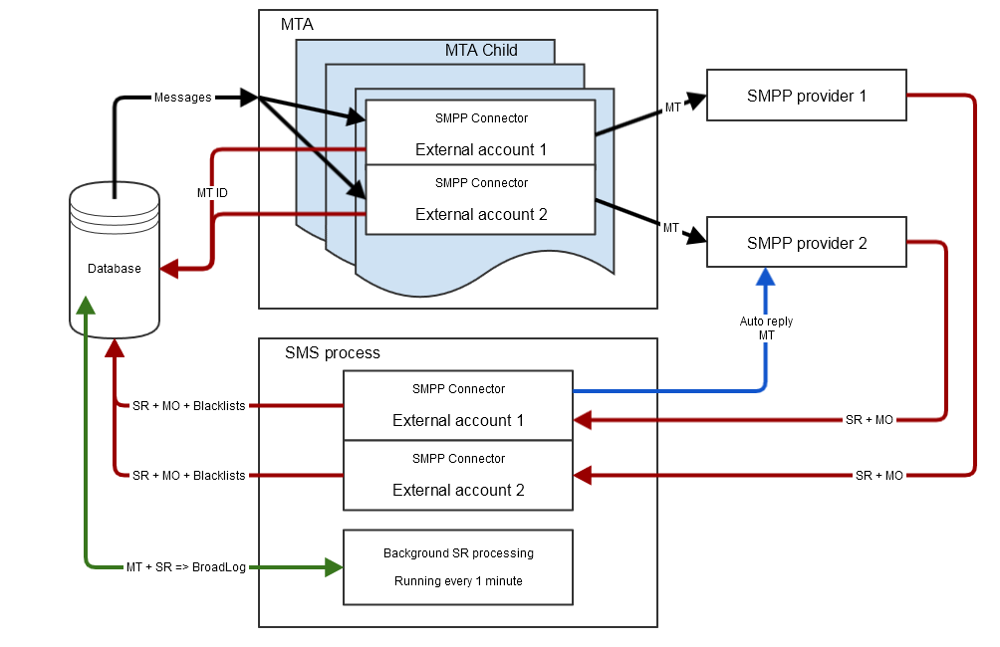

# 短信连接器协议和设置 {#sms-connector-protocol}

>[!NOTE]
>
>通过此文档，所有对协议、字段名称和值详细信息的引用都引用[SMPP 3.4规范](https://smpp.org/SMPP_v3_4_Issue1_2.pdf)。
>

## 概述 {#overview}

SMS可能仅限于发送无格式的短文本消息，但其简单性使其成为有价值的通信渠道。

发送短信有两种主要方式：

* 通过电话手动发送，这是人们直接沟通的常用方式。
* 通过Adobe Campaign发送消息的方式从互联网发送。 为此，您需要一个SMS服务提供商来将Internet连接到移动网络。
Adobe Campaign使用SMPP协议向服务提供商发送短信。

本文档将指导您逐步完成Adobe Campaign与SMPP提供商之间的连接设置。

SMPP提供商有时可能会偏离官方规范，但Adobe Campaign中的SMS连接器提供了许多选项来调整其行为，以便与大多数提供商兼容。

>[!IMPORTANT]
>
>建立与新提供商的连接可能需要一些技术技能、TCP知识、二进制、十六进制表示和文本编码。 它还需要与提供者积极合作。

### 短信类型 {#sms-types}

通过短信提供商发送大量短信时，您会遇到三种不同的短信：

* **SMS MT（已终止移动设备）**： Adobe Campaign通过SMPP提供商向移动电话发出的短信。

* **SMS MO （发起移动设备）**：移动设备通过SMPP提供商发送到Adobe Campaign的短信。

* **SMS SR（状态报告）或DR或DLR（投放回执）**：移动设备通过SMPP提供商发送给Adobe Campaign的回执，指示已成功接收短信。 Adobe Campaign还可能会收到指示无法投放消息的SR，通常包含错误描述。

您需要区分确认（RESP PDU，SMPP协议的一部分）和SR： SR是一种通过网络端到端发送的SMS，而确认仅是确认一次传输已成功完成。

确认和SR都可以触发错误，区分二者将有助于进行故障排除。

### 短信携带的信息 {#information-sms}

短信携带的信息比文本多。 此处列出您希望在短信中找到的内容：

* 文本，长度限制为140字节，这意味着根据编码方式，长度介于70到160个字符之间。 有关详细信息和限制，请参阅下面的[短信文本编码](sms-protocol.md#sms-text-encoding)。

* 收件人地址，有时称为`ADC`或`MSISDN`。 这是将接收短信的移动设备的号码。

* 发件人地址，可称为`oADC`，有时可称为`sender id`。 这可以是日常使用的电话号码、通过提供商发送的短代码或姓名。 “名称”是一个可选功能，在该情况下您无法回复短信。

* 用于指示消息是否为闪存消息的标志。 闪存消息是未存储在内存中的弹出窗口。

* 用于指示是否需要SR的标志。

* 一个有效日期，在此日期之后不允许任何网络设备重试。

* `data_coding`字段，指示文本的编码。

## SMPP协议 {#smpp-protocol}

Adobe Campaign Classic支持SMPP协议版本3.4。这是一种广泛使用的协议，允许向提供商(SMSC)发送SMS并接收SMS和接收。 有关详细信息，请参阅[SMPP文档](https://smpp.org/SMPP_v3_4_Issue1_2.pdf)。

SMS服务提供商端的网络设备通常称为SMSC。

### SMPP连接 {#smpp-connections}

Adobe Campaign通过TCP连接到SMS服务提供商的网络设备。 SMPP协议设置从Adobe Campaign到提供程序的永久TCP连接。 TCP连接始终由Adobe Campaign启动，即使接收消息也是如此。
SMPP会打开1或2个TCP连接，具体取决于其模式。 所有连接始终由Adobe Campaign启动。

SMPP协议可以两种模式工作：

* **发送器+接收器（或TX+RX）**：使用两个单独的TCP连接来发送和接收消息。
* **收发器（或TRX）**：单个TCP连接用于发送和接收消息。

>[!NOTE]
>
> Adobe Campaign Classic仅支持TX+RX模式。 此限制是由于其技术架构造成的。

### SMPP PDU {#smpp-pdu}

SMPP传输单元（“数据包”）称为PDU。 **PDU**&#x200B;包含命令、状态、序列号和数据。

每个PDU必须由`SMPP RESP PDU`确认（同步响应）。 可以管道化请求：发送者可以发送许多命令而无需等待`RESP`，可以随时管道化的请求数称为窗口。 `RESP PDU`可以任意顺序到达，与其对应的启动器PDU的顺序无关。

在分隔的&#x200B;**发送器+接收器**&#x200B;模式下，使用的连接取决于发送的消息类型。 发送器连接用于MT，接收器连接用于MO和SR。 通过同一TCP连接发送每种消息的请求和响应。

例如，在发送MT时，将使用发送器连接，并且还会通过发送器通道发送确认MT的`RESP`。 当您收到MO（或SR）时，接收器连接用于接收MO并发送确认MO的`RESP`。


在Adobe Campaign Classic中，要将SR与其对应的MT关联，SMSC将返回一个ID，其中包含`SUBMIT_SM_RESP`和`DELIVER_SM`步骤。 该标识符存储在`nms::providerMsgId`表的`providerId`字段中，并链接到`broadLogId`和`deliveryId`。 此匹配操作由SMS进程在写入数据库时完成。

成功的`SUBMIT_SM_RESP PDU`在发送日志中触发“已发送”消息状态，而成功的`DELIVER_SM (SR) PDU`触发“已接收”消息状态。

### 安全方面 {#security-aspects}

协议本身不加密。 大多数提供商在允许列表上实施IP的变体，因此必须向提供商声明Adobe Campaign服务器IP地址。

Adobe Campaign支持在绑定阶段传递登录名和密码。 它还支持SMPP而不支持TLS。 需要注意的是，要获得适当的安全性，需要证书。 虽然SMPP连接器允许绕过证书检查，但应仅将其用于测试，因为没有证书的TLS提供了显着较低的安全级别。

连接器使用系统`openssl`库提供的默认证书。 通常由Debian上的`/etc/ssl/certs`目录提供。 默认情况下，“ca-certificates”包会提供此目录，但可以对其进行自定义。

### 各种PDU中的信息 {#information-pdu}

每种PDU都有不同的字段，这些字段包含不同的信息。 这些PDU在[SMPP 3.4规范](https://smpp.org/SMPP_v3_4_Issue1_2.pdf)中有详细说明。

以下每个部分都描述了PDU及其同步响应(`*_RESP PDU`)。 所有PDU都必须由相应的`RESP`确认，这是规范的强制部分。

PDU可以有可选字段。 此处只介绍最常见的字段。 有关详细信息，请参阅[SMPP 3.4规范](https://smpp.org/SMPP_v3_4_Issue1_2.pdf)。

**BIND_TRANSMITTER / BIND_RECEIVER / BIND_TRANSCEIVER**

此PDU用于启动与SMSC的连接。 **发送器**、**接收器**&#x200B;和&#x200B;**收发器**&#x200B;模式仅更改允许通过此连接传输的SMS类型，特别是：

| 模式 | 允许的短信类型 |
|:-:|:-:|
| 发射器 | MT |
| 接收器 | MO + SR |
| 收发器 | MT + MO + SR |

`BIND_* PDU`中值得注意的字段：

* **system_id**：用于身份验证的登录。 在外部帐户中设置。

* **密码**：用于身份验证的密码。 在外部帐户中设置。

* **system_type**：对于某些提供程序，需要设置为特定值。 在外部帐户中设置（在所有版本中均可用）。 通常区分不同类型的合同、渠道、国家/地区等。

* **addr_ton**&#x200B;和&#x200B;**addr_npi**：某些提供程序需要它们。 由外部帐户中的`Bind TON`和`Bind NPI`设置设置。

* **address_range**：某些提供程序需要此项。 大多数情况下，这是此连接上允许的短代码列表。 在外部帐户中设置。

`BIND_*_RESP`没有特定字段，它确认连接是否成功。

#### 取消绑定 {#unbind}

此PDU必须在断开连接之前由系统发送。 它必须等待匹配的`UNBIND_RESP` PDU才能关闭连接。

符合SMSC的不得关闭连接，TCP连接由Adobe Campaign连接器控制。

#### SUBMIT_SM {#submit-sm}

此PDU向SMSC发送MT。 其响应PDU提供MT的ID。

`SUBMIT_SM` PDU中的重要字段：

* **service_type**：某些提供程序需要。 在投放属性中设置。

* **source_addr_ton**&#x200B;和&#x200B;**source_addr_npi**：指示传输的源地址类型。 这些字段的含义是标准化的，但由于某些提供商使用字段的方式有所不同，因此您应该要求提供商提供其正确的值。 在外部帐户中设置。

* **source_addr**： MT的源地址/ oADC。 那个显示在手机上。 在外部帐户和投放中设置，投放中的值优先于外部帐户的值。

* **dest_addr_ton**&#x200B;和&#x200B;**dest_addr_npi**：指示传输的目标地址类型（例如，本地或国际格式）。 这些字段的含义是标准化的，但由于某些提供商使用字段的方式有所不同，因此您应该要求提供商提供其正确的值。 在外部帐户中设置。

* **destination_addr**：收件人地址、电话号码或MSISDN。

* **esm_class**：用于判断文本字段中是否使用了UDH。 如果未使用`message_payload`模式，则连接器会自动启用拆分短信。

* **priority_flag**：此邮件的优先级高于其他邮件。 这与投放本身的优先级相关联。

* **validity_period**：时间戳，超过该时间后不应再尝试重试。 在投放本身中设置。

* **registered_delivery**：告知是否请求了SR。 Adobe Campaign始终设置此标记，但自动回复除外。 对于多部分消息，只为第一部分设置标志。 所有版本都具有相同的行为。

* **data_coding**：指示文本字段中使用的编码。 有关详细信息，请参阅[短信文本编码](sms-protocol.md#sms-text-encoding)部分。

* **short_message**：消息的文本。 如果使用UDH，则其中还包含UHD标头。

Adobe Campaign支持以下可选字段：

* **dest_addr_subunit**：用于指定SMS的目标：闪存、移动或SIM卡。 在投放属性中设置。

* **message_payload**：在外部帐户中启用时，将在单个PDU中发送长消息，文本将在此字段而不是`short_message`字段中传输。

#### SUBMIT_SM_RESP {#submit-sm-resp}

此PDU将包含MT的ID。 这有助于将其与传入SR匹配。

>[!IMPORTANT]
>
>许多提供商以十六进制格式传输MT ID。 确保在外部帐户中正确设置MT确认&#x200B;**中的** ID格式。

某些提供商在发送SR后发送`SUBMIT_SM_RESP`。 为了解释该行为，Adobe Campaign在将&#x200B;**无效的消息ID**&#x200B;回复到具有未知ID的SR之前等待了30秒。

#### DELIVER_SM {#delivery-sm}

此PDU由SMSC发送到Adobe Campaign。 它包含MO或SR。

大多数字段与其对应的`SUBMIT_SM`字段具有相同的含义。 以下是有用字段的列表：

* **source_addr**： MO/SR的源地址。 通常这是一个电话号码。

* **destination_addr**：接收MO或SR的短代码。

* **esm_class**：用于判断PDU是MO还是SR。

* **short_message**：消息的文本。 对于SR，这包含SMPP协议规范的附录B中描述的数据。 有关详细信息，请参阅[SR错误管理](sms-protocol.md#sr-error-management)。

Adobe Campaign能够通过某些配置读取`receipted_message_id`可选字段中的消息ID。

#### DELIVER_SM_RESP {#deliver-sm-resp}

此PDU由Adobe Campaign发送，用于确认SR和MO。

将SR和MO插入数据库后，Adobe Campaign Classic会确认它们。 即使发送了成功的`DELIVER_SM_RESP` PDU，也可能会发生一些处理错误。 此限制是由Adobe Campaign Classic的软件架构造成的。

#### ENQUIRE_LINK {#enquire-links}

此PDU仅用于检查连接是否处于活动状态。 其频率应根据提供商的需求进行设置。

默认的60秒应与外部帐户中设置的大多数配置匹配。

#### INQUIRE_LINK_RESP {#enquire-links-resp}

此PDU确认连接处于活动状态。

### 多部分SMS（长短信） {#multipart}

>[!IMPORTANT]
>
> Adobe Campaign仅支持发送多部分短信或长短信。 传入的SMS (MO)不支持UDH和`message_payload`，这意味着MO限制为160个字符。

多部分SMS或长SMS是以多个部分发送的短信。 由于移动网络协议中的技术限制，短信不能大于140字节或需要拆分。 请参阅[短信文本编码](sms-protocol.md#sms-text-encoding)部分以了解有关短信中可容纳的字符数的更多信息。

长消息的每个部分都是单独的短信。 这些部件在网络上独立运行，并由接收手机组装。 为了处理重试和连接问题，Adobe Campaign以反向顺序发送这些部分，并仅在消息的第一部分（最后发送）请求SR。 由于手机仅在收到其第一部分时显示消息，因此对其他部分的重试不会在手机上产生重复项。

可以使用&#x200B;**投放模板**&#x200B;中的&#x200B;**每条消息的最大短信数**&#x200B;设置设置每次投放的最大短信数。 超过此限制的消息在发送期间将失败，并且短信失败原因过长。

有2种方法可发送长短信：

* **UDH**：发送长消息的默认和推荐方式。 在此模式下，连接器将邮件拆分为多个`SUBMIT_SM PDU`，其中包含UDH信息。 此协议是手机本身使用的协议。 这意味着Adobe Campaign对消息生成具有最大控制权，能够准确计算发送了多少部分以及这些部分是如何拆分的。

* **message_payload**：在单个`SUBMIT_SM PDU`中发送整个长消息的方式。 提供商必须拆分该部分，这意味着Adobe Campaign无法确切知道发送了多少个部件。 某些提供商需要此模式，但我们建议您仅在它们不支持UDH时才使用此模式。

有关协议和格式的更多详细信息，请参阅[SUBMIT_SM PDU](sms-protocol.md#information-pdu)的`esm_class`、`short_message`和`message_payload`字段的说明。

### 吞吐量上限和窗口 {#throughput-capping}

大多数提供商都要求为每个SMPP连接设置吞吐量限制。 通过在外部帐户中设置大量短信即可实现此目的。 请注意，吞吐量限制发生在每个连接上，总有效吞吐量是每个连接的限制乘以连接总数。 [同时连接](sms-protocol.md#connection-settings)部分中对此进行了详细说明。

要达到最大可能的吞吐量，您需要微调最大发送窗口。 发送窗口是无需等待`SUBMIT_SM_RESP`即可发送的`SUBMIT_SM PDU`数。 有关更多详细信息，请参阅[发送窗口设置](sms-protocol.md#throughput-timeouts)部分。

### 服务请求和错误管理（“附录B”） {#sr-error-management}

SMPP协议在`RESP PDU`中定义了标准同步错误，但它没有为SR定义错误代码。 每个提供商都使用自己的错误代码及其含义。

在[SMPP协议规范](https://smpp.org/SMPP_v3_4_Issue1_2.pdf)（第167页）的附录B部分提出了建议，但这不会列出实际错误代码，也不会列出其含义。

为适应错误管理，已利用Adobe Campaign的broadlog消息系统正确配置错误及其严重性（硬、软等）。

如上所述，有两种不同的错误：

* 将消息发送到SMSC后立即在`SUBMIT_SM_RESP`中同步回复
* 可能在移动设备收到消息或消息超时后很晚发生的回执。 在这种情况下，该错误可在SR中找到。

收到SR时，可在其`short_message`字段中找到状态和错误（例如，附录B合规性实施）。 PDU的`short_message`字段通常称为&#x200B;**文本字段**，因为它包含MT中的文本。 对于SR，它包含技术信息以及名为&#x200B;**Text**&#x200B;的子字段。 这2个字段不同，`short_message`实际包含&#x200B;**文本**&#x200B;字段和其他信息。

Adobe Campaign Classic连接器（扩展SMPP除外）使用取决于所选提供商的硬编码行为。 通用SMPP只区分成功和错误，不提供任何详细信息。 投放日志可能包含一些不保证的信息。

#### SR文本字段格式 {#sr-text-field-format}

该规范建议对SR文本字段使用此格式。 它是子字段的列表，用冒号分隔以分隔字段名称及其值。 字段名称不区分大小写。

与附录B推荐匹配的SR文本字段示例：

```
id:1234567890 sub:001 dlvrd:001 submit date:1608011415 done date:1608011417 stat:DELIVRD err:000 Text:Hello Adobe world
```

ID字段是在`SUBMIT_SM_RESP PDU`中收到的ID，即MT的确认。

`sub`和`dlvrd`应该计算已传递部件和已传递消息的数量，但Adobe Campaign不使用此数量，因为broadlog系统提供了更好、更完整的信息。

`submit date`和`done date`字段是指示性时间戳，指示何时发送MT以及移动设备何时发送SR。 可能出现时区问题，甚至是日期集不正确的移动设备所给的时间戳错误。

stat字段非常重要，因为它可告知消息的状态。 唯一重要的状态为`DELIVRD`、`UNDELIV`和`REJECTD`。 `DELIVRD`状态表示成功，其他两个状态表示错误。 其他值是可能的，但它们通常是中间通知，例如MT到达移动运营商，而不是移动电话。 Adobe Campaign会忽略这些中间通知。

错误字段包含特定于提供程序的错误代码。 提供程序必须提供一份可能的错误代码表及其含义，才能解释此值。

最后，文本字段通常包含MT文本的开头。 Adobe Campaign忽略了这一点，并且一些提供商不传输此消息以避免PII泄漏和网络带宽消耗。 在故障排除期间，可通过阅读此字段更轻松地识别与测试MT匹配的SR。

### Adobe Campaign Classic Extended generic SMPP中的SR处理示例 {#sr-processing}

此示例显示了遵循附录B建议的实施案例、外部帐户中的默认值和成功的SMS MT。

```
id:1234567890 sub:001 dlvrd:001 submit date:1608011415 done date:1608011417 stat:DELIVRD err:000 Text:Hello Adobe world
```

首先，应用`id extraction`正则表达式以提取ID并将其与相应的MT进行协调。

然后，应用`status extraction`正则表达式和`error code extraction`正则表达式以提取这些字段并将其附加到字符串中。

broadlog消息是使用此信息构建的，并且会将原始的未更改字符串附加在一起以供参考：

```
SR ExampleProvider DELIVRD 000|MESSAGE=id:1234567890 sub:001 dlvrd:001 submit date:1608011415 done date:1608011417 stat:DELIVRD err:000 Text:Hello Adobe world
```

然后，对消息进行标准化，删除MESSAGE部分，以便能够将多个消息与相同的状态和错误代码进行匹配。

```
SR ExampleProvider DELIVRD 000|#MESSAGE#
```

如果尚未在broadlog消息表中配置该消息，则将创建一个新条目，并将整个消息用作&#x200B;**firstText**&#x200B;和规范化的消息。 然后，连接器使用成功和`error`正则表达式来确定它是成功还是失败：

* 如果与`success`正则表达式匹配，则将其视为成功。

* 如果与`error`正则表达式匹配，则该消息将被限定为错误。

* 如果这两个正则表达式都不匹配，则会忽略SR。 它可能是中间通知，Adobe Campaign不处理它。

默认情况下，所有错误均设置为软错误。 这意味着必须手动配置硬错误。

### 短信文本编码 {#sms-text-encoding}

如果出现编码问题，您应&#x200B;**始终与SMSC提供程序联系**。 只有SMSC提供商了解他们支持的编码以及由于其技术平台的限制可能适用的特殊规则。

SMS消息使用特殊的7位编码，通常称为GSM7编码。

在SMPP协议中，GSM7文本将扩展为每个字符8位，可促进故障排除。 SMSC会将其打包成每个字符7位，然后再发送到移动设备。 这意味着SMS的`short_message`字段在SMPP帧中可能长达160字节，而在移动网络上发送时限制为140字节。

如果出现编码问题，请检查以下重要事项：

* 确保您知道哪些字符属于哪种编码。 GSM7不完全支持变音标记或重音符号。 尤其是在法语中，é和è是GSM7的一部分，但ê、â或ï不是。 西班牙语也是如此。

* 带有cedilla (c)的C在GSM7字母表中仅以大写形式出现，但有些手机以小写或“智能”大小写形式呈现。 一般建议是完全避免这种情况并删除cedilla或切换到UCS-2。

* **请勿在SMS**&#x200B;中使用ASCII，除非SMSC提供程序明确要求。 这种编码会浪费空间，因为它有8位字符且覆盖范围比GSM7小。 北美使用的CDMA网络可能需要此编码。

* 并非始终支持Latin-1。 在尝试使用Latin-1之前，请检查与您的SMSC提供商的兼容性。

* Adobe Campaign连接器不支持国家语言转换表。 必须改用UCS-2或其他`data_coding`。

* UCS-2和UTF-16经常被手机混合使用。 当使用UCS-2中不存在的表情符号和其他字符时，会出现此问题。

* 大多数手机没有所有UCS-2字符的字体字形。 智能手机往往能够轻松显示稀有字符，但功能型手机通常对购买时所在国母语有用的字符支持有限。 如果要使用emoji或ASCII-art，请在发送前在多种手机上进行测试。 Adobe Campaign预览不会模拟缺少的字形，并将显示Web浏览器上可用的符号。

`data_coding`字段告诉您使用哪种编码。 主要问题是，值0表示规范中的默认SMSC编码，该编码通常指GSM7。 与SMSC合作伙伴核实，该合作伙伴的编码与Adobe Campaign仅支持的`data_coding` = 0相关联。 其他`data_coding`值倾向于遵循规范，但唯一确定的方法是与SMSC提供程序核实。

消息的大小上限取决于其编码。 下表总结了所有相关信息：

| 编码 | 常用数据编码 | 消息大小（字符） | 多部分短信的部分大小 | 可用字符 |
|:-:|:-:|:-:|:-:|:-:|
| GSM7 | 0 | 160 | 152 | GSM7基本字符集+扩展（扩展字符占2个字符） |
| Latin-1 | 3 | 140 | 134 | ISO-8859-1 |
| UCS-2 <br>UTF-16 | 8 | 70 | 67 | Unicode（因手机而异） |

## SMPP外部帐户参数 {#SMPP-parameters-external}

SMPP协议的每个实施都有许多变体。 为了提高兼容性和适应性，提供了许多设置以更改SMPP连接器的行为。 本节介绍每个参数及其对连接器的影响。

### 常规参数和路由 {#general-parameters-routing}

**限制此帐户的MTA实例**

可以设置允许连接到SMPP提供商的MTA实例数限制。 选中后，您可以指定最多可以使用多少MTA。

此选项允许更精确地控制连接数，请参见[同时连接](sms-protocol.md#connection-settings)。

如果设置的值高于正在运行的MTA的数量，则所有MTA都将以正常方式运行：此选项只是一个限制，不会生成其他MTA。

如果您需要精确控制连接数（如提供程序要求），则建议始终设置此选项，即使当前部署运行了正确数量的MTA也是如此。 如果之后添加其他MTA，则连接限制仍将遵守。

### 连接设置 {#connection-settings}

#### SMSC 实施名称 {#smsc-implementation-name}

设置SMSC实施的名称。 它应设置为您的提供商的名称。 联系管理员或可投放性团队以了解要在此字段中添加的内容。 此字段的角色在[SR错误管理](sms-protocol.md#sr-error-management)部分中描述。

>[!NOTE]
>
>可交付性团队的参与基于合同，客户应联系其Adobe代表以获取与可交付性参与相关的信息。

#### 服务器 {#server}

要连接的服务器的DNS名称或IP地址。

#### 端口 {#port}

要连接的TCP端口。

#### 帐户 {#account}

连接的登录名。 在BIND PDU的`system_id`字段中传递。

#### 密码 {#password}

SMPP连接的密码。 在BIND PDU的密码字段中传递。

#### 系统类型 {#system-type}

在BIND PDU的`system_id`字段中传递的值。 某些提供商需要在此指定特定值。

#### MTA 子连接数 {#number-mta-child}

在Adobe Campaign Classic中，它定义每个MTA子级的连接数。

Adobe Campaign Classic Extended SMPP连接器可以控制每个MTA子级的连接数。 要控制连接的全局限制，您必须限制MTA子进程的数量，这通常意味着为SMS提供专用的中间源平台。

对于Adobe Campaign Classic，可能存在其他数量的接收器和发射器连接：

* **发射器连接= MTA子连接数* MTA子进程数* MTA数（如果已设置自动回复）* MTA子连接数**

如上所述，如果启用了自动回复，Adobe Campaign Classic短信进程将打开更多发送器连接。 这些额外的连接用于发送自动回复。

* **接收器连接= MTA子连接数**

如果您设置自动回复，短信流程将打开发送方/接收方对，从而增加发送方连接的数量。 如果未设置任何自动回复，则仅会打开接收器连接。

#### 通过 SMPP 启用 TLS {#enable-TLS}

使用TLS连接到提供程序。 连接将被加密。 TLS连接由OpenSSL库管理，任何适用于OpenSSL的内容对于此连接都将为true。

#### 在日志文件中启用详细的 SMPP 跟踪 {#enable-verbose-log-file}

此设置将所有SMPP通信转储到日志文件中。 在初始设置过程中，通常需要调整参数。 在对连接器进行故障诊断并与提供商的通信记录进行比较时，必须启用此功能。

在Adobe Campaign Classic中，日志输出位于MT相关流量的MTA日志中，以及MO和SR相关流量的短信日志中。

### 接收器连接设置 {#receiver-connection}

此部分仅在分隔的&#x200B;**发射器+接收器**&#x200B;模式下可见。

#### 为接收器使用不同的参数 {#receiver-parameters}

如果未选中该框，则会对发射器和接收器使用相同的设置。

选中该框后，**连接设置**&#x200B;部分中的设置将应用于发射器，**接收器连接**&#x200B;设置中的设置将应用于接收器。

**接收服务器，端口，帐户，密码，系统类型**

这些设置适用于处于发射器+接收器模式的接收器。 它们的工作方式与发射器部分类似，请参阅上面了解更多详细信息。

### SMPP渠道设置 {#smpp-channel-settings}

#### 允许字符音译 {#allow-character-transliteration}

音译是查找与缺少的字符等价的字符的过程。 例如，GSM编码中缺少法语“e”（带抑扬符）字符，但它可以替换为“e”，而不会影响可读性。

如果未选中此框，则当无法按原样对字符串进行编码时，文本编码将失败。

选中此框后，文本编码将尝试将字符串转换为近似版本，而不是失败。 如果某些字符在目标编码中没有等效字符，则文本编码将失败。

请参阅[定义编码设置的特定映射](sms-protocol.md#SMSC-specifics)，以获取编码过程的更一般说明。

#### 将传入MO存储在数据库中 {#incoming-mo-storing}

启用后，传入的MO将存储在数据库的inSMS表中。 可使用任何工作流的查询活动来查询此表。

Adobe Campaign Classic始终将所有MO存储在inSMS数据库中，因此此选项不可用。

#### 在SR处理期间启用实时KPI更新 {#real-time-kpi}

启用后，当收到错误SR时，将在主投放页面上实时更新KPI。

其缺点可能是由于它产生的数据库争用而导致性能降低。 如果禁用，**syncfromexec**&#x200B;工作流将更新统计信息，每20分钟运行一次。

Adobe Campaign Classic具有完全不同的KPI机制，因此此选项不可用。

#### 来源编号 {#source-number}

定义消息的默认源地址。 此设置仅适用于投放中源编号留空的情况。

默认情况下，不会传递源编号字段，因此提供商会将其替换为短代码。

这将启用发件人地址/oADC覆盖功能。

#### 短代码 {#short-code}

指示帐户的主要短代码。 如果此帐户使用了多个短代码，或者如果短代码未知，请将此字段留空。

指定短代码对以下两项功能很有用：

* 如果未提供源号码，则预览将显示短代码。 那个反映的是手机上的真实行为。

* 自动回复功能的“阻止列表”设置只会将特定短代码的隔离用户发送到。

#### Source TON/NPI，目的地TON/NPI {#ton-npi}

TON（号码类型）和NPI（编号计划指示器）在[SMPP 3.4规范](https://smpp.org/SMPP_v3_4_Issue1_2.pdf)（第117页）的第5.2.5节中进行了说明。 这些值应该根据提供商的需求进行设置。

它们在`SUBMIT_SM PDU`的`source_addr_ton`、`source_addr_npi`、`dest_addr_ton`和`dest_addr_npi`字段中按原样传输。

#### 服务类型 {#service-type}

此字段在`SUBMIT_SM PDU`的`service_type`字段中按原样传输。 根据提供商的需求进行设置。

### 吞吐量和超时 {#throughput-timeouts}

这些设置控制SMPP频道的所有计时方面。 某些提供商需要非常精确地控制消息速率、窗口和重试计时。 应将这些设置设置为与提供商的容量及其合同中指示的条件匹配的值。

#### 发送窗口 {#sending-window}

窗口是无需等待匹配的`SUBMIT_SM_RESP`即可发送的`SUBMIT_SM PDU`数。

最大窗口为4的传输示例：


当网络链路具有高等待时间时，该窗口有助于提高吞吐量。  窗口的值必须至少是SMS数乘以链路延迟
以秒为单位，连接器绝不会等待`SUBMIT_SM_RESP`才发送下一封邮件。
如果窗口太大，您可以在出现连接问题时发送更多重复消息。 此外，大多数提供商对窗口都有非常严格的限制，并拒绝超出限制的消息。

如何计算最佳发送窗口公式：

* 测量`SUBMIT_SM`到`SUBMIT_SM_RESP`之间的最大延迟。

* 将该值以秒为单位乘以最大MT吞吐量。 这将提供最佳发送窗口值。

示例：如果在最大MT吞吐量中设置300 SMS/s，并且平均`SUBMIT_SM`到`SUBMIT_SM_RESP`之间有100毫秒的延迟，则最佳值将是`300×0.1 = 30`。

#### 最大 MT 吞吐量 {#max-mt-throughput}

每秒和每个连接的最大MT数。 必须严格执行此设置，MTA绝不会以快于此限制的速度推送消息。 它对于需要精确节流的提供商非常有用。

要了解总吞吐量限制，请将此数字乘以连接总数，如上面的公式中所详述。

0表示没有限制，MTA将尽快发送MT。

通常建议将此设置保持在1000以下，因为无法保证超过此数量的精确吞吐量，除非在最终架构上正确设定基准并专门请求SMPP提供商。 最好将连接数增加到1000 MT/s以上。

#### 重新连接前的时间 {#time-reconnection}

当TCP连接丢失时，连接器将等待此秒数，然后再尝试建立连接。

#### MT 的有效期限 {#expiration-period}

介于`SUBMIT_SM`及其匹配`SUBMIT_SM_RESP`之间的超时。 如果未及时收到`RESP`，则消息将被视为失败，并且将应用MTA的全局重试策略。

#### 绑定超时 {#bind-timeout}

TCP连接尝试与`BIND_*_RESP`回复之间的超时。 如果超时，连接将被Adobe Campaign连接器关闭，并且它将等待一段时间后再重新连接，然后重试。

#### 查询链接期 {#enquire-link-period}

`enquire_link`是为保持连接活动而发送的特殊类型的PDU。 此时间段以秒为单位。 Campaign连接器仅在连接空闲时发送`enquire_link`以节省带宽。 如果在此时间段后两次未收到RESP，则连接将被视为无效，并触发重新连接过程。

### SMSC详情 {#SMSC-specifics}

这些设置是高级设置，可使Adobe Campaign连接器适应大多数SMPP实施特点。

**定义编码的特定映射**

有关文本编码的详细信息，请参阅[短信文本编码](sms-protocol.md#sms-text-encoding)部分。

此设置允许您定义与规范不同的自定义编码映射。 您将能够声明编码列表及其`data_coding`值。

MTA将尝试使用列表中的第一个编码进行编码。 如果失败，则会尝试使用列表中的下一个编码等。 如果无法使用编码对消息进行编码，则会发生错误。 找到编码后，MTA将使用编码文本创建`SUBMIT_SM PDU`，并使用表中指定的值设置`data_coding`字段。

表中的项目顺序很重要：编码是从上到下的尝试。 您应该将最便宜或最推荐的编码放在列表的顶部，然后进行越来越昂贵的编码。

请注意，UCS-2永远不会失败，因为它可以编码Adobe Campaign中支持的所有字符，并且UCS-2短信的最大长度要小得多：仅限70个字符。

也可以使用此设置通过仅声明映射表中的1行来强制始终使用特定编码。

未选中该复选框时使用的默认映射等效于下表：

| 数据编码 | 编码 |
|---|---|
| 0 | GSM |
| 9 | UCS-2 |

这意味着MTA将尝试在GSM中编码消息。 如果成功，它将在`data_coding`设置为0的情况下发送。

如果无法以GSM对消息进行编码，则将以UCS-2对消息进行编码，并将`data_coding`设置为8。

#### 启用message_payload {#enable-message-payload}

取消选中后，长短信将被MTA拆分，并使用UDH在多个`SUBMIT_SM PDU`中发送。 该消息将根据UDH数据由手机重新组合。

选中后，长型SMS将在一个SUBMIT_SM PDU中发送，并将文本放置在message_payload可选字段中。 有关此内容的详细信息，请参阅[SMPP规范](sms-protocol.md#ACS-SMPP-connector)。

如果启用了此功能，Adobe Campaign将无法单独计算短信部件数量：所有消息都将被计为在一部分发送。

#### 发送完整的电话号码 {#send-full-phone-number}

如果未选中此复选框，则仅向提供商发送电话号码的号码（`SUBMIT_SM`字段的`destination_addr`字段）。 这是默认行为，因为国际数字指示符（通常为+前缀）将替换为SMPP中的TON和NPI字段。

选中该复选框后，电话号码将按原样发送，不会进行预处理和添加可能的空格，+前缀或井号/井号/星号。

此功能还对自动回复阻止列表功能的行为产生影响：如果未选中该复选框，则会在插入隔离表的电话号码中添加+前缀，以补偿SMPP协议本身从电话号码中删除的+前缀。

#### 跳过TLS证书检查 {#skip-tls}

启用TLS后，跳过所有证书检查。

选中后，连接不再安全，在生产环境中不应启用连接。

它可用于调试或测试目的。

您可以在三个不同的证书验证值之间进行选择：

* 完整的认证检查（包括主机名），默认。
* 跳过主机名验证。
* 跳过证书验证。

#### 绑定TON/NPI {#bind-ton-npi}

[SMPP 3.4规范](https://smpp.org/SMPP_v3_4_Issue1_2.pdf)（第117页）的第5.2.5节中描述的TON（编号类型）和NPI（编号计划指示器）。 应将这些值设置为提供商所需的任何值。

它们在BIND PDU的`addr_ton`和`addr_npi`字段中按原样传输。

#### 地址范围 {#address-range}

在BIND PDU的address_range字段中按原样发送。 此值应设置为提供商所需的任何值。

#### 无效 ID 确认计数 {#invalid-id}

限制可以为单个SR发送的&#x200B;**消息ID无效** `DELIVER_SM_RESP`的数量。

**这仅作为解决方法用于故障排除目的**，并在正常情况下设置为0。

Fox示例，当设置为2时：

* 提供程序发送ID为“1234”的SR (`DELIVER_SM`)。

* 在数据库中找不到ID“1234”。

* 连接器计算该ID的1 **无效ID**&#x200B;错误，因此它会发送`DELIVER_SM_RESP`并显示“消息ID无效”错误代码（正常行为）。

* 提供程序将重试ID为“1234”的相同SR。

* 在数据库中仍然找不到ID“1234”。

* 连接器计算该ID的2 **无效ID**&#x200B;错误，因此即使未正确处理，也会发送`DELIVER_SM_RESP`“正常”。

* 此功能旨在当无效的SR块合法表示无法处理消息时刷新提供程序端的SR缓冲区。

将此字段设置为0将禁用始终返回&#x200B;**消息ID无效**&#x200B;的机制，这是正常行为。

将此字段设置为1可使连接器始终响应“确定”，即使ID无效也是如此。 仅在监督下，该值才应设置为1，以用于故障排除和最短时间，例如，从提供商方问题中恢复。

#### SR 中 ID 的提取正则表达式 {#regex-extraction}

SMPP协议规范未严格强制实施SR格式。 它只是规范的[附录B](sms-protocol.md#sr-error-management)（第167页）中描述的建议。 有些SMPP实施者采用不同的格式设置此字段，因此Adobe Campaign需要一种方法来提取正确的字段。

默认情况下，它捕获`id:`后最多10个字母数字字符。

正则表达式必须正好具有一个捕获组，该捕获组的一部分包含在括号中。 ID部分必须用括号括起来。 正则表达式格式为PCRE。

调整此设置时，请确保包含尽可能多的上下文，以避免误触发。 如果有特定的前缀，例如标准中的`id:`，请将其包含在正则表达式中。 此外，请尽量使用单词分隔符(\b)，以避免在单词中间捕获文本。

在正则表达式中没有包含足够的上下文可能会引入一个小的安全缺陷：消息的实际内容可以包含在SR中。 如果您只匹配某个不含上下文的特定ID格式，例如UUID，那么它可能是在解析实际文本内容，例如，在文本字段中嵌入的UUID，而不是ID。

#### 应用正则表达式来确定成功/错误状态 {#regex-applied}

当遇到具有未知stat/err字段组合的消息时，这些正则表达式将应用于stat字段以确定SR是成功还是错误。 如果其stat值与这些正则表达式中的任何值都不匹配，则会忽略SR。

默认情况下，以`DELIV`开头的stat值（如[附录B](sms-protocol.md#sr-error-management)中的`DELIVRD`）将被视为已成功交付，而所有与错误（如`REJECTED`、`UNDELIV`）匹配的stat值将被视为错误。

#### MT确认中的ID格式 {#id-format-mt}

这表示`SUBMIT_SM_RESP PDU`的`message_id`字段中返回的ID的格式。

* **请勿修改**：该ID在数据库中以ASCII编码文本的形式按原样存储。 不进行预处理或过滤。

* **十进制数**：ID应为ASCII格式的十进制数。 使用此设置时，将删除前导和尾随空格以及前导零。

* **十六进制数字**：ID应为ASCII形式的十六进制数字，不能以0x开头，也不能以h结尾。然后，该ID在存储到数据库中之前被转换为十进制数。

* **十六进制字符串**： ID应为ASCII编码的文本，其本身是编码为十六进制的字节字符串。 例如，在PDU中，您将找到`0x34 0x31 0x34 0x32 0x34 0x33`，这将转换为ASCII“414243”。 然后，此字符串被解码为字节的十六进制字符串，您因此获得“ABC”：您将在数据库中存储ID“ABC”。

#### SR中的ID格式 {#id-format-sr}

这表示由SR中ID的`Extraction`正则表达式捕获的ID的格式。 值与上述MT中的格式具有相同的含义和行为。

**可选字段**&#x200B;中的SR ID或错误代码

>[!NOTE]
>
>仅在Adobe Campaign Classic Extended SMPP连接器中可用。

如果选中，可选字段的内容将附加到上述正则表达式处理的文本中。 文本的格式为`0xTAG:VALUE`，`0xTAG`是标记的4位十六进制值，用大写表示，如`0x002E`。

例如，您可能希望捕获`receipted_message_id`字段中的ID。 为此，请启用此复选框，并将以下文本添加到状态：

```
0x001E:05e3299e-8d37-49d0-97c6-8e4fe60c7739
```

在本例中，0x001E是可选字段的标记，UUID是字段的值。

为了捕获此值，您现在可以在SR字段中ID的提取正则表达式中设置以下正则表达式：

```
\b0x001E:([0-9a-f]{8}-[0-9a-f]{4}-[0-9a-f]{4}-[0-9a-f]{4}-[0-9a-f]{12})\b
```

>[!IMPORTANT]
>
>您只能捕获具有文本(ASCII/UTF-8)值的可选字段。 具体而言，使用当前的正则表达式系统无法可靠地捕获二进制字段。

**文本字段中的SR ID或错误代码**

如果选中，**Text**&#x200B;字段将在处理SR的状态文本期间保留。

如果提供商将重要数据（如ID或状态）放置在此字段中，这将很有用。 通常，此字段可以安全丢弃，因为它可能包含使用非ASCII编码的文本并中断正则表达式处理。

如果SR字段中ID的`Extraction`正则表达式不够具体，则启用此选项可能会引入非常小的安全缺陷。 **Text**&#x200B;字段的内容可以解析为ID，攻击者可能会使用它注入伪造的ID，这可能导致部分拒绝服务情况。

**服务ID标记**

允许添加自定义TLV。 此字段设置标记部分。 可以在每次投放的高级参数的&#x200B;**服务或程序ID**&#x200B;值中自定义该值。

此设置仅允许每条消息添加一个TLV选项。

### 自动回复发送至 MO {#automatic-reply}

>[!IMPORTANT]
>
>在Adobe Campaign Classic和混合架构中，对扩展SMPP连接器应用自动回复需要为&#x200B;**外部帐户**&#x200B;文件夹上的mid运算符添加写入权限。

列入阻止列表此功能允许快速回复文本到MO，并处理每个短代码发送到。

**关键字**&#x200B;和&#x200B;**短代码**&#x200B;列定义条件以触发自动回复。 如果两个字段匹配，则会发送MO并触发其他操作。 要指定通配符，应将字段留空。 关键字与MO文本中的第一个字母数字单词匹配，忽略标点和前导空格。 这意味着&#x200B;**Keyword**&#x200B;字段不能包含空格，并且必须是单个单词。

**关键字**&#x200B;设置是前缀。 例如，如果您指定“AD”，则会匹配“AD”、“ADAPT”和“ADOBE”。 如果您有多个具有相同前缀的关键字，则需要注意顺序，因为关键字是从上到下处理的。

**Reply**&#x200B;列是要回复的文本。 此字段中没有可用的个性化设置。 如果您将此字段留空，将不会回复任何消息，但将仍触发其他操作。

当&#x200B;**关键字**&#x200B;和&#x200B;**短代码**&#x200B;都匹配时，**附加操作**&#x200B;列会提供一个附加操作，空短代码与所有短代码匹配。 您可以发送隔离或从隔离中删除，值none对文本不回复。 如果您指定了&#x200B;**其他操作**，但将&#x200B;**回复**&#x200B;字段留空，则将执行该操作，但不会发送回复。 仅对指定的短代码应用隔离，如果字段留空，则对所有短代码应用隔离。

>[!IMPORTANT]
>
>“发送完整电话号码”设置会影响自动回复隔离机制的行为：如果未选中“发送完整电话号码”，则被隔离的电话号码将带有加号(“+”)，以使其与国际电话号码格式兼容。

表中所有条目都按指定的顺序进行处理，直到一个规则匹配为止。 如果多个规则匹配一个MO，则仅应用最顶层的规则。

## 短信投放模板参数 {#sms-delivery-template-parameters}

某些参数可以根据投放模板进行设置。

### 发件人字段 {#from-field}

此字段为可选字段。 它允许覆盖发件人地址(oADC)。 此字段的内容放在`SUBMIT_SM PDU`的`source_addr`字段中。

根据SMPP规范，字段限制为21个字符，但某些提供程序可能允许较长的值。 另请注意，在某些国家/地区可能会应用非常严格的限制，例如长度、内容、允许的字符。

### 投放参数 {#delivery-parameters}

#### 每条消息的最大短信数 {#maximum-sms}

此设置仅在&#x200B;**消息有效负载**&#x200B;设置被禁用时才有效。 如果消息需要的短信数超过此值，则会触发错误。

SMS协议将SMS限制为255部分，但某些手机无法拼合长度超过10部分左右的消息，此限制取决于确切模型。 我们建议您不要每条消息超过5部分。

由于个性化消息在Adobe Campaign中的工作方式，消息的大小可能有所不同。 拥有大量长报文可能会增加发送成本。

#### 传输方式 {#transmission-mode}

此字段指示您要传输的SMS类型：普通消息或闪存消息，存储在移动设备或SIM卡上。

此设置在`SUBMIT_SM PDU`的`dest_addr_subunit`可选字段中传输。

* **未指定**&#x200B;在PDU中未发送任何可选字段。

* **Flash**&#x200B;将该值设置为1。 它会发送一条在手机上弹出且未存储在内存中的闪存消息。

* **Normal**&#x200B;将该值设置为0。 它会发送一条正常消息。

* **Save on mobile**&#x200B;将该值设置为2。 它告知手机将短信存储在内存中。

* **保存在终端**&#x200B;上将值设置为3。 它告知手机将短信存储在SIM卡中。

#### 有效期 {#validity-period}

有效期在`SUBMIT_SM PDU`的`validity_period`字段中传输。 日期始终采用绝对UTC时间格式，日期字段将以“00+”结尾。

## 扩展的通用SMPP连接器 {#acc-extended-connector}



箭头表示数据流。

发送投放部分时，MTA会生成MTA子项。 MTA子进程的数目是动态的，取决于serverConf.xml中的配置。 每个MTA子实例化连接到SMPP提供程序的连接器`CSmppConnectorWorker`。 只要MTA子项保持活动状态（也可以在serverConf.xml中配置），连接就会保持活动状态。

SMS进程仅处理SR，它连接到提供商并保持连接打开。 该进程每10分钟重新连接一次，以重新加载新设置，这是正常操作。

### 匹配MT、SR和broadlog条目 {#matching-mt}

中间表`nmsProviderMsgId`用于在异步提交到broadlog之前临时存储MT和SR数据。

`nmsProviderMsgId`表有3组列：

* 发送和确认MT时更新的列： `iBroadLogId`，`iDeliveryId`

* 收到SR时更新的列： `iMsgId`， `iStatus`

* 始终更新的列： `tsCreated`， `sProviderId`

当MT和SR都完成处理时，您应该具有完整的行，其中包含broadlog信息和状态信息。

此处，`iMsgId`链接到`nmsBroadLogMsg`表，指示完整状态/错误消息。

短信进程每分钟检查一次完整的行，然后异步处理它们：

* 将读取整行。
* SMS进程根据投放映射计算broadlog表的名称。
* 短信进程使用消息ID和状态更新broadlog表。

**吞吐量和并行连接**

每个MTA子级会创建可配置的连接量，因此限制MTA子级的数量将限制连接量。 由于MTA子进程和流量之间的相关性是相关的，因此这可以有所控制，但仍然是有点不可预测的。

## 上线之前 {#checklist}

本核对清单列出您在上线前应检查的事项。 不完整的设置可能会导致许多问题。

### 检查外部帐户冲突 {#external-account-conflict}

检查您是否没有旧的短信外部帐户。 如果禁用测试帐户，则会在生产系统上重新启用该帐户并产生潜在冲突。

如果同一Adobe Campaign实例上有多个帐户连接到同一提供商，请联系提供商以确保他们实际区分这些帐户之间的连接。 使用同一登录名拥有多个帐户需要额外的配置。

### 在检查期间启用详细的SMPP跟踪 {#enable-verbose}

检查期间应始终启用详细的SMPP跟踪。
即使您无法自己查看日志，[Adobe客户关怀](https://helpx.adobe.com/cn/enterprise/admin-guide.html/enterprise/using/support-for-experience-cloud.ug.html)也可以更轻松地为您提供帮助。

### 测试短信 {#test}

* **发送包含各种字符的短信**
如果您需要发送非GSM或非ASCII字符的短信，请尝试发送尽可能多多种字符的消息。 如果设置自定义字符映射表，请为所有可能的`data_coding`值至少发送一个SMS。

* **检查SR是否正确处理**
在投放日志中，短信应标记为已接收。 投放日志应该成功，并且应该如下所示：
  `SR yourProvider stat=DELIVRD err=000|#MESSAGE`
检查您是否更改了投放提供商名称。 在生产环境中，投放日志绝不应该包含&#x200B;**SR Generic**。

* **检查是否已处理MO**
如果需要处理MO（自动回复、将MO存储在数据库中等），请尝试进行一些测试。 为所有自动回复关键字发送几条短信，并检查回复是否足够快，不超过几秒。
在日志中检查Adobe Campaign是否成功回复了`DELIVER_SM_RESP` (command_status=0)。

### 检查PDU {#check-pdus}

即使消息看起来成功，但请务必检查PDU的格式是否正确。

在连接到之前未连接到Adobe Campaign的提供程序时，必须执行此步骤。

#### 绑定 {#bind}

检查`BIND_* PDUs`是否正确发送。 要检查的最重要事项是提供程序始终返回成功的`BIND_*_RESP PDUs` (command_status = 0)。

检查`BIND_* PDU`是否不多。如果数量过多，则可能表示连接不稳定。 有关详细信息，请参阅[连接不稳定的问题](sms-protocol.md#issues-unstable-connection)部分。

#### ENQUIRE_LINK {#enquire-link-pdus}

检查连接空闲时是否定期交换`ENQUIRE_LINK PDU`。

**SUBMIT_SM / DELIVER_SM**

发送消息，然后在日志中搜索相应的`SUBMIT_SM`、`SUBMIT_SM_RESP`、`DELIVER_SM`和`DELIVER_SM_RESP PDU`。

使用`SUBMIT_SM PDU`：

* 检查`data_coding`是否正确，默认情况下为0。
* 检查`short_message`是否正确编码。 尝试使用支持多种编码的十六进制转换器对其进行解码。

使用`SUBMIT_SM_RESP PDU`：

* 检查是否成功，command_status = 0。
* 检查其正文是否包含格式正确的ID，后跟“0”字节。

使用`DELIVER_SM PDU`：

* 对十六进制`short_message`字段进行解码。
* 使用正则表达式检查工具检查SR中ID的`Extraction`正则表达式中定义的正则表达式是否只返回一个捕获组，以及它是否捕获消息中的整个ID。
* 检查提取的ID是否与`SUBMIT_SM_RESP`中的ID匹配。
* 检查SR中状态的`Extraction`正则表达式中定义的正则表达式是否返回stat字段的内容。
* 检查SR中错误的`Extraction`正则表达式中定义的正则表达式是否返回错误字段的内容。

使用`DELIVER_SM_RESP PDU`：

* 检查在收到`DELIVER_SM PDU`后是否快速发送，通常小于1秒。
* 检查是否成功，command_status = 0。

### 与提供商核实 {#provider}

即使您的短信发送成功，请联系提供商以查看是否一切正常。

### 禁用详细的SMPP跟踪 {#disable-verbose}

完成所有检查后，最后一项是&#x200B;**禁用详细的SMPP跟踪**&#x200B;以不生成过多日志。 出于故障排除目的，甚至可以在生产系统中重新启用它们。
