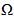

# 在独立实例上配置短信渠道 {#setting-up-sms-channel}

要发送到手机，您需要：

1. 指定连接器和消息类型的外部帐户。

   请注意，旧版连接器现已弃用。 已弃用的功能仍然可用，但不会进一步增强或支持这些功能。请参阅[此页面](../../rn/using/deprecated-features.md)以了解详情。

1. 引用此外部帐户的投放模板。

>[!NOTE]
>
> 对于短信投放，分类应使用在中创建的特定SMS亲和度 **一** 专用应用程序服务器容器。 [了解详情](../../installation/using/configure-delivery-settings.md#managing-outbound-smtp-traffic-with-affinities)

## 创建SMPP外部帐户 {#creating-an-smpp-external-account}

>[!IMPORTANT]
>
>对多个外部SMS帐户使用相同的帐户和密码可能会导致帐户之间的冲突和重叠。 请参阅 [短信疑难解答页面](troubleshooting-sms.md#external-account-conflict).

要将短信发送到手机，您首先需要创建SMPP外部帐户。
有关短信协议和设置的更多信息，请参阅此 [页面](sms-protocol.md).

为此请执行以下操作步骤：

1. 在 **[!UICONTROL Platform]** > **[!UICONTROL External accounts]** 节点，单击 **[!UICONTROL New]** 图标。
1. 将帐户类型定义为 **路由**，渠道为 **移动（短信）**，并且投放模式为 **批量投放**.

   

1. 查看 **[!UICONTROL Enabled]** 盒子。
1. 在 **[!UICONTROL Mobile]** 选项卡，选择 **[!UICONTROL Extended generic SMPP]** 从 **[!UICONTROL Connector]** 下拉列表。

   

   >[!CAUTION]
   >
   > 从版本20.2开始，旧版连接器已弃用，并且不受支持。 我们建议使用 **[!UICONTROL Extended generic SMPP]** 连接器。 有关如何迁移到推荐连接器的更多信息，请参阅此 [页面](unsupported-connector-migration.md).

1. 此 **[!UICONTROL Enable verbose SMPP traces in the log file]** 选项允许您将所有SMPP通信转储到日志文件中。 必须启用此选项才能对连接器进行故障诊断，并与提供商的通信记录进行对比。

1. 请联系短信服务提供商，该提供商将向您说明如何填写以下文件中的不同外部帐户字段： **[!UICONTROL Connection settings]** 选项卡。

   然后，根据所选提供商，联系您的提供商，提供商将为您提供用于进入 **[!UICONTROL SMSC implementation name]** 字段。

   您可以定义每个MTA子级与提供程序的连接数。 默认情况下，设置为1。

1. 默认情况下，短信的字符数应符合GSM标准。

   使用 GSM 编码的短信消息长度上限为 160 个字符，而对于分段发送的消息，每段短信的长度上限为 153 个字符。

   >[!NOTE]
   >
   >某些字符会被计为两个字符（大括号、方括号、欧元符号等）。
   >
   >可用GSM字符的列表如下所示。

   如果需要，您可通过勾选对应的方框来授权字符音译。

   

   如需详细信息，请参阅[此小节](#about-character-transliteration)。

1. 在 **[!UICONTROL Throughput and delays]** 选项卡上，您可以指定叫客消息(“MT”，Mobile Terminated)的最大吞吐量，以每秒MT为单位。 如果在对应的字段中输入“0”，则吞吐量将没有限制。

   对应于持续时间的所有字段值，都必须填写以秒为单位的值。

1. 在 **[!UICONTROL Mapping of encodings]** 选项卡，您可以定义编码。

   如需详细信息，请参阅[此小节](#about-text-encodings)。

1. 在 **[!UICONTROL SMSC specificities]** 选项卡， **[!UICONTROL Send full phone number]** 选项默认处于禁用状态。 如果要遵守SMPP协议，并且只向SMS提供商(SMSC)的服务器传输数字，请勿启用此项。

   但是，鉴于某些提供商需要使用“+”前缀，建议您与提供商进行核实，他们将会提供是否有必要启用此选项的建议。

   此 **[!UICONTROL Enable TLS over SMPP]** 利用复选框，可加密SMPP通信。 有关详细信息，请参见此 [ 页面](sms-protocol.md)。

1. 如果您正在配置 **[!UICONTROL Extended generic SMPP]** 连接器，您可以设置自动回复。

   如需详细信息，请参阅[此小节](#automatic-reply)。

## 短信字符音译 {#about-character-transliteration}

可在SMPP移动投放外部帐户中设置字符音译，位于 **[!UICONTROL Mobile]** 选项卡。

音译指的是，如果 GSM 标准无法识别某个短信字符，则会用另一个字符替换该字符。

* 如果音译为 **[!UICONTROL authorized]**，则在发送消息时，无法识别的每个字符都将替换为GSM字符。 例如，字母“ë”会被替换为“e”。因此，消息会有些微变化，但字符限制将保持不变。
* 当音译为 **[!UICONTROL not authorized]**，则包含无法识别字符的每条消息都将以二进制格式(Unicode)发送：这样，所有字符都会按原样发送。 但是，使用 Unicode 的短信消息长度上限为 70 个字符（对于分段发送的消息，每段短信的长度上限为 67 个字符）。如果超过最大字符数，则会分段发送多条消息，这可能会产生额外的费用。

>[!IMPORTANT]
>
>将个性化字段插入短信消息内容，可能会引入GSM编码无法识别的字符。

默认情况下，字符音译处于禁用状态。如果您希望将短信消息中的所有字符都按原样保留，以免名称等内容被错误地更改，我们建议您不要启用此选项。

但是，如果短信消息包含大量会生成 Unicode 消息的字符，则可以选择加入此选项以限制发送消息的成本。

下表列出了GSM标准可识别的字符。 除下面提及的字符外，插入消息正文的所有其他字符都会将整个消息转换为二进制格式(Unicode)，因此将其限制为70个字符。

**基本字符**

<table> 
 <tbody> 
  <tr> 
   <td> @ </td> 
   <td>  </td> 
   <td> SP </td> 
   <td> 0 </td> 
   <td> ¡AEM </td> 
   <td> P </td> 
   <td> ？ </td> 
   <td> p </td> 
  </tr> 
  <tr> 
   <td> £ </td> 
   <td> _ </td> 
   <td> ！ </td> 
   <td> 1 </td> 
   <td> A </td> 
   <td> Q </td> 
   <td> a </td> 
   <td> q </td> 
  </tr> 
  <tr> 
   <td> $ </td> 
   <td>  </td> 
   <td> ” </td> 
   <td> 2 </td> 
   <td> B </td> 
   <td> R </td> 
   <td> b </td> 
   <td> r </td> 
  </tr> 
  <tr> 
   <td> £ </td> 
   <td>  </td> 
   <td> # </td> 
   <td> 3 </td> 
   <td> C </td> 
   <td> S </td> 
   <td> c </td> 
   <td> s </td> 
  </tr> 
  <tr> 
   <td> e </td> 
   <td>  </td> 
   <td> ¤AEM </td> 
   <td> 4 </td> 
   <td> D </td> 
   <td> T </td> 
   <td> d </td> 
   <td> t </td> 
  </tr> 
  <tr> 
   <td> é </td> 
   <td>  </td> 
   <td> % </td> 
   <td> 5 </td> 
   <td> E </td> 
   <td> U </td> 
   <td> e </td> 
   <td> u </td> 
  </tr> 
  <tr> 
   <td> u </td> 
   <td>  </td> 
   <td> 和 </td> 
   <td> 6 </td> 
   <td> F </td> 
   <td> V </td> 
   <td> f </td> 
   <td> v </td> 
  </tr> 
  <tr> 
   <td> i </td> 
   <td>  </td> 
   <td> ’ </td> 
   <td> 7 </td> 
   <td> G </td> 
   <td> W </td> 
   <td> g </td> 
   <td> w </td> 
  </tr> 
  <tr> 
   <td> ö </td> 
   <td>  </td> 
   <td> ( </td> 
   <td> 8 </td> 
   <td> H </td> 
   <td> X </td> 
   <td> h </td> 
   <td> x </td> 
  </tr> 
  <tr> 
   <td> C </td> 
   <td>  </td> 
   <td> ) </td> 
   <td> 9 </td> 
   <td> I </td> 
   <td> Y </td> 
   <td> i </td> 
   <td> y </td> 
  </tr> 
  <tr> 
   <td> 换行 </td> 
   <td>  </td> 
   <td> * </td> 
   <td> ： </td> 
   <td> J </td> 
   <td> Z </td> 
   <td> j </td> 
   <td> z </td> 
  </tr> 
  <tr> 
   <td> Ø </td> 
   <td> ESC </td> 
   <td> + </td> 
   <td> ； </td> 
   <td> K </td> 
   <td> 一 </td> 
   <td> k </td> 
   <td> a </td> 
  </tr> 
  <tr> 
   <td> ø </td> 
   <td> AE </td> 
   <td> ， </td> 
   <td> &lt; </td> 
   <td> L </td> 
   <td> Ö </td> 
   <td> l </td> 
   <td> ö </td> 
  </tr> 
  <tr> 
   <td> 回车 </td> 
   <td> “ ”标签 </td> 
   <td> - </td> 
   <td> = </td> 
   <td> M </td> 
   <td> 否 </td> 
   <td> m </td> 
   <td> n </td> 
  </tr> 
  <tr> 
   <td> Å </td> 
   <td> ß </td> 
   <td> 。 </td> 
   <td> &gt; </td> 
   <td> N </td> 
   <td> U </td> 
   <td> n </td> 
   <td> u </td> 
  </tr> 
  <tr> 
   <td> a </td> 
   <td> É </td> 
   <td> / </td> 
   <td> ? </td> 
   <td> O </td> 
   <td> § </td> 
   <td> ö </td> 
   <td> à </td> 
  </tr> 
 </tbody> 
</table>

SP：空格键

ESC：Escape 键

LF：换行

CR：回车

**高级字符（计为两个字符）**

^ { } `[ ~ ]` | €

## 文本编码 {#about-text-encodings}

发送短信消息时，Adobe Campaign 可以使用一个或多个文本编码。每个编码都有属于自己的特定字符集，可确定其适合短信消息的字符数。

配置新的SMPP移动投放外部帐户时，您可以定义 **[!UICONTROL Mapping of encodings]** 在 **[!UICONTROL Mobile]** 选项卡： **[!UICONTROL data_coding]** 字段允许Adobe Campaign向SMSC传达使用的编码。

>[!NOTE]
>
>**Data_coding** 值与实际使用的编码之间的映射，经过标准化处理。但是，某些SMSC具有属于自己的特定映射：在这种情况下，您的 **Adobe Campaign** 管理员需要声明此映射。 有关更多信息，请咨询您的提供商。

您可以声明 **data_codings** 并强制进行编码（如有必要）：要实现此目的，请在表中指定一种编码。

* 未定义编码映射时，连接器会采取常规行为：

   * 它会尝试将 GSM 编码用于分配值 **data_coding = 0**。
   * 如果 GSM 编码失败，则会将 **UCS2** 编码用于分配值 **data_coding = 8**。

* 定义要使用的编码以及链接的编码时 **[!UICONTROL data_coding]** 对于字段值，Adobe Campaign将尝试使用列表中的第一种编码，如果第一种编码被证实不可用，则使用后续的编码。

>[!IMPORTANT]
>
>声明的顺序很重要：建议您按照&#x200B;**成本**&#x200B;的升序方式排列编码列表，以选出可尽量减少短信消息发送条数的编码。
>
>仅声明您要使用的编码。如果SMSC提供的某些编码不符合您的使用目的，请不要在列表中声明这些编码。

## 自动回复 {#automatic-reply}

设置扩展通用SMPP连接器时，您可以配置自动回复。

当订阅者回复通过Adobe Campaign发送给他们的短信消息，并且其消息包含关键词（如“STOP”）时，您可以在中配置自动发回给他们的消息 **[!UICONTROL Automatic reply sent to the MO]** 部分。

>[!NOTE]
>
>关键字不区分大小写。

对于每个关键字，指定一个短代码，然后输入要发送给订阅者的消息。短代码通常用于发送投放并用作发送者姓名。

您还可以将操作链接到自动响应： **[!UICONTROL Send to quarantine]** 或 **[!UICONTROL Remove from quarantine]**. 例如，如果收件人发送关键词“STOP”，他们将自动收到退订确认并添加到隔离。

如果您关联 **[!UICONTROL Remove from quarantine]** 操作到自动响应，发送相应关键字的收件人会自动从隔离中删除。

收件人列在 **[!UICONTROL Non deliverables and addresses]** 表格可通过 **[!UICONTROL Administration]** > **[!UICONTROL Campaign Management]** > **[!UICONTROL Non deliverables Management]** 菜单。

* 要发送相同的回复，无论短代码是什么，请将 **[!UICONTROL Short code]** 列为空。
* 无论关键字是什么，要发送相同的回复，请将 **[!UICONTROL Keyword]** 列为空。
* 要执行操作而不发送响应，请将 **[!UICONTROL Response]** 列为空。 例如，这允许您从隔离中删除回复消息不是“STOP”的用户。

如果您有多个外部帐户使用具有同一提供商帐户的扩展通用SMPP连接器，则可能会发生以下问题：在发送对短代码的回复时，可能会通过任何外部帐户连接收到该回复。 因此，发送的自动回复不能是预期的消息。
要避免这种情况，请根据您使用的提供商，应用以下解决方案之一：

* 为每个外部帐户创建一个提供程序帐户。
* 使用 **[!UICONTROL System type]** 中的字段 **[!UICONTROL Mobile]** > **[!UICONTROL Connection settings]** 制表符以区分每个短代码。 请向您的提供商询问每个帐户的不同值。

  

有关使用扩展的通用SMPP连接器设置外部帐户的详细步骤，请参见 [创建SMPP外部帐户](#creating-an-smpp-external-account) 部分。

## 更改投放模板 {#changing-the-delivery-template}

Adobe Campaign为您提供了一个用于向移动设备交付内容的模板。 此模板位于 **[!UICONTROL Resources > Templates > Delivery templates]** 节点。 有关详细信息，请参见 [关于模板](about-templates.md) 部分。

要通过短信渠道进行投放，您必须创建引用渠道连接器的模板。

要保留本机投放模板，我们建议您复制该模板并对其进行配置。

在下面的示例中，我们创建一个模板，以便通过之前启用的SMPP帐户来传递消息。 操作步骤：

1. 转到 **[!UICONTROL Delivery templates]** 节点。
1. 右键单击 **[!UICONTROL Send to mobiles]** 模板，并选择 **[!UICONTROL Duplicate]**.

   

1. 更改模板的标签，例如 **发送到手机(SMPP)**.

   

1. 单击 **[!UICONTROL Properties]**。
1. 在 **[!UICONTROL General]** 选项卡，选择与在前面步骤中创建的外部帐户对应的路由模式。

   

1. 单击 **[!UICONTROL Save]** 以创建模板。

   

现在，您有一个外部帐户和一个投放模板，可让您通过短信投放。
