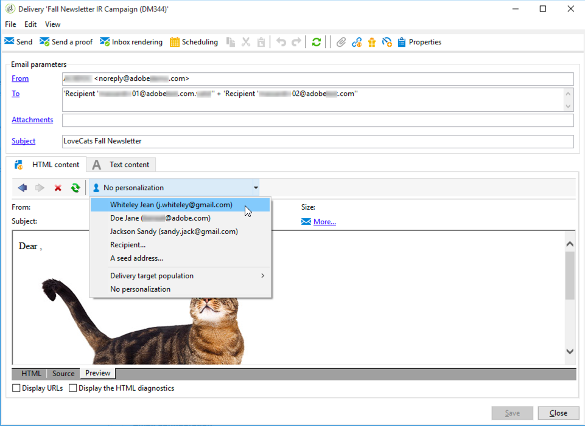

# SpamAssassin{#spamassassin}

## 关于SpamAssassin {#about-spamassassin}

Adobe Campaign可配置为与[SpamAssassin](https://spamassassin.apache.org)一起使用，后者是用于电子邮件垃圾邮件过滤的第三方服务。 这样，您就可以对电子邮件进行评分，以确定邮件是否存在被接收时使用的防垃圾邮件工具视为垃圾邮件的风险。

SpamAssassin利用各种垃圾邮件检测技术，包括：

* 基于DNS和模糊校验的垃圾邮件检测
* 贝叶斯过滤
* 外部程序
* 阻止列表
* 联机数据库

>[!NOTE]
>
>必须在Adobe Campaign应用程序服务器上安装和配置SpamAssassin。 如需详细信息，请参阅[此部分](../../installation/using/configuring-spamassassin.md)。
>
>用于管理元素是否为垃圾邮件的规则通过SpamAssassin进行管理，并可由具有权限的管理员进行编辑。

## 使用SpamAssassin {#using-spamassassin}

创建电子邮件投放并定义其内容后，请按照以下步骤评估风险。

有关创建和设计投放的更多信息，请参阅[此部分](about-email-channel.md)。

1. 转到 **[!UICONTROL Preview]** 选项卡。
1. 选择收件人以预览投放。

   

   >[!NOTE]
   >
   >如果未选择收件人，则无法执行反垃圾邮件检查。

1. 出现警告消息，显示测试结果。 如果检测到高风险级别，将显示以下警告消息：

   

1. 单击警告旁边的&#x200B;**[!UICONTROL More...]**&#x200B;链接。
1. 选择 **[!UICONTROL Anti-spam checking]** 选项卡。
1. 转到&#x200B;**[!UICONTROL Points / Rule / Description]**&#x200B;部分，查看产生此风险的原因。

   

>[!NOTE]
>
>每次单击&#x200B;**[!UICONTROL Anti-spam checking]**&#x200B;时，都会调用SpamAssassin服务，并再次分析该消息以检测防垃圾邮件。 确保在再次运行防垃圾邮件分析之前更改了内容。
