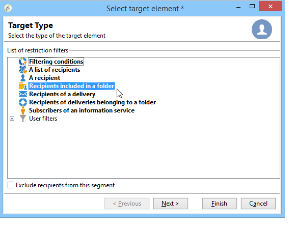

# 定义目标群 {#defining-the-target-population}

## 关于目标群 {#about-target-populations}

对于每个投放，您可以定义几种类型的目标群体。 以下部分提供有关如何选择的更多信息：

* 投放的主要收件人。 [阅读更多](../../delivery/using/steps-defining-the-target-population.md#selecting-the-main-target)
* 收件人验证消息，以设置验证周期。 [阅读更多](../../delivery/using/steps-defining-the-target-population.md#defining-a-specific-proof-target)

此外，如果投放包含在营销活动中，您还可以定义 [种子地址](../../delivery/using/about-seed-addresses.md)和 [对照组](../../campaign/using/marketing-campaign-deliveries.md#defining-a-control-group)。

## 选择投放的主要收件人 {#selecting-the-main-target}

在大多数情况下，主目标会从Adobe Campaign数据库中提取（默认模式）。 但是，收件人也可以存储在外部文件中。 在本节中了 [解更多](../../delivery/using/steps-defining-the-target-population.md#selecting-external-recipients)。

要选择收件人，请按照以下步骤操作：

1. 在投放编辑器中，选择 **[!UICONTROL To]**。
1. 如果收件人存储在数据库中，请选择第一个选项。

   

1. 在下拉目标映射 **[!UICONTROL Target mapping]** 中选择列表。 Adobe Campaign默认目标映射 **[!UICONTROL Recipients]**&#x200B;基于 **nms:收件人** 模式。

   其他目标映射可用，有些可能与您的特定配置相关。 有关目标映射的详细信息，请参 [阅选择目标映射](../../delivery/using/selecting-a-target-mapping.md)。

1. 单击按 **[!UICONTROL Add]** 钮以定义限制过滤器。

   然后，您可以选择要应用的筛选类型：

   

   您可以使用收件人库中定义的定位类型选择定位。 要使用目标类型，请选择该类型并单击 **[!UICONTROL Next]**。 对于每个目标，可以通过单击选项卡来显示相关的 **[!UICONTROL Preview]** 收件人。 对于某些类型的目标，该 **[!UICONTROL Refine target]** 按钮允许您组合多个定位条件。

   默认情况下，提供以下目标类型：

   * **[!UICONTROL Filtering conditions]** : 此选项允许您定义查询并显示结果。 本节介绍了定义查询 [的方法](../../platform/using/creating-filters.md#creating-an-advanced-filter)。
   * **[!UICONTROL Subscribers of an information service]** : 通过此选项，您可以选择收件人必须订阅到的新闻稿，以便由创建的投放定位。

      

   * **[!UICONTROL Recipients of a delivery]** : 此选项允许您将现有收件人的投放定义为定位标准。 然后，您必须在投放中选择列表:

      

   * **[!UICONTROL Delivery recipients belonging to a folder]** : 通过此选项，您可以选择投放文件夹，并目标该文件夹中的投放的收件人。

      

      您可以通过从下拉收件人中进行选择来筛选列表的行为：

      

      >[!NOTE]
      >
      >通过 **[!UICONTROL Include sub-folders]** 该选项还可以目标包含在选定节点下树结构中文件夹中的投放。

   * **[!UICONTROL Recipients included in a folder]** : 通过此选项，可以目标树的特定文件夹中包含的用户档案。
   * **[!UICONTROL A recipient]** : 通过此选项，您可以从收件人库的用户档案中选择特定的数据。
   * **[!UICONTROL A list of recipients]** : 此选项允许您目标一列表收件人。 列表显示在 [本节中](../../platform/using/creating-and-managing-lists.md)。
   * **[!UICONTROL User filters]** : 通过此选项，您可以访问预配置的过滤器，将其用作用户档案库中的筛选条件。 此部分显示预配置 [的过滤器](../../platform/using/creating-filters.md#saving-a-filter)。
   * 通过该选 **[!UICONTROL Exclude recipients corresponding to this segment]** 项，可以目标不满足定义的目标条件的收件人。 要使用此选项，请选择相应的框，然后应用定位（如前面所定义）以排除生成的用户档案。

      

1. 在字段中输入此定位的 **[!UICONTROL Label]** 名称。 默认情况下，该标签将是第一个定位标准的标签。 对于组合，最好使用显式名称。
1. 单击 **[!UICONTROL Finish]** 以验证已配置的定位。

   定义的定位条件在主目标配置选项卡的中央部分进行汇总。 单击一个标准以视图其内容(配置和预览)。 要删除标准，请单击其标签后的叉。

   

### 选择外部收件人 {#selecting-external-recipients}

可以对未保存在收件人库中但存储在外部文件中的启动投放。 例如，我们将在此处向从文本文件导入的投放发送一个收件人。

操作步骤：

1. 单击链 **[!UICONTROL To]** 接以选择投放的收件人。
1. 选择选 **[!UICONTROL Defined in an external file]** 项。

   

1. 默认情况下，收件人会导入数据库。 必须选择 **[!UICONTROL Target mapping]**。 有关目标映射的详细信息，请参 [阅选择目标映射](../../delivery/using/selecting-a-target-mapping.md)

   您还可以选择 **[!UICONTROL Do not import the recipients into the database]**。

1. 导入收件人时，单击链 **[!UICONTROL File format definition...]** 接以选择和配置外部文件。

   For more information on data import, refer to [this section](../../platform/using/importing-data.md#step-2---source-file-selection).

1. 单击 **[!UICONTROL Finish]** 并将投放配置为标准投放。

>[!CAUTION]
>
>在为电子邮件投放定义邮件内容时，不要包含指向镜像页面的链接； 无法在此投放模式下生成。

### 设置排除设置 {#customizing-exclusion-settings}

地址错误和质量等级由服务提供商(IAP)提供。 此信息会在收件人用户档案中根据投放操作和服务提供商返回的文件自动更新。 可以在用户档案中以只读方式查看。

您可以选择排除已达到特定数量连续错误或质量等级低于此窗口中指定阈值的地址。 您还可以选择是否对尚未返回数据的未限定地址授权。

>[!NOTE]
>
>如果两个收件人在直接邮件投放中具有相同的名字、姓氏、邮戳和城市，则将发生多次错误，并且不会考虑重复。

该 **[!UICONTROL Exclusions]** 选项卡用于限制消息数。

>[!NOTE]
>
>建议使用默认参数，但您可以根据需要调整设置。 但是，这些选项只应由专家用户更改，以避免任何误用和错误。

单击链 **[!UICONTROL Edit...]** 接以修改默认配置。

可以使用以下选项：

* **[!UICONTROL Exclude duplicate addresses during delivery]**. 此选项默认处于活动状态： 它允许您在投放期间删除重复电子邮件地址。 所应用的策略可能因Adobe Campaign的使用方式和数据库中数据的类型而异。

   可以为每个投放模板配置选项的默认值。

   例如：

   * 投放新闻稿或电子文档投放。 在某些情况下，如果重复没有本机重复，则不排除该数据。 订阅同一电子邮件地址的夫妇可能会收到两条特定的个性化电子邮件： 每个人的姓名。 在这种情况下，可以取消选择此选项。
   * 营销投放活动: 重复排除对于避免向同一收件人发送过多消息至关重要。 在这种情况下，可以选择此选项。

      如果取消选择此选项，则可以访问其他选项： **[!UICONTROL Keep duplicate records (same identifier)]**. 它允许您为满足多个定位标准的投放授权多个收件人。

      

* **[!UICONTROL Exclude recipients who no longer want to be contacted]** ，即其电子邮件地址位于阻止列表(“选择退出”)上的收件人。 为了遵守电子营销的职业道德和电子商务法律，必须继续选择此选项。
* **[!UICONTROL Exclude quarantined recipients]**. 此选项允许您从目标中排除任何地址没有响应的用户档案。 我们强烈建议保持选中此选项。

   >[!NOTE]
   >
   >有关隔离管理的更多信息，请参阅 [了解隔离管理](../../delivery/using/understanding-quarantine-management.md)。

* **[!UICONTROL Limit delivery]** 到给定数量的消息。 通过此选项，可输入要发送的消息的最大数量。 如果目标的内容超过所指示的消息数，则随机选择被应用到目标。

### 减少目标口 {#reducing-the-size-of-the-target-population}

你可以缩小目标群。 为此，请指定要在字段中导出的收件人 **[!UICONTROL Requested quantity]** 数。

## 选择收件人验证消息 {#selecting-the-proof-target}

验证是一条特殊消息，允许您在将投放发送到主目标之前测试该。 验证收件人负责批准邮件的表单和内容。

要选择目标，请按照以下步骤操作：

1. 单击链 **[!UICONTROL To]** 接。
1. 单击选 **[!UICONTROL Target of the proofs]** 项卡。
1. 单击字 **[!UICONTROL Targeting mode]** 段以选择要应用的方法： **[!UICONTROL Definition of a specific proof target]** 、 **[!UICONTROL Substitution of the address]** 、 **[!UICONTROL Seed addresses]** 或 **[!UICONTROL Specific target and seed addresses]**。

>[!NOTE]
>
>通常，验证的目标可以添加到主目标。 为此，请在选项卡的下半部分选择相应的选 **[!UICONTROL Main target]** 项。

## 定义特定验证目标 {#defining-a-specific-proof-target}

选择验证目标时， **[!UICONTROL Definition of a specific proof target]** 该选项允许您从库中的用户档案中选择验证收件人。

选择此选项可使用按 **[!UICONTROL Add]** 钮选择收件人，如定义主目标。 请参 [阅选择主目标](../../delivery/using/steps-defining-the-target-population.md#selecting-the-main-target)。

For more on proof sending, refer to [this section](../../delivery/using/steps-validating-the-delivery.md#sending-a-proof).

### 在验证中使用地址替换 {#using-address-substitution-in-proof}

您可以使用该选项，而不是在收件人库中选择专用 **[!UICONTROL Substitution of the address]** 。

此选项允许您使用收件人的用户档案，并将其电子邮件地址替换为一个或多个将接收验证的其他地址。

选择此选项后，将通过一个特殊编辑器填写验证地址，该编辑器允许您配置替代。

配置的执行方式如下：

1. 单击图 **[!UICONTROL Add]** 标以定义替代。
1. 输入要使用的收件人地址，或从列表中选择它。
1. 选择要在用户档案中使用的验证: 将值 **[!UICONTROL Random]** 保存在列 **[!UICONTROL Profile to use]** 中，以使用验证中用户档案的任何目标的数据。

   

1. 单击图 **[!UICONTROL Detail]** 标以从主用户档案中选择目标，如下例所示：

   

   您可以根据需要定义任意数量的替换地址。

## 将种子地址用作验证 {#using-seed-addresses-as-proof}

您可以 **[!UICONTROL Seed addresses]** 用作目标验证: 此选项允许您使用或导入现有列表的种子地址。

>[!NOTE]
>
>种子地址显示在“关于 [种子地址”中](../../delivery/using/about-seed-addresses.md)。

您可以使用选项组合特定验证目标的定义和种子地址的 **[!UICONTROL Specific target and Seed addresses]** 使用。 相关配置随后在两个单独的子标签中定义。
