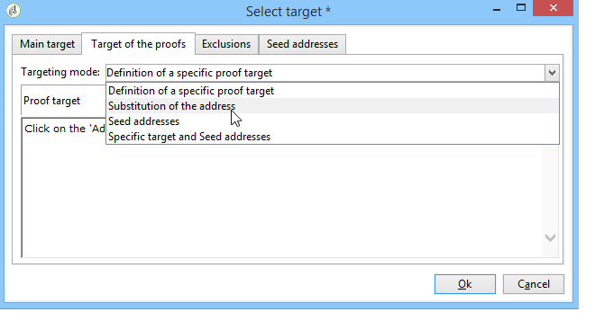

# 定义目标群体 {#defining-the-target-population}

## 关于目标群体 {#about-target-populations}

对于每个投放，您可以定义多种类型的目标群体：

* **主受众**:接收消息的用户档案。 [了解详情](steps-defining-the-target-population.md#selecting-the-main-target)
* **校样**:校样消息的收件人，涉及验证周期。 [了解详情](steps-defining-the-target-population.md#defining-a-specific-proof-target)
* **种子地址**:已超出投放目标但将收到投放的收件人（仅在营销活动上下文中）。 [了解详情](about-seed-addresses.md)
* **控制组**:将不会收到投放的群体，用于跟踪行为和促销活动影响（仅在营销活动的上下文中）。 [了解详情](../../campaign/using/marketing-campaign-target.md#defining-a-control-group)。

## 选择投放的主要收件人 {#selecting-the-main-target}

在大多数情况下，主目标是从Adobe Campaign数据库中提取（默认模式）。 但是，收件人也可以存储在外部文件中。 在 [此部分](steps-defining-the-target-population.md#selecting-external-recipients).

要选择投放的收件人，请执行以下步骤：

1. 在投放编辑器中，选择 **[!UICONTROL To]**.
1. 如果收件人存储在数据库中，请选择第一个选项。

   

1. 在 **[!UICONTROL Target mapping]** 下拉列表。 Adobe Campaign默认目标映射为 **[!UICONTROL Recipients]**，基于 **nms:recipient** 架构。

   其他目标映射可用，其中一些映射可能与您的特定配置相关。 有关目标映射的更多信息，请参阅 [选择目标映射](selecting-a-target-mapping.md).

1. 单击 **[!UICONTROL Add]** 按钮以定义限制过滤器。

   然后，您可以选择要应用的筛选类型：

   

   您可以使用数据库中定义的定向类型选择收件人。 要使用目标类型，请选择它并单击 **[!UICONTROL Next]**. 对于每个目标，您可以通过单击 **[!UICONTROL Preview]** 选项卡。 对于某些类型的目标， **[!UICONTROL Refine target]** 按钮可组合多个定位标准。

   默认提供以下目标类型：

   * **[!UICONTROL Filtering conditions]** :利用此选项可定义查询并显示结果。 定义查询的方法请参见 [此部分](../../platform/using/creating-filters.md#creating-an-advanced-filter).
   * **[!UICONTROL Subscribers of an information service]** :此选项允许您选择新闻稿，收件人必须订阅才能被创建的投放定向到该新闻稿。

      

   * **[!UICONTROL Recipients of a delivery]** :利用此选项，可将现有投放的收件人定义为定位标准。 然后，必须在列表中选择投放：

      

   * **[!UICONTROL Delivery recipients belonging to a folder]** :利用此选项，可选择投放文件夹，并定位该文件夹中投放的收件人。

      

      您可以从下拉列表中选择以过滤收件人的行为：

      

      >[!NOTE]
      >
      >的 **[!UICONTROL Include sub-folders]** 选项还允许您定位文件夹中包含的投放，文件夹位于选定节点下方的树结构中。

   * **[!UICONTROL Recipients included in a folder]** :利用此选项，可定向树中特定文件夹中包含的用户档案。
   * **[!UICONTROL A recipient]** :此选项允许您从数据库中的用户档案中选择特定收件人。
   * **[!UICONTROL A list of recipients]** :利用此选项可定位收件人列表。 列表列于 [此部分](../../platform/using/creating-and-managing-lists.md).
   * **[!UICONTROL User filters]** :此选项允许您访问预配置的过滤器，以将它们用作数据库中用户档案的筛选条件。 中提供了预配置的过滤器 [此部分](../../platform/using/creating-filters.md#saving-a-filter).
   * 选项 **[!UICONTROL Exclude recipients corresponding to this segment]** 允许您定位不符合所定义定位标准的收件人。 要使用此选项，请选中相应的框，然后按照之前的定义应用定位，以排除生成的用户档案。

      

1. 在 **[!UICONTROL Label]** 字段。 默认情况下，标签将是第一个定位标准的标签。 对于组合，最好使用明确的名称。
1. 单击 **[!UICONTROL Finish]** 验证配置的定位。

   主定位配置选项卡的中心部分概述了定义的定位标准。 单击条件可查看其内容（配置和预览）。 要删除标准，请单击位于其标签后面的交叉点。

   

### 选择外部收件人 {#selecting-external-recipients}

您可以对未保存在数据库中但存储在外部文件中的收件人启动投放。 例如，我们将在此处向从文本文件导入的收件人发送投放。

操作步骤：

1. 单击 **[!UICONTROL To]** 链接以选择投放的收件人。
1. 选择 **[!UICONTROL Defined in an external file]** 选项。

   

1. 默认情况下，收件人会导入数据库。 您必须选择 **[!UICONTROL Target mapping]**. 有关目标映射的更多信息，请参阅 [选择目标映射](selecting-a-target-mapping.md)

   您还可以选择 **[!UICONTROL Do not import the recipients into the database]**.

1. 导入收件人时，单击 **[!UICONTROL File format definition...]** 链接以选择和配置外部文件。

   有关数据导入的更多信息，请参阅 [此部分](../../platform/using/executing-import-jobs.md#step-2---source-file-selection).

1. 单击 **[!UICONTROL Finish]** 并将投放配置为标准投放。

>[!CAUTION]
>
>定义电子邮件投放的邮件内容时，请勿包含指向镜像页面的链接；无法在此投放模式下生成。

### 设置排除设置 {#customizing-exclusion-settings}

地址错误和质量评级由服务提供商(IAP)提供。 在执行投放操作后，收件人用户档案中的此信息将自动更新，并包含服务提供商返回的文件。 它可以在用户档案中以只读方式查看。

您可以选择排除已达到特定数量的连续错误的地址，或者其质量评级低于此窗口中指定的阈值的地址。 您还可以选择是否授权尚未返回任何数据的未限定地址。

>[!NOTE]
>
>如果直邮投放中有两个收件人的名字、姓氏、邮编和城市相同，则会出现双重错误，并且不会考虑重复项。

的 **[!UICONTROL Exclusions]** 选项卡来限制消息数量。

>[!NOTE]
>
>建议使用默认参数，但您可以根据需要调整设置。 但是，专家用户只应更改这些选项，以避免任何误用和错误。

单击 **[!UICONTROL Edit...]** 链接以修改默认配置。

可以使用以下选项：

* **[!UICONTROL Exclude duplicate addresses during delivery]**. 默认情况下，此选项处于活动状态：它可让您在投放期间消除重复的电子邮件地址。 应用的策略可能会因使用Adobe Campaign的方式和数据库中的数据类型而异。

   可以为每个投放模板配置选项的默认值。

   例如：

   * 快讯或电子文档提交。 在某些情况下，如果数据没有本机重复项，则不会排除重复项。 使用同一电子邮件地址订阅的对偶可能会收到两条特定的个性化电子邮件：每个人姓名的地址。 在这种情况下，可以取消选择此选项。
   * 营销活动的交付：重复排除对于避免向同一收件人发送过多消息至关重要。 在这种情况下，可以选择此选项。

      如果取消选择此选项，则可以访问其他选项： **[!UICONTROL Keep duplicate records (same identifier)]**. 您可以授权多个投放给满足多个定位标准的收件人。

      

* **[!UICONTROL Exclude recipients who no longer want to be contacted]** ，即电子邮件地址处于“”(“阻止列表选择退出”)的收件人。 为遵守电子营销的职业道德和电子商务的法律，必须继续选择这一选项。
* **[!UICONTROL Exclude quarantined recipients]**. 此选项允许您从目标中排除任何地址未响应的用户档案。 我们强烈建议保持选中此选项。

   >[!NOTE]
   >
   >有关隔离管理的详细信息，请参阅 [了解隔离管理](understanding-quarantine-management.md).

* **[!UICONTROL Limit delivery]** 给定数量的消息。 利用此选项，可输入要发送的消息数上限。 如果目标的内容超过所指示的消息数，则随机选择被应用于目标。

### 减小目标群体的大小 {#reducing-the-size-of-the-target-population}

您可以减小目标群体的大小。 为此，请在 **[!UICONTROL Requested quantity]** 字段。

## 选择校样消息的收件人 {#selecting-the-proof-target}

校样是一条特殊消息，允许您在将投放发送到主目标之前对投放进行测试。 校样收件人负责批准消息的表单和内容。

 [在视频中发现此功能](#seeds-and-proofs-video)

要选择校样的目标，请执行以下步骤：

1. 单击 **[!UICONTROL To]** 链接。
1. 单击 **[!UICONTROL Target of the proofs]** 选项卡。
1. 单击 **[!UICONTROL Targeting mode]** 字段选择要应用的方法： **[!UICONTROL Definition of a specific proof target]** , **[!UICONTROL Substitution of the address]** , **[!UICONTROL Seed addresses]** 或 **[!UICONTROL Specific target and seed addresses]**.

>[!NOTE]
>
>通常，校样的目标可以添加到主目标。 为此，请在 **[!UICONTROL Main target]** 选项卡。

## 定义特定校样目标 {#defining-a-specific-proof-target}

选择校样目标时， **[!UICONTROL Definition of a specific proof target]** 选项，您可以从数据库中的用户档案中选择校样收件人。

选择此选项，可使用 **[!UICONTROL Add]** 按钮，例如定义主目标时。 请参阅 [选择主目标](steps-defining-the-target-population.md#selecting-the-main-target).

有关校样发送的更多信息，请参阅 [此部分](steps-validating-the-delivery.md#sending-a-proof).

### 在校样中使用地址替换 {#using-address-substitution-in-proof}

您可以使用 **[!UICONTROL Substitution of the address]** 选项。

利用此选项，可使用投放的收件人用户档案，并将其电子邮件地址替换为一个或多个将接收校样的其他地址。

选择此选项后，校样地址将通过允许您配置替换的特殊编辑器来填充。

配置的执行方式如下：

1. 单击 **[!UICONTROL Add]** 图标来定义替换。
1. 输入要使用的收件人地址，或从列表中选择该地址。
1. 选择要在校样中使用的配置文件：保存 **[!UICONTROL Random]** 值 **[!UICONTROL Profile to use]** 列来使用校样中目标任何用户档案的数据。

   

1. 单击 **[!UICONTROL Detail]** 图标从主目标中选择用户档案，如以下示例所示：

   

   您可以根据需要定义任意数量的替换地址。

## 使用种子地址作为证明 {#using-seed-addresses-as-proof}

您可以使用 **[!UICONTROL Seed addresses]** 作为校样的目标：此选项允许您使用或导入现有种子地址列表。

>[!NOTE]
>
>种子地址在 [关于种子地址](about-seed-addresses.md).

您可以将特定校样目标的定义与种子地址的使用(使用 **[!UICONTROL Specific target and Seed addresses]** 选项。 相关配置随后在两个单独的子选项卡中定义。

另请参阅:

* [选择校样目标](#selecting-the-proof-target)
* [关于种子地址](about-seed-addresses.md)
* [用例：根据条件选择种子地址](use-case--selecting-seed-addresses-on-criteria.md)

## 教程视频 {#seeds-and-proofs-video}

在此视频中，您将了解如何向现有电子邮件添加种子和验证，以及如何发送。

>[!VIDEO](https://video.tv.adobe.com/v/25606?quality=12)

提供了其他Campaign Classic操作方法视频 [此处](https://experienceleague.adobe.com/docs/campaign-classic-learn/tutorials/overview.html?lang=zh-Hans).
