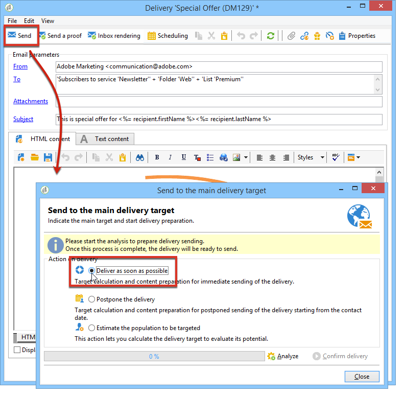
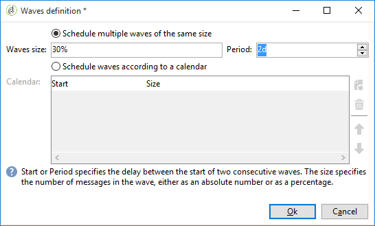

# 配置和发送投放 {#configuring-and-sending-the-delivery}

>[!NOTE]
>
>只有投放所有者才能启动投放。 为了使其他运算符（或运算符组）能够开始投放，您必须在&#x200B;**[!UICONTROL Delivery start:]**&#x200B;字段中将它们添加为审阅者。 有关详细信息，请参见[此部分](../../campaign/using/marketing-campaign-approval.md#selecting-reviewers)。

## 传递其他参数 {#delivery-additiona-parameters}

在发送投放之前，您可以通过&#x200B;**[!UICONTROL Delivery]**&#x200B;选项卡在投放属性中定义发送参数。

* **[!UICONTROL Delivery priority]**:利用此选项，可声明投放的优先级（正常、高或低），从而影响投放的发送顺序。这样，您就可以优先处理某些更紧急投放的订单，而不是其他投放。

* **[!UICONTROL Message batch quantity]**:利用此选项可定义同一XML投放包内分组的消息数。如果将参数设置为0，则会自动对消息进行分组。 包大小由计算`<delivery size>/1024`定义，每包最少8条，最多256条消息。

   >[!IMPORTANT]
   >
   >复制投放时，会重置参数。

* **[!UICONTROL Send using multiple waves]**:有关更多信息，请参阅使 [用多个批次发送](#sending-using-multiple-waves)。

* **[!UICONTROL Test SMTP delivery]**:利用此选项，可测试通过SMTP发送的投放。投放会一直处理到与SMTP服务器的连接，但不会发送。

   >[!NOTE]
   >
   >安装使用中间源作为时，不建议使用此选项，否则不调用mta。 有关配置SMTP服务器的更多信息，请参阅此部分](../../installation/using/configure-delivery-settings.md)。[

* **[!UICONTROL Email BCC]**:此选项允许您通过密送方式在外部系统上存储电子邮件，方法是只需向消息目标添加密送电子邮件地址。如需详细信息，请参阅[此部分](sending-messages.md#archiving-emails)。

## 确认投放 {#confirming-delivery}

配置投放并准备好发送后，请确保已运行投放分析。

要执行此操作，请单击&#x200B;**[!UICONTROL Send]**，选择所需的操作，然后单击&#x200B;**[!UICONTROL Analyze]**。 有关更多信息，请参阅[启动分析](steps-validating-the-delivery.md#analyzing-the-delivery)。

完成后，单击&#x200B;**[!UICONTROL Confirm delivery]**&#x200B;以启动消息投放。

然后，您可以关闭投放向导，并从&#x200B;**[!UICONTROL Delivery]**&#x200B;选项卡跟踪投放的执行情况，该选项卡可通过此投放的详细信息或投放列表访问。

发送消息后，您可以监控和跟踪投放内容。 有关更多信息，请参阅一下章节。

* [监测投放](about-delivery-monitoring.md)
* [了解投放失败](understanding-delivery-failures.md)
* [关于邮件跟踪](about-message-tracking.md)

## 计划投放发送 {#scheduling-the-delivery-sending}

您可以推迟邮件的投放，以便计划内容的投放或管理销售压力并避免过度营销。

1. 单击&#x200B;**[!UICONTROL Send]**&#x200B;按钮并选择&#x200B;**[!UICONTROL Postpone delivery]**&#x200B;选项。

1. 在&#x200B;**[!UICONTROL Contact date]**&#x200B;字段中指定开始日期。

1. 然后，您可以开始投放分析，然后确认投放发送。 但是，投放发送直到&#x200B;**[!UICONTROL Contact date]**&#x200B;字段中给定的日期才开始。

>[!IMPORTANT]
>
>开始分析后，您定义的联系日期即为固定日期。 如果修改此日期，则必须重新开始分析，以便考虑您所做的修改。

在投放列表中，将显示状态为&#x200B;**[!UICONTROL Pending]**&#x200B;的投放。

也可以通过投放的&#x200B;**[!UICONTROL Scheduling]**&#x200B;按钮在上游配置计划。

它允许您将投放推迟到稍后的日期，或在临时日历中保存投放。

* 使用&#x200B;**[!UICONTROL Schedule delivery (no automatic execution)]**&#x200B;选项可安排对投放进行临时分析。

   保存此配置后，投放状态将变为&#x200B;**[!UICONTROL Targeting pending]**。 分析将在指定的日期启动。

* 使用&#x200B;**[!UICONTROL Schedule delivery (automatic execution on planned date)]**&#x200B;选项可指定投放日期。

   单击&#x200B;**[!UICONTROL Send]**&#x200B;并选择&#x200B;**[!UICONTROL Postpone delivery]**，然后启动分析并确认提交。 分析完成后，投放目标就绪，消息将在指定日期自动发送。

日期和时间以当前运算符的时区表示。 位于联系日期输入字段下方的&#x200B;**[!UICONTROL Time zone]**&#x200B;下拉列表允许您自动将输入的日期和时间转换为选定的时区。

例如，如果您计划在伦敦时间8点自动执行投放，则时间会自动转换为选定的时区：

## 使用多个批次发送 {#sending-using-multiple-waves}

要平衡负载，您可以将投放分为多个批次。 配置批数及其相对于整个交货的比例。

>[!NOTE]
>
>您只能定义两个连续波之间的大小和延迟。 无法配置每个波次的收件人选择标准。

1. 打开投放属性窗口，然后单击&#x200B;**[!UICONTROL Delivery]**&#x200B;选项卡。
1. 选择&#x200B;**[!UICONTROL Send using multiple waves]**&#x200B;选项并单击&#x200B;**[!UICONTROL Define waves...]**&#x200B;链接。

   

1. 要配置批次，您可以：

   * 定义每个波的大小。 例如，如果在相应的字段中输入&#x200B;**[!UICONTROL 30%]**，则每个波将代表投放中包含的消息的30%，但最后一个波将代表消息的10%。

      在&#x200B;**[!UICONTROL Period]**&#x200B;字段中，指定两个连续波开始之间的延迟。 例如，如果输入&#x200B;**[!UICONTROL 2d]**，则第一个波次将立即开始，第二个波次将在两天后开始，第三个波次将在四天后开始，依此类推。

      

   * 定义用于发送每个波动的日历。

      在&#x200B;**[!UICONTROL Start]**&#x200B;列中，指定两个连续波开始之间的延迟。 在&#x200B;**[!UICONTROL Size]**&#x200B;列中，输入固定数字或百分比。

      在以下示例中，第一波表示投放中包含的消息总数的25%，且将立即开始。 接下来的两个批次将完成投放，并设置为以6小时为间隔开始。

      
   特定的分类规则&#x200B;**[!UICONTROL Wave scheduling check]**&#x200B;可确保在投放有效性限制之前计划好最后一次投放。 在投放属性的&#x200B;**[!UICONTROL Typology]**&#x200B;选项卡中配置的促销活动分类及其规则，在[使用分类的验证过程](steps-validating-the-delivery.md#validation-process-with-typologies)中提供。

   >[!IMPORTANT]
   >
   >确保最后一批次不超过&#x200B;**[!UICONTROL Validity]**&#x200B;选项卡中定义的投放截止时间。 否则，可能无法发送某些消息。
   >
   >配置最后一批时，还必须允许足够的时间进行重试。 请参阅[此小节](steps-sending-the-delivery.md#configuring-retries)。

1. 要监控您的发送，请转到投放日志。 请参阅[此页](delivery-dashboard.md#delivery-logs-and-history)。

   您可以看到已在处理的批次中发送的投放（**[!UICONTROL Sent]**&#x200B;状态），以及将在剩余批次中发送的投放（**[!UICONTROL Pending]**&#x200B;状态）。

以下两个示例是使用多波的最常见用例。

* **在启动过程中**

   使用新平台发送电子邮件时，互联网服务提供商(ISP)会怀疑无法识别的IP地址。 如果突然发送了大量电子邮件，ISP通常会将它们标记为垃圾邮件。

   为避免被标记为垃圾邮件，您可以使用批次逐步增加发送的数量。 这应该可以确保启动阶段的顺利开发，并使您能够降低无效地址的整体速率。

   为此，请使用&#x200B;**[!UICONTROL Schedule waves according to a calendar]**&#x200B;选项。 例如，将第一波设置为10%，将第二波设置为15%，依此类推。

   

* **涉及呼叫中心的营销活动**

   在管理电话忠诚度促销活动时，贵组织处理联系订阅者的呼叫数量的能力有限。

   使用分批，您可以将消息数量限制为每天20条，即呼叫中心的日常处理能力。

   要执行此操作，请选择&#x200B;**[!UICONTROL Schedule multiple waves of the same size]**&#x200B;选项。 在&#x200B;**[!UICONTROL Period]**&#x200B;字段中输入&#x200B;**[!UICONTROL 20]**&#x200B;作为波的大小，并输入&#x200B;**[!UICONTROL 1d]**。

   

## 配置重试 {#configuring-retries}

由于出现&#x200B;**Soft**&#x200B;或&#x200B;**Ignored**&#x200B;错误而临时未投放的消息将自动重试。 投放失败类型和原因详见[部分](understanding-delivery-failures.md#delivery-failure-types-and-reasons)。

>[!IMPORTANT]
>
>对于托管安装或混合安装，如果已升级到[Enhanced MTA](sending-with-enhanced-mta.md)，则Campaign不再使用投放中的重试设置。 软退件重试次数及其间隔时间，由Enhanced MTA根据从消息电子邮件域返回的退回响应的类型和严重性确定。

对于使用旧版Campaign MTA的内部部署安装和托管/混合安装，投放参数&#x200B;**[!UICONTROL Delivery]**&#x200B;选项卡的中心部分会指示在投放后一天应执行多少次重试，以及重试之间的最短延迟。

默认情况下，会为投放的第一天安排五次重试，最短间隔为一小时，分布在一天的24小时内。 在此之后，每天对一次重试进行编程，直到投放截止时间（在&#x200B;**[!UICONTROL Validity]**&#x200B;选项卡中定义）为止（请参阅[定义有效期](#defining-validity-period)）。

## 定义有效期 {#defining-validity-period}

启动投放后，可在投放截止时间之前发送消息（以及任何重试）。 通过&#x200B;**[!UICONTROL Validity]**&#x200B;选项卡在投放属性中指示此情况。

* 使用&#x200B;**[!UICONTROL Delivery duration]**&#x200B;字段，可输入全局投放重试的限制。 这意味着Adobe Campaign从开始日期开始发送消息，然后，对于仅返回错误的消息，会执行常规的可配置重试，直到达到有效性限制为止。

   您还可以选择指定日期。 要执行此操作，请选择&#x200B;**[!UICONTROL Explicitly set validity dates]**。 在这种情况下，投放和有效期限制日期还允许您指定时间。 默认使用当前时间，但您可以直接在输入字段中修改此时间。

   >[!IMPORTANT]
   >
   >对于托管或混合安装，如果已升级到[Enhanced MTA](sending-with-enhanced-mta.md)，则仅当设置为&#x200B;**3.5天或更短的**&#x200B;时，才会使用Campaign电子邮件投放中的&#x200B;**[!UICONTROL Delivery duration]**&#x200B;设置。 如果定义的值超过 3.5 天，则不会将其考虑在内。

* **资源的有效性限制**:字段 **[!UICONTROL Validity limit]** 用于已上传的资源，主要用于镜像页面和图像。本页上的资源仅在限制时间内有效（以节省磁盘空间）。

   此字段中的值可以以[此部分](../../platform/using/adobe-campaign-workspace.md#default-units)中列出的单位表示。
