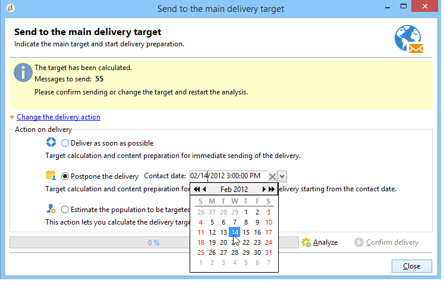

# 配置和发送投放{#configuring-and-sending-the-delivery}

>[!NOTE]
>
>只有投放所有者可以开始投放。 要使其他运算符（或运算符组）能够开始投放，您必须在&#x200B;**[!UICONTROL Delivery start:]**&#x200B;字段中将其添加为审阅者。 有关详细信息，请参阅[本节](../../campaign/using/marketing-campaign-approval.md#selecting-reviewers)。

## 投放其他参数{#delivery-additiona-parameters}

在发送投放之前，您可以通过&#x200B;**[!UICONTROL Delivery]**&#x200B;选项卡在投放属性中定义发送参数。

* **[!UICONTROL Delivery priority]**:此选项允许您通过声明投放的优先级（正常、高或低）来影响发送顺序。这样，您可以优先处理特定、更紧急投放的订单，而不是其他订单。

* **[!UICONTROL Message batch quantity]**:此选项允许您定义在同一XML投放包内分组的消息数。如果参数设置为0，则消息将自动分组。 包大小由计算`<delivery size>/1024`定义，每个包最少8条消息，最多256条消息。

   >[!IMPORTANT]
   >
   >复制投放时，会重置该参数。

* **[!UICONTROL Send using multiple waves]**:有关详细信息，请参阅使 [用多个批次发送](#sending-using-multiple-waves)。

* **[!UICONTROL Test SMTP delivery]**:此选项允许您测试通过SMTP发送投放。投放会处理到连接到SMTP服务器，但不会发送。

   >[!NOTE]
   >
   >在安装时，不建议使用此选项，而是使用中间源来调用mta。 有关配置SMTP服务器的详细信息，请参阅[本节](../../installation/using/configuring-campaign-server.md#delivery-settings)。

* **[!UICONTROL Email BCC]**:通过此选项，您只需向邮件目标中添加密送电子邮件地址，即可通过密送方式在外部系统上存储电子邮件。如需详细信息，请参阅[此部分](../../delivery/using/sending-messages.md#archiving-emails)。

## 确认投放{#confirming-delivery}

配置投放并准备发送时，请确保已运行投放分析。

要执行此操作，请单击&#x200B;**[!UICONTROL Send]**，选择所需的操作，然后单击&#x200B;**[!UICONTROL Analyze]**。 有关详细信息，请参阅[启动分析](../../delivery/using/steps-validating-the-delivery.md#analyzing-the-delivery)。

完成后，单击&#x200B;**[!UICONTROL Confirm delivery]**&#x200B;启动消息投放。

然后，您可以关闭投放向导并从&#x200B;**[!UICONTROL Delivery]**&#x200B;选项卡跟踪投放的执行，可通过此投放的详细信息或投放列表访问该选项卡。

发送消息后，您可以监视和跟踪投放。 有关更多信息，请参阅一下章节。

* [监控投放](../../delivery/using/about-delivery-monitoring.md)
* [了解投放失败](../../delivery/using/understanding-delivery-failures.md)
* [关于邮件跟踪](../../delivery/using/about-message-tracking.md)

## 安排投放发送{#scheduling-the-delivery-sending}

您可以推迟邮件的投放，以便计划内容的投放或管理销售压力并避免过度营销。

1. 单击&#x200B;**[!UICONTROL Send]**&#x200B;按钮并选择&#x200B;**[!UICONTROL Postpone delivery]**&#x200B;选项。

1. 在&#x200B;**[!UICONTROL Contact date]**&#x200B;字段中指定开始日期。

1. 然后，您可以开始投放分析，然后确认投放发送。 但是，投放发送直到&#x200B;**[!UICONTROL Contact date]**&#x200B;字段中给定的日期才会开始。

>[!IMPORTANT]
>
>启动分析后，您定义的联系日期即已确定。 如果您修改了此日期，则必须重新启动分析，以便将您的修改考虑在内。

在投放列表中，投放将显示为&#x200B;**[!UICONTROL Pending]**&#x200B;状态。

还可以通过投放的&#x200B;**[!UICONTROL Scheduling]**&#x200B;按钮在上游配置调度。

它允许您将投放推迟到以后的日期或将投放保存在临时日历中。

* 使用&#x200B;**[!UICONTROL Schedule delivery (no automatic execution)]**&#x200B;选项可计划投放的临时分析。

   保存此配置后，投放将变为&#x200B;**[!UICONTROL Targeting pending]**&#x200B;状态。 分析将在指定日期启动。

* 使用&#x200B;**[!UICONTROL Schedule delivery (automatic execution on planned date)]**&#x200B;选项可以指定投放日期。

   单击&#x200B;**[!UICONTROL Send]**&#x200B;并选择&#x200B;**[!UICONTROL Postpone delivery]**，然后启动分析并确认投放。 分析完成后，投放目标就绪，消息将在指定日期自动发送。

日期和时间以当前运算符的时区表示。 位于联系日期输入字段下方的&#x200B;**[!UICONTROL Time zone]**&#x200B;下拉列表允许您自动将输入的日期和时间转换为选定的时区。

例如，如果您计划要在伦敦时间8点自动执行的投放，则该时间会自动转换为选定的时区：

## 使用多个批次{#sending-using-multiple-waves}发送

要平衡负载，您可以将投放分为几批。 配置批数及其相对于整个投放的比例。

>[!NOTE]
>
>您只能定义两个连续批次之间的大小和延迟。 无法配置每个波的收件人选择标准。

1. 打开“投放属性”窗口，然后单击&#x200B;**[!UICONTROL Delivery]**&#x200B;选项卡。
1. 选择&#x200B;**[!UICONTROL Send using multiple waves]**&#x200B;选项，然后单击&#x200B;**[!UICONTROL Define waves...]**&#x200B;链接。

   

1. 要配置批次，您可以：

   * 定义每个波的大小。 例如，如果在相应的字段中输入&#x200B;**[!UICONTROL 30%]**，则每个波将代表投放中包含的30%的消息，但最后一个波除外，后者将代表10%的消息。

      在&#x200B;**[!UICONTROL Period]**&#x200B;字段中，指定两个连续批次的开始之间的延迟。 例如，如果输入&#x200B;**[!UICONTROL 2d]**，则第一波将立即开始，第二波将在两天内开始，第三波将在四天内，依此类推。

      

   * 定义用于发送每个波形的日历。

      在&#x200B;**[!UICONTROL Start]**&#x200B;列中，指定两个连续开始之间的延迟。 在&#x200B;**[!UICONTROL Size]**&#x200B;列中，输入固定数字或百分比。

      在以下示例中，第一波表示包含在投放中的消息总数的25%，并将立即开始。 接下来的两个批次将完成投放，并设置为以六小时间隔开始。

      
   特定类型规则&#x200B;**[!UICONTROL Wave scheduling check]**&#x200B;可确保在投放有效期限之前规划最后一波。 活动类型及其规则(在投放属性的&#x200B;**[!UICONTROL Typology]**&#x200B;选项卡中配置)在[类型验证流程中显示。](../../delivery/using/steps-validating-the-delivery.md#validation-process-with-typologies)

   >[!IMPORTANT]
   >
   >确保最后的批次不超过在&#x200B;**[!UICONTROL Validity]**&#x200B;选项卡中定义的投放截止期。 否则，可能无法发送某些消息。
   >
   >配置最后一个重试时，还必须留出足够的时间。 请参阅[此章节](../../delivery/using/steps-sending-the-delivery.md#configuring-retries)。

1. 要监视您的发送，请转到投放日志。 请参阅[此页](../../delivery/using/delivery-dashboard.md#delivery-logs-and-history)。

   您可以看到已处理的投放（**[!UICONTROL Sent]**&#x200B;状态）中已发送的投放，以及将在其余批次（**[!UICONTROL Pending]**&#x200B;状态）中发送的批次。

以下两个示例是使用多个批次的最常见用例。

* **在加速过程中**

   使用新平台发送电子邮件时，Internet服务提供商(ISP)会怀疑无法识别的IP地址。 如果突然发送了大量电子邮件，ISP往往会将其标记为垃圾邮件。

   为避免被标记为垃圾邮件，您可以逐步增加使用批次发送的卷。 这应确保开始阶段的顺利开发，并使您能够降低无效地址的总体速率。

   为此，请使用&#x200B;**[!UICONTROL Schedule waves according to a calendar]**&#x200B;选项。 例如，将第一波设置为10%，将第二波设置为15%，依此类推。

   

* **活动涉及呼叫中心**

   在管理电话忠诚度活动时，您的组织处理联系订阅者的呼叫数量的能力有限。

   使用批次，您可以将消息数限制为每天20个，即呼叫中心的日处理能力。

   要执行此操作，请选择&#x200B;**[!UICONTROL Schedule multiple waves of the same size]**&#x200B;选项。 在&#x200B;**[!UICONTROL Period]**&#x200B;字段中输入&#x200B;**[!UICONTROL 20]**&#x200B;作为波的大小和&#x200B;**[!UICONTROL 1d]**。

   

## 配置重试{#configuring-retries}

由于&#x200B;**Soft**&#x200B;或&#x200B;**Ignored**&#x200B;错误而暂时未传送的消息可能会自动重试。 此[部分](../../delivery/using/understanding-delivery-failures.md#delivery-failure-types-and-reasons)显示了投放故障类型和原因。

>[!IMPORTANT]
>
>对于托管或混合安装，如果已升级到[增强的MTA](../../delivery/using/sending-with-enhanced-mta.md)，则投放中的重试设置不再由活动使用。 软跳出重试和软跳出时间长度由增强的MTA根据邮件电子邮件域返回的跳出响应的类型和严重性决定。

对于使用旧版活动 MTA的内部部署安装和托管/混合安装，投放参数&#x200B;**[!UICONTROL Delivery]**&#x200B;选项卡的中心部分指示投放次日应执行的重试数和重试之间的最小延迟。

默认情况下，在投放的第一天安排五个重试，每天24小时内，最小间隔为1小时。 在此之后，每天编写一次重试程序，直到投放截止日期（在&#x200B;**[!UICONTROL Validity]**&#x200B;选项卡中定义）（请参阅[定义有效期](#defining-validity-period)）。

## 定义有效期{#defining-validity-period}

启动投放后，消息(和任何重试)可发送到投放截止日期。 这在投放属性中通过&#x200B;**[!UICONTROL Validity]**&#x200B;选项卡指示。

* 在&#x200B;**[!UICONTROL Delivery duration]**&#x200B;字段中可输入全局投放重试的限制。 这意味着Adobe Campaign从开始日期开始发送消息，然后，对于仅返回错误的消息，执行常规的可配置重试，直到到达有效期限。

   您还可以选择指定日期。 要执行此操作，请选择&#x200B;**[!UICONTROL Explicitly set validity dates]**。 在这种情况下，投放和有效期限日期还允许您指定时间。 默认情况下使用当前时间，但您可以直接在输入字段中修改此时间。

   >[!IMPORTANT]
   >
   >对于托管或混合安装，如果已升级到[增强的MTA](../../delivery/using/sending-with-enhanced-mta.md)，则只有在设置为&#x200B;**3.5天或更小于**&#x200B;时，活动电子邮件投放中的&#x200B;**[!UICONTROL Delivery duration]**&#x200B;设置才会使用。 如果定义的值超过 3.5 天，则不会将其考虑在内。

* **资源有效期限**:该字 **[!UICONTROL Validity limit]** 段用于上传的资源，主要用于镜像页面和图像。本页上的资源仅在限制时间内有效（以节省磁盘空间）。

   此字段中的值可以用[此部分](../../platform/using/adobe-campaign-workspace.md#default-units)中列出的单位表示。
