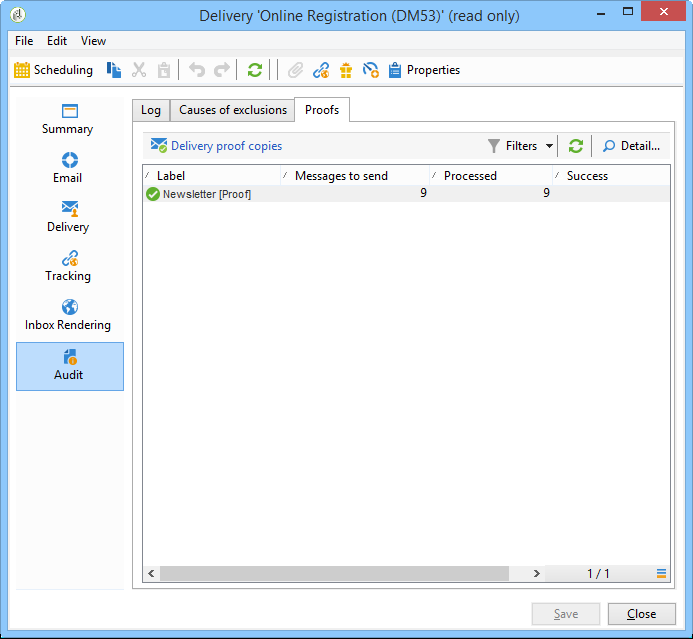

# 验证投放 {#validating-the-delivery}

创建并配置投放后，您必须先验证投放，然后再将其发送到主目标。

操作步骤：

1. **分析投放**:通过此步骤，您可以准备要投放的消息。 [了解详情](#analyzing-the-delivery)。

   分析过程中应用的规则在 [此部分](#validation-process-with-typologies). 有关可用验证模式的详情，请参阅 [更改批准模式](#changing-the-approval-mode) 中。

1. **发送校样**:通过此步骤，您可以控制内容、URL、个性化等。 在 [发送校样](steps-validating-the-delivery.md#sending-a-proof) 和 [定义特定校样目标](steps-defining-the-target-population.md#defining-a-specific-proof-target).

>[!IMPORTANT]
>
>对消息内容进行每次修改后，必须执行上述两个步骤。

## 分析投放 {#analyzing-the-delivery}

分析是计算目标群体并准备投放内容的阶段。 完成后，即可发送投放。

### 启动分析 {#launching-the-analysis}

1. 要启动投放分析，请单击 **[!UICONTROL Send]**.
1. 选择 **[!UICONTROL Deliver as soon as possible]**。

   

1. 单击 **[!UICONTROL Analyze]** 以手动启动分析。

   进度栏显示分析的进度。

   

   >[!NOTE]
   >
   >分析过程中使用的验证规则在 [使用分类验证流程](steps-validating-the-delivery.md#validation-process-with-typologies) 中。

1. 您可以随时通过单击 **[!UICONTROL Stop]**.

   

   在准备阶段期间不会发送消息。 因此，您可以开始或取消分析，而不会产生任何风险。

   >[!IMPORTANT]
   >
   >运行时，分析会冻结投放（或校样）。 投放（或验证）的任何更改都必须随后进行其他分析，然后才能适用。

1. 等待分析完成。

   分析完成后，窗口的上半部分会指示投放准备是否完成或是否发生任何错误。 列出了所有验证步骤、警告和错误。 彩色图标显示消息类型：
   * 蓝色图标表示信息性消息。
   * 黄色图标表示非关键处理错误。
   * 红色图标表示阻止发送投放的严重错误。

   

1. 单击 **[!UICONTROL Close]** 以纠正错误（如果有）。

1. 进行更改后，重新启动分析，单击 **[!UICONTROL Analyze]**.

检查分析结果后，您将能够单击 **[!UICONTROL Confirm delivery]** 将消息发送到指定目标。 确认消息允许您启动投放。

>[!NOTE]
>
>单击 **[!UICONTROL Change the main delivery target]** 链接。 这允许您更改目标群体的定义并重新开始分析。

### 分析设置 {#analysis-parameters}

的 **[!UICONTROL Analysis]** 利用投放属性的选项卡，可定义一组有关在分析阶段准备消息的信息。

利用此选项卡，可访问以下选项：

* **[!UICONTROL Label and code of the delivery]** :此部分中的选项用于在投放分析阶段计算这些字段的值。 的 **[!UICONTROL Compute the execution folder during the delivery analysis]** 字段会计算将在分析阶段包含此提交操作的文件夹的名称。
* **[!UICONTROL Approval mode]** :利用此字段，可在分析完成后定义手动或自动提交。 验证模式在 [更改批准模式](#changing-the-approval-mode) 中。
* **[!UICONTROL Prepare the delivery parts in the database]** :利用此选项，可提高投放分析性能。 有关更多信息，请参阅[此章节](#improving-delivery-analysis)。
* **[!UICONTROL Prepare the personalization data with a workflow]** :此选项允许在自动工作流中准备投放中包含的个性化数据，这可以显着提高执行个性化的性能。 有关此内容的更多信息，请参阅 [优化个性化](personalization-fields.md#optimizing-personalization).
* **[!UICONTROL Start job in a detached process]** :利用此选项，可以在单独的流程中启动投放分析。 默认情况下，分析函数使用Adobe Campaign应用程序服务器进程(web nlserver)。 通过选择此选项，您可确保即使在应用程序服务器出现故障时也能完成分析。
* **[!UICONTROL Log SQL queries generated during the analysis in the journal]** :此选项在分析阶段将SQL查询日志添加到投放日志。
* **[!UICONTROL Ignore personalization scripts during sending]** :此选项允许您绕过对HTML内容中JavaScript指令的解释。 它们将按原样显示在已交付的内容中。 这些指令在 **&lt;%=** 标记)。

### 提高投放分析性能 {#improving-delivery-analysis}

要加快投放准备，您可以检查 **[!UICONTROL Prepare the delivery parts in the database]** 选项。

启用此选项后，将直接在数据库中执行投放准备，这可以显着加快分析。

目前，此选项仅在满足以下条件时才可用：
* 投放必须是电子邮件。 目前不支持其他渠道。
* 您不得使用中间采购或外部工艺路线，而只能使用批量交货工艺路线类型。 您可以检查 **[!UICONTROL General]** 选项卡 **[!UICONTROL Delivery properties]**.
* 无法定位来自外部文件的群体。 对于单个投放，请单击 **[!UICONTROL To]** 链接 **[!UICONTROL Email parameters]** 并检查 **[!UICONTROL Defined in the database]** 选项。 对于工作流中使用的投放，请检查收件人是否 **[!UICONTROL Specified by the inbound event(s)]** 在 **[!UICONTROL Delivery]** 选项卡。
* 您必须使用PostgreSQL数据库。

### 配置分析优先级 {#analysis-priority-}

当投放是营销活动的一部分时， **[!UICONTROL Advanced]** 选项卡中提供了其他选项。 这可让您组织同一营销活动中投放的处理顺序。

在发送之前，会分析每个投放。 分析持续时间取决于投放提取文件。 文件大小越大，分析所需的时间就越长，从而导致后续投放等待。

选项 **[!UICONTROL Message preparation by the scheduler]** 可让您在营销活动工作流中优先进行投放分析。

如果投放过大，最好为其分配较低的优先级，以避免降低对其他工作流投放的分析速度。

>[!NOTE]
>
>要确保较大的投放分析不会减慢工作流的进度，您可以通过在 **[!UICONTROL Schedule execution for a time of low activity]**.

## 发送验证 {#sending-a-proof}

为了检测邮件配置中可能出现的错误，Adobe 强烈建议您设置投放验证周期。尽可能频繁地向测试收件人发送验证内容，确保内容已获得批准。每次进行变更时都应发送验证内容，以批准内容。

>[!NOTE]
>
>* 有关可用验证模式的详情，请参阅 [更改批准模式](steps-validating-the-delivery.md#changing-the-approval-mode).
>* 校样目标的配置在 [定义特定校样目标](steps-defining-the-target-population.md#defining-a-specific-proof-target).
>

要发送校样，请执行以下步骤：

1. 确保已按照 [定义特定校样目标](steps-defining-the-target-population.md#defining-a-specific-proof-target).
1. 单击 **[!UICONTROL Send a proof]** 中，单击“投放”对话框。

   

1. 开始消息分析。 请参阅 [分析投放](steps-validating-the-delivery.md#analyzing-the-delivery).
1. 您现在可以发送投放(请参阅 [发送投放](steps-sending-the-delivery.md))。

   发送投放后，校样将显示在投放列表中，并自动创建和编号。 如果您希望访问其内容和属性，可以编辑该内容。 有关详细信息，请参见此 [ 页面](about-delivery-monitoring.md)。

   

   >[!NOTE]
   >
   >如果为投放创建了多种格式(HTML和文本)，则可以在窗口的下部选择要发送给校样收件人的消息格式。

   

您可能希望修改投放的内容，因为接收校样的验证组做出了任何评论。 进行更改后，必须重新启动分析，然后发送另一个校样。 每个新校样都编号并记录在投放日志中。

分析投放后，您可以查看通过 **[!UICONTROL Proofs]** 日志的子选项卡(**[!UICONTROL Audit]** 选项卡。

在投放内容完成之前，您必须发送所需数量的校样。 之后，您可以将投放发送到主目标并关闭验证周期。

的 **[!UICONTROL Advanced]** 利用投放属性的选项卡，可定义校样的属性。 如果需要，您可以覆盖收件人排除规则。

可以使用以下选项：

* 第一个选项允许您保留校样双调。
* 通过以下两个选项，您可以将处于状态的收件阻止列表人和地址保留在隔离中。 请参阅 [自定义排除设置](steps-defining-the-target-population.md#customizing-exclusion-settings). 与投放目标不同，默认情况下会排除这些地址，但默认情况下会为校样目标保留这些地址。
* 的 **[!UICONTROL Keep the delivery code for the proof]** 选项允许您为校样提供与其相关投放所定义的交付代码相同的交付代码。 此代码在投放向导的第一步中指定。
* 默认情况下，校样的主题以“校样#”为前缀，其中#是校样的编号。 您可以在 **[!UICONTROL Label prefix]** 字段。

## 使用分类验证流程 {#validation-process-with-typologies}

在发送任何消息之前，您应分析营销活动以批准其内容和配置。 分析阶段期间应用的检查规则在 **类型**. 默认情况下，对于电子邮件，分析涵盖以下几点：

* 批准对象
* 批准URL和图像
* 批准URL标签
* 批准退订链接
* 检查校样的大小
* 检查有效期
* 检查波的调度

在 **[!UICONTROL Typologies]** 选项卡。

您可以通过 **[!UICONTROL Administration > Campaign execution > Typology management > Typology rules]** 节点。

您可以从此节点创建新规则并定义新分类。 但是，这些任务是专家用户（了解JavaScript）所保留的。

有关分类规则的更多信息，请参阅 [本页](../../campaign-opt/using/about-campaign-typologies.md).

要编辑当前分类，请单击 **[!UICONTROL Edit link]** 图标 **[!UICONTROL Typology]** 字段。

的 **[!UICONTROL Rule]** 选项卡提供了要应用的分类规则列表。 选择一个规则并单击 **[!UICONTROL Detail...]** 图标以查看其配置：

>[!NOTE]
>
>**[!UICONTROL Arbitration]** 类型分类在销售压力管理框架内使用。 如需详细信息，请参阅[此部分](../../mrm/using/about-marketing-resource-management.md)。

## 更改批准模式 {#changing-the-approval-mode}

的 **[!UICONTROL Analysis]** 选项卡（用于提交属性），可让您选择验证模式。 如果在分析期间生成警告（例如，如果某些字符在投放的主题中突出显示等），则可以配置投放以定义是否应仍执行该投放。 默认情况下，用户必须在分析阶段结束时确认消息的发送：此为 **手动** 验证。

从相应字段的下拉列表中选择其他批准模式。

可以使用以下批准模式：

* **[!UICONTROL Manual]**:在分析阶段结束时，用户必须确认投放以开始发送。 为此，请单击 **[!UICONTROL Start]** 按钮来启动投放。
* **[!UICONTROL Semi-automatic]**:如果分析阶段未生成警告消息，则自动开始发送。
* **[!UICONTROL Automatic]**:发送在分析阶段结束时自动开始，而与其结果无关。
