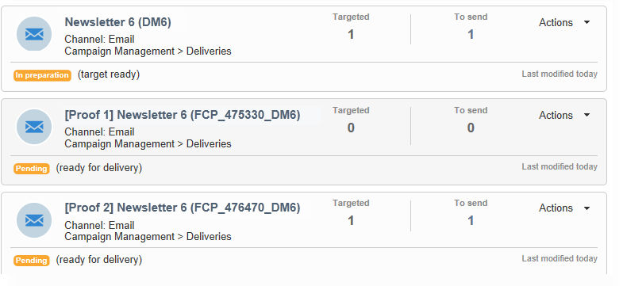
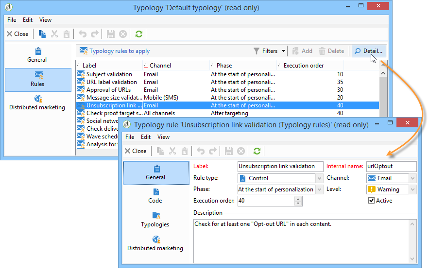

# 验证交付 {#validating-the-delivery}

创建和配置交付后，您必须先验证它，然后再将其发送到主目标。

操作步骤：

1. **分析交付**:通过此步骤，您可以准备要传送的消息。 请参阅 [分析交付](#analyzing-the-delivery)。

   更改批准模式中详细介绍了 [可用的验证模式](../../delivery/using/steps-validating-the-delivery.md#changing-the-approval-mode)。

1. **发送校样**:通过此步骤，您可以批准内容、URL、个性化字段等。 请参阅 [发送证明](../../delivery/using/steps-validating-the-delivery.md#sending-a-proof)[和定义特定证明目标](../../delivery/using/steps-defining-the-target-population.md#defining-a-specific-proof-target)。

>[!CAUTION]
>
>必须在对消息内容进行每次修改后执行这两个步骤。

## 分析交付 {#analyzing-the-delivery}

分析是计算目标群体和准备交付内容的阶段。 完成后，即可发送交付。 要启动交付分析，请单击， **[!UICONTROL Send]**&#x200B;然后选择 **[!UICONTROL Deliver as soon as possible]**。

通过 **[!UICONTROL Analyze]** 该按钮可手动启动分析。 进度栏显示分析的进度。 窗口的下部显示分析结果。 特殊图标显示警告。

>[!NOTE]
>
>验证规则在带有类型的验 [证过程中进行了说明](../../delivery/using/steps-validating-the-delivery.md#validation-process-with-typologies)。

您可以随时单击以停止此作业 **[!UICONTROL Stop]**。

分析阶段不会发送任何消息。 因此，您可以无风险地开始或取消此作业。

>[!CAUTION]
>
>分析会在分析时冻结交货（或证明）。 对交付（或证据）的任何修改必须在适用之前再进行其他分析。

最后一条日志消息显示所有错误消息和错误数。 特殊图标显示错误类型：黄色图标表示非关键处理错误，红色图标表示阻止开始交付的关键错误。

单击 **[!UICONTROL Close]** 以更正错误。 进行更改后，必须重新开始分析。

单击以将消息发送到指定目 **[!UICONTROL Confirm delivery]** 标之前，请检查分析结果。 通过确认消息，可启动传送。

>[!NOTE]
>
>如果要 **[!UICONTROL Change the main delivery target]** 发送的消息数与您的配置不匹配，请单击该链接。 这样，您就可以更改目标人群的定义并重新开始分析。

传送参数 **[!UICONTROL Analysis]** 选项卡允许您定义一组有关在分析阶段准备消息的信息。

通过此选项卡，可以访问以下选项：

* **[!UICONTROL Label and code of the delivery]** :屏幕的此部分相关的选项用于计算这些字段在交付分析阶段的值。 该字 **[!UICONTROL Calculate the execution folder during the delivery analysis]** 段计算将在分析阶段包含此提交操作的文件夹的名称。
* **[!UICONTROL Approval mode]** :通过此字段，您可以选择交付批准的类型。 批准模式在验证过 [程中与类型一起显示](../../delivery/using/steps-validating-the-delivery.md#validation-process-with-typologies)。
* **[!UICONTROL Prepare the personalization data with a workflow]** :此选项允许您在自动工作流程中准备交付中包含的个性化数据。 它使得在处理大量数据时，特别是当个性化数据来自外部表通过FDA时，能够大幅提高交付分析性能。 请参阅访 [问外部数据库(FDA)部分](../../platform/using/accessing-an-external-database.md#optimizing-email-personalization-with-external-data) 。
* **[!UICONTROL Start job in a detached process]** :通过此选项，您可以在单独的流程中启动交付分析。 默认情况下，分析功能使用Adobe Campaign应用程序服务器进程(Web Nlserver)。 通过选择此选项，即使在应用程序服务器出现故障时，您也可以确保完成分析。
* **[!UICONTROL Log SQL queries generated during the analysis in the journal]** :此选项会在分析阶段将SQL查询日志添加到分发日志。
* **[!UICONTROL Ignore personalization scripts during sending]** :通过此选项，您可以绕过对HTML内容中的JavaScript指令的解释。 它们将按原样显示在已传送的内容中。 这些指令与 **&lt;%=标签一起引入** 。

### 配置分析优先级 {#analysis-priority-}

当分发是营销活动的一部分时，该选项卡 **[!UICONTROL Advanced]** 会提供其他选项。 这样，您就可以组织同一营销活动中交货的处理顺序。

在发送之前，将分析每个交付。 分析持续时间取决于提交提取文件。 文件的大小越大，分析的时间越长，以下提交就会等待。

通过这些选项，您 **[!UICONTROL Message preparation by the scheduler]** 可以在营销活动工作流程中对分发分析进行优先级排序。

如果交付过大，最好为其分配低优先级，以避免降低对其他工作流交付的分析速度。

>[!NOTE]
>
>要确保较大的交付分析不会减慢工作流的进度，您可以通过滴答来安排其执行 **[!UICONTROL Schedule execution for a time of low activity]**。

## 发送证明 {#sending-a-proof}

为了检测邮件配置中可能出现的错误，Adobe 强烈建议您设置投放验证周期。尽可能频繁地向测试收件人发送验证内容，确保内容已获得批准。每次进行变更时都应发送验证内容，以批准内容。

>[!NOTE]
>
>* 更改批准模式中详细介绍了 [可用的验证模式](../../delivery/using/steps-validating-the-delivery.md#changing-the-approval-mode)。
>* 定义特定的证明目标中介绍了 [证明目标的配置](../../delivery/using/steps-defining-the-target-population.md#defining-a-specific-proof-target)。
>

要发送证明，请执行以下步骤：

1. 确保已按照定义特定证明目标中的 [说明配置证明目标](../../delivery/using/steps-defining-the-target-population.md#defining-a-specific-proof-target)。
1. 单 **[!UICONTROL Send a proof]** 击传送向导顶栏。

   

1. 开始消息分析。 请参 [阅分析交付](../../delivery/using/steps-validating-the-delivery.md#analyzing-the-delivery)。
1. 您现在可以发送传送(请参 [阅发送传送](../../delivery/using/steps-sending-the-delivery.md))。

   发送送货后，证明将显示在送货列表中，并自动创建和编号。 如果您希望访问其内容和属性，可以编辑它。 For more on this, refer to this [page](../../delivery/using/monitoring-a-delivery.md#delivery-dashboard).

   

   >[!NOTE]
   >
   >如果为分发（HTML和文本）创建了多种格式，则可以选择要发送给窗口下半部分的证明收件人的消息格式。

   

您可能希望修改交付内容，因为接收证明的验证组做出了任何评论。 进行更改后，必须重新启动分析，然后再发送其他证明。 每个新证明都编号并记录在交付日志中。

分析完交付后，您可以查看通过日志（选项卡）的子 **[!UICONTROL Proofs]** 选项卡发送的各种校样&#x200B;**[!UICONTROL Audit]** 信息。

您必须发送所需数量的校样，直到交付内容完成。 之后，您可以将交付发送到主目标并关闭验证周期。

交付 **[!UICONTROL Advanced]** 属性的选项卡允许您定义证明的属性。 如果需要，您可以覆盖收件人排除规则。

可以使用以下选项：

* 第一个选项可让您保持双倍的校样。
* 以下两个选项都允许您将列入黑名单的收件人和地址置于隔离状态。 请参阅自定义排除设置中有关主目标的这些选 [项的说明](../../delivery/using/steps-defining-the-target-population.md#customizing-exclusion-settings)。 与交付目标（默认情况下，这些地址被排除）不同，它们默认情况下会保留为证明目标。
* 通过 **[!UICONTROL Keep the delivery code for the proof]** 此选项，您可以为证明提供与其相关的交付所定义的相同的交付代码。 此代码在交付向导的第一步中指定。
* 默认情况下，证明标的以“证明编号”为前缀，其中#是证明编号。 您可以在字段中更改此前 **[!UICONTROL Label prefix]** 缀。

## 使用类型的验证过程 {#validation-process-with-typologies}

在发送任何消息之前，您应分析营销活动以批准其内容和配置。 在分析阶段应用的检查规则在类型学中定 **义**。 默认情况下，对于电子邮件，分析涵盖以下几点：

* 批准对象
* 批准URL和图像
* 批准URL标签
* 批准取消订阅链接
* 检查校样的大小
* 检查有效期
* 检查波形的调度

将在交付参数的选项卡中选择要应用于每 **[!UICONTROL Typologies]** 个交付的类型。

您可以通过节点查看和编辑批准规则、其内容、其执行顺序以及其完整说 **[!UICONTROL Administration > Campaign execution > Typology management > Typology rules]** 明。

您可以从此节点创建新规则和定义新的类型。 但是，这些任务是为了解JavaScript的专家用户保留的。

要编辑当前排版，请单 **[!UICONTROL Edit link]** 击字段右侧的图 **[!UICONTROL Typology]** 标。

该选 **[!UICONTROL Rule]** 项卡提供了要应用的类型学规则列表。 选择一个规则，然后单击 **[!UICONTROL Detail...]** 该图标以查看其配置：

>[!NOTE]
>
>**[!UICONTROL Arbitration]** 类型类型于销售压力管理框架内使用。 如需详细信息，请参阅[此部分](../../campaign/using/about-marketing-resource-management.md)。

## 更改批准模式 {#changing-the-approval-mode}

通过 **[!UICONTROL Analysis]** 交付属性的选项卡，您可以选择验证模式。 如果分析期间生成了警告（例如，如果某些字符在分发的主题中被突出，等等），您可以配置分发以定义是否应继续执行它。 默认情况下，用户必须在分析阶段结束时确认消息的发送：这是手 **动验** 证。

从相应字段的下拉列表中选择其他批准模式。

可以使用以下批准模式：

* **[!UICONTROL Manual]**:在分析阶段结束时，用户必须确认发送以开始发送。 要执行此操作，请单击 **[!UICONTROL Start]** 按钮以启动交付。
* **[!UICONTROL Semi-automatic]**:如果分析阶段不生成警告消息，则发送会自动开始。
* **[!UICONTROL Automatic]**:无论其结果如何，发送都会在分析阶段结束时自动开始。
