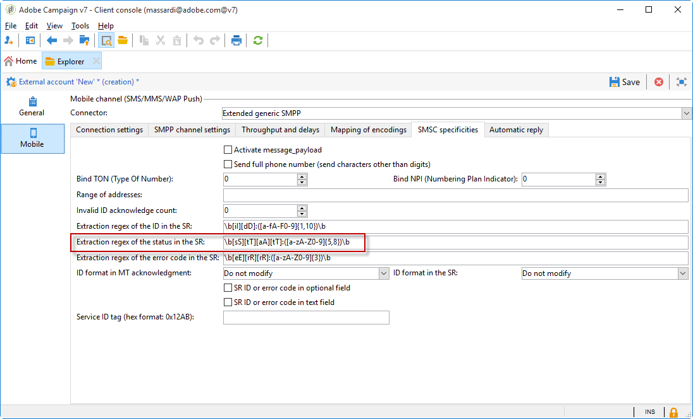

# 了解隔离管理{#understanding-quarantine-management}

Adobe Campaign 管理了一个隔离地址列表。在投放分析时，默认情况下会将其地址已被隔离的收件人排除在外，不会将其设为目标。举例来说，信箱已满或地址不存在时，可以隔离某个电子邮件地址。无论如何，隔离程序都符合下述具体规则。

>[!NOTE]
>
>本节适用于在线渠道：电子邮件、短信、推送通知。

## 通过隔离管理优化投放 {#optimizing-your-delivery-through-quarantines}

在准备消息时，电子邮件地址或电话号码处于隔离状态的用户档案将被自动排除(请参阅 [确定投放的隔离地址](#identifying-quarantined-addresses-for-a-delivery))。 这样可加快投放速度，因为错误率对投放速度有显著的影响。

如果无效地址率过高，某些互联网访问提供商会自动将电子邮件判断为垃圾邮件。因此，隔离可让您避免被这些提供商添加到阻止列表。

此外，隔离还可避免向错误的电话号码投放短信，有助于降低短信发送成本。

有关安全防护和优化投放之最佳做法的更多信息，请参阅[此页面](delivery-best-practices.md)。

### 隔离与阻止列表 {#quarantine-vs-denylist}

隔离和阻止列表不适用于同一对象：

* **隔离** 仅适用于 **地址** （或电话号码等），而不是配置文件本身。 例如，其电子邮件地址被隔离的用户档案可以更新其用户档案并输入新地址，然后再次被投放操作定向。 同样，如果两个用户档案碰巧拥有相同的电话号码，那么隔离该号码将会同时影响这两个用户档案。

  隔离的地址或电话号码显示在 [排除日志](#identifying-quarantined-addresses-for-a-delivery) （针对投放）或在 [隔离列表](#identifying-quarantined-addresses-for-the-entire-platform) （适用于整个平台）。

* 位于 **阻止列表**&#x200B;另一方面，将导致 **个人资料** 不再被投放定向，如针对给定渠道的退订（选择退出）后。 例如，如果电子邮件渠道阻止列表上的用户档案有两个电子邮件地址，则这两个地址都将排除在投放之外。

  您可以检查配置文件是否在阻止列表中 **[!UICONTROL No longer contact]** 用户档案的部分 **[!UICONTROL General]** 选项卡。 请参阅[此章节](../../platform/using/editing-a-profile.md#general-tab)。

>[!NOTE]
>
>隔离包括 **[!UICONTROL Denylisted]** 状态，当收件人将您的邮件报告为垃圾邮件或回复带有关键词（如“STOP”）的短信邮件时适用。 在这种情况下，用户档案中涉及的地址或电话号码将与 **[!UICONTROL Denylisted]** 状态。 有关管理停止短信消息的更多信息，请参阅 [本节](../../delivery/using/sms-send.md#processing-inbound-messages).

## 确定隔离的地址 {#identifying-quarantined-addresses}

可以针对特定投放或整个平台列出隔离的地址。

### 确定投放的隔离地址 {#identifying-quarantined-addresses-for-a-delivery}

在投放准备阶段期间，投放仪表板的投放日志中会列出特定投放的隔离地址(请参阅 [投放日志和历史记录](delivery-dashboard.md#delivery-logs-and-history))。

### 确定整个平台的隔离地址 {#identifying-quarantined-addresses-for-the-entire-platform}

管理员可以从以下位置列出整个平台的隔离地址 **[!UICONTROL Administration > Campaign Management > Non deliverables Management > Non deliverables and addresses]** 节点。

>[!NOTE]
>
>此菜单列出了&#x200B;**电子邮件**、**短信**&#x200B;和&#x200B;**推送通知**&#x200B;渠道的隔离元素。

每个地址均提供以下信息：


>[!NOTE]
>
>隔离数量的增加是正常的，这与数据库的“磨损”有关。 例如，如果将电子邮件地址的生命周期视为三年，并且收件人表每年增加50%，则隔离的增加可以按如下方式计算：
>
>第1年年末：(1&#42;0.33)/(1+0.5)=22%。
>
>第2年年末：((1.22)&#42;0.33)+0.33)/(1.5+0.75)=32.5%。

### 在投放报告中确定隔离的地址 {#identifying-quarantined-addresses-in-delivery-reports}

以下报告提供了有关隔离地址的信息：

* 对于每次投放， **[!UICONTROL Delivery summary]** 报告显示投放目标中隔离的地址数。 它显示：

   * 投放分析期间被隔离的地址数，

   * 投放操作后放置到隔离区的地址数。

* 此 **[!UICONTROL Non-deliverables and bounces]** 报告显示有关隔离地址、遇到的错误类型等以及按域划分的失败的信息。

您可以查找该平台所有投放的信息(**[!UICONTROL Home page > Reports]**)或进行特定投放。 您还可以创建自定义报告并选择要显示的信息。

### 确定收件人的隔离地址 {#identifying-quarantined-addresses-for-a-recipient}

您可以查找任何收件人的电子邮件地址的状态。 为此，请选择收件人配置文件，然后单击 **[!UICONTROL Deliveries]** 选项卡。 对于发送给该收件人的所有投放，您可以查明地址是否出现故障，在分析期间是否被隔离等。 对于每个文件夹，您只能显示其电子邮件地址处于隔离状态的收件人。 要执行此操作，请使用 **[!UICONTROL Quarantined email address]** 应用程序过滤器。


## 将地址加入隔离的条件 {#conditions-for-sending-an-address-to-quarantine}

Adobe Campaign根据投放失败类型和错误消息鉴别期间分配的原因管理隔离(请参阅 [退回邮件鉴别](understanding-delivery-failures.md#bounce-mail-qualification) 和 [投放失败类型和原因](understanding-delivery-failures.md#delivery-failure-types-and-reasons))。

* **已忽略的错误**：已忽略的错误不会将地址添加到隔离。
* **硬错误**：相应的电子邮件地址会立即添加到隔离。
* **软错误**：软错误不会立即将地址添加到隔离，但会增加错误计数。有关此内容的更多信息，请参阅 [软错误管理](#soft-error-management).

如果用户将电子邮件标记为垃圾邮件([反馈环](https://experienceleague.adobe.com/docs/deliverability-learn/deliverability-best-practice-guide/transition-process/infrastructure.html#feedback-loops))，邮件会自动重定向到由Adobe管理的技术邮箱。 随后，该用户的电子邮件地址会自动添加到隔离，并附加 **[!UICONTROL Denylisted]** 状态。此状态仅适用于地址，用户档案不在阻止列表上，因此用户可继续接收短信和推送通知。

>[!NOTE]
>
>Adobe Campaign 中的隔离会区分大小写字母。请确保以小写方式导入电子邮件地址，这样以后就不会重新定向这些地址。

在隔离地址列表中(请参阅 [确定整个平台的隔离地址](#identifying-quarantined-addresses-for-the-entire-platform))，则 **[!UICONTROL Error reason]** 字段指示将选定地址置于隔离状态的原因。


### 软错误管理 {#soft-error-management}

与硬错误相反，软错误不会立即将地址添加到隔离，而是会增加错误计数。

重试操作将在 [投放持续时间](../../delivery/using/steps-sending-the-delivery.md#defining-validity-period). 当错误计数达到限制阈值时，即会将地址添加到隔离。有关详细信息，请参见 [投放临时失败后重试](understanding-delivery-failures.md#retries-after-a-delivery-temporary-failure).

如果最后一次重大错误发生在10天之前，则重新初始化错误计数器。 然后，地址状态更改为 **有效** 并且它会被从隔离列表中删除 [数据库清理](../../production/using/database-cleanup-workflow.md) 工作流。


对于托管或混合安装，如果已升级到 [增强MTA](sending-with-enhanced-mta.md)，在下列情况下执行的最大重试次数： **[!UICONTROL Erroneous]** 现在，状态和重试之间的最短延迟取决于IP在给定域名的历史和当前表现如何。

对于使用旧版Campaign MTA的内部部署和托管/混合安装，您可以修改错误数以及两个错误之间的时间间隔。 要执行此操作，请在 [部署向导](../../installation/using/deploying-an-instance.md) (**[!UICONTROL Email channel]** > **[!UICONTROL Advanced parameters]**)或 [在投放级别](../../delivery/using/steps-sending-the-delivery.md#configuring-retries).


## 从隔离中删除地址 {#removing-a-quarantined-address}

### 自动更新 {#unquarantine-auto}

符合特定条件的地址会由自动从隔离列表中删除 [数据库清理](../../production/using/database-cleanup-workflow.md) 工作流。

在以下情况下，地址会自动从隔离列表中删除：

* 中的地址 **[!UICONTROL With errors]** 状态将在成功投放后从隔离列表中删除。
* 中的地址 **[!UICONTROL With errors]** 如果最后一次软退回发生在10天之前，则会从隔离列表中删除该状态。 有关软错误管理的更多信息，请参阅 [本节](#soft-error-management).
* 中的地址 **[!UICONTROL With errors]** 退回的状态 **[!UICONTROL Mailbox full]** 错误将在30天后从隔离列表中删除。

然后，其状态更改为 **[!UICONTROL Valid]**.

>[!IMPORTANT]
>
>地址在中的收件人 **[!UICONTROL Quarantine]** 或 **[!UICONTROL Denylisted]** 即使他们收到电子邮件，状态也不会被删除。

### 手动更新 {#unquarantine-manual}

您还可以手动取消隔离地址。 要从隔离列表中手动删除地址，请将其状态更改为 **[!UICONTROL Valid]** 从 **[!UICONTROL Administration > Campaign Management > Non deliverables Management > Non deliverables and addresses]** 节点。


### 批量更新 {#unquarantine-bulk}

您可能需要对隔离列表执行批量更新，例如，在ISP中断的情况下。 在这种情况下，电子邮件会错误地标记为跳出，因为它们无法成功传递给收件人。 必须从隔离列表中删除这些地址。

要执行此操作，请创建工作流并添加 **[!UICONTROL Query]** 活动以过滤掉所有受影响的收件人。 确定后，可以从隔离列表中删除它们，并将其包含在将来的Campaign电子邮件投放中。

以下是此查询的建议准则：

* 对于Campaign Classicv7环境，其入站电子邮件规则信息位于 **[!UICONTROL Error text]** 隔离列表的字段：

   * **错误文本（隔离文本）** 包含“Momen_Code10_InvalidRecipient”
   * **电子邮件域(@domain)** 等于domain1.com或 **电子邮件域(@domain)** 等于domain2.com或 **电子邮件域(@domain)** 等于domain3.com
   * **更新状态(@lastModified)** YYYY/MM/DD HH当天或之后:MM:SS AM
   * **更新状态(@lastModified)** 在MM/DD/YYYY HH或之前:MM:SS PM

* 对于包含SMTP退回响应信息的Campaign Classicv7实例 **[!UICONTROL Error text]** 隔离列表的字段：

   * **错误文本（隔离文本）** 包含“550-5.1.1”和 **错误文本（隔离文本）** 包含“support.ISP.com”

  其中“support.ISP.com”可以是：例如“support.apple.com”或“support.google.com”

   * **更新状态(@lastModified)** YYYY/MM/DD HH当天或之后:MM:SS AM
   * **更新状态(@lastModified)** 在MM/DD/YYYY HH或之前:MM:SS PM

获得受影响的收件人列表后，添加 **[!UICONTROL Update data]** 活动，将其电子邮件地址状态设置为 **[!UICONTROL Valid]** 因此它们将被从隔离列表中删除 **[!UICONTROL Database cleanup]** 工作流。 也可以直接从隔离表中删除它们。

## 推送通知隔离 {#push-notification-quarantines}

推送通知的隔离机制与常规流程全局相同。 但是，对于推送通知，某些错误的管理方式有所不同。 例如，对于某些软错误，不会在同一投放中执行重试。 下面列出了推送通知的特性。 重试机制（重试次数、频率）与电子邮件的机制相同。

被隔离的项目是设备令牌。

### iOS隔离 {#ios-quarantine}

HTTP/V2协议允许直接反馈每个推送投放的状态。 如果使用HTTP/V2协议连接器，则反馈服务不再由 **[!UICONTROL mobileAppOptOutMgt]** 工作流。 卸载或重新安装移动应用程序时，令牌被视为已注销。

同时，如果APN为消息返回“未注册”状态，则目标令牌将立即被隔离。

<table> 
 <tbody> 
  <tr> 
   <td> <strong>方案</strong><br /> </td> 
   <td> <strong>状态</strong><br /> </td> 
   <td> <strong>错误消息</strong><br /> </td> 
   <td> <strong>失败类型</strong><br /> </td> 
   <td> <strong>失败原因</strong><br /> </td> 
   <td> <strong>重试</strong><br /> </td> 
  </tr> 
  <tr> 
   <td> 目标设备已通电<br /> </td> 
   <td> 确定<br /> </td> 
   <td> </td> 
   <td> </td> 
   <td> </td> 
   <td> </td> 
  </tr> 
  <tr> 
   <td> 目标设备已关闭<br /> </td> 
   <td> 确定<br /> </td> 
   <td> </td> 
   <td> </td> 
   <td> </td> 
   <td> </td> 
  </tr> 
  <tr> 
   <td> 用户禁用应用程序的通知<br /> </td> 
   <td> 确定<br /> </td> 
   <td> </td> 
   <td> </td> 
   <td> </td> 
   <td> </td> 
  </tr> 
  <tr> 
   <td> 报文创建/分析阶段 — 有效负载太大<br /> </td> 
   <td> 失败<br /> </td> 
   <td> 有效负载过长<br /> </td> 
   <td> 柔光<br /> </td> 
   <td> 已拒绝<br /> </td> 
   <td> 否<br /> </td> 
  </tr> 
  <tr> 
   <td> 报文创建/分析阶段 — 意外的内容格式问题<br /> </td> 
   <td> 失败<br /> </td> 
   <td> 根据错误显示各种错误消息<br /> </td> 
   <td> 柔光<br /> </td> 
   <td> 未定义<br /> </td> 
   <td> 否<br /> </td> 
  </tr> 
  <tr> 
   <td> 证书问题（密码、损坏等） 和测试与APNs问题的连接<br /> </td> 
   <td> 失败<br /> </td> 
   <td> 根据错误显示各种错误消息<br /> </td> 
   <td> 柔光<br /> </td> 
   <td> 已拒绝<br /> </td> 
   <td> 否<br /> </td> 
  </tr> 
  <tr> 
   <td> 发送期间网络连接丢失<br /> </td> 
   <td> 失败<br /> </td> 
   <td> 连接错误<br /> </td> 
   <td> 未定义<br /> </td> 
   <td> 不可到达<br /> </td> 
   <td> 是<br /> </td> 
  </tr> 
  <tr> 
   <td> APNs消息拒绝：取消注册<br /> 用户已删除应用程序或令牌已过期<br /> </td> 
   <td> 失败<br /> </td> 
   <td> 未注册<br /> </td> 
   <td> 硬<br /> </td> 
   <td> 用户未知<br /> </td> 
   <td> 否<br /> </td> 
  </tr> 
  <tr> 
   <td> APNs消息拒绝：所有其他错误<br /> </td> 
   <td> 失败<br /> </td> 
   <td> 错误消息中将显示错误拒绝原因<br /> </td> 
   <td> 柔光<br /> </td> 
   <td> 已拒绝<br /> </td> 
   <td> 否<br /> </td> 
  </tr> 
 </tbody> 
</table>

### Android隔离 {#android-quarantine}

**适用于Android V1**

对于每个通知，Adobe Campaign都会直接从FCM服务器接收同步错误。 Adobe活动会即时处理这些错误，并根据错误的严重性生成硬错误或软错误，并且可以执行重试：

* 已超出有效负载长度，连接问题，服务可用性问题：已执行重试，软错误，失败原因为 **[!UICONTROL Refused]**.
* 超出设备配额：无重试、软错误、失败原因为 **[!UICONTROL Refused]**.
* 无效或未注册的令牌、意外错误、发件人帐户问题：无重试、硬错误、失败原因为 **[!UICONTROL Refused]**.

此 **[!UICONTROL mobileAppOptOutMgt]** 工作流每6小时运行一次，以更新 **AppSubscriptionRcp** 表格。 对于声明为未注册或不再有效的令牌，字段 **已禁用** 设置为 **True** 并且将来投放时将自动排除链接到该设备令牌的订阅。

在投放分析期间，从目标中排除的所有设备会自动添加到 **excludeLogAppSubRcp** 表格。

>[!NOTE]
>
>对于使用百度连接器的客户，以下是不同类型的错误：
>
>* 投放开始时的连接问题：失败类型 **[!UICONTROL Undefined]**，失败原因 **[!UICONTROL Unreachable]**，将执行重试。
>* 投放期间连接丢失：软错误、失败原因 **[!UICONTROL Refused]**，将执行重试。
>* 百度在发送过程中返回的同步错误：硬错误、失败原因 **[!UICONTROL Refused]**，则不执行重试。
>
>Adobe Campaign每10分钟联系百度服务器以检索发送消息的状态，并更新broadlog。 如果消息被声明为已发送，则broadlogs中消息的状态将设置为 **[!UICONTROL Received]**. 如果百度声明错误，则状态设置为 **[!UICONTROL Failed]**.

**适用于Android V2**

Android V2隔离机制使用与Android V1相同的过程，该过程同样适用于订阅和排除项更新。 欲知详情，请参阅 [Android V1](#android-quarantine) 部分。

<table> 
 <tbody> 
  <tr> 
   <td> <strong>方案</strong><br /> </td> 
   <td> <strong>状态</strong><br /> </td> 
   <td> <strong>错误消息</strong><br /> </td> 
   <td> <strong>失败类型</strong><br /> </td> 
   <td> <strong>失败原因</strong><br /> </td> 
   <td> <strong>重试</strong><br /> </td> 
  </tr> 
  <tr> 
   <td> 报文创建/分析阶段：自定义字段中使用的关键字非法<br /> </td> 
   <td> 失败<br /> </td> 
   <td> 不能使用以下关键字： {1}<br /> </td> 
   <td> 柔光<br /> </td> 
   <td> </td> 
   <td> 否<br /> </td> 
  </tr> 
  <tr> 
   <td> 消息创建/分析阶段：有效负载太大<br /> </td> 
   <td> 失败<br /> </td> 
   <td> 通知过重： {1}位，而只有{2}位被授权<br /> </td> 
   <td> 柔光<br /> </td> 
   <td> 已拒绝<br /> </td> 
   <td> 否<br /> </td> 
  </tr> 
  <tr> 
   <td> 发送期间网络连接丢失<br /> </td> 
   <td> 失败<br /> </td> 
   <td> 地址上的Firebase Cloud Messaging服务没有响应： {1}<br /> </td> 
   <td> 柔光<br /> </td> 
   <td> 不可到达<br /> </td> 
   <td> 是<br /> </td> 
  </tr> 
  <tr> 
   <td> FCM消息拒绝： FCM服务器暂时不可用（例如，超时）。 <br /> </td> 
   <td> 失败<br /> </td> 
   <td> Firebase云消息服务暂时不可用<br /> </td> 
   <td> 柔光<br /> </td> 
   <td> 不可到达<br /> </td> 
   <td> 是<br /> </td> 
  </tr> 
  <tr> 
   <td> FCM消息拒绝：验证发件人帐户时出错<br /> </td> 
   <td> 失败<br /> </td> 
   <td> 无法识别开发人员帐户，请检查您的ID和密码<br /> </td> 
   <td> 柔光<br /> </td> 
   <td> 已拒绝<br /> </td> 
   <td> 否<br /> </td> 
  </tr> 
  <tr> 
   <td> FCM消息拒绝：超出设备配额<br /> </td> 
   <td> 失败<br /> </td> 
   <td> </td> 
   <td> 柔光<br /> </td> 
   <td> 已拒绝<br /> </td> 
   <td> 是<br /> </td> 
  </tr> 
  <tr> 
   <td> FCM消息拒绝：注册无效/未注册<br /> </td> 
   <td> 失败<br /> </td> 
   <td> </td> 
   <td> 硬<br /> </td> 
   <td> 用户未知<br /> </td> 
   <td> 否<br /> </td> 
  </tr> 
  <tr> 
   <td> FCM消息拒绝：所有其他错误<br /> </td> 
   <td> 失败<br /> </td> 
   <td> Firebase Cloud Messaging Server返回了意外错误代码： {1} </td> 
   <td> </td> 
   <td> 已拒绝<br /> </td> 
   <td> 否<br /> </td> 
  </tr> 
    <tr> 
   <td> FCM消息拒绝：参数无效<br /> </td> 
   <td> 失败<br /> </td> 
   <td> INVALID_ARGUMENT </td> 
   <td> 已忽略</td> 
   <td> 未定义<br /> </td> 
   <td> 否<br /> </td> 
  </tr>
    <tr> 
   <td> FCM消息拒绝：第三方身份验证错误<br /> </td> 
   <td> 失败<br /> </td> 
   <td> THIRD_PARTY_AUTH_ERROR </td> 
   <td> 已忽略</td>
   <td> 已拒绝<br /> </td> 
   <td> 是<br /> </td> 
  </tr>
    <tr> 
   <td> FCM消息拒绝：发件人ID不匹配<br /> </td> 
   <td> 失败<br /> </td> 
   <td> SENDER_ID_MISMATCH </td> 
   <td> 柔光</td>
   <td> 用户未知<br /> </td> 
   <td> 否<br /> </td> 
  </tr>
    <tr> 
   <td> FCM消息拒绝：未注册<br /> </td> 
   <td> 失败<br /> </td>
   <td> 未注册 </td> 
   <td> 硬</td> 
   <td> 用户未知<br /> </td> 
   <td> 否<br /> </td> 
  </tr>
    <tr> 
   <td> FCM消息拒绝：内部<br /> </td> 
   <td> 失败<br /> </td> 
   <td> 内部 </td> 
   <td> 已忽略</td> 
   <td> 已拒绝<br /> </td> 
   <td> 是<br /> </td> 
  </tr>
    <tr> 
   <td> FCM消息拒绝：不可用<br /> </td> 
   <td> 失败<br /> </td> 
   <td> 不可用</td> 
   <td> 已忽略</td> 
   <td> 已拒绝<br /> </td> 
   <td> 是<br /> </td> 
  </tr>
    <tr> 
   <td> FCM消息拒绝：意外错误代码<br /> </td> 
   <td> 失败<br /> </td> 
   <td> 意外错误代码</td> 
   <td> 已忽略</td> 
   <td> 已拒绝<br /> </td> 
   <td> 否<br /> </td> 
  </tr>
  <tr> 
   <td> 身份验证：连接问题<br /> </td> 
   <td> 失败<br /> </td> 
   <td> 无法连接到身份验证服务器 </td> 
   <td> 已忽略</td>
   <td> 已拒绝<br /> </td> 
   <td> 是<br /> </td> 
  </tr>
    <tr> 
   <td> 身份验证：请求中有未经授权的客户端或作用域。<br /> </td> 
   <td> 失败<br /> </td> 
   <td> unauthorized_client </td> 
   <td> 已忽略</td>
   <td> 已拒绝<br /> </td> 
   <td> 否<br /> </td> 
  </tr>
    <tr> 
   <td> 身份验证：客户端无权使用此方法检索访问令牌，或者客户端无权使用请求的任何作用域。<br /> </td> 
   <td> 失败<br /> </td> 
   <td> unauthorized_client </td> 
   <td> 已忽略</td>
   <td> 已拒绝<br /> </td> 
   <td> 否<br /> </td> 
  </tr>
    <tr> 
   <td> 身份验证：访问被拒绝<br /> </td> 
   <td> 失败<br /> </td>
   <td> access_denied</td> 
   <td> 已忽略</td>
   <td> 已拒绝<br /> </td> 
   <td> 否<br /> </td> 
  </tr>
    <tr> 
   <td> 身份验证：无效的电子邮件<br /> </td> 
   <td> 失败<br /> </td> 
   <td> invalid_grant </td> 
   <td> 已忽略</td> 
   <td> 已拒绝<br /> </td> 
   <td> 否<br /> </td> 
  </tr>
    <tr> 
   <td> 身份验证：JWT无效<br /> </td> 
   <td> 失败<br /> </td> 
   <td> invalid_grant </td> 
   <td> 已忽略</td> 
   <td> 已拒绝<br /> </td> 
   <td> 否<br /> </td> 
  </tr>
    <tr> 
   <td> 身份验证： JWT签名无效<br /> </td> 
   <td> 失败<br /> </td> 
   <td> invalid_grant </td> 
   <td> 已忽略</td> 
   <td> 已拒绝<br /> </td> 
   <td> 否<br /> </td> 
  </tr>
    <tr> 
   <td> 身份验证：提供的OAuth范围或ID令牌受众无效<br /> </td> 
   <td> 失败<br /> </td> 
   <td> unauthorized_client</td> 
   <td> 已忽略</td> 
   <td> 已拒绝<br /> </td> 
   <td> 否<br /> </td> 
  </tr>
    <tr> 
   <td> 身份验证：已禁用OAuth客户端<br /> </td> 
   <td> 失败<br /> </td> 
   <td> 已禁用客户端</td> 
   <td> 已忽略</td> 
   <td> 已拒绝<br /> </td> 
   <td> 否<br /> </td> 
  </tr>
 </tbody> 
</table>

## 短信隔离 {#sms-quarantines}

**对于标准连接器**

SMS消息的隔离机制在全局上与常规流程相同。 请参阅 [关于隔离](#about-quarantines). 下面列出了短信的特性。

>[!NOTE]
>
>此 **[!UICONTROL Delivery log qualification]** 表不适用于 **扩展的通用SMPP** 连接器。

<table> 
 <tbody> 
  <tr> 
   <td> <strong>方案</strong><br /> </td> 
   <td> <strong>状态</strong><br /> </td> 
   <td> <strong>错误消息</strong><br /> </td> 
   <td> <strong>失败类型</strong><br /> </td> 
   <td> <strong>失败原因</strong><br /> </td> 
  </tr> 
  <tr> 
   <td> 已发送给提供商<br /> </td> 
   <td> 已发送<br /> </td> 
   <td> </td> 
   <td> </td> 
   <td> </td> 
  </tr> 
  <tr> 
   <td> 已在移动设备上接收<br /> </td> 
   <td> 已接收<br /> </td> 
   <td> </td> 
   <td> </td> 
   <td> </td> 
  </tr> 
  <tr> 
   <td> 提供程序返回的错误<br /> </td> 
   <td> 失败<br /> </td> 
   <td> 接收数据时出错（SR或MO）<br /> </td> 
   <td> 柔光<br /> </td> 
   <td> 不可到达<br /> </td> 
  </tr> 
  <tr> 
   <td> MT确认无效<br /> </td> 
   <td> 失败<br /> </td> 
   <td> 处理发送查询的确认帧时出错“{1}”<br /> </td> 
   <td> 柔光<br /> </td> 
   <td> 不可到达<br /> </td> 
  </tr> 
  <tr> 
   <td> 发送报文时出错<br /> </td> 
   <td> 失败<br /> </td> 
   <td> 发送消息时出错<br /> </td> 
   <td> 柔光<br /> </td> 
   <td> 不可到达<br /> </td> 
  </tr> 
 </tbody> 
</table>

**对于扩展的通用SMPP连接器**

使用SMPP协议发送短信消息时，错误管理的处理方式不同。 有关扩展的通用SMPP连接器的更多信息，请参阅 [此页面](sms-set-up.md#creating-an-smpp-external-account).

SMPP连接器从使用正则表达式（正则表达式）返回的SR（状态报告）消息中检索数据，以筛选其内容。 然后，将此数据与 **[!UICONTROL Delivery log qualification]** 表格(可通过以下网站获取： **[!UICONTROL Administration]** > **[!UICONTROL Campaign Management]** > **[!UICONTROL Non deliverables Management]** 菜单)。

在限定新类型的错误之前，失败原因始终设置为 **已拒绝** 默认情况下。

>[!NOTE]
>
>失败类型和失败原因与电子邮件相同。 请参阅 [投放失败类型和原因](understanding-delivery-failures.md#delivery-failure-types-and-reasons).
>
>请向您的提供商索取状态和错误代码列表，以便在投放日志资格表中设置正确的失败类型和失败原因。

生成的消息示例：

```
SR Generic DELIVRD 000|#MESSAGE#
```

* 所有错误消息都以开头 **SR** 以区分短信错误代码和电子邮件错误代码。
* 第二部分(**通用** 在此示例中，错误消息引用SMSC实施的名称，如中定义的 **[!UICONTROL SMSC implementation name]** 短信外部帐户的字段。 请参阅[此页](sms-set-up.md#creating-an-smpp-external-account)。

  由于对于每个提供程序而言，相同的错误代码可能具有不同的含义，因此此字段允许您知道是哪个提供程序生成了错误代码。 然后，您可以在相关提供商的文档中查找错误。

* 第三部分(**投放** 在此示例中)的错误消息对应于使用在SMS外部帐户中定义的状态提取正则表达式从SR检索到的状态代码。

  此正则表达式在 **[!UICONTROL SMSC specificities]** 外部帐户的选项卡。 请参阅[此页](sms-set-up.md#creating-an-smpp-external-account)。

  

  默认情况下，正则表达式会提取 **stat：** 由定义的字段 **附录B** 的部分 **SMPP 3.4规范**.

* 第四部分(**000** 在此示例中，错误消息的对应于使用在SMS外部帐户中定义的错误代码提取正则表达式从SR提取的错误代码。

  此正则表达式在 **[!UICONTROL SMSC specificities]** 外部帐户的选项卡。 请参阅[此页](sms-set-up.md#creating-an-smpp-external-account)。

  默认情况下，正则表达式会提取 **错误：** 由定义的字段 **附录B** 的部分 **SMPP 3.4规范**.

* 管道符号(|)之后的所有内容仅显示在 **[!UICONTROL First text]** 列 **[!UICONTROL Delivery log qualification]** 表格。 此内容始终替换为 **#MESSAGE#** 在消息规范化之后。 此过程避免因类似错误而出现多个条目，与电子邮件的情况相同。 有关此内容的更多信息，请参阅 [退回邮件鉴别](understanding-delivery-failures.md#bounce-mail-qualification).

扩展通用SMPP连接器应用启发式来查找合理的默认值：如果状态开头为 **DELIV**，则它被视为成功，因为它与常见状态相匹配 **投放** 或 **已投放** 供大多数提供商使用。 任何其他状态都会导致硬故障。
