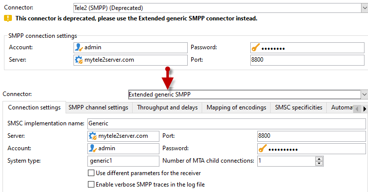
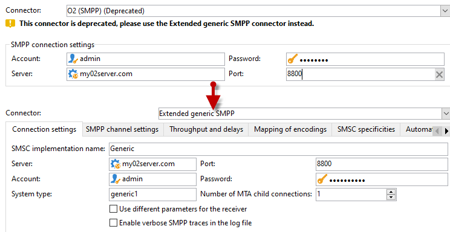

# 将不支持的SMS连接器迁移到扩展通用SMPP连接器{#unsupported-connector-migration}

从版本20.2开始，弃用旧版连接器。 本文档将帮助您将在旧系统上仍在运行的连接器迁移到推荐的SMPP连接器。

>[!CAUTION]
>
>此迁移不是强制性的，但由Adobe推荐，它将确保您在受支持的最新软件版本上运行。

## 关于SMS连接器 {#about-sms-connectors}

以下连接器自版本20.2起已弃用：

* **[!UICONTROL Generic SMPP]** （支持二进制模式的SMPP版本3.4）
* **[!UICONTROL Sybase365]** (SAP SMS 365)
* **[!UICONTROL CLX Communications]**
* **[!UICONTROL Tele2]**
* **[!UICONTROL O2]**
* **[!UICONTROL iOS]**

已弃用的功能仍然可用并受支持，但不会进一步增强它们。 我们建议使用 **[!UICONTROL Extended generic SMPP]** 连接器。

有关已弃用和已删除功能的详细信息，请参阅此 [页面](../../rn/using/deprecated-features.md).

旧的SMS连接器使用的Java SMS连接器会重载Web进程。 迁移到新 **[!UICONTROL Extended Generic SMPP]** 连接器会将此负载移动到可以支持它的MTA。

## 迁移到扩展的通用SMPP连接器 {#migrating-extended-generic-smpp}

>[!CAUTION]
>
>即使您可以调换参数，配置 **[!UICONTROL Extended Generic SMPP]** 连接器要求您与提供商联系，提供商将为您提供填写其余参数所需的信息。 有关详细信息，请参见此 [ 页面](sms-protocol.md)。

首先，您需要创建一个 **[!UICONTROL Extended Generic SMPP]** 然后，您或许能够转置某些参数。 您可以在此处找到详细步骤 [页面](sms-set-up.md#creating-an-smpp-external-account).

现在，您需要填写 **[!UICONTROL Mobile]** 新创建的选项卡 **[!UICONTROL Extended Generic SMPP]** 外部帐户，具体取决于您之前的连接器。

### 从通用连接器 {#from-generic-connector}

当选择 **[!UICONTROL Generic]** 连接器时，您应该具有适应各种情况的自定义JavaScript连接器。

如果您知道此连接器已在使用SMPP协议，则可以迁移到 **[!UICONTROL Extended Generic SMPP]** 连接器。 如果不支持，请与您的提供商联系，了解他们是否支持SMPP协议，并在顾问的帮助下设置新连接器。

来自您的 **[!UICONTROL Generic]** 连接器，您可以调换到新创建的 **[!UICONTROL Extended SMPP]** 帐户：

在 **[!UICONTROL Connection Settings]** 选项卡：

* **[!UICONTROL Account]**
* **[!UICONTROL Password]**
* **[!UICONTROL Server]**
* **[!UICONTROL Port]**

### 来自通用SMPP连接器 {#from-generic-smpp-connector}

来自您的 **[!UICONTROL Generic SMPP]** 连接器，您可以调换到新创建的 **[!UICONTROL Extended SMPP]** 帐户：

在 **[!UICONTROL Connection Settings]** 选项卡：

* **[!UICONTROL Account]**
* **[!UICONTROL Password]**
* **[!UICONTROL Server]**
* **[!UICONTROL Port]**
* **[!UICONTROL System Type]**

在 **[!UICONTROL SMPP Channel Settings]** 选项卡：

* **[!UICONTROL Source number]**
* **[!UICONTROL Source NPI]**
* **[!UICONTROL Destination NPI]**
* **[!UICONTROL Source TON]**
* **[!UICONTROL Destination TON]**

在 **[!UICONTROL Mapping of Encoding]** 选项卡：

* **[!UICONTROL Outbound SMS coding]**

在 **[!UICONTROL SMSC specificities]** 选项卡：

* **[!UICONTROL Coding when sending]** 对应于 **[!UICONTROL ID Format in MT acknowledgement]**
* **[!UICONTROL Coding when receiving]** 对应于 **[!UICONTROL ID Format in the SR]**

### 从Sybase365连接器 {#from-sybase}

来自您的 **[!UICONTROL Sybase365]** 连接器，您可以调换到新创建的 **[!UICONTROL Extended SMPP]** 帐户：

在 **[!UICONTROL Connection Settings]** 选项卡：

* **[!UICONTROL Account]**
* **[!UICONTROL Password]**
* **[!UICONTROL Server]**
* **[!UICONTROL Port]**
* **[!UICONTROL System Type]**

### 来自CLX连接器 {#from-clx}

来自您的 **[!UICONTROL CLX]** 连接器，您可以调换到新创建的 **[!UICONTROL Extended SMPP]** 帐户：

在 **[!UICONTROL Connection Settings]** 选项卡：

* **[!UICONTROL Account]**
* **[!UICONTROL Password]**
* **[!UICONTROL Server]**
* **[!UICONTROL Port]**
* **[!UICONTROL System Type]**

在 **[!UICONTROL SMPP Channel Settings]** 选项卡：

* **[!UICONTROL Source number]**

在 **[!UICONTROL SMSC specificities]** 选项卡：

* **[!UICONTROL Coding when sending]** 对应于 **[!UICONTROL ID Format in MT acknowledgement]**
* **[!UICONTROL Coding when receiving]** 对应于 **[!UICONTROL ID Format in the SR]**

### 从Tele2连接器 {#from-tele2}

来自您的 **[!UICONTROL Tele2]** 连接器，您可以调换到新创建的 **[!UICONTROL Extended SMPP]** 帐户：

在 **[!UICONTROL Connection Settings]** 选项卡：

* **[!UICONTROL Account]**
* **[!UICONTROL Password]**
* **[!UICONTROL Server]**
* **[!UICONTROL Port]**
* **[!UICONTROL System Type]**

在 **[!UICONTROL SMPP Channel Settings]** 选项卡：

* **[!UICONTROL Source number]**
* **[!UICONTROL Source NPI]**
* **[!UICONTROL Destination NPI]**
* **[!UICONTROL Source TON]**

在 **[!UICONTROL Mapping of Encoding]** 选项卡：

* **[!UICONTROL Outbound SMS coding]**

### 从O2连接器 {#from-O2}

来自您的 **[!UICONTROL O2]** 连接器，您可以调换到新创建的 **[!UICONTROL Extended SMPP]** 帐户：

在 **[!UICONTROL Connection Settings]** 选项卡：

* **[!UICONTROL Account]**
* **[!UICONTROL Password]**
* **[!UICONTROL Server]**
* **[!UICONTROL Port]**
* **[!UICONTROL System Type]**

在 **[!UICONTROL SMPP Channel Settings]** 选项卡：

* **[!UICONTROL Source number]**
* **[!UICONTROL Source NPI]**
* **[!UICONTROL Destination NPI]**
* **[!UICONTROL Source TON]**
* **[!UICONTROL Destination TON]**
