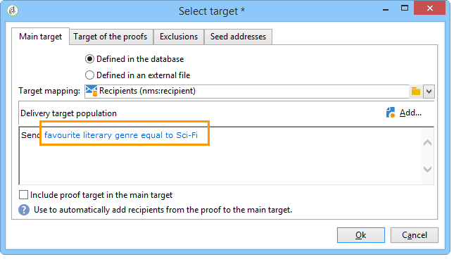

# 用例：配置字段替换{#use-case-configuring-the-field-substitution}

随机字段替换允许您将收件人列表中的某个值归因于用户在分发中使用此值时的种子地址为空(例如：名称、城市等)。

通过此替换，您可以在创建交付时节省时间：替代不是手动将所需值添加到种子地址，而是在由递送目标的收件人列表中随机恢复此值并将其应用于种子地址。

## 上下文 {#context}

在这种情况下，“我的在 **线图书馆** ”网站会根据客户喜爱的文学类型，给客户打折。

该快递经理将一个与喜爱的类型关联的个性化领域整合到他的电子邮件中。 他想用一些种子地址。 这些种子地址的表中包含个性化字段，但此处不保存任何值。

要使用随机字段替换，您必须具有：

* 具有一个或多个个性化字段的交付，
* 其数据架构 **根据交付中使用** 的个性化字段进行修改的种子地址。

## 创建分发 {#step-1---creating-a-delivery}

创建电子邮件分发部分详细介绍了创 [建分发的步骤](../../delivery/using/creating-an-email-delivery.md) 。

在此示例中，交付管理器已创建Newsletter。


## 编辑种子地址数据架构 {#editing-the-seed-addresses-data-schema}

有关如何修改数据架构的说明，请参见一节。

在此示例中，种子地址数据架构采用从收件人数据架构创建的值：

```
 <attribute label="Favorite literary genre" length="80" name="favoriteLiteraryGenre"
               type="string" userEnum="favoriteLiteraryGenre"/>
```

通过此枚举，用户可指定其客户喜爱的文学类型。

要使此数据架构修改可在种子地址输入表单 **中查看**，您必须更新它。 请参阅更 [新输入表单部分](../../delivery/using/use-case--selecting-seed-addresses-on-criteria.md#updating-the-input-form) 。

## 配置个性化 {#configuring-personalization}

1. 打开分发。

   在此示例中，交付具有两个个性化字段：收件人的名字 **和收件人最喜欢的** “文学 **类别”**。

   

1. 配置传送列表和种子地址。 请参阅 [识别目标人群](../../delivery/using/steps-defining-the-target-population.md)。

   在此示例中，用户选择其最喜爱的文 **学类型为** Sci-Fi的用户作为主要目标群体。

   

   用户向传送添加种子地址。

   

   >[!NOTE]
   >
   >有关链接的详细 **[!UICONTROL Edit the dynamic condition...]** 信息，请参阅使 [用案例：根据条件选择种子地址](../../delivery/using/use-case--selecting-seed-addresses-on-criteria.md)。

1. 单击选 **[!UICONTROL Preview]** 项卡，然后选择种子地址以测试个性化。

   

   您可以看到其中一个个性化字段为空。 由于种子地址没有此字段的数据，因此HTML内容预览无法显示值。

   场的随机替换在 **传送时执行**。

1. Click the **[!UICONTROL Send]** button.
1. 分析您的交付，然 **后确认交付**。

   种子地址会在其收件箱中接收分发。

   现场个性化非常有效。

   
