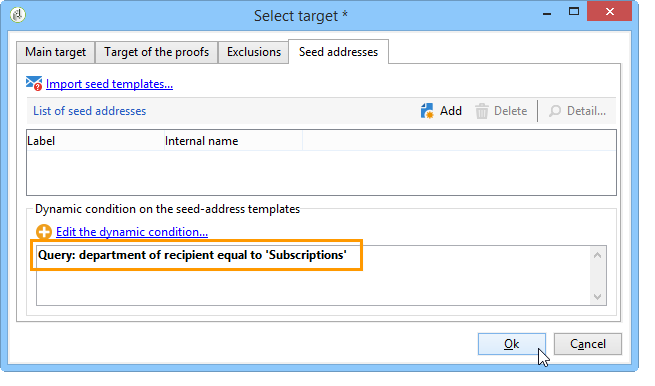

# 用例：配置字段替换{#use-case-configuring-the-field-substitution}

随机字段替换允许您将收件人列表中的值归因为用户在投放中使用此值时种子地址为空(例如：名称、城市等)。

通过此替换，您可以在创建投放时节省时间：替代不会手动将所需的值添加到种子地址，而是在投放所针对的收件人列表中随机恢复此值，并将其应用于种子地址。

## 上下文 {#context}

在此用例中，网站&#x200B;**我的在线图书馆**&#x200B;希望根据客户喜爱的文学类型向其客户发送折扣。

该投放经理已将一个与喜爱的类型关联的个性化领域集成到其电子邮件中。 他想用一些种子地址。 这些种子地址的表中包含个性化字段，但没有保存任何值。

要使用随机字段替换，您必须具有：

* 一个投放，一个个性化字段,
* 其&#x200B;**数据模式**&#x200B;的种子地址根据投放中使用的个性化字段进行修改。

## 创建投放{#step-1---creating-a-delivery}

创建投放的步骤详见[创建电子邮件投放](../../delivery/using/creating-an-email-delivery.md)一节。

在此示例中，投放管理器已创建Newsletter。


## 编辑种子地址模式{#editing-the-seed-addresses-data-schema}

有关如何修改数据模式的说明，请参见一节。

在此示例中，种子地址数据模式使用从收件人数据模式创建的值：

```
 <attribute label="Favorite literary genre" length="80" name="favoriteLiteraryGenre"
               type="string" userEnum="favoriteLiteraryGenre"/>
```

此明细列表允许用户指定客户最喜爱的文学类型。

要使此模式修改在种子地址&#x200B;**输入表单**&#x200B;中可查看，您必须更新它。 请参阅[更新输入表单](../../delivery/using/use-case--selecting-seed-addresses-on-criteria.md#updating-the-input-form)部分。

## 配置个性化{#configuring-personalization}

1. 打开投放。

   在此示例中，投放具有两个个性化字段:收件人的&#x200B;**名字**&#x200B;和收件人的&#x200B;**最喜爱的文学类型**。

   

1. 配置投放列表和种子地址。 请参阅[识别目标群体](../../delivery/using/steps-defining-the-target-population.md)。

   在本例中，用户选择其&#x200B;**最喜爱的文学流派**&#x200B;是Sci-Fi的用户作为主要目标群体。

   

   用户向种子地址添加投放。

   

   >[!NOTE]
   >
   >有关&#x200B;**[!UICONTROL Edit the dynamic condition...]**&#x200B;链接的详细信息，请参阅[用例：根据条件选择种子地址](../../delivery/using/use-case--selecting-seed-addresses-on-criteria.md)。

1. 单击&#x200B;**[!UICONTROL Preview]**&#x200B;选项卡，然后选择种子地址以测试个性化。

   

   您可以看到其中一个个性化字段是空的。 由于种子地址没有此字段的预览，因此HTML内容地址无法显示值。

   在投放&#x200B;**时执行域的随机替换。**

1. 单击 **[!UICONTROL Send]** 按钮。
1. 分析投放，然后&#x200B;**确认投放**。

   种子地址会在其收件箱中接收投放。

   现场个性化非常有效。

   
