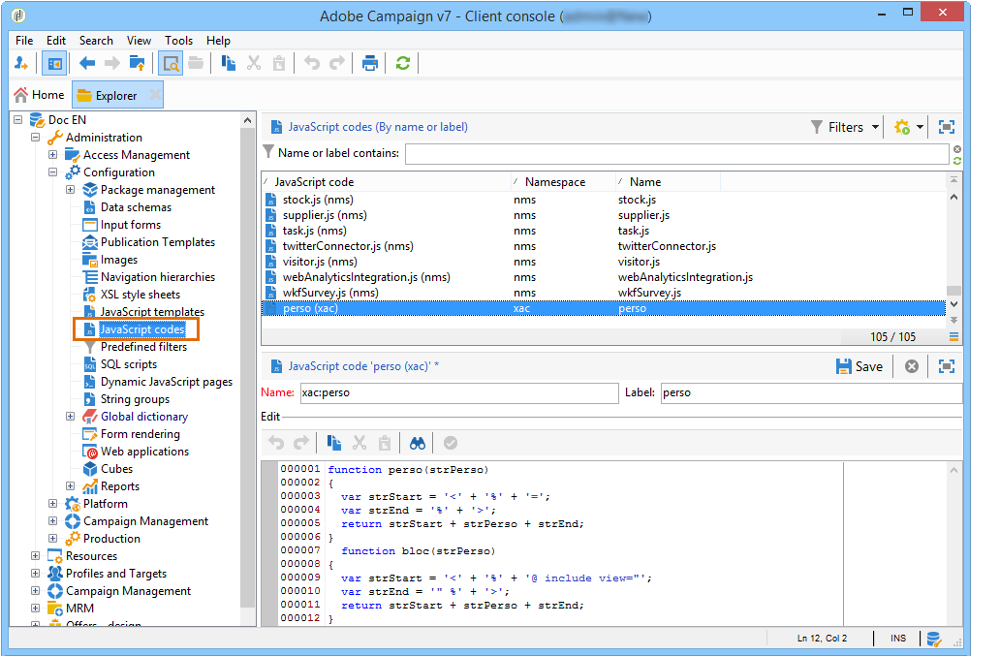

# 用例：创建内容管理{#use-case-creating-content-management}

要在Adobe Campaign中创建内容管理，必须执行以下步骤：

* [第1步——分析要生成的内容](#step-1---analyzing-the-content-to-be-produced),
* [第2步——创建数据架构](#step-2---creating-the-data-schema),
* [第3步——创建输入表单](#step-3---creating-the-input-form),
* [第4步——创建构建模板](#step-4---creating-the-construction-template),
* [第5步——创建发布模板](#step-5---creating-the-publication-template),
* [第6步——创建内容](#step-6---creating-contents)。

## 第1步——分析要生成的内容 {#step-1---analyzing-the-content-to-be-produced}

在开始之前，您需要对要生成的内容进行精确分析：确定要显示的元素，研究与这些元素链接的约束，为每个元素定义类型等。 您还需要区分静态元素和变量元素。

例如，要在HTML中创建包含以下类型内容的Newsletter:


此新闻稿包含三种类型的元素：

1. 变量元素，其内容由用户在交付创建过程中通过输入表单输入或选择。

   

1. 个性化字段，这些字段根据保存在数据库中的信息（本例中为收件人的名字和姓氏）动态输入。

   

1. 静态元素，对于所有新闻稿都是相同的。

   

此Newsletter的各种元素根据JavaScript模板中定义的规则组合在一起，该模板引用要插入的所有元素并概念化其布局。

这些元素是通过专用架构创建的，该架构为每个内容指定以下元素：名称、标签、类型、大小以及与Adobe Campaign中的处理相关的任何其他信息。

## 第2步——创建数据架构 {#step-2---creating-the-data-schema}

数据架构是与内容关联的XML文档。 它描述了此内容中数据的XML结构。

>[!NOTE]
>
>有关在Adobe Campaign中创建和配置数据架构的详细信息，请参阅 [此部分](../../configuration/using/about-schema-edition.md)。
>
>特定于内容管理的配置元素在数据架构中 [有详细说明](../../delivery/using/data-schemas.md)。

要创建数据架构，请应用以下步骤：

1. 打开Adobe Campaign资源管理器并选择该 **[!UICONTROL Administration > Configuration > Data schemas]** 节点。

   单击位 **[!UICONTROL New]** 于数据架构列表上方的图标。

1. 选择内容 **[!UICONTROL Create a schema]** 管理选项，然后单击 **[!UICONTROL Next]**。

   

1. 在相应的字段中输入架构的名称和标签。 您可以根据需要添加描述并链接特定图像。

   

   Click **[!UICONTROL Next]** to validate.

1. 在窗口中输入架构的内 **[!UICONTROL Edit schema]** 容。

   使用 **[!UICONTROL Insert]** 按钮可创建架构内容。

   

   For more on this, refer to [Editing schemas](../../delivery/using/data-schemas.md#editing-schemas).

   对于内容中引用的每个元素，您需要选择一个匹配的类型。

   在此示例中，标识的内容、其格式和类型为：

<table> 
 <thead> 
  <tr> 
   <th> <strong>内容</strong><br /> </th> 
   <th> <strong>格式</strong><br /> </th> 
   <th> <strong>类型</strong><br /> </th> 
   <th> <strong>标签</strong><br /> </th> 
  </tr> 
 </thead> 
 <tbody> 
  <tr> 
   <td> 标题<br /> </td> 
   <td> 属性<br /> </td> 
   <td> 字符串<br /> </td> 
   <td> 标题<br /> </td> 
  </tr> 
  <tr> 
   <td> 子标题<br /> </td> 
   <td> 属性<br /> </td> 
   <td> 字符串<br /> </td> 
   <td> 名称<br /> </td> 
  </tr> 
  <tr> 
   <td> 活动日期<br /> </td> 
   <td> 属性<br /> </td> 
   <td> 日期<br /> </td> 
   <td> 日期<br /> </td> 
  </tr> 
  <tr> 
   <td> 简介段落<br /> </td> 
   <td> 元素<br /> </td> 
   <td> HTML<br /> </td> 
   <td> 概述<br /> </td> 
  </tr> 
  <tr> 
   <td> 作者照片<br /> </td> 
   <td> 属性<br /> </td> 
   <td> 字符串<br /> </td> 
   <td> URL<br /> </td> 
  </tr> 
  <tr> 
   <td> 作者<br /> </td> 
   <td> 元素<br /> </td> 
   <td> 备忘录<br /> </td> 
   <td> 作者<br /> </td> 
  </tr> 
  <tr> 
   <td> 标题徽标（存储在Adobe Campaign公共资源中）<br /> </td> 
   <td> 属性<br /> </td> 
   <td> 链接<br /> </td> 
   <td> Image<br /> </td> 
  </tr> 
 </tbody> 
</table>

架构将包含以下信息：

```
<element label="Invitation" name="invitation" template="ncm:content" xmlChildren="true">
    <compute-string expr="@name"/>
    <attribute label="Title" length="40" name="title" type="string"/>
    <element label="Presentation" name="presentation" type="html"/>
    <attribute label="Date" name="date" type="date"/>
    <attribute label="Name" length="10" name="name" type="string"/>
    <attribute label="URL" name="url" type="string"/>
    <element label="Author" name="author" type="memo"/>
    <element label="Image" name="image" target="xtk:fileRes" type="link"/>
  </element>
```

1. 单击 **[!UICONTROL Save]** 以创建数据架构。

## 第3步——创建输入表单 {#step-3---creating-the-input-form}

通过输入表单，您可以通过Adobe Campaign客户端控制台中的输入界面编辑内容实例。

表单的描述是一个结构化XML文档，它遵守“xtk:form”表单架构的语法。

>[!NOTE]
>
>有关在Adobe Campaign中创建和配置表单的详细信息，请参阅 [此部分](../../configuration/using/identifying-a-form.md)。
>
>特定于内容管理的配置元素在输入表单中 [有详细说明](../../delivery/using/input-forms.md)。

要创建内容管理的输入表单，请应用以下步骤：

1. 打开Adobe Campaign资源管理器并选择该 **[!UICONTROL Administration > Configuration > Input forms]** 节点。

   单击表 **[!UICONTROL New]** 单列表上方的图标。

1. 输入表单的名称和链接到表单的标签，然后选择类 **[!UICONTROL Content management]** 型。

   

   >[!NOTE]
   >
   >要使两个元素能够自动匹配，建议使用与链接数据架构相同的名称。 使用输 **[!UICONTROL Insert]** 入区域上方的按钮可添加从链接到表单的架构中添加字段。

   

1. 在编辑器的中间部分，指定要在输入表单中显示的字段。

   在本例中，我们将提供以下类型的信息：

   ```
    <input xpath="@title"/>
     <input xpath="@date"/>
     <input xpath="presentation"/>
     <input xpath="@name"/>
     <input xpath="@url"/>
     <input xpath="author"/>
     <input img="nl:sryimage.png" newEntityFormChoice="true" xpath="image">
       <sysFilter>
         <condition expr="@isImage = true"/>
       </sysFilter>
     </input>
   ```

   在编 **[!UICONTROL Preview]** 辑表单时，您可以使用选项卡检查表单的呈现：

   

1. 单击 **[!UICONTROL Save]** 以创建输入表单。

## 第4步——创建构建模板 {#step-4---creating-the-construction-template}

使用XSLT语言，可将XML文档转换为其他输出文档。 此转换在称为样式表的文档中的XML中进行说明。

在此示例中，我们希望使用JavaScript模板来定义生成的文档中的数据构建和布局模式。

>[!NOTE]
>
>与文档构建（JavaScript或XSL模板）链接的约束在格式中有详细 [说明](../../delivery/using/formatting.md)。

要在Adobe Campaign中使用JavaScript模板，请应用以下步骤：

1. 打开Adobe Campaign资源管理器并选择该 **[!UICONTROL Administration > Configuration > JavaScript Templates]** 节点。

   单击模 **[!UICONTROL New]** 板列表上方的图标。

1. 输入模板名称，然后选择您为内容管理创建的架构。
1. 导入要在消息中显示的集合内容。

   添加变量元素，同时遵守 [JavaScript模板中详细介绍的语法](../../delivery/using/formatting.md#javascript-templates)。

   要显示示例中显示的内容，JavaScript模板必须包含以下元素：

   ```
   <html>
   <% eval(xtk.javascript.load("xac:perso").data); %>
   <head>
     <title>Invitation to an exceptional dedication session</title>
   </head>
   <body link="#0E59AE" vlink="#0E59AE" alink="#0E59AE" style="background-color:white;">
       <table width="546" border="0" align="center" cellpadding="0" cellspacing="0" style="border-left: solid 1px gray;border-top: solid 1px gray;border-right: solid 1px gray;">
         <tr>
           <td colspan="3">
             <%= generateImgTag(content.@["image-id"]) %>
           </td>
         </tr>
       </table>
       <table width="546" border="0" align="center" cellpadding="0" cellspacing="0" style="border-left: solid 1px gray;border-right: solid 1px gray;">
         <tr>
           <td>
             <table border="0" cellspacing="0" cellpadding="5">
               <tr>
                 <td width="10"> </td>
                 <td style="padding-top:2em; padding-bottom:2em;" width="730" align="middle">
                   <b>
                     <font style="font-family:Verdana, Arial, Helvetica, sans-serif; font-size:14px; color:#800080;">
                       <span style="FONT-VARIANT: small-caps"><%= content.@title %> - <%= content.@name %></span>
                     </font>
                   </b>
                 </td>
                 <td width="10"> </td>
               </tr>
               <tr>
                 <td width="10"> </td>
                 <td style="padding-top:1em; padding-bottom:1em;" width="730">
                   <font style="font-family:Verdana, Arial, Helvetica, sans-serif; font-size:11px; color:#666666;">
                     Hello <%= perso('recipient.firstName') %> <%= perso('recipient.lastName') %>,
                     <p>
                       <%= content.presentation %>
                     </p>               
                     <center>
                       <b><%= formatDate(content.@date, "%2D %Bl %4Y") %></b> come to our Book Fair and meet our favorite authors and illustrators.<br>
                       <br>
                       <a href="https://www.site.web.com/registration" target="_blank"><b>REGISTER</b></a>
                     </center>
                   </font>
                 </td>
                 <td width="10"> </td>
               </tr>
               <tr>
                 <td width="10"> </td>
                 <td style="padding-top:1em; padding-bottom:1em;" width="730">
                   <font style="font-family:Verdana, Arial, Helvetica, sans-serif; font-size:11px; color:#666666;">
                    " width="70" height="70">
                     <b><%= content.author %></b>, will be signing their book between 2
   and 5:30PM.
                   </font>
                 </td>
                 <td width="10"> </td>
               </tr>            
                   <tr>
                 <td width="10"> </td>
                 <td width="730">
                   <font style="font-family:Verdana, Arial, Helvetica, sans-serif; font-size:11px; color:#666666;">                  
                 </td>
                 <td width="10"> </td>
               </tr>           
               <tr>
                 <td width="10"> </td>
                 <td>
                   <font style="font-family:Verdana, Arial, Helvetica, sans-serif; font-size:11px; color:#666666;">
                     <center>
                       <p>
                         <a href="https://www.site.web.com/program" target="_blank"><span style="FONT-VARIANT: small-caps"><b>Program</b></span></a>
                          | 
                         <a href="https://www.site.web.com/information" target="_blank"><span style="FONT-VARIANT: small-caps"><b>Useful information</b></span></a>
                          | 
                       <a href="https://www.site.web.com/registration" target="_blank"><span style="FONT-VARIANT: small-caps"><b>Register</b></span></a></p>
                       </center>
                     </font>
                   </td>
                   <td width="10"> </td>
                 </tr>
               </table>
               <br>
             </td>
           </tr>
         </table>
   </body>
   </html>
   ```

   在模板开始时调用函数可让您设置对从Adobe Campaign数据库获取的个性化数据的调用(在本例中：recipient.firstName和recipient.lastName)，以便在分发中使用时对其进行解释。 有关详细信息，请参 [阅包括JavaScript模板](../../delivery/using/formatting.md#including-a-javascript-template)。

   在本例中，函数将包含以下代码：

   ```
   function perso(strPerso)
   {
     var strStart = '<' + '%' + '=';
     var strEnd = '%' + '>';
     return strStart + strPerso + strEnd;
   }
     function bloc(strPerso)
   {
     var strStart = '<' + '%' + '@ include view="';
     var strEnd = '" %' + '>';
     return strStart + strPerso + strEnd;
   }
   ```

   要使JavaScript模板有效，必须从树结构中的节点预先创建 **[!UICONTROL JavaScript codes]** 此函数，如下所示：

   

## 第5步——创建发布模板 {#step-5---creating-the-publication-template}

下一步包括创建内容发布模板以链接架构、表单和内容构建模板。 此发布模板可以有多种输出格式。

>[!NOTE]
>
>有关内容发布模板的详细信息，请参阅发 [布模板](../../delivery/using/publication-templates.md)。

在本例中，步骤如下：

1. 通过节点创建新的发布 **[!UICONTROL Administration > Configuration > Publication templates]** 模板。
1. 输入名称和标签，然后选择要使用的架构和表单。
1. 然后输入模板的名称并选择要应用的渲染模式。 这里，我们根据 **[!UICONTROL JavaScript]** 上面创建的模板提供类型渲染。

   

   >[!NOTE]
   >
   >默 **[!UICONTROL DOM interface]** 认情况下，选项处于选中状态，这意味着如果您使用E4X语法，将无法访问此文档。 选中此选项时必须使用DOM接口，并且是建议的语法。
   >
   >您仍可以使用E4X语法。 如果是，请确保取消选中此选项。

   使用该按 **[!UICONTROL Add]** 钮可创建其他变形模板。

1. 单击 **[!UICONTROL Save]** 以创建发布模板。

## 第6步——创建内容 {#step-6---creating-contents}

您现在可以基于此发布模板创建内容。

>[!NOTE]
>
>有关创建内容的详细信息，请参 [阅使用内容模板](../../delivery/using/using-a-content-template.md)。

### 在分发向导中创建内容 {#creating-content-in-the-delivery-wizard}

要直接在分发中创建内容，请应用以下步骤：

1. 首先，通过交付属性的选项卡 **[!UICONTROL Advanced]** 引用发布模板。

   

   为了通过内容管理表单定义内容，将向交付向导添加一个额外的选项卡。

1. 输入新闻稿的变量信息。

   

1. 单击选 **[!UICONTROL HTML preview]** 项卡以查看渲染。 您需要选择收件人来测试个性化。

   
