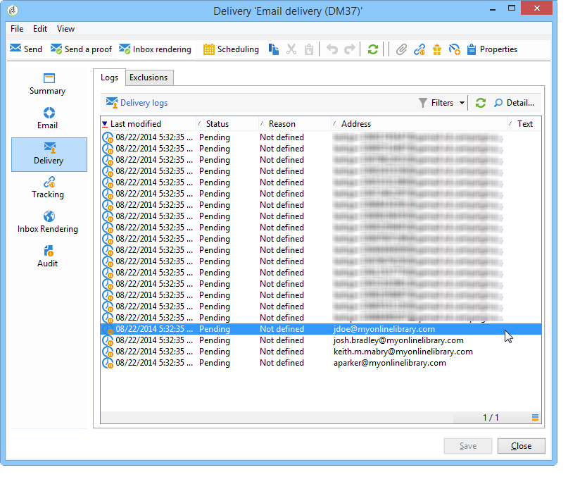

# 用例：根据条件选择种子地址{#use-case-selecting-seed-addresses-on-criteria}


在投放或营销策划的框架中， **[!UICONTROL Edit the dynamic condition...]** 链接允许您根据特定选择条件选择种子地址。

在此用例中，站点 **我的在线图书馆** 想根据客户的文学品味，将其通讯个性化。

负责投放的用户会与采购部门一起，为购买过警察小说的订阅者创建通讯。

为了与他们分享他们协作的最终结果，交付经理决定将他们从采购部门到交付部门的同事添加为种子地址。 使用动态条件可节省配置和更新地址的时间。

要使用动态条件，您必须具有：

* 准备发送的投放，
* 具有相同值的种子地址。 此值可以是Adobe Campaign中已存在的字段。 在本例中，种子地址共享“部门”字段中的“采购”值，默认情况下，该值不存在于应用程序中。

## 步骤1 — 创建投放 {#step-1---creating-a-delivery}

有关创建投放的详细步骤，请参见 [创建电子邮件投放](creating-an-email-delivery.md) 中。

在此示例中，投放管理器创建了新闻稿并选择了收件人。


## 步骤2 — 创建公用值 {#step-2---creating-a-common-value}

要创建与示例中的值（采购部门）类似的公用值，您必须先将 **数据模式** 并编辑关联的输入表单。

### 扩展数据模式 {#extending-the-data-schema}

有关模式扩展的更多详细信息，请参阅 [此部分](../../configuration/using/data-schemas.md).

1. 在 **[!UICONTROL Administration > Configuration > Data schemas]** 节点，单击 **[!UICONTROL New]** 图标。
1. 在 **[!UICONTROL Creation of a data schema]** 窗口，选择 **[!UICONTROL Extension of a schema]** 选项并单击 **[!UICONTROL Next]**.

   

1. 选择 **[!UICONTROL Seed addresses]** 源架构，输入 **doc** 作为 **[!UICONTROL Namespace]** 单击 **[!UICONTROL Ok]**.

   

1. 单击 **[!UICONTROL Save]**。
1. 在架构编辑窗口中，复制下面的行并将其粘贴到屏幕截图中指示的区域。

   ```
     <element name="common">
       <element label="Recipient" name="custom_nms_recipient">
         <attribute label="Department" length="80" name="workField" template="nms:recipient:recipient/@company"
                    type="string" userEnum="workField"/>
       </element>
     </element>
   ```

   

   然后，复制以下行并将其粘贴到 **[!UICONTROL Seed to insert in the export files]** 元素。

   ```
       <element aggregate="doc:seedMember:common">
     </element>
   ```

   

   在这种情况下，您将指定一个名为 **[!UICONTROL Department]** 已在种子地址表中创建，且基于标准 **[!UICONTROL @company]** 枚举模板（在名称下标记） **公司** )。

1. 单击 **[!UICONTROL Save]**。
1. 在 **[!UICONTROL Tools > Advanced]** 菜单，选择 **[!UICONTROL Update database structure]** 选项。

   

1. 显示更新向导后，单击 **[!UICONTROL Next]** 用于访问“编辑表”窗口的按钮：在种子地址数据模式中执行的更改需要结构更新。

   

1. 按照向导操作，直到您进入页面运行更新。 单击 **[!UICONTROL Start]** 按钮。

   

   更新完成后，您可以关闭向导。

1. 断开连接，然后重新连接到Adobe Campaign。 现在，对种子地址数据模式所做的更改已生效。 要使它们从种子地址屏幕中可见，您必须更新关联的 **[!UICONTROL Input form]**. 请参阅 [更新输入表单](#updating-the-input-form) 中。

#### 从链接的表扩展数据模式 {#extending-the-data-schema-from-a-linked-table}

种子地址数据模式可以使用来自链接到收件人数据模式 — 收件人(nms)的表的值。

例如，用户希望将 **[!UICONTROL Internet Extension]** 在 **[!UICONTROL Country]** 链接到收件人模式的表。


因此，必须扩展种子地址数据架构，如一节中所述。 但是，要在 **步骤4** 如下所示：

```
<element name="country">
      <attribute label="Internet Extension" length="2" name="iana" type="string"/>
      <attribute label="Country ISO" length="2" name="countryIsoA2" type="string"/>
    </element>
```


它们表示：

* 用户要创建名为 **[!UICONTROL Internet Extension]**,
* 这个元素来自 **[!UICONTROL Country]** 表。

>[!CAUTION]
>
>在链接的表名中，必须指定 **xpath-dst** 表格。
>
>这可在 **[!UICONTROL Country]** 元素。


然后，用户可以从 **步骤5** ，并更新 **[!UICONTROL Input form]** 种子地址。

请参阅 [更新输入表单](#updating-the-input-form) 中。

#### 更新输入表单 {#updating-the-input-form}

1. 在 **[!UICONTROL Administration > Configuration > Input forms]** 节点，查找种子地址输入表单。

   

1. 编辑表单，并在 **[!UICONTROL Recipient]** 容器。

   ```
   <input xpath="@workField"/>
   ```

   

1. 保存更改。
1. 打开种子地址。 的 **[!UICONTROL Department]** 字段 **[!UICONTROL Recipient]** 表。

   

1. 编辑要用于投放的种子地址，然后输入 **购买** 作为 **[!UICONTROL Department]** 字段。

## 第3步 — 定义条件 {#step-3---defining-the-condition}

您现在可以为投放指定种子地址的动态条件。 操作步骤：

1. 打开投放。

   

1. 单击 **[!UICONTROL To]** 链接，然后 **[!UICONTROL Seed addresses]** 选项卡 **[!UICONTROL Edit the dynamic condition...]** 链接。

   

1. 选择用于选择所需种子地址的表达式。 在此，用户将选择 **[!UICONTROL Department (@workField)]** 表达式。

   

1. 选择所需的值。 在本例中，用户选择 **购买** 值下拉列表中的部门。

   

   >[!NOTE]
   >
   >之前创建的架构扩展来自 **收件人** 架构。 上面屏幕上显示的值来自 **收件人** 架构。

1. 单击 **[!UICONTROL Ok]**。

   查询显示在 **[!UICONTROL Select target]** 窗口。

   

1. 单击 **[!UICONTROL Ok]** 以批准查询。
1. 分析投放，然后单击 **[!UICONTROL Delivery]** 选项卡访问投放日志。

   采购部门的种子地址显示为待交付，与收件人的种子地址或其他种子地址一样。

   

1. 单击 **[!UICONTROL Send]** 按钮以开始投放。

   购买部门的成员构成了种子地址的一部分，这些种子地址将在其电子邮件收件箱中接收投放内容。

   
