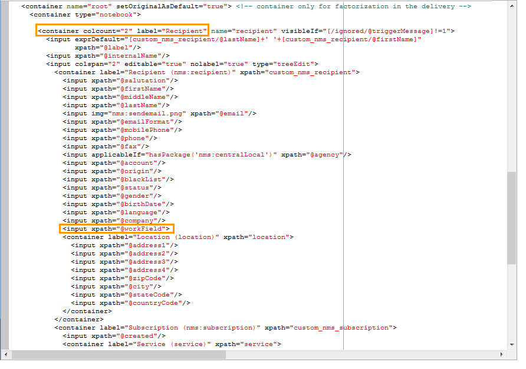

# 用例：根据条件选择种子地址{#use-case-selecting-seed-addresses-on-criteria}

在投放或营销策划的框架中，**[!UICONTROL Edit the dynamic condition...]**&#x200B;链接允许您根据特定选择标准选择种子地址。

在此用例中，网站&#x200B;**My online library**&#x200B;希望根据其客户的文学品味将其新闻稿个性化。

负责投放的用户会与采购部门一起，为购买过警察小说的订阅者创建通讯。

为了与他们分享他们协作的最终结果，送货经理决定将其从采购部门的同事添加到送货部门，作为种子地址。 使用动态条件可节省配置和更新地址的时间。

要使用动态条件，您必须具有：

* 准备发送的投放，
* 具有相同值的种子地址。 此值可以是Adobe Campaign中已存在的字段。 在本例中，种子地址共享“部门”字段中的“采购”值，默认情况下，该值不存在于应用程序中。

## 步骤1 — 创建投放 {#step-1---creating-a-delivery}

有关创建投放的详细步骤，请参见[创建电子邮件投放](creating-an-email-delivery.md)一节。

在此示例中，投放管理器创建了新闻稿并选择了收件人。


## 步骤2 — 创建公共值 {#step-2---creating-a-common-value}

要创建与示例（采购部门）中相同的公用值，您必须首先扩展种子地址的&#x200B;**数据架构**&#x200B;并编辑关联的输入表单。

### 扩展数据模式 {#extending-the-data-schema}

有关模式扩展的更多详细信息，请参阅[配置指南](../../configuration/using/data-schemas.md)。

1. 在&#x200B;**[!UICONTROL Administration > Configuration > Data schemas]**&#x200B;节点中，单击&#x200B;**[!UICONTROL New]**&#x200B;图标。
1. 在&#x200B;**[!UICONTROL Creation of a data schema]**&#x200B;窗口中，选择&#x200B;**[!UICONTROL Extension of a schema]**&#x200B;选项，然后单击&#x200B;**[!UICONTROL Next]**。

   

1. 选择&#x200B;**[!UICONTROL Seed addresses]**&#x200B;源架构，输入&#x200B;**doc**&#x200B;作为&#x200B;**[!UICONTROL Namespace]**，然后单击&#x200B;**[!UICONTROL Ok]**。

   

1. 单击 **[!UICONTROL Save]**。
1. 在架构编辑窗口中，复制下面的行并将其粘贴到屏幕截图中指示的区域。

   ```
     <element name="common">
       <element label="Recipient" name="custom_nms_recipient">
         <attribute label="Department" length="80" name="workField" template="nms:recipient:recipient/@company"
                    type="string" userEnum="workField"/>
       </element>
     </element>
   ```

   

   然后，复制以下行并将它们粘贴到&#x200B;**[!UICONTROL Seed to insert in the export files]**&#x200B;元素下。

   ```
       <element aggregate="doc:seedMember:common">
     </element>
   ```

   

   在这种情况下，您将指定在种子地址表中创建名为&#x200B;**[!UICONTROL Department]**&#x200B;的新枚举，该枚举基于标准的&#x200B;**[!UICONTROL @company]**&#x200B;枚举模板（在种子地址表单的名称&#x200B;**Company**&#x200B;下标记）。

1. 单击 **[!UICONTROL Save]**。
1. 在&#x200B;**[!UICONTROL Tools > Advanced]**&#x200B;菜单中，选择&#x200B;**[!UICONTROL Update database structure]**&#x200B;选项。

   

1. 显示更新向导时，单击&#x200B;**[!UICONTROL Next]**&#x200B;按钮以访问“编辑表”窗口：在种子地址数据模式中执行的更改需要结构更新。

   

1. 按照向导操作，直到您进入页面运行更新。 单击 **[!UICONTROL Start]** 按钮。

   

   更新完成后，您可以关闭向导。

1. 断开连接，然后重新连接到Adobe Campaign。 现在，对种子地址数据模式所做的更改已生效。 为了从种子地址屏幕中显示它们，必须更新关联的&#x200B;**[!UICONTROL Input form]**。 请参阅[更新输入表单](#updating-the-input-form)一节。

#### 从链接的表扩展数据模式 {#extending-the-data-schema-from-a-linked-table}

种子地址数据模式可以使用来自链接到收件人数据模式 — 收件人(nms)的表的值。

例如，用户希望集成&#x200B;**[!UICONTROL Country]**&#x200B;表中的&#x200B;**[!UICONTROL Internet Extension]**，该表链接到收件人架构。


因此，必须扩展种子地址数据架构，如一节中所述。 但是，要在&#x200B;**步骤4**&#x200B;集成的代码行如下：

```
<element name="country">
      <attribute label="Internet Extension" length="2" name="iana" type="string"/>
      <attribute label="Country ISO" length="2" name="countryIsoA2" type="string"/>
    </element>
```


它们表示：

* 用户要创建名为&#x200B;**[!UICONTROL Internet Extension]**&#x200B;的新元素时，
* 此元素来自&#x200B;**[!UICONTROL Country]**&#x200B;表。

>[!CAUTION]
>
>在链接的表名称中，必须指定该链接表的&#x200B;**xpath-dst**。
>
>这可在收件人表的&#x200B;**[!UICONTROL Country]**&#x200B;元素中找到。


然后，用户可以按照部分的&#x200B;**步骤5**&#x200B;操作，并更新种子地址的&#x200B;**[!UICONTROL Input form]**。

请参阅[更新输入表单](#updating-the-input-form)一节。

#### 更新输入表单 {#updating-the-input-form}

1. 在&#x200B;**[!UICONTROL Administration > Configuration > Input forms]**&#x200B;节点中，找到输入表单中的种子地址。

   

1. 编辑表单，并在&#x200B;**[!UICONTROL Recipient]**&#x200B;容器中插入以下行。

   ```
   <input xpath="@workField"/>
   ```

   

1. 保存更改。
1. 打开种子地址。 **[!UICONTROL Department]**&#x200B;字段显示在&#x200B;**[!UICONTROL Recipient]**&#x200B;表中。

   

1. 编辑要用于交货的种子地址，并输入&#x200B;**Purchasing**&#x200B;作为&#x200B;**[!UICONTROL Department]**&#x200B;字段中的值。

## 步骤3 — 定义条件 {#step-3---defining-the-condition}

您现在可以为投放指定种子地址的动态条件。 操作步骤：

1. 打开投放。

   

1. 单击&#x200B;**[!UICONTROL To]**&#x200B;链接，然后单击&#x200B;**[!UICONTROL Seed addresses]**&#x200B;选项卡以访问&#x200B;**[!UICONTROL Edit the dynamic condition...]**&#x200B;链接。

   

1. 选择用于选择所需种子地址的表达式。 此处，用户选择&#x200B;**[!UICONTROL Department (@workField)]**&#x200B;表达式。

   

1. 选择所需的值。 在此示例中，用户从值下拉列表中选择&#x200B;**Purchasing**&#x200B;部门。

   

   >[!NOTE]
   >
   >之前创建的架构扩展来自&#x200B;**recipient**&#x200B;架构。 上面屏幕上显示的值来自&#x200B;**recipient**&#x200B;架构的枚举。

1. 单击 **[!UICONTROL Ok]**。

   查询显示在&#x200B;**[!UICONTROL Select target]**&#x200B;窗口中。

   

1. 单击&#x200B;**[!UICONTROL Ok]**&#x200B;以批准查询。
1. 分析投放，然后单击&#x200B;**[!UICONTROL Delivery]**&#x200B;选项卡以访问投放日志。

   采购部门的种子地址显示为待交付，与收件人的种子地址或其他种子地址一样。

   

1. 单击&#x200B;**[!UICONTROL Send]**&#x200B;按钮以开始投放。

   购买部门的成员构成了种子地址的一部分，这些种子地址将在其电子邮件收件箱中接收投放内容。

   
