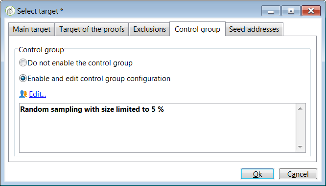

# 使用模板 {#use-templates}

通过为最常见的活动类型提供现成的方案，交付模板可以提高效率。 借助模板，营销人员可以在更短的时间内部署具有最小自定义的新营销活动。

要了解有关投放模板的更多信息，请参阅 [本节](creating-a-delivery-template.md).

## 投放模板入门 {#gs-templates}

A [投放模板](creating-a-delivery-template.md) 使您可定义一组以后可重复使用且符合您需求的技术和功能属性。 然后，您可以节省时间并在需要时标准化交付。

在Adobe Campaign中管理多个品牌时，Adobe建议每个品牌具有一个子域。 例如，银行可以具有与其每个区域机构对应的多个子域。 如果银行拥有bluebank.com域，则其子域可以是@ny.bluebank.com、@ma.bluebank.com、@ca.bluebank.com等。 每个子域拥有一个投放模板，让您能够始终为每个品牌使用正确的预配置参数，从而避免错误并节省您的时间。

**提示**：为了避免配置错误，我们建议您复制本机模板并更改其属性，而不是创建新模板。

## 配置地址

* 必须提供发件人地址，才能发送电子邮件。

* 有些ISP（Internet服务提供商）在接受消息之前会检查发件人地址的有效性。

* 格式错误的地址可能导致接收服务器拒绝该地址。 您必须确保提供了正确的地址。

* 地址必须明确识别发件人。 域必须归发件人所有并向其注册。

* Adobe建议创建对应于为投放和回复指定的地址的电子邮件帐户。 请与您的邮件系统管理员联系。

要在Campaign界面中配置地址，请执行以下步骤：

1. 在 [投放模板](creating-a-delivery-template.md)，单击 **[!UICONTROL From]** 链接。 在 **[!UICONTROL Email header parameters]** 窗口中，填写以下字段：

   

1. 在 **[!UICONTROL Sender address]** 字段中，确保地址域与您委派给Adobe的子域相同。 您可以更改“@”之前的部分，但不能更改域地址。

1. 在 **[!UICONTROL From]** 字段中，使用易于收件人识别的名称（如您的品牌名称）来增加投放的开头率。 要进一步改善收件人的体验，您可以添加人员的姓名，例如“Emma from Megastore”。

1. 在 **[!UICONTROL Reply address text]** 字段中，默认情况下使用发件人地址进行回复。 但是，Adobe建议使用现有的真实地址，例如您品牌的客户关怀地址。 在这种情况下，如果收件人发送回复，客户关怀团队将能够处理。

### 设置对照组

发送投放后，您可以将排除的收件人的行为与接收投放的收件人的行为进行比较。 然后，您可以衡量营销活动的效率。 了解有关控制组的更多信息 [本节](../../campaign/using/marketing-campaign-deliveries.md#defining-a-control-group).

要设置控制组，请单击 **[!UICONTROL To]** 链接。 在 **[!UICONTROL Select target]** 窗口中，选择 **[!UICONTROL Control group]** 选项卡。 您可以提取目标的一部分，例如5%随机抽样。

## 使用类型应用过滤器或控制规则

分类包含在发送任何消息之前，在分析阶段应用的检查规则。

在 **[!UICONTROL Typology]** 选项卡中，根据需要更改默认的分类。

例如，为了更好地控制出站流量，您可以通过定义每个子域的一个关联并为每个关联创建一个类型来定义可以使用的IP地址。 相关性在实例的配置文件中定义。 联系Adobe Campaign管理员。

有关分类的详细信息，请参阅 [本节](../../campaign-opt/using/about-campaign-typologies.md).
