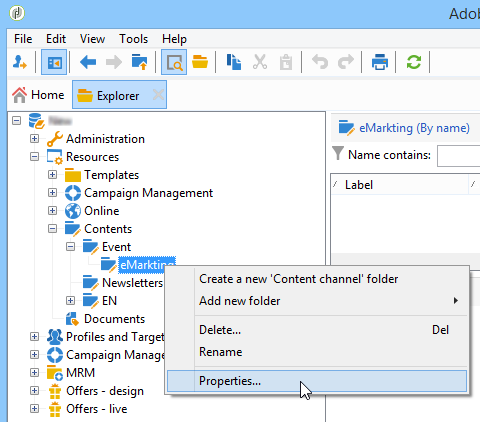
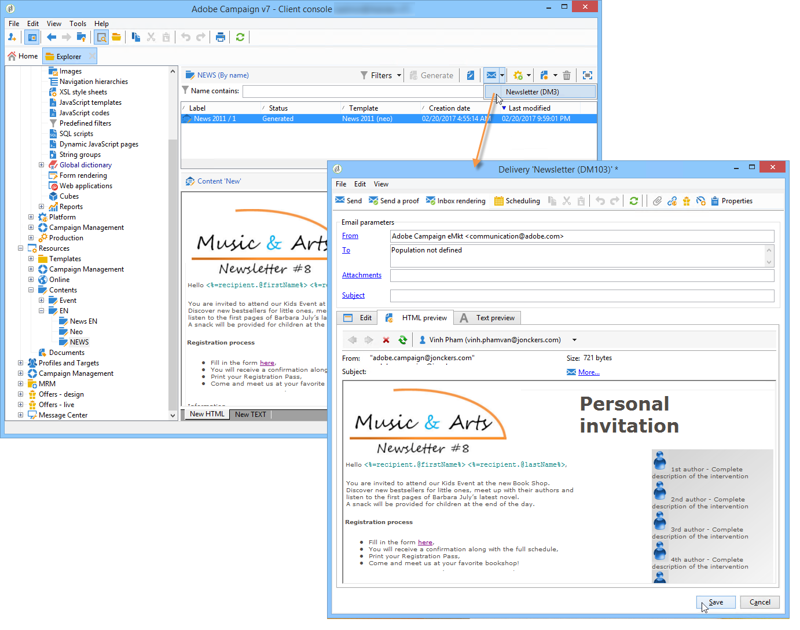

# 使用内容模板{#using-a-content-template}

## 关于内容模板 {#about-content-templates}

可以直接在投放中引用和使用内容模板。 请参阅 [通过内容管理创建投放](#creating-a-delivery-via-content-management)

它们还可用于创建内容实例。 创建实例后，即可交付这些实例(请参阅 [交付内容实例](#delivering-a-content-instance))或导出(请参阅 [创建内容实例](#creating-a-content-instance))。

## 通过内容管理创建投放 {#creating-a-delivery-via-content-management}

考虑到使用输入字段输入内容，您可以在投放中引用内容模板。 在投放向导中添加了一个附加选项卡，用于定义投放内容。

将根据所选设置自动应用布局。 要查看它，请单击 **[!UICONTROL HTML preview]** (或 **[!UICONTROL Text preview]** )，并选择一个收件人以测试个性化元素。

有关更多信息，请参阅完整实施示例： [在投放向导中创建内容](use-case-creating-content-management.md#creating-content-in-the-delivery-wizard).

## 创建内容实例 {#creating-a-content-instance}

您可以直接在Adobe Campaign树中创建内容，以在工作流中使用，或者直接导出或插入新投放中。

应用以下步骤：

1. 选择 **[!UICONTROL Resources > Contents]** 节点，右键单击并选择 **[!UICONTROL Properties]**.

   

1. 选择将在此文件夹中处于活动状态的发布模板。

   

1. 您现在可以使用来创建新内容 **[!UICONTROL New]** 按钮进行标记。

   

1. 在表单中输入字段。

   

1. 然后单击 **[!UICONTROL HTML preview]** 选项卡以查看渲染。 此处，不输入从数据库获取的个性化字段。

   

1. 创建后，该内容即添加到可用内容列表中。 单击 **[!UICONTROL Properties]** 用于更改其标签、状态或查看其历史记录的链接。

   

1. 如有必要，在内容获得批准后，可以使用工具栏上的相应按钮生成内容。

   

   >[!NOTE]
   >
   >您可以授权生成未批准的内容。 为此，请更改发布模板中的相关选项。 有关详细信息，请参见 [创建和配置模板](publication-templates.md#creating-and-configuring-the-template).

   默认情况下，HTML和文本内容会在 **发布** Adobe Campaign实例的文件夹。 您可以更改发布文件夹，这要归功于 **NcmPublishingDir** 选项。

## 交付内容实例 {#delivering-a-content-instance}

要创建并投放内容实例，投放模板需要链接到用于生成此内容的发布模板。 有关详细信息，请参见 [投放](publication-templates.md#delivery).

此外，内容存储文件夹必须专用于从此发布模板中获取的内容（当内容文件夹允许您生成多种类型的内容时，无法自动创建投放）。

要根据所选内容自动创建投放，请单击 **[!UICONTROL Delivery]** 图标并选择模板。

文本和HTML内容会自动输入。
