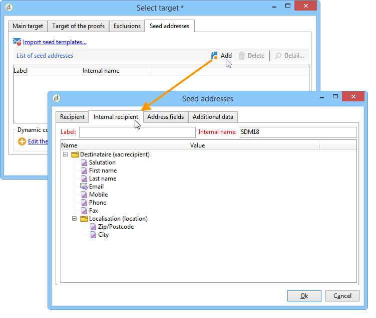

# 使用外部收件人表{#using-an-external-recipient-table}

如果投放表是外部表，则需要执行其他配置。 必须扩展&#x200B;**[!UICONTROL nms:seedmember]**&#x200B;架构。 向种子地址添加制表符以定义适当的字段，如下所示：

在这种情况下，要将种子地址添加到投放，请直接在匹配选项卡中输入适当的字段，或导入地址模板：

**nms:seedMember**&#x200B;架构扩展为[此节](../../configuration/using/seed-addresses.md)。
