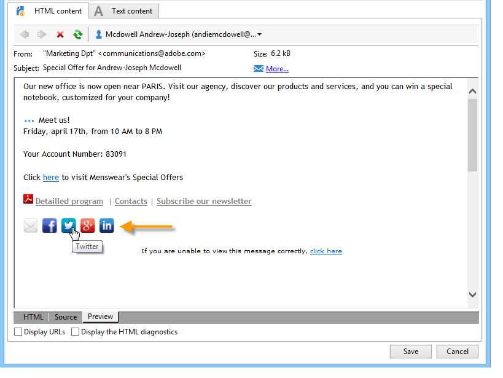

# 病毒式营销和社交媒体营销{#viral-and-social-marketing}

Adobe Campaign允许您设置工具来鼓励病毒式营销。

这样，投放收件人或网站访客就可以与其网络共享信息：从添加指向其Facebook或X(以前称为Twitter)配置文件的链接到向朋友发送消息。

>[!CAUTION]
>
>为了使添加的链接正常工作，必须提供匹配的镜像页面。 为此，请在投放中包含指向镜像页面的链接。

## 社交网络：共享链接 {#social-networks--sharing-a-link}

要使投放收件人能够与其网络成员共享消息内容，您需要包含匹配的个性化块。

>[!NOTE]
>
>默认情况下，块列表中不提供此链接。 您可以通过单击&#x200B;**[!UICONTROL Other...]**&#x200B;并选择&#x200B;**[!UICONTROL Social network sharing links]**&#x200B;块来访问它。

渲染方式如下：

当收件人单击显示的其中一个社交网络的图标时，他们会被自动重定向到其帐户，并且可以通过链接共享消息内容。 这允许其网络成员访问通信。

>[!NOTE]
>
>此个性化块包含所有链接（用于消息发送和与所有社交网络共享）。 您可以根据自己的需求对其进行更改。 但是，配置是为高级用户保留的。 要编辑匹配的个性化块，请转到Adobe Campaign树的&#x200B;**[!UICONTROL Resources > Campaign management > Personalization blocks]**&#x200B;节点。

## 病毒式营销：转发给朋友 {#viral-marketing--forward-to-a-friend}

病毒式服务允许执行转介类型的操作：这些操作允许您向朋友转发消息。 被推荐人的简档临时存储在数据库中（在专用表中）。 转发的消息包括一个供被推荐人订阅的链接：如果是，将被添加到Adobe Campaign数据库。

消息转发基于与社交网络链接相同的原则。

应用以下阶段：

1. 将&#x200B;**[!UICONTROL Social network sharing links]**&#x200B;个性化块添加到原始邮件的正文中。
1. 邮件收件人可以单击&#x200B;**[!UICONTROL Email]**&#x200B;图标将此邮件发送给一个或多个好友。

   

   通过推荐表单，您可以输入推荐人的电子邮件地址。

   

   当主收件人单击&#x200B;**[!UICONTROL Next]**&#x200B;按钮时，会将消息发送给他们。

   >[!NOTE]
   >
   >此消息的内容可以根据您的需求进行个性化。 它是基于&#x200B;**[!UICONTROL Transfer of original message]**&#x200B;模板创建的，该模板存储在&#x200B;**[!UICONTROL Administration > Campaign management > Technical delivery templates]**&#x200B;节点中。
   >
   >还可以更改可供反向链接使用的邮件转发表单。为此，您需要更改存储在&#x200B;**[!UICONTROL Resources > Online > Web applications]**&#x200B;节点中的&#x200B;**病毒表单** Web应用程序。

1. 在转发的消息中，引用方可通过链接将其用户档案保存在数据库中。 为此提供了输入表单。

   

   >[!NOTE]
   >
   >该配置是可调整的。 为此，您需要修改存储在&#x200B;**[!UICONTROL Resources > Online > Web applications]**&#x200B;节点中的&#x200B;**收件人订阅** Web应用程序。
   >
   >有关Web应用程序的详细信息，请参阅[此部分](../../web/using/about-web-applications.md)。

   验证后，将向他们发送确认消息：只有在他们激活确认消息中的链接后，才会永久注册他们。 此消息基于&#x200B;**[!UICONTROL Registration confirmation]**&#x200B;模板创建，该模板存储在&#x200B;**[!UICONTROL Administration > Campaign management > Technical delivery templates]**&#x200B;节点中。

   被推荐人已添加到数据库的&#x200B;**Recipients**&#x200B;文件夹，并（默认情况下）订阅了&#x200B;**新闻稿**&#x200B;信息服务。

## 跟踪社交网络共享 {#tracking-social-network-sharing}

共享信息的共享和访问将受到跟踪。 Adobe Campaign收集的这些信息可在以下两个位置访问：

* 在投放的&#x200B;**[!UICONTROL Tracking]**&#x200B;选项卡中（或分别针对每个收件人）：

  

* 在专用&#x200B;**[!UICONTROL Sharing to social networks]**&#x200B;报告中：

  
