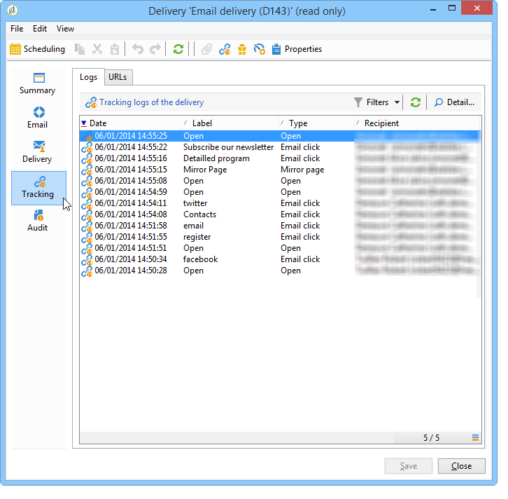

# 病毒式和社交媒体营销{#viral-and-social-marketing}

## 关于病毒式营销{#about-viral-marketing}

Adobe Campaign可让您设置各种工具来鼓励病毒式营销。

这样，投放收件人或网站访客可以与其网络共享信息：从添加指向其Facebook或Twitter用户档案的链接到向朋友发送消息。

>[!CAUTION]
>
>要使添加的链接正常工作，必须提供匹配镜像页面。 为此，请在投放中包含指向镜像页面的链接。

## 社交网络：共享链接{#social-networks--sharing-a-link}

要使投放收件人能够与其网络成员共享消息内容，您需要包含匹配的个性化块。

>[!NOTE]
>
>默认情况下，此链接在块列表中不提供。 单击&#x200B;**[!UICONTROL Other...]**&#x200B;并选择&#x200B;**[!UICONTROL Social network sharing links]**&#x200B;块即可访问它。

渲染将如下所示：

当收件人单击显示的某个社交网络的图标时，他们会自动重定向到其帐户，并可以通过链接共享消息内容。 这允许其网络成员访问通信。

>[!NOTE]
>
>此个性化块包含所有链接（用于与所有社交网络发送和共享消息）。 可以根据您的需要更改。 但是，配置是为高级用户保留的。 要编辑匹配的个性化块，请转到Adobe Campaign树的&#x200B;**[!UICONTROL Resources > Campaign management > Personalization blocks]**&#x200B;节点。

## 病毒式营销：转发给朋友{#viral-marketing--forward-to-a-friend}

传播服务允许执行引用类型操作：通过这些操作，您可以将消息转发给朋友。 被推荐人的用户档案临时存储在数据库中（在专用表中）。 转发的消息包括被推荐人订阅的链接：如果他们这样做，他们将添加到Adobe Campaign数据库。

消息转发与社交网络链路相同。

应用以下阶段：

1. 将&#x200B;**[!UICONTROL Social network sharing links]**&#x200B;个性化块添加到原始消息的正文中。
1. 消息收件人可以单击&#x200B;**[!UICONTROL Email]**&#x200B;图标将此消息发送给一个或多个朋友。

   

   通过引用表单，您可以输入被推荐人的电子邮件地址。

   

   当主收件人单击&#x200B;**[!UICONTROL Next]**&#x200B;按钮时，将向他们发送消息。

   >[!NOTE]
   >
   >可以个性化此消息的内容以满足您的需求。 它基于存储在&#x200B;**[!UICONTROL Administration > Campaign management > Technical delivery templates]**&#x200B;节点中的&#x200B;**[!UICONTROL Transfer of original message]**&#x200B;模板创建。
   >
   >还可以更改向推荐人提供的消息转发表单。要执行此操作，您需要更改存储在&#x200B;**[!UICONTROL Resources > Online > Web applications]**&#x200B;节点中的&#x200B;**病毒表单** Web 应用程序。

1. 在转发的消息中，链接允许被推荐人将其用户档案保存在数据库中。 为此提供了登入表单。

   

   >[!NOTE]
   >
   >这种结构可以调整。 为此，您需要修改存储在&#x200B;**[!UICONTROL Resources > Online > Web applications]**&#x200B;节点中的&#x200B;**收件人订阅** Web 应用程序。
   >
   >有关Web 应用程序的详细信息，请参阅[本节](../../web/using/about-web-applications.md)。

   验证后，会向他们发送确认消息：只有在用户激活确认消息中的链接后，才会永久注册。 此消息基于&#x200B;**[!UICONTROL Registration confirmation]**&#x200B;模板创建，该模板存储在&#x200B;**[!UICONTROL Administration > Campaign management > Technical delivery templates]**&#x200B;节点中。

   该被推荐人将添加到收件人库的&#x200B;****&#x200B;文件夹，并（默认）订阅&#x200B;**新闻稿**&#x200B;信息服务。

## 跟踪社交网络共享{#tracking-social-network-sharing}

跟踪共享和访问共享信息。 Adobe Campaign收集的此信息可在以下两个位置访问：

* 在投放的&#x200B;**[!UICONTROL Tracking]**&#x200B;选项卡中(或针对每个收件人单独设置):

   

* 在专用&#x200B;**[!UICONTROL Sharing to social networks]**&#x200B;报告中：

   

