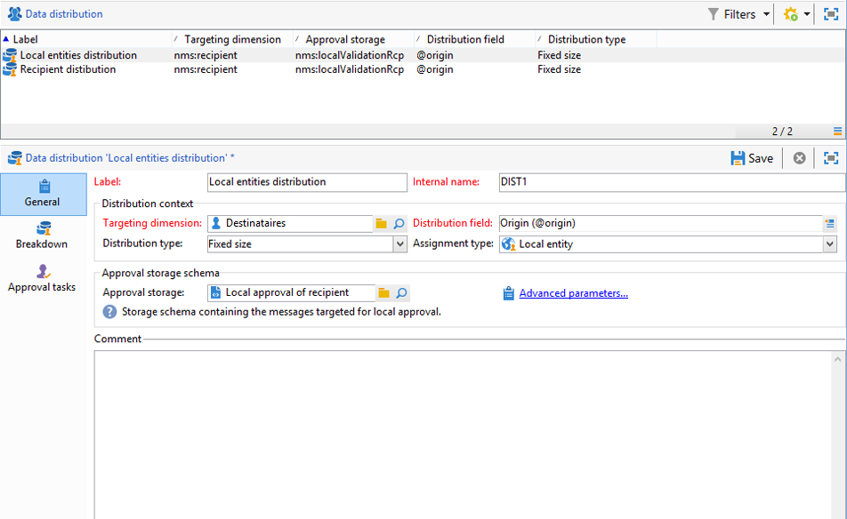
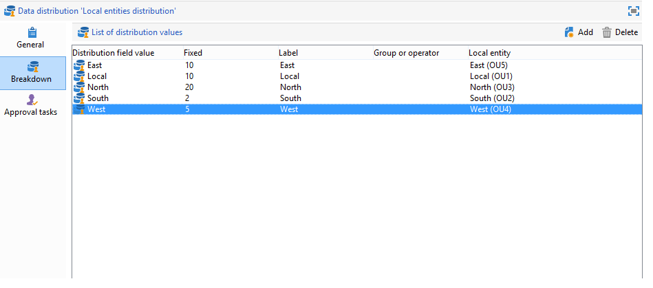
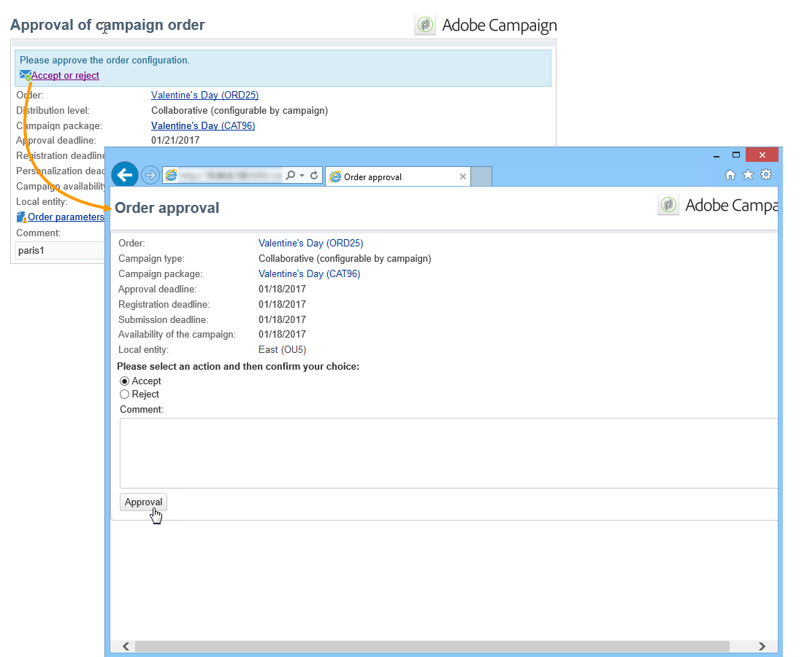

# 创建协作活动{#creating-a-collaborative-campaign-intro}

中央实体从&#x200B;**分布式营销**&#x200B;营销活动模板创建协作营销活动。 请参见[此页面](about-distributed-marketing.md#collaborative-campaign)。

## 创建协作活动 {#creating-a-collaborative-campaign}

要配置协作营销活动，请单击&#x200B;**[!UICONTROL Campaign management > Campaigns]**&#x200B;节点，然后单击&#x200B;**[!UICONTROL New]**&#x200B;图标。

>[!NOTE]
>
>除了&#x200B;**[!UICONTROL collaborative campaigns (by campaign)]**&#x200B;之外，还可以通过Web界面配置和执行这些营销活动。

协作促销活动数据库的配置过程与本地促销活动模板的配置过程类似。 下面详细描述了不同类型的协作活动的规格。

### 按表单 {#by-form}

要创建协作型营销活动（按表单），必须选择&#x200B;**[!UICONTROL Collaborative campaign (by form)]**&#x200B;模板。

在&#x200B;**[!UICONTROL Edit]**&#x200B;选项卡中，单击&#x200B;**[!UICONTROL Advanced campaign settings...]**&#x200B;链接以访问&#x200B;**分布式营销**&#x200B;选项卡。

选择&#x200B;**按表单** Web界面。 利用此类界面，可创建个性化字段，供本地实体在订购营销活动时使用。 请参阅[创建本地营销活动（按表单）](examples.md#creating-a-local-campaign--by-form-)。

保存营销活动。 现在，您可以通过单击&#x200B;**[!UICONTROL Create]**&#x200B;按钮，从&#x200B;**Campaign**&#x200B;选项卡的&#x200B;**Campaign包**&#x200B;视图中使用它。

**[!UICONTROL Campaign Package]**&#x200B;视图允许您使用本地营销活动模板（现成或重复），以及参考营销活动以进行协作营销活动，目的是为不同的组织实体创建营销活动。

### 按营销活动 {#by-campaign}

要创建协作型营销活动（按营销活动），必须选择&#x200B;**[!UICONTROL Collaborative campaign (by campaign) (opCollaborativeByCampaign)]**&#x200B;模板。

对营销活动进行排序时，本地实体可以完成由中央实体预定义的标准，并在对营销活动进行排序之前对其进行评估。

当&#x200B;**协作促销活动（按促销活动）**&#x200B;的订单获得中央实体的批准后，将为本地实体创建子促销活动。 当本地实体可供使用后，即可修改：

* 营销活动工作流，
* 分类规则，
* 和个性化字段。

本地实体执行子营销活动。 中央实体执行父营销活动。

中央实体可从此功能板（通过&#x200B;**[!UICONTROL List of associated campaigns]**&#x200B;链接）查看与&#x200B;**协作式营销活动（按营销活动）**&#x200B;链接的所有子营销活动。

### 按目标批准 {#by-target-approval}

要创建协作型营销活动（通过目标批准），必须选择&#x200B;**[!UICONTROL Collaborative campaign (by target approval)]**&#x200B;模板。

>[!NOTE]
>
>在此模式下，中央实体不需要指定本地实体。

营销活动工作流必须集成&#x200B;**本地批准**&#x200B;类型活动。 活动参数如下所示：

* **[!UICONTROL Action to perform]** :Target批准通知。
* **[!UICONTROL Distribution context]** :明确。
* **[!UICONTROL Data distribution]** :本地实体分发。

**必须创** 建本地实体分发类型数据分发。利用数据分发模板，可限制分组值列表中的记录数。 在&#x200B;**[!UICONTROL Resources > Campaign management > Data distribution]**&#x200B;中，单击&#x200B;**[!UICONTROL New]**&#x200B;图标以创建新的&#x200B;**[!UICONTROL Data distribution]**。 有关数据分发的更多信息，请参阅[工作流](../../workflow/using/using-the-local-approval-activity.md#step-1--creating-the-data-distribution-template-)指南。

选择&#x200B;**定向维度**&#x200B;和&#x200B;**[!UICONTROL Distribution field]**。 对于&#x200B;**[!UICONTROL Assignment type]**，选择&#x200B;**本地实体**。

在&#x200B;**[!UICONTROL Distribution]**&#x200B;选项卡中，为每个本地实体添加一个字段并指定值。

您可以在&#x200B;**Delivery**&#x200B;类型活动之后添加第二个&#x200B;**Target approval**，以配置该活动的报表。

在促销活动创建通知消息中，本地实体接收由中央实体参数预定义的联系人列表。

本地实体可以根据促销活动内容删除某些联系人。

### 简单 {#simple}

要创建简单的协作营销活动，必须选择&#x200B;**[!UICONTROL Collaborative campaign (simple)]**&#x200B;模板。

## 创建协作活动包 {#creating-a-collaborative-campaign-package}

要使营销活动可供本地实体使用，中央实体必须创建营销活动包。

应用以下步骤：

1. 在&#x200B;**营销活动**&#x200B;页面的&#x200B;**[!UICONTROL Navigation]**&#x200B;部分，单击&#x200B;**[!UICONTROL Campaign packages]**&#x200B;链接。
1. 单击 **[!UICONTROL Create]** 按钮。
1. 利用窗口顶部的部分，可选择&#x200B;**[!UICONTROL New collaborative package (mutualizedEmpty)]**&#x200B;模板。
1. 选择引用营销活动。
1. 指定营销活动包的标签、文件夹和执行计划。

### 日期 {#dates}

开始和结束日期定义营销活动包列表中营销活动的可见性时段。

对于&#x200B;**协作营销活动**，中心实体必须指定注册和个性化的截止日期。

>[!NOTE]
>
>**[!UICONTROL Personalization deadline]**&#x200B;允许中央实体选择一个截止时间，本地实体必须在该截止时间之前提交用于配置营销活动的文档（电子表格、图像）。 这不是强制选项。 跨越此日期不会影响促销活动实施。

### 受众 {#audience}

一旦创建了协作型营销活动，中央实体必须指定每个营销活动涉及的本地实体。

>[!CAUTION]
>
>**[!UICONTROL Simple, by form and by campaign collaborative campaign kits]** 除非已指定相关本地实体，否则不能批准。

### 审批模式 {#approval-modes}

对于&#x200B;**协作式营销活动**，您可以指定订单批准模式。

在手动模式下，本地实体需要订阅营销活动才能参与。

在自动模式下，本地实体预订该营销活动。 它可以取消促销活动订阅或修改其参数，而不需要中央实体的批准。

### 通知 {#notifications}

通知的配置与本地实体的通知相同。 请参阅[此小节](creating-a-local-campaign.md#notifications)。

## 订购营销活动 {#ordering-a-campaign}

当协作营销活动添加到营销活动包列表时，将通知属于由中心实体定义的受众的本地实体(**协作营销活动（通过目标批准）**&#x200B;没有预定义受众)。 已发送的消息包含用于注册营销活动的链接，如下所示：

此消息还允许本地实体查看由创建资源包的中央运算符输入的说明，以及链接到营销策划的文档。 这些属性不属于营销活动本身，但提供了有关该活动的其他信息。

当本地运营商通过Web界面登录后，他们可以输入要订购的协作促销活动的个性化信息：

当地单位办理登记后，会通过电子邮件通知中央单位批准其订单。

有关更多信息，请参阅[批准流程](creating-a-local-campaign.md#approval-process)一节。

## 批准订单 {#approving-an-order}

批准协作促销活动包订单的过程与批准本地促销活动包订单的过程相同。 请参阅[此小节](creating-a-local-campaign.md#approving-an-order)。
