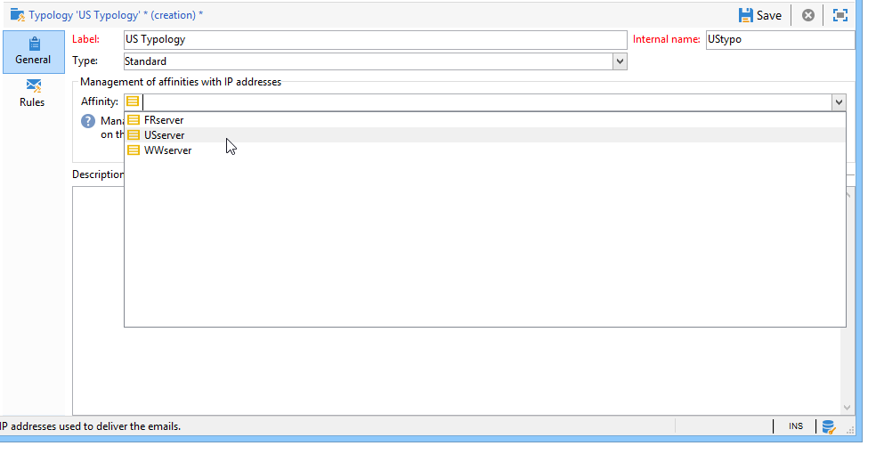

# 配置投放设置 {#delivery-settings}


必须在 **serverConf.xml** 文件夹。

* **DNS配置**:指定用于响应MTA模块从 **`<dnsconfig>`** 向前。

   >[!NOTE]
   >
   >的 **nameServers** 参数对于在Windows中进行安装是必不可少的。 对于Linux中的安装，必须将其留空。

   ```
   <dnsConfig localDomain="domain.com" nameServers="192.0.0.1,192.0.0.2"/>
   ```

您还可以根据自己的需求和设置执行以下配置：配置 [SMTP中继](#smtp-relay)，调整 [MTA子进程](#mta-child-processes), [管理出站SMTP流量](#managing-outbound-smtp-traffic-with-affinities).

## SMTP中继 {#smtp-relay}

MTA模块充当SMTP广播（端口25）的本机邮件传输代理。

但是，如果您的安全策略需要，则可以通过中继服务器替换它。 在这种情况下，全局吞吐量将是中继吞吐量(前提是中继服务器吞吐量低于Adobe Campaign吞吐量)。

在这种情况下，这些参数是通过在 **`<relay>`** 中。 您必须指定用于传输邮件及其关联端口（默认为25）的SMTP服务器的IP地址（或主机）。

```
<relay address="192.0.0.3" port="25"/>
```

>[!IMPORTANT]
>
>此操作模式对投放造成严重限制，因为它会因为中继服务器的固有性能（延迟、带宽……）而大大降低吞吐量。 此外，鉴别同步投放错误（通过分析SMTP流量检测到）的容量将受到限制，如果中继服务器不可用，则将无法发送。

## MTA子进程 {#mta-child-processes}

可以根据服务器的CPU功率和可用网络资源来优化广播性能，从而控制子进程（默认为2）的数量。 此配置将在 **`<master>`** MTA配置的部分。

```
<master dataBasePoolPeriodSec="30" dataBaseRetryDelaySec="60" maxSpareServers="2" minSpareServers="0" startSpareServers="0">
```

另请参阅 [电子邮件发送优化](../../installation/using/email-deliverability.md#email-sending-optimization).

## 管理具有相关性的出站SMTP流量 {#managing-outbound-smtp-traffic-with-affinities}

>[!IMPORTANT]
>
>从一台服务器到另一台服务器的关联配置需要保持一致。 我们建议您联系Adobe以进行亲和度配置，因为配置更改应复制到运行MTA的所有应用程序服务器上。

您可以通过具有IP地址的相关性来改善出站SMTP流量。

要执行此操作，请应用以下步骤：

1. 在 **`<ipaffinity>`** 部分 **serverConf.xml** 文件。

   一个亲和度可以具有多个不同的名称：要将它们分开，请使用 **;** 字符。

   示例:

   ```
    IPAffinity name="mid.Server;WWserver;local.Server">
             <IP address="XX.XXX.XX.XX" heloHost="myserver.us.campaign.net" publicId="123" excludeDomains="neo.*" weight="5"/
   ```

   要查看相关参数，请参阅 **serverConf.xml** 文件。

1. 要在下拉列表中启用亲和度选择，您需要在 **IPAffinity** 枚举。

   

   >[!NOTE]
   >
   >详细列表请参见 [本文档](../../platform/using/managing-enumerations.md).

   然后，您可以选择要使用的亲和度，如下分类所示：

   

   >[!NOTE]
   >
   >您还可以参阅 [投放服务器配置](../../installation/using/email-deliverability.md#delivery-server-configuration).

**相关主题**
* [技术电子邮件配置](email-deliverability.md)
* [在 Campaign 中使用 MX 服务器](using-mx-servers.md)
* [配置电子邮件密送](email-archiving.md)
