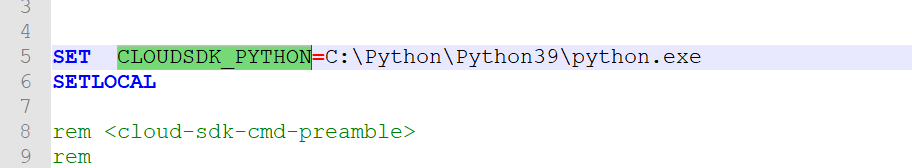
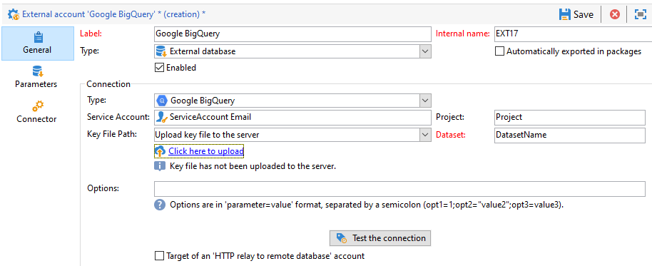

# 配置对Google BigQuery的访问权限 {#configure-fda-google-big-query}


使用Adobe Campaign Classic **联合数据访问** (FDA)选项，用于处理存储在外部数据库中的信息。 请按照以下步骤配置对 [!DNL Google BigQuery].

1. 配置 [!DNL Google BigQuery] on [Windows](#google-windows) 或 [Linux](#google-linux)
1. 配置 [!DNL Google BigQuery] [外部帐户](#google-external) 在Adobe Campaign Classic
1. 设置 [!DNL Google BigQuery] 连接器批量加载 [Windows](#bulk-load-windows) 或 [Linux](#bulk-load-linux)

>[!NOTE]
>
> [!DNL Google BigQuery] 连接器可用于混合部署和内部部署。 有关详细信息，请参见[此页面](../../installation/using/capability-matrix.md)。


## Google BigQuery Windows版 {#google-windows}

### 在Windows上设置的驱动程序 {#driver-window}

1. 下载 [用于Windows的ODBC驱动程序](https://cloud.google.com/bigquery/docs/reference/odbc-jdbc-drivers).

1. 在Windows中配置ODBC驱动程序。 有关详细信息，请参见[此页面](https://storage.googleapis.com/simba-bq-release/jdbc/Simba%20JDBC%20Driver%20for%20Google%20BigQuery%20Install%20and%20Configuration%20Guide.pdf)。

1. 对于 [!DNL Google BigQuery] 连接器工作时，Adobe Campaign Classic需要以下参数才能连接：

   * **[!UICONTROL Project]**:创建或使用现有项目。

      有关更多信息，请参阅 [页面](https://cloud.google.com/resource-manager/docs/creating-managing-projects).

   * **[!UICONTROL Service account]**:创建服务帐户。

      有关更多信息，请参阅 [页面](https://cloud.google.com/iam/docs/creating-managing-service-accounts).

   * **[!UICONTROL Key File Path]**:the **[!UICONTROL Service account]** 需要 **[!UICONTROL Key File]** a [!DNL Google BigQuery] 通过ODBC连接。

      有关更多信息，请参阅 [页面](https://cloud.google.com/iam/docs/creating-managing-service-account-keys).

   * **[!UICONTROL Dataset]**: **[!UICONTROL Dataset]** 对于ODBC连接而言，它是可选项。 由于每个查询都需要提供表所在的数据集，因此需要指定 **[!UICONTROL Dataset]** 对于 [!DNL Google BigQuery] Adobe Campaign Classic中的FDA连接器。

      有关更多信息，请参阅 [页面](https://cloud.google.com/bigquery/docs/datasets).

1. 在Adobe Campaign Classic中，您随后可以配置 [!DNL Google BigQuery] 外部帐户。 有关如何配置外部帐户的更多信息，请参阅 [此部分](#google-external).

### 在Windows上设置批量加载 {#bulk-load-window}

>[!NOTE]
>
>您需要安装Python才能使Google Cloud SDK正常工作。
>
>我们建议使用Python3，请参阅 [页面](https://www.python.org/downloads/).

批量加载实用程序允许更快的传输，这是通过Google Cloud SDK实现的。

1. 从此处下载Windows 64位(x86_64)存档 [页面](https://cloud.google.com/sdk/docs/downloads-versioned-archives) 并将其提取到相应的目录中。

1. 运行 `google-cloud-sdk\install.sh` 脚本。 您需要接受路径变量的设置。

1. 安装后，检查路径变量 `...\google-cloud-sdk\bin` 设置。 如果没有，请手动添加。

1. 在  `..\google-cloud-sdk\bin\bq.cmd` 文件，添加 `CLOUDSDK_PYTHON` 本地变量，该变量将重定向到Python安装的位置。

   例如：

   

1. 重新启动Adobe Campaign Classic以考虑所做的更改。

## Google BigQuery Linux版 {#google-linux}

### 在Linux上设置的驱动程序 {#driver-linux}

1. 在安装ODBC驱动程序之前，您需要更新系统。 在Linux或CentOS上，运行以下命令：

   ```
   yum update
   # install unixODBC driver manager
   yum install unixODBC
   ```

1. 然后，您需要使用以下命令安装unixODBC驱动程序管理器：

   ```
   # switch to root user
   sudo su
   ```

   在Debian上：

   ```
   apt-get update
   apt-get upgrade
   # install unixODBC driver manager
   apt-get install unixODBC
   ```

1. 下载 [Simba Linux ODBC驱动程序(.tar.gz)](https://cloud.google.com/bigquery/docs/reference/odbc-jdbc-drivers). 然后，将目标文件传输到计算机上的临时文件夹中，或使用wget命令：

   ```
   # in this example driver version is 2.3.1.1001
   wget https://storage.googleapis.com/simba-bq-release/odbc/SimbaODBCDriverforGoogleBigQuery_[Version]-Linux.tar.gz
   ```

1. 按如下方式提取主目标文件，其中 **TarballName** 是包含驱动程序的tarball包的名称：

   ```
   tar --directory=/tmp -zxvf [TarballName]
   ```

1. 访问您提取的文件夹，并提取与驱动程序版本对应的内部目标文件。 将其安装到另一个临时文件夹中，如以下示例BigQueryDriver中：

   ```
   mkdir /tmp/BigQueryDriver/
   cd /tmp/SimbaODBCDriverforGoogleBigQuery_[Version]-Linux/
   tar --directory=/tmp/BigQueryDriver/ -zxvf SimbaODBCDriverforGoogleBigQuery[Bitness]_[Version].tar.gz
   ```

1. 访问提取主目标文件的临时位置，并复制 `GoogleBigQueryODBC.did` 和 `setup/simba.googlebigqueryodbc.ini` 文件到上一步中创建的新文件夹中：

   ```
   cd /tmp/SimbaODBCDriverforGoogleBigQuery_[Version]-Linux/
   cp GoogleBigQueryODBC.did /tmp/BigQueryDriver/SimbaODBCDriverforGoogleBigQuery[Bitness]_[Version]/lib/
   cp setup/simba.googlebigqueryodbc.ini /tmp/BigQueryDriver/SimbaODBCDriverforGoogleBigQuery[Bitness]_[Version]/lib/
   ```

1. 创建安装目录，如下所示：

   ```
   mkdir -p /opt/simba/googlebigqueryodbc/
   ```

1. 将目录的内容复制到新的安装目录中：

   ```
   cp -r /tmp/BigQueryDriver/SimbaODBCDriverforGoogleBigQuery[Bitness]_[Version]/* /opt/simba/googlebigqueryodbc/
   ```

1. 替换 `<INSTALLDIR>` with `/opt/simba/googlebigqueryodbc` in `simba.googlebigqueryodbc.ini` 在安装目录中：

   ```
   cd /opt/simba/googlebigqueryodbc/lib/
   sed -i 's/<INSTALLDIR>/\/opt\/simba\/googlebigqueryodbc/g' simba.googlebigqueryodbc.ini
   ```

1. 更改 `DriverManagerEncoding` 到UTF-16和 `SwapFilePath` in `simba.googlebigqueryodbc.ini`. 如果需要，您还可以更改日志记录设置。

   以下是更新的驱动程序范围配置文件的示例：

   ```
   # /opt/simba/googlebigqueryodbc/lib/simba.googlebigqueryodbc.ini
   [Driver]
   DriverManagerEncoding=UTF-16
   ErrorMessagesPath=opt/simba/googlebigqueryodbc/ErrorMessages
   LogLevel=6
   LogPath=/tmp
   SwapFilePath=/tmp
   ```

1. 如果您使用的是系统驱动程序文件或任何当前的 `odbcinst.ini` 文件，配置 `/etc/odbcinst.ini` 指向Google BigQuery驱动程序位置 `/opt/simba/googlebigqueryodbc/lib/libgooglebigqueryodbc_sb[Bitness].so`.

   例如：

   ```
   # /etc/odbcinst.ini
   # Make sure to use Simba ODBC Driver for Google BigQuery as a driver name.
   
   [ODBC Drivers]
   Simba ODBC Driver for Google BigQuery=Installed
   
   [Simba ODBC Driver for Google BigQuery]
   Description=Simba ODBC Driver for Google BigQuery(64-bit)
   Driver=/opt/simba/googlebigqueryodbc/lib/libgooglebigqueryodbc_sb64.so
   ```

1. 查找unixODBC驱动程序管理器库的位置，并添加 `unixODBC` 和 `googlebigqueryodbc` 库路径 `LD_LIBRARY_PATH environment` 变量。

   ```
   find / -name 'lib*odbc*.so*' -print
   #output:
   /usr/lib/x86_64-linux-gnu/libodbccr.so.2
   /usr/lib/x86_64-linux-gnu/libodbcinst.so.2.0.0
   /usr/lib/x86_64-linux-gnu/libodbccr.so.1
   .
   .
   /opt/simba/googlebigqueryodbc/lib/libgooglebigqueryodbc_sb64.so
   
   #the command would look like this
   export LD_LIBRARY_PATH=$LD_LIBRARY_PATH:/opt/simba/googlebigqueryodbc:/usr/lib
   ```

1. 在Adobe Campaign Classic中，您随后可以配置 [!DNL Google BigQuery] 外部帐户。 有关如何配置外部帐户的更多信息，请参阅 [此部分](#google-external).

### 在Linux上设置批量加载 {#bulk-load-linux}

>[!NOTE]
>
>您需要安装Python才能使Google Cloud SDK正常工作。
>
>我们建议使用Python3，请参阅 [页面](https://www.python.org/downloads/).

批量加载实用程序允许更快的传输，这是通过Google Cloud SDK实现的。

1. 在此下载Linux 64位(x86_64)存档 [页面](https://cloud.google.com/sdk/docs/downloads-versioned-archives) 和提取到相应目录中。

1. 运行 `google-cloud-sdk\install.sh` 脚本。 您需要接受路径变量的设置。

1. 安装后，检查路径变量 `...\google-cloud-sdk\bin` 设置。 如果没有，请手动添加。

1. 如果您希望避免使用 `PATH` 变量，或者 `google-cloud-sdk` 目录到其他位置，请使用 `bqpath` 选项值 **[!UICONTROL External account]** 指定系统上bin目录的确切路径。

1. 重新启动Adobe Campaign Classic以考虑所做的更改。

## Google BigQuery外部帐户 {#google-external}

您需要创建 [!DNL Google BigQuery] 用于将Adobe Campaign Classic实例连接到 [!DNL Google BigQuery] 外部数据库。

1. 从Adobe Campaign Classic **[!UICONTROL Explorer]**，单击 **[!UICONTROL Administration]** &#39;>&#39; **[!UICONTROL Platform]** &#39;>&#39; **[!UICONTROL External accounts]**.

1. 单击 **[!UICONTROL New]**。

1. 选择 **[!UICONTROL External database]** 作为外部帐户的 **[!UICONTROL Type]**.

1. 配置 [!DNL Google BigQuery] 外部帐户，您必须指定：

   * **[!UICONTROL Type]**: [!DNL Google BigQuery]

   * **[!UICONTROL Service account]**:电子邮件 **[!UICONTROL Service account]**. 有关此内容的详细信息，请参阅 [Google Cloud文档](https://cloud.google.com/iam/docs/creating-managing-service-accounts).

   * **[!UICONTROL Project]**:您的 **[!UICONTROL Project]**. 有关此内容的详细信息，请参阅 [Google Cloud文档](https://cloud.google.com/resource-manager/docs/creating-managing-projects).

   * **[!UICONTROL Key file Path]**:
      * **[!UICONTROL Upload key file to the server]**:选择 **[!UICONTROL Click here to upload]** 如果您选择通过Adobe Campaign Classic上传密钥。

      * **[!UICONTROL Enter manually the key file path]**:如果选择使用预先存在的键，请在此字段中复制/粘贴绝对路径。
   * **[!UICONTROL Dataset]**:您的 **[!UICONTROL Dataset]**. 有关此内容的详细信息，请参阅 [Google Cloud文档](https://cloud.google.com/bigquery/docs/datasets-intro).
   
