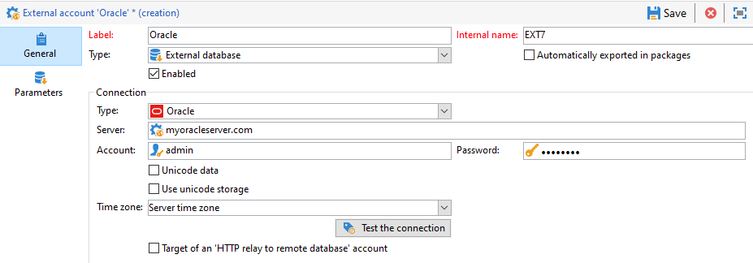

# 配置对Oracle的访问权限 {#configure-access-to-oracle}


使用Campaign [联合数据访问](../../installation/using/about-fda.md) (FDA)选项处理存储在外部数据库中的信息。 请按照以下步骤配置对Oracle的访问权限。

1. 在[Linux](#oracle-linux)或[Windows](#azure-windows)上配置Oracle
1. 在Campaign中配置Oracle [外部帐户](#oracle-external)

## Linux上的Oracle {#oracle-linux}

连接到FDA中的Oracle外部数据库需要在Adobe Campaign服务器上进行以下其他配置。

1. 安装与您的Oracle版本相对应的Oracle完整客户端。
1. 将TNS定义添加到安装中。 为此，请在/etc/oracle存储库的&#x200B;**tnsnames.ora**&#x200B;文件中指定它们。 如果此存储库不存在，请创建它。

   然后，创建一个新的TNS_ADMIN环境变量：导出TNS_ADMIN=/etc/oracle并重新启动计算机。

1. 将Oracle集成到Adobe Campaign服务器(nlserver)。 为此，请检查&#x200B;**customer.sh**&#x200B;文件是否存在于Adobe Campaign服务器树结构的“nl6”文件夹中，以及该文件是否包含指向Oracle库的链接。

   例如，对于11.2中的客户端：

   ```
   export ORACLE_HOME=/usr/lib/oracle/11.2
   export TNS_ADMIN=/etc/oracle
   export LD_LIBRARY_PATH=$ORACLE_HOME/client64/lib:$LD_LIBRARY_PATH
   ```

   >[!NOTE]
   >
   >这些值（特别是ORACLE_HOME）取决于您的安装存储库。 在引用这些值之前，请确保检查树结构。

1. 安装Oracle所需的库：

   * **libclntsh.so**

     ```
     cd /usr/lib/oracle/<version>/client<architecture>/lib
     ln -s libclntsh.so.<version> libclntsh.so
     ```

   * **libaio1**

     ```
     apt install libaio1
     or
     yum install libaio1
     ```

1. 然后，您可以在Campaign Classic中配置[!DNL Oracle]外部帐户。 有关如何配置外部帐户的更多信息，请参阅[此部分](#oracle-external)。

## Windows上的Oracle {#oracle-windows}

连接到FDA中的Oracle外部数据库需要在Adobe Campaign服务器上进行以下其他配置。

1. 安装Oracle客户端。

1. 在C:Oracle文件夹中，创建一个包含您的TNS定义的&#x200B;**tnsnames.ora**&#x200B;文件。

1. 添加值为C:Oracle的TNS_ADMIN环境变量并重新启动计算机。

1. 然后，您可以在Campaign Classic中配置[!DNL Oracle]外部帐户。 有关如何配置外部帐户的更多信息，请参阅[此部分](#oracle-external)。

## Oracle外部帐户 {#oracle-external}

[!DNL Oracle]外部帐户允许您将Campaign实例连接到Oracle外部数据库。

1. 从营销活动&#x200B;**[!UICONTROL Explorer]**&#x200B;中，选择&#x200B;**[!UICONTROL Administration]**“>”**[!UICONTROL Platform]**“>”**[!UICONTROL External accounts]**。

1. 选择&#x200B;**[!UICONTROL New]**。

1. 选择&#x200B;**[!UICONTROL External database]**&#x200B;作为外部帐户的&#x200B;**[!UICONTROL Type]**。

1. 配置&#x200B;**[!UICONTROL Oracle]**&#x200B;外部帐户，您必须指定：

   * **[!UICONTROL Type]**： Oracle

   * **[!UICONTROL Server]**： DNS的名称

   * **[!UICONTROL Account]**：用户的名称

   * **[!UICONTROL Password]**：用户帐户密码

   * **[!UICONTROL Time zone]**：服务器时区

   
