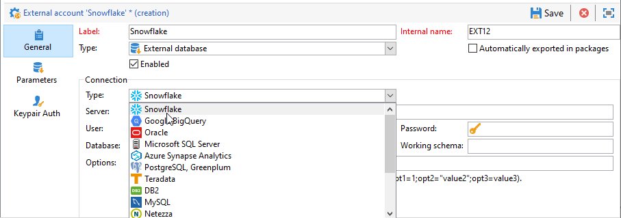

# 配置对Snowflake的访问权限 {#configure-access-to-snowflake}

使用营销活动 **联合数据访问** (FDA)选项，用于处理存储在外部数据库中的信息。 按照以下步骤配置对的访问权限 [!DNL Snowflake].

1. 配置 [!DNL Snowflake] 日期 [Linux](#snowflake-linux).
1. 配置 [!DNL Snowflake] [外部帐户](#snowflake-external) 在Campaign中

>[!NOTE]
>
>[!DNL Snowflake] 连接器可用于托管和内部部署。 有关详细信息，请参见[此页面](../../installation/using/capability-matrix.md)。


## Linux上的Snowflake {#snowflake-linux}

配置 [!DNL Snowflake] 在Linux上，请执行以下步骤：

1. 在ODBC安装之前，请检查在Linux分发服务器上是否安装了以下软件包：

   * 对于Red Hat/CentOS：

     ```
     yum update
     yum upgrade
     yum install -y grep sed tar wget perl curl
     ```

   * 对于Debian：

     ```
     apt-get update
     apt-get upgrade
     apt-get install -y grep sed tar wget perl curl
     ```

1. 在运行脚本之前，您可以使用 `--help` 选项：

   ```
   cd /usr/local/neolane/nl6/bin/fda-setup-scripts/
   ./snowflake_odbc-setup.sh --help
   ```

1. 访问脚本所在的目录，并以root用户身份运行以下脚本：

   ```
   cd /usr/local/neolane/nl6/bin/fda-setup-scripts
   ./snowflake_odbc-setup.sh
   ```

1. 安装ODBC驱动程序后，需要重新启动Campaign Classic。 为此，请运行以下命令：

   ```
   systemctl stop nlserver.service
   systemctl start nlserver.service
   ```

1. 然后，您可以在Campaign中配置 [!DNL Snowflake] 外部帐户。 有关如何配置外部帐户的更多信息，请参阅 [本节](#snowflake-external).

## Snowflake外部帐户 {#snowflake-external}

您需要创建 [!DNL Snowflake] 用于将Campaign实例连接到 [!DNL Snowflake] 外部数据库。

1. 来自营销活动 **[!UICONTROL Explorer]**，单击 **[!UICONTROL Administration]** &#39;>&#39; **[!UICONTROL Platform]** &#39;>&#39; **[!UICONTROL External accounts]**.

1. 单击 **[!UICONTROL New]**。

1. 选择 **[!UICONTROL External database]** 作为外部帐户的 **[!UICONTROL Type]**.

1. 下 **[!UICONTROL Configuration]**，选择 [!DNL Snowflake] 从 **[!UICONTROL Type]** 下拉菜单。

   

1. 添加您的 **[!UICONTROL Server]** URL和 **[!UICONTROL Database]**.

1. 配置 **[!UICONTROL Snowflake]** 外部帐户身份验证：

   * 对于帐户/密码验证，您必须指定：

      * **[!UICONTROL Account]**：用户名称

      * **[!UICONTROL Password]**：用户帐户密码。

     

   * 对于密钥对验证，单击 **[!UICONTROL Keypair Auth]** 选项卡，以使用 **[!UICONTROL Private key]** 要验证并复制，请粘贴您的 **[!UICONTROL Private key]**.

     

1. 单击 **[!UICONTROL Parameters]** 选项卡，然后 **[!UICONTROL Deploy functions]** 按钮创建函数。

   >[!NOTE]
   >
   >要使所有函数都可用，您需要在远程数据库中创建Adobe Campaign SQL函数。 有关更多信息，请参阅此 [页面](../../configuration/using/adding-additional-sql-functions.md).

   

1. 单击 **[!UICONTROL Save]** 配置完成后。

连接器支持以下选项：

| 选项 | 说明 |
|---|---|
| 工作模式 | 用于工作表的数据库模式 |
| 仓库 | 要使用的默认仓库的名称。 它将覆盖用户的默认值。 |
| 时区名称 | 默认情况下为空，这意味着使用Campaign Classic应用程序服务器的系统时区。 选项可用于强制使用时区会话参数。 <br>有关详细信息，请参见 [此页面](https://docs.snowflake.net/manuals/sql-reference/parameters.html#timezone). |
| weekstart | WEEK_START会话参数。 默认设置为0。 <br>有关详细信息，请参见 [此页面](https://docs.snowflake.com/en/sql-reference/parameters.html#week-start). |
| UseCachedResult | USE_CACHED_RESULTS会话参数。 默认设置为TRUE。 此选项可用于禁用Snowflake缓存的结果。 <br>有关详细信息，请参见 [此页面](https://docs.snowflake.net/manuals/user-guide/querying-persisted-results.html). |
| bulkthreads | 用于Snowflake批量加载器的线程数，线程越多，批量加载越大，性能越好。 默认设置为1。 根据计算机线程数，可以调整该数字。 |
| chunkSize | 确定批量加载程序块的文件大小。 默认设置为128MB。 当与bulkThreads一起使用时，可以修改以获得更佳的性能。 更多并发活动线程意味着更好的性能。 <br>有关详细信息，请参见 [Snowflake文档](https://docs.snowflake.net/manuals/sql-reference/sql/put.html). |
| 阶段名称 | 预配置的内部阶段的名称。 它将用于批量加载，而不是创建新的临时阶段。 |
