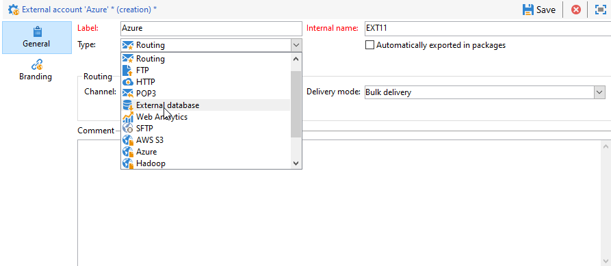
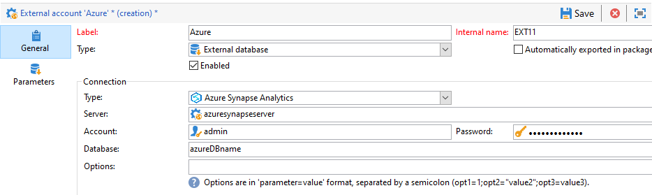

# 配置对Azure synapse的访问权限 {#configure-access-to-azure-synapse}


使用Campaign [联合数据访问](../../installation/using/about-fda.md) (FDA)选项处理存储在外部数据库中的信息。 按照以下步骤配置对&#x200B;**MicrosoftAzure synapse分析**&#x200B;的访问权限。

1. 在[CentOS](#azure-centos)、[Windows](#azure-windows)或[Debian](#azure-debian)上配置Azure synapse
1. 在Campaign中配置Azure synapse[外部帐户](#azure-external)

## 在CentOS上Azure synapse {#azure-centos}

>[!CAUTION]
>
>* 您需要具有root权限才能安装ODBC驱动程序。
>* Microsoft提供的Red Hat Enterprise ODBC驱动程序也可以与CentOS一起用于连接到SQL Server。
>* 版本13.0可以与Red Hat 6和7一起使用。

要在CentOS上配置Azure synapse，请执行以下步骤：

1. 首先，安装ODBC驱动程序。 您可以在此[页面](https://www.microsoft.com/en-us/download/details.aspx?id=50420)中找到它。

   >[!NOTE]
   >
   >这是ODBC驱动程序版本13独有的。

   ```
   sudo su
   curl https://packages.microsoft.com/config/rhel/6/prod.repo > /etc/yum.repos.d/mssql-release.repo
   exit
   # Uninstall if already installed Unix ODBC driver
   sudo yum remove unixODBC-utf16 unixODBC-utf16-devel #to avoid conflicts
   
   sudo ACCEPT_EULA=Y yum install msodbcsql
   
   sudo ACCEPT_EULA=Y yum install mssql-tools
   echo 'export PATH="$PATH:/opt/mssql-tools/bin"' >> ~/.bash_profile
   echo 'export PATH="$PATH:/opt/mssql-tools/bin"' >> ~/.bashrc
   source ~/.bashrc
   
   # the Microsoft driver expects unixODBC to be here /usr/lib64/libodbc.so.1, so add soft links to the '.so.2' files
   cd /usr/lib64
   sudo ln -s libodbccr.so.2   libodbccr.so.1
   sudo ln -s libodbcinst.so.2 libodbcinst.so.1
   sudo ln -s libodbc.so.2     libodbc.so.1
   
   # Set the path for unixODBC
   export ODBCINI=/usr/local/etc/odbc.ini
   export ODBCSYSINI=/usr/local/etc
   source ~/.bashrc
   
   #Add a DSN information to /etc/odbc.ini
   sudo vi /etc/odbc.ini
   
   #Add the following:
   [Azure Synapse Analytics]
   Driver      = ODBC Driver 13 for SQL Server
   Description = Azure Synapse Analytics DSN
   Trace       = No
   Server      = [insert your server here]
   ```

1. 如果需要，可以通过运行以下命令来安装unixODBC开发标头：

   ```
   sudo yum install unixODBC-devel
   ```

1. 安装驱动程序后，您可以测试和验证ODBC驱动程序并根据需要查询数据库。 运行以下命令：

   ```
   /opt/mssql-tools/bin/sqlcmd -S yourServer -U yourUserName -P yourPassword -q "your query" # for example -q "select 1"
   ```

1. 然后，您可以在Campaign中配置[!DNL Azure Synapse]外部帐户。 有关如何配置外部帐户的更多信息，请参阅[此部分](#azure-external)。

1. 由于Azure synapseAnalytics通过TCP 1433端口进行通信，因此需要在防火墙上打开此端口。 使用以下命令：

   ```
   firewall-cmd --permanent --add-rich-rule='rule family="ipv4" source address="[server_ip_here]/32" port port="1433" protocol="tcp" accept'
   # you can ping your hostname and the ping command will translate the hostname to IP address which you can use here
   ```

   >[!NOTE]
   >
   >要允许来自Azure synapse列入允许列表 Analytics端的通信，您可能需要将公共IP添加到。 为此，请参阅[Azure文档](https://docs.microsoft.com/en-us/azure/sql-database/sql-database-firewall-configure#use-the-azure-portal-to-manage-server-level-ip-firewall-rules)。

1. 如果是iptables，请运行以下命令：

   ```
   iptables -A OUTPUT -p tcp -d [server_hostname_here] --dport 1433 -j ACCEPT
   ```

## 在Windows上Azure synapse {#azure-windows}

>[!NOTE]
>
>这是ODBC驱动程序版本13所独有的，但Adobe Campaign Classic也可以使用SQL Server Native Client驱动程序11.0和10.0。

要在Windows上配置Azure synapse，请执行以下操作：

1. 首先，安装Microsoft ODBC驱动程序。 您可以在[此页面](https://www.microsoft.com/en-us/download/details.aspx?id=50420)中找到它。

1. 选择要安装的以下文件：

   ```
   your_language\your_architecture\msodbcsql.msi (i.e: English\X64\msodbcsql.msi)
   ```

1. 安装ODBC驱动程序后，您可以根据需要对其进行测试。 有关详细信息，请参见此 [ 页面](https://docs.microsoft.com/en-us/sql/connect/odbc/windows/system-requirements-installation-and-driver-files?view=sql-server-ver15#installing-microsoft-odbc-driver-for-sql-server)。

1. 在Campaign Classic中，您可以配置[!DNL Azure Synapse]外部帐户。 有关如何配置外部帐户的更多信息，请参阅[此部分](#azure-external)。

1. 由于Azure synapseAnalytics通过TCP 1433端口进行通信，因此您需要在Windows Defender防火墙上打开此端口。 有关详细信息，请参阅[Windows文档](https://docs.microsoft.com/en-us/windows/security/threat-protection/windows-firewall/create-an-outbound-program-or-service-rule)。

## DebianAzure synapse {#azure-debian}

**先决条件：**

* 您需要具有root权限才能安装ODBC驱动程序。
* 安装msodbcsql包需要curl。 如果未安装该软件，请运行以下命令：

  ```
  sudo apt-get install curl
  ```

要在Debian上配置Azure synapse，请执行以下操作：

1. 首先，安装适用于SQL Server的Microsoft ODBC驱动程序。 使用以下命令安装用于SQL Server的ODBC驱动程序13.1：

   ```
   sudo su
   curl https://packages.microsoft.com/keys/microsoft.asc | apt-key add -
   curl https://packages.microsoft.com/config/debian/8/prod.list > /etc/apt/sources.list.d/mssql-release.list
   exit
   sudo apt-get update
   sudo ACCEPT_EULA=Y apt-get install msodbcsql
   ```

1. 如果您收到以下错误&#x200B;**“在调用** sudo apt-get update **时找不到方法驱动程序/usr/lib/apt/methods/https”**，您应该运行该命令：

   ```
   sudo apt-get install apt-transport-https ca-certificates
   ```

1. 现在，您需要使用以下命令安装mssql-tools。 要使用Bulk Copy程序（或BCP）实用程序并运行查询，需要Mssq-tools。

   ```
   sudo ACCEPT_EULA=Y apt-get install mssql-tools
   echo 'export PATH="$PATH:/opt/mssql-tools/bin"' >> ~/.bash_profile
   echo 'export PATH="$PATH:/opt/mssql-tools/bin"' >> ~/.bashrc
   source ~/.bashrc
   ```

1. 如果需要，可以通过运行以下命令来安装unixODBC开发标头：

   ```
   sudo yum install unixODBC-devel
   ```

1. 安装驱动程序后，您可以测试和验证ODBC驱动程序并根据需要查询数据库。 运行以下命令：

   ```
   /opt/mssql-tools/bin/sqlcmd -S yourServer -U yourUserName -P yourPassword -q "your query" # for example -q "select 1"
   ```

1. 在Campaign Classic中，您现在可以配置[!DNL Azure Synapse]外部帐户。 有关如何配置外部帐户的更多信息，请参阅[此部分](#azure-external)。

1. 要在Debian上配置iptables以确保与Azure synapseAnalytics的连接，请使用以下命令为主机名启用出站TCP 1433端口：

   ```
   iptables -A OUTPUT -p tcp -d [server_hostname_here] --dport 1433 -j ACCEPT
   ```

   >[!NOTE]
   >
   >要允许来自Azure synapse列入允许列表 Analytics端的通信，您可能需要将公共IP添加到。 为此，请参阅[Azure文档](https://docs.microsoft.com/en-us/azure/sql-database/sql-database-firewall-configure#use-the-azure-portal-to-manage-server-level-ip-firewall-rules)。

## azure synapse外部帐户 {#azure-external}

[!DNL Azure Synapse]外部帐户允许您将Campaign实例连接到Azure synapse外部数据库。

要创建您的[!DNL Azure Synapse]外部帐户，请执行以下步骤：

1. 在营销活动&#x200B;**[!UICONTROL Explorer]**&#x200B;中，单击&#x200B;**[!UICONTROL Administration]**“>”**[!UICONTROL Platform]**“>”**[!UICONTROL External accounts]**。

1. 单击 **[!UICONTROL New]**。

1. 选择&#x200B;**[!UICONTROL External database]**&#x200B;作为外部帐户的&#x200B;**[!UICONTROL Type]**。

   

1. 在&#x200B;**[!UICONTROL Configuration]**&#x200B;下，从&#x200B;**[!UICONTROL Type]**&#x200B;下拉列表中选择&#x200B;**[!UICONTROL Azure Synapse Analytics]**。

   

1. 配置[!DNL Azure Synapse]外部帐户：

   * 对于标准身份验证，您必须指定：

      * **[!UICONTROL Server]**：Azure synapse服务器的URL

      * **[!UICONTROL Account]**：用户的名称

      * **[!UICONTROL Password]**：用户帐户密码

      * **[!UICONTROL Database]**：数据库的名称

     

   * 对于系统分配的托管身份验证，您必须指定：

      * **[!UICONTROL Server]**：Azure synapse服务器的URL

      * **[!UICONTROL Database]**：数据库的名称

      * **[!UICONTROL Options]**：添加以下语法`Authentication=ActiveDirectoryMsi`

     

1. 单击 **[!UICONTROL Save]**。

连接器支持以下选项：

| 选项 | 说明 |
|---|---|
| 身份验证 | 连接器支持的身份验证类型。 当前支持的值： ActiveDirectoryMSI。 </br>有关详细信息，请参阅[SQL doc](https://docs.microsoft.com/en-us/sql/connect/odbc/using-azure-active-directory?view=sql-server-ver15#example-connection-strings)（连接字符串n°8示例）。 |
