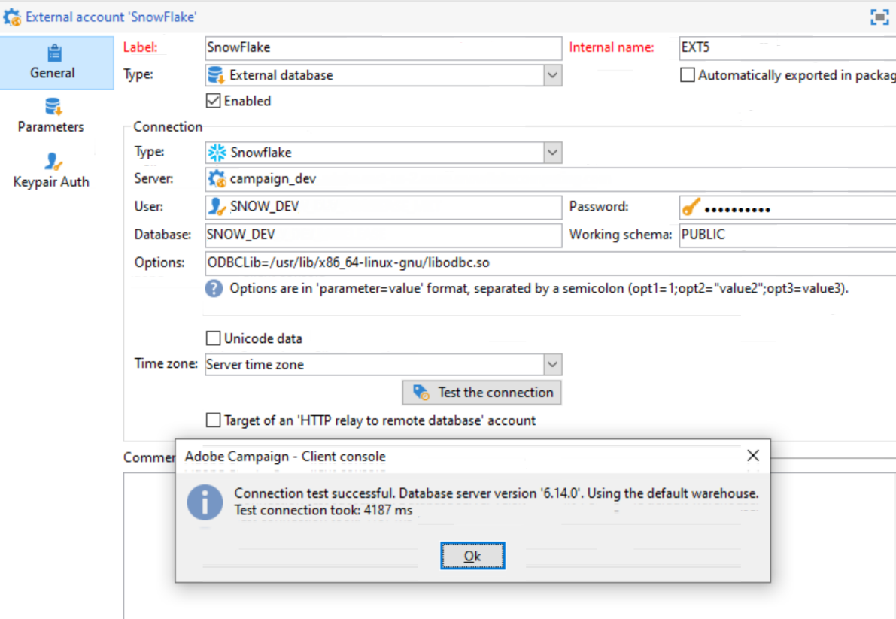

# 配置对Teradata的访问权限 {#configure-access-to-teradata}


使用Campaign [联合数据访问](../../installation/using/about-fda.md) (FDA)选项处理存储在外部数据库中的信息。 请按照以下步骤配置对Teradata的访问权限。

1. 安装和配置[Teradata驱动程序](#teradata-config)
1. 在Campaign中配置Teradata[外部帐户](#teradata-external)
1. 为Teradata和Campaign服务器设置[其他配置](#teradata-additional-configurations)

## teradata配置 {#teradata-config}

您需要安装驱动程序，以便实现Teradata与Campaign的连接。

1. 为Teradata[&#128279;](https://downloads.teradata.com/download/connectivity/odbc-driver/linux)安装ODBC驱动程序。

   它由三个软件包组成，这些软件包可按以下顺序安装在Red Hat（或CentOS）/Suse上：

   * TeraGSS
   * tdicu1510（使用setup_wrapper.sh安装）
   * tdodbc1510（使用setup_wrapper.sh安装）

1. 配置ODBC驱动程序。 可以在标准文件中执行配置： **/etc/odbc.ini**&#x200B;用于常规参数，/etc/odbcinst.ini用于声明驱动程序：

   * **/etc/odbc.ini**

     ```
     [ODBC]
     InstallDir=/etc/
     ```

     “InstallDir”对应于&#x200B;**odbcinst.ini**&#x200B;文件的位置。

   * **/etc/odbcinst.ini**

     ```
     [ODBC DRIVERS]
     teradata=Installed
     
     [teradata]
     Driver=/opt/teradata/client/17.10/lib64/tdataodbc_sb64.so
     APILevel=CORE
     ConnectFunctions=YYY
     DriverODBCVer=3.51
     SQLLevel=1
     ```

1. 指定Adobe Campaign服务器的环境变量：

   * **LD_LIBRARY_PATH**： /opt/teradata/client/15.10/lib64和/opt/teradata/client/15.10/odbc_64/lib。
   * **ODBCINI**： odbc.ini文件的位置(例如/etc/odbc.ini)。
   * **NLSPATH**： opermsgs.cat文件的位置(/opt/teradata/client/15.10/msg/opermsgs.cat)

>[!NOTE]
>
>连接到FDA中的Teradata外部数据库需要在Adobe Campaign服务器上执行其他配置步骤。 [了解详情](#teradata-additional-configurations)。
>

## teradata外部帐户{#teradata-external}

利用Teradata外部帐户，可将Campaign实例连接到Teradata外部数据库。

1. 在营销活动&#x200B;**[!UICONTROL Explorer]**&#x200B;中，单击&#x200B;**[!UICONTROL Administration]** / **[!UICONTROL Platform]** / **[!UICONTROL External accounts]**。

1. 单击&#x200B;**[!UICONTROL New]**&#x200B;并选择&#x200B;**[!UICONTROL External database]**&#x200B;作为&#x200B;**[!UICONTROL Type]**。

   

1. 要配置&#x200B;**[!UICONTROL Teradata]**&#x200B;外部帐户，您必须指定：

   * **[!UICONTROL Type]**：选择&#x200B;**[!UICONTROL Teradata]**&#x200B;类型。

   * **[!UICONTROL Server]**：Teradata服务器的URL或名称

   * **[!UICONTROL Account]**：用于访问Teradata数据库的帐户的名称

   * **[!UICONTROL Password]**：用于连接到Teradata数据库的密码

   * **[!UICONTROL Database]**：数据库的名称（可选）

   * **[!UICONTROL Options]**：要通过Teradata传递的选项。 使用以下格式： &#39;parameter=value&#39;。 使用分号作为值之间的分隔符。

   * **[!UICONTROL Timezone]**：在Teradata中设置的时区。 [了解详情](#timezone)

连接器支持以下选项：

| 选项 | 说明 |
|---|---|
| TD_MAX_SESSIONS | 指定Teradata并行传输程序可以为操作员作业获取的最大登录会话数。 |
| 时区名称 | 服务器时区的名称。 |
| 字符集 | 用于配置Teradata字符集。 <br>有关详情，请参阅[本页](https://docs.teradata.com/r/ODBC-Driver-for-Teradata-User-Guide/May-2017/Configuration-of-odbc.ini-in-UNIX/Linux-and-Apple-OS-X/Teradata-DSN-Options#rub1478609534082__table_N102D3_N102B6_N102B3_N10001)。 |
| IANAAppCodePage | ODBC应用程序代码页。 <br>有关详情，请参阅[本页](https://docs.teradata.com/r/ODBC-Driver-for-Teradata-User-Guide/May-2017/ODBC-Driver-for-Teradata-Application-Development/International-Character-Set-Support/Application-Code-Page) |

### 添加其他ODBC外部帐户 {#add-external}

>[!NOTE]
>
> 此选项不适用于低于7.3.1版本的内部版本。

teradata驱动程序提供自己的ODBC库，但此库可能与其他ODBC外部帐户不兼容。

如果要配置另一个也使用ODBC的外部帐户，例如Snowflake，则需要将一个ODBCLib选项集添加到默认ODBC库的路径中（ Debian上为`/usr/lib/x86_64-linux-gnu/libodbc.so`，RHEL/CentOS上为`/usr/lib64/libodbc.so`）。



### 查询分段

当多个Adobe Campaign用户连接到同一FDATeradata外部帐户时，**[!UICONTROL Query banding]**&#x200B;选项卡允许您在一个会话上设置查询范围，即一组键/值对。


配置此选项后，每次Campaign用户在Teradata数据库上执行查询时，Adobe Campaign都将发送与此用户关联的元数据，其中包括键列表。 然后，Teradata管理员可以使用此数据来进行审核或管理访问权限。

>[!NOTE]
>
>有关&#x200B;**[!UICONTROL Query banding]**&#x200B;的详细信息，请参阅[Teradata文档](https://docs.teradata.com/reader/cY5B~oeEUFWjgN2kBnH3Vw/a5G1iz~ve68yTMa24kVjVw)。

要配置查询分段，请执行以下步骤：

1. 使用&#x200B;**[!UICONTROL Default]**&#x200B;输入在用户没有关联的查询频带时将使用的默认查询频带。 如果此字段留空，则没有查询范围的用户将无法使用Teradata。

1. 使用&#x200B;**[!UICONTROL Users]**&#x200B;字段为每个用户指定查询范围。 您可以根据需要添加任意数量的键/值对，例如，priority=1；workload=high。 如果用户未分配查询频带，则将应用&#x200B;**[!UICONTROL Default]**&#x200B;字段。

1. 选中&#x200B;**[!UICONTROL Active]**&#x200B;框以激活此功能

#### 外部帐户疑难解答 {#external-account-troubleshooting}

如果在测试连接&#x200B;**TIM-030008日期“2”时出现以下错误：缺少字符(iRc=-53)**，请确保已正确安装ODBC驱动程序，并且已为Campaign服务器设置LD_LIBRARY_PATH (Linux) / PATH (Windows)。

错误&#x200B;**ODB-240000 ODBC错误： [Microsoft][ODBC Driver Manager]未找到数据源名称，未指定默认驱动程序。如果使用16.X驱动程序，则Windows中会出现**。 Adobe Campaign要求odbcinst.ini中的teradata名为“{teradata}”。

* 从Campaign 18.10开始，您可以在外部帐户的选项中添加ODBCDriverName=&quot;Teradata数据库ODBC驱动程序16.10&quot;。 版本号可以更改，通过运行odbcad32.exe并访问“驱动程序”选项卡，可以找到确切的名称。

* 如果您使用的是较旧的Campaign版本，则必须将驱动程序安装创建的odbcinst.ini的Teradata部分复制到名为Teradata的新部分。 在这种情况下，可以使用Regedit。 如果您的基数是latin1，则必须在选项中添加&#x200B;**APICharSize=1**。

## 其他配置 {#teradata-additional-configurations}

<!--
### Compatibility {#teradata-compatibility}

**Based in Unicode**

| Database version | Driver version |  Minimal Campaign version required |  Note |
|:-:|:-:|:-:|:-:|
| 15  |  15 |  Campaign Classic 17.9 | Under Linux: Queries with timestamp may fail (fixed in build 8937 for 18.4 and 8977 for 18.10) In debug mode, warnings relative to bad memory usage in the driver may occur. |
| 15  | 16  | Campaign Classic 17.9  | Recommended setup for a Teradata 15 database under Linux.  |
|  16 | 16  | Campaign Classic 18.10 |  Unicode characters with surrogate pairs are not fully handled. Using surrogate characters in data should work. Using surrogates in a filtering condition of a query will not work without this change. |
| 16  |  15 |  Campaign Classic 19.0 |  &nbsp; |

**Based in Latin1**

Versions previous to Adobe Campaign Classic 17.9 only supported Teradata Latin-1 database.

Starting from Adobe Campaign Classic 17.9, we now support by default Teradata database in Unicode.

Customers with a Latin-1 Teradata database migrating to a recent Campaign Classic release will have to add the parameter APICharSize=1 in the options of the external account.
-->

### 用户配置 {#user-configuration}

外部数据库上需要以下权限：创建/删除/执行自定义过程，创建/删除/插入/选择表。 如果要在Adobe Campaign实例上使用md5和sha2函数，则可能还必须创建用户模式函数。

确保配置正确的时区。 它应该与将在Adobe Campaign实例中创建的外部帐户中设置的内容匹配。

Adobe Campaign不会对其将在数据库中创建的对象设置保护模式（回退）。 您可能需要在Adobe Campaign将用于使用以下查询连接到Teradata数据库的用户上设置默认值：

| 禁用默认回退 |
| :-: |
| ```MODIFY USER $login$ AS NO FALLBACK;``` |

### MD5安装 {#md5-installation}

如果要在Adobe Campaign实例中使用md5函数，则必须从此[page](https://downloads.teradata.com/download/extensibility/md5-message-digest-udf) (md5_20080530.zip)在Teradata数据库上安装用户模式函数。

下载文件的sha1如下所示：65cc0bb6935f72fcd84fef1ebcd64c00115dfd1e。

要安装md5，请执行以下操作：

1. 解压缩md5_20080530.zip文件。

1. 转到md5/src目录。

1. 使用bteq连接到Teradata数据库。

1. 运行以下bteq命令：

   ```
   .run file = hash_md5.btq
   ```

### SHA2安装 {#sha2-installation}

如果要在Adobe Campaign实例中使用sha2函数，则必须从此[页面](https://github.com/akuroda/teradata-udf-sha2/archive/v1.0.zip) (teradata-udf-sha2-1.0.zip)在Teradata数据库上安装用户模式函数。

下载文件的sha1如下所示e87438d37424836358bd3902cf1adeb629349780。

要安装sha2：

1. 解压缩teradata-udf-sha2-1.0.zip文件。

1. 转到teradata-udf-sha2-1.0/src目录。

1. 使用bteq连接到Teradata数据库。

1. 运行以下两个bteq命令：

   ```
   .run file = hash_sha256.sql
   .run file = hash_sha512.sql
   ```

### UDF_UTF16TO8安装 {#UDF-UTF16TO8-installation}

如果要在Adobe Campaign实例中使用udf_utf16to8函数，请从&#x200B;**Teradataunicode工具包**&#x200B;在Teradata数据库上安装用户模式函数。

下载的文件的sha1如下e58235f434f52c71316a577cb48e20b97d24f470。

要安装udf_utf16to8：

1. 解压缩utk_release1.7.0.0.zip文件。

1. 在提取的文件中查找udf_utf16to8.o，并导航到包含该文件的目录。 应将其命名为utk_release1.7.0.0/utk_release1.7.0.0/04 TranslationUDFs/01TeradataUDFs/suselinux-x8664/udf_installation/。

1. 使用bteq连接到Teradata数据库。

1. 键入以下bteq命令：

   ```
   REPLACE FUNCTION udf_utf16to8 (
   inputString VARCHAR(8000) CHARACTER SET UNICODE
   ) RETURNS VARCHAR(16000) CHARACTER SET LATIN
   LANGUAGE C
   NO SQL
   EXTERNAL NAME 'CO!i18n103!udf_utf16to8.o!F!udf_utf16to8'
   PARAMETER STYLE SQL;
   
   -- Test: should return 410042
   SELECT CAST(Char2HexInt(UDF_UTF16to8(_UNICODE'004100000042'XC)) AS VARCHAR(100));
   ```

## 适用于Linux的Campaign服务器配置 {#campaign-server-linux}

驱动程序安装需要以下内容：

* 可在此[页](https://downloads.teradata.com/download/connectivity/odbc-driver/linux)中找到的ODBC驱动程序Teradata

* 可在此[页](https://downloads.teradata.com/download/tools/teradata-tools-and-utilities-linux-installation-package-0)中找到的Teradata工具和实用工具（用于批量加载）

文件名和sha1：

* tdodbc1620__linux_indep.16.20.00.00-1.tar.gz 121fdd978b56fe1304fc5cb7819741b0847f44fd

* TeradataToolsAndUtilitiesBase__linux_indep.16.20.01.00.tar.gz b 29d0af5ffd8dcf68a9dbbaa6f8639387b19c563

如果Linux分发没有包，您可以按照CentOS 7上的说明进行安装（例如使用docker），然后在Adobe Campaign服务器上复制/opt/teradata的内容。

### ODBC驱动程序安装 {#odbc-installation}

要安装ODBC驱动程序：

1. 提取tdodbc1620__linux_indep.16.20.00.00-1.tar.gz文件。

1. 转到tdodbc1620目录。

1. 您可能需要修复安装脚本：

   ```
   "sed -i s/16.10/16.20/ setup_wrapper.sh".
   ```

1. 运行setup_wrapper.sh。

### teradata工具和实用程序安装 {#teradata-tools-installation}

要安装工具，请执行以下操作：

1. 提取TeradataToolsAndUtilitiesBase__linux_indep.16.20.01.00.tar.gz文件。

1. 转到TeradataToolsAndUtilitiesBase/Linux/i386-x8664/tdicu目录。

1. 运行setup_wrapper.sh。

1. 转到TeradataToolsAndUtilitiesBase/Linux/i386-x8664/cliv2目录。

1. 运行setup_wrapper.sh。

1. 转到TeradataToolsAndUtilitiesBase/Linux/i386-x8664/tptbase目录。

1. 运行setup_wrapper.sh。

1. libtelapi.so文件应可在/opt/teradata/client/16.20/lib64中使用。

## 适用于Windows的Campaign服务器配置 {#campaign-server-windows}

您首先需要下载适用于Windows的Teradata工具和实用程序。 您可以从此[页面](https://downloads.teradata.com/download/tools/teradata-tools-and-utilities-windows-installation-package)下载

确保安装ODBC驱动程序和Teradata并行传输程序基础。 它将安装用于在Teradata数据库上进行批量加载的telapi.dll。

确保驱动程序和实用程序的路径位于nlserver在执行期间将具有的PATH变量中。 默认情况下，路径为C:\Program Files (x86) \Teradata\Client\15.10\bin （在Windows 32位上）或C:\Program Files\Teradata\Client\15.10\bin （在64位上）。

## 时区 {#timezone}

teradata使用非标准的时区名称，您可以在[Teradata站点](https://docs.teradata.com/reader/rgAb27O_xRmMVc_aQq2VGw/oGKvgl7gCeBMTGrp59BnwA)上找到该列表。 Adobe Campaign将尝试将外部配置中给定的时区转换为Teradata能够理解的时区。 如果未找到通信，则会找到会话的最接近GMT+X（或GMT-X）时区，日志中会显示警告。

完成转换后，将读取名为teradata_timezones.txt的文件，该文件应位于linux下的/usr/local/neolane/nl6/datakit目录下。 如果您编辑此文件，请确保联系Adobe Campaign团队以在源代码中进行更改，否则此文件将在下次Campaign更新时覆盖。

使用 — verbose开关运行nlserver时，将指示用于连接的时区，例如：

```
15:04:04 >   ODB-240007 Teradata: will use 'Europe Central' as session time zone.
```

如果所使用的时区不正确，则可以在外部帐户中添加名为“TimeZoneName”的选项。 在这种情况下，请使用Teradata值，例如“TimeZoneName=Europe Central”。

在Teradata文档中使用批量加载或“快速加载”时，Campaign无法指示时区。 因此，建议设置Campaign用于连接的用户的默认时区：

```
MODIFY USER $login$ AS TIME ZONE = 'Europe Central';
```
