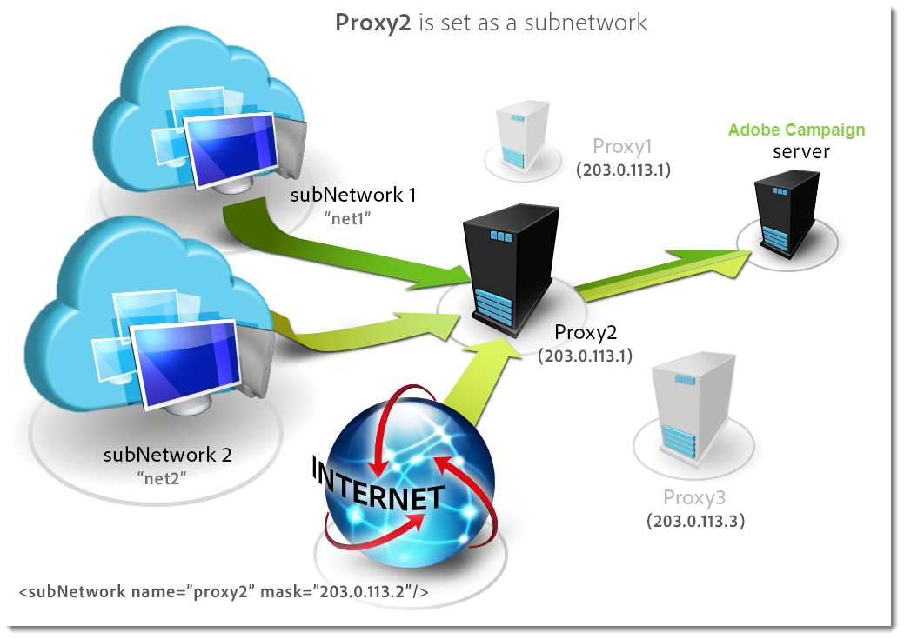

# 配置 Campaign 服务器{#configuring-campaign-server}

下节详细介绍了可根据您的需求和环境特性执行的服务器端配置。

>[!IMPORTANT]
>
>这些配置必须由管理员执行，并且 **仅适用于预置** 托管模型。
>
>对于 **托管** (Hosted)部署，服务器端设置只能由Adobe配置。 但是，可以在控制面板中设置一些设置(例如，IP允许列表管理或URL权限)。

有关详细信息，请参阅以下部分：

* [控制面板文档](https://docs.adobe.com/content/help/zh-Hans/control-panel/using/control-panel-home.html)
* [托管模型](../../installation/using/hosting-models.md)
* [Campaign Classic本地和托管功能矩阵](https://helpx.adobe.com/campaign/kb/acc-on-prem-vs-hosted.html)
* [混合型号和托管型号配置步骤](../../installation/using/about-hybrid-and-hosted-models.md) )

Campaign Classic配置文件存储在 **Adobe Campaign** 安装文件夹的conf文件夹中。 配置分布在两个文件上：

* **serverConf.xml**:所有实例的常规配置。 此文件结合了Adobe Campaign服务器的技术参数：这些属性由所有实例共享。 下面详细介绍了其中一些参数。 本节中列出的不同节点和 [参数](../../installation/using/the-server-configuration-file.md)。
* **config-`<instance>`.xml** (其中 **instance是实例的名称** ):实例的特定配置。 如果您在多个实例之间共享服务器，请在其相关文件中输入每个实例的特定参数。

## 定义安全区域 {#defining-security-zones}

### 关于安全区域 {#about-security-zones}

每个操作员需要链接到一个区域才能登录到实例，并且操作员IP必须包含在安全区域中定义的地址或地址集中。 安全区配置在Adobe Campaign服务器的配置文件中执行。

操作符从控制台（节点）中的用户档案链接到安 **[!UICONTROL Administration > Access management > Operators]** 全区。 在本节中了解如何将区域链接到活动 [运算符](#linking-a-security-zone-to-an-operator)。

### 创建安全区域 {#creating-security-zones}

区域由以下对象定义：

* 一个或多个IP地址范围（IPv4和IPv6）
* 链接到各种IP地址的技术名称

安全区域是互锁的，这意味着在另一个区域内定义新区域会减少可以登录到它的操作符数量，同时增加分配给每个操作符的权限。

在服务器配置过程中，必须在serverConf.xml **文件中定义** 区域。 serverConf.xml中的所 **有可用参数** 都列在本 [节中](../../installation/using/the-server-configuration-file.md)。

每个区域定义权限，如：

* HTTP连接而非HTTPS
* 错误显示（Java错误、JavaScript、C++等）
* 报告和webApp预览
* 通过登录名／口令进行身份验证
* 非安全连接模式

>[!NOTE]
>
>**每个运算符都必须链接到区域**。 如果操作员的IP地址属于区域定义的范围，则操作员可以登录到实例。\
>操作员的IP地址可以在多个区域中定义。 在这种情况下，操作员接收 **每个区** 域的可用权限集。

现成的serverConf.xml文 **件包括** 三个区域： **公共、VPN和LAN**。

>[!NOTE]
>
>**开箱即用配置是安全的**。 但是，在从较早版本的Adobe Campaign迁移之前，可能需要临时降低安全性，以便迁移和批准新规则。

如何在serverConf.xml文件中定 **义区域的示例** :

```
<securityZone allowDebug="false" allowHTTP="false" label="Public Network" name="public">
<subNetwork label="All addresses" mask="*" name="all"/>

<securityZone allowDebug="true" allowHTTP="false" label="Private Network (VPN)"
              name="vpn" showErrors="true">

  <securityZone allowDebug="true" allowEmptyPassword="true" allowHTTP="true"
                allowUserPassword="false" label="Private Network (LAN)" name="lan"
                sessionTokenOnly="true" showErrors="true">
    <subNetwork label="Lan 1" mask="192.168.0.0/16" name="lan1"/>
    <subNetwork label="Lan 2" mask="172.16.0.0/12" name="lan2"/>
    <subNetwork label="Lan 3" mask="10.0.0.0/8" name="lan3"/>
    <subNetwork label="Localhost" mask="127.0.0.1/16" name="locahost"/>
    <subNetwork label="Lan (IPv6)" mask="fc00::/7" name="lan6"/>
    <subNetwork label="Localhost (IPv6)" mask="::1/128" name="localhost6"/>
  </securityZone>

</securityZone>
</securityZone>
```

定义区域的所有权利如下：

* **allowDebug**:允许在“调试”模式下执行webApp
* **allowEmptyPassword**:授权无口令连接实例
* **allowHTTP**:无需使用HTTPS协议即可创建会话
* **allowUserPassword**:会话令牌可以具有以下格式“`<login>/<password>`”
* **sessionTokenOnly**:连接URL中不需要安全令牌
* **showErrors**:转发并显示服务器端的错误

>[!IMPORTANT]
>
>在区域定义中，每个具有true值的属 **性** 都会降低安全性。

使用消息中心时，如果有多个执行实例，您需要创建一个附加的安全区 **域，其中** sessionTokenOnly属 **性定义为** true，其中只需添加必要的IP地址。 有关配置实例的详细信息，请参 [阅此文档](../../message-center/using/creating-a-shared-connection.md)。

### 安全区的最佳实践 {#best-practices-for-security-zones}

在lan安全区的定 **义中** ，可以添加定义技术访问的IP地址掩码。 此添加将允许访问服务器上托管的所有实例。

```
<securityZone allowDebug="true" allowEmptyPassword="false" allowHTTP="true"
                    allowUserPassword="false" label="Private Network (LAN)" name="lan"
                    sessionTokenOnly="true" showErrors="true">
        <subNetwork label="Lan 1" mask="192.168.0.0/16" name="lan1"/>
        <subNetwork label="Lan 2" mask="172.16.0.0/12" name="lan2"/>
        <subNetwork label="Lan 3" mask="10.0.0.0/8" name="lan3"/>
        <subNetwork label="Localhost" mask="127.0.0.1/16" name="locahost"/>
        <subNetwork label="Lan (IPv6)" mask="fc00::/7" name="lan6"/>
        <subNetwork label="Localhost (IPv6)" mask="::1/128" name="localhost6"/>
  
        <!-- Customer internal IPs -->
        <subNetwork id="internalNetwork" mask="a.b.c.d/xx"/>

      </securityZone>
```

我们建议仅在仅访问特定实例的操作员专用的配置文件中直接定义IP地址范围。

在文 **`config-<instance>.xml`** 件中：

```
  <securityZone name="public">
   ...
    <securityZone name="vpn">
      <subNetwork id="cus1" mask="a.b.c.d/xx"/>
```

### 安全区域中的子网和代理 {#sub-networks-and-proxies-in-a-security-zone}

代理 **参数** ，可在subNetwork元素中使 **用，以指** 定在安全区域中使用代理。

当引用代理并通过此代理进入连接时（通过HTTP X-Forwarded-For头可见），验证区域是代理客户端的区域，而不是代理客户端的区域。

>[!IMPORTANT]
>
>如果配置了代理并且可以覆盖它（如果不存在），则将测试的IP地址将能够被伪造。
>
>此外，中继现在与代理一样生成。 因此，您可以将IP地址127.0.0.1添加到安全区配置中的代理列表。
>
>For example: &quot; `<subnetwork label="Lan 1" mask="192.168.0.0/16" name="lan1" proxy="127.0.0.1,10.100.2.135" />`&quot;.

可能会发生各种情况：

* 子网络在安全区中直接引用，并且未配置代理：子网用户可以直接连接到Adobe Campaign服务器。

   

* 为安全区域中的子网络指定代理：来自此子网络的用户可以通过此代理访问Adobe Campaign服务器。

   

* 代理包含在安全区子网络中：有权通过此代理访问的用户，无论其来源如何，都可以访问Adobe Campaign服务器。

   

可能访问Adobe Campaign服务器的代理的IP地址必须在相关网络和第一 **`<subnetwork>`** 级子网中输入 **`<subnetwork name="all"/>`**。 例如，此处用于IP地址为10.131.146.102的代理：

```
<securityZone allowDebug="false" allowHTTP="false" label="Public Network" 
                      name="public">
    <subNetwork label="All addresses" mask="*" name="all"
                      proxy="10.131.146.102,127.0.0.1, ::1"/>

    <securityZone allowDebug="true" allowHTTP="false" label="Private Network (VPN)" 
                      name="vpn" showErrors="true">
        <securityZone allowDebug="true" allowEmptyPassword="false" allowHTTP="true" 
                      allowUserPassword="false" label="Private Network (LAN)" 
                      name="lan" sessionTokenOnly="true" showErrors="true">
            <subNetwork label="Lan proxy" mask="10.131.193.182" name="lan3" 
                      proxy="10.131.146.102,127.0.0.1, ::1"/>
            <subNetwork label="Lan 1" mask="192.168.0.0/16" name="lan1" 
                      proxy="127.0.0.1, ::1"/>

        </securityZone>
    </securityZone>
</securityZone>
```

### 将安全区域链接到运算符 {#linking-a-security-zone-to-an-operator}

定义区域后，必须将每个操作员链接到其中一个才能登录实例，并且该操作员的IP地址必须包含在区域中引用的地址或地址范围中。

区域的技术配置在活动服务器的配置文件中执行： **serverConf.xml**。

在此之前，您必须通过配置现成开始来明细列表 **[!UICONTROL Security zone]** ，将标签链接到serverConf.xml文件中定义的 **区域的内部名称** 。

此配置在活动资源管理器中完成：

1. 单击节 **[!UICONTROL Administration > Platform > Enumerations]** 点。
1. 选择系 **[!UICONTROL Security zone (securityZone)]** 统明细列表。

   

1. 对于在服务器配置文件中定义的每个安全区，单击按 **[!UICONTROL Add]** 钮。
1. 在字 **[!UICONTROL Internal name]** 段中，输入serverConf.xml文件中定 **义的区域名** 。 它对应于元 **素的** @name属 `<securityzone>` 性。 在标签字段中输入链接到内部名称的 ****&#x200B;标签。

   

1. 单击“确定”并保存修改。

定义区域并配置明细列表 **[!UICONTROL Security zone]** 后，您需要将每个运算符链接到安全区域：

1. 单击节 **[!UICONTROL Administration > Access management > Operators]** 点。
1. 选择要将安全区域链接到的操作员，然后单击选 **[!UICONTROL Edit]** 项卡。
1. 转到选项 **[!UICONTROL Access rights]** 卡并单击链 **[!UICONTROL Edit access parameters...]** 接。

   

1. 从下拉式列表 **[!UICONTROL Authorized connection zone]** 中选择一个区域

   

1. 单击 **[!UICONTROL OK]** 并保存修改以应用这些更改。

## 配置Tomcat {#configuring-tomcat}

### Tomcat的默认端口 {#default-port-for-tomcat}

当Tomcat服务器的8080侦听端口已忙于配置所需的其他应用程序时，您需要将8080端口替换为免费端口（例如8090）。 要更改它，请编 **辑保存在Adobe Campaign安** 装文件夹/tomcat-7/conf目录中 **** 的server.xml文件。

然后修改JSP中继页的端口。 为此，请更改 **保存在Adobe Campaign安装目** 录的/conf目录中的 **** serverConf.xml文件。 serverConf.xml中的所 **有可用参数** 都列在本 [节中](../../installation/using/the-server-configuration-file.md)。

```
<serverConf>
   ...
   <web controlPort="8005" httpPort="8090"...
   <url ... targetUrl="http://localhost:8090"...
```

### 在Tomcat中映射文件夹 {#mapping-a-folder-in-tomcat}

要定义客户特定设置，可以在 **/tomcat-7/conf文件夹** 中创建user_上下文 **.xml文件** ，该文件夹也包含 **上下文.xml** 文件。

此文件将包含以下类型的信息：

```
 <Context path='/foo' docBase='../customers/foo'   crossContext='true' debug='0' reloadable='true' trusted='false'/>
```

如有必要，可以在服务器端重现此操作。

## 个性化投放参数 {#personalizing-delivery-parameters}

投放参数在serverConf.xml **配置文件中定** 义。 serverConf.xml中的所 **有可用参数** 都列在本 [节中](../../installation/using/the-server-configuration-file.md)。

一般服务器配置和命令在活动服务 [器配置中详细介绍](../../installation/using/campaign-server-configuration.md)。

您还可以根据您的需求和设置执行以下配置。

### SMTP中继 {#smtp-relay}

MTA模块充当SMTP广播（端口25）的本机邮件传输代理。

但是，如果安全策略要求使用中继服务器来替换它，则可能。 在这种情况下，全局吞吐量将是中继吞吐量(前提是中继服务器吞吐量低于Adobe Campaign吞吐量)。

在这种情况下，通过在部分中配置SMTP服务器来设置这些 **`<relay>`** 参数。 必须指定用于传输邮件的SMTP服务器的IP地址（或主机）及其关联端口（默认为25）。

```
<relay address="192.0.0.3" port="25"/>
```

>[!IMPORTANT]
>
>此操作模式对投放造成严重限制，因为由于中继服务器的固有性能（延迟、带宽……），它可以大大降低吞吐量。 此外，限定同步投放错误（通过分析SMTP流量检测到）的容量将受到限制，如果中继服务器不可用，则发送将不可能。

### MTA子进程 {#mta-child-processes}

可以根据服务器的CPU功率和可用网络资源控制子进程（默认为2）的数量，以优化广播性能。 此配置将在每台计算机 **`<master>`** 的MTA配置部分进行。

```
<master dataBasePoolPeriodSec="30" dataBaseRetryDelaySec="60" maxSpareServers="2" minSpareServers="0" startSpareServers="0">
```

另请参阅电子 [邮件发送优化](../../installation/using/email-deliverability.md#email-sending-optimization)。

### 使用关联管理出站SMTP通信 {#managing-outbound-smtp-traffic-with-affinities}

>[!IMPORTANT]
>
>关联配置需要从一台服务器协调到另一台服务器。 我们建议您与Adobe联系进行关联配置，因为应在运行MTA的所有应用程序服务器上复制配置更改。

您可以通过具有IP地址的关联改善出站SMTP通信。

为此，请应用以下步骤：

1. 在serverConf.xml文 **`<ipaffinity>`** 件的一 **节中输入关联** 。

   一个关联可以有多个不同的名称：分离，使用 **;** 字符。

   示例:

   ```
    IPAffinity name="mid.Server;WWserver;local.Server">
             <IP address="XX.XXX.XX.XX" heloHost="myserver.us.campaign.net" publicId="123" excludeDomains="neo.*" weight="5"/
   ```

   要视图相关参数，请参 **阅serverConf.xml** 文件。

1. 要在下拉关联中启用关联选择，您需要在IPAfinity列表中添加明细列表 **名** 。

   

   >[!NOTE]
   >
   >明细列表详见 [此文档](../../platform/using/managing-enumerations.md)。

   然后，您可以选择要使用的关联，如下所示，用于字型：

   

   >[!NOTE]
   >
   >您还可以参考 [投放服务器配置](../../installation/using/email-deliverability.md#delivery-server-configuration)。

## URL 权限 {#url-permissions}

Campaign Classic 实例可以通过 JavaScript 代码（工作流等）调用的 URL 默认列表是有限的。这些 URL 允许实例正常运行。

默认情况下，实例不允许连接到外部 URL。但是，可以向授权URL的列表添加一些外部URL，这样您的实例就可以连接到它们。 这允许您将 Campaign 实例连接到外部系统，例如 SFTP 服务器或网站，以启用文件和/或数据传输。

添加 URL 后，该 URL 将在实例的配置文件 (serverConf.xml) 中引用。

它们取决于您的托管模式，用于管理URL权限的方式如下：

* **混合** 或 **内部部署**:添加允许进入serverConf. **xml文件的URL**。 详细信息请参阅以下部分。
* **托管**:添加允许通过控制面板的 **URL**。 有关详细信息，请参阅[专用文档](https://docs.adobe.com/content/help/en/control-panel/using/instances-settings/url-permissions.html)。

借助 **Hybrid****和On-premise** 托管模型，管理员需要在 **ServerConf.xml文件中引** 用新的 **urlPermission** 。 serverConf.xml中的所 **有可用参数** 都列在本 [节中](../../installation/using/the-server-configuration-file.md)。

存在三种连接保护模式：

* **阻止**:将阻止所有不属于该允许列表的URL，并显示错误消息。 这是在配置升级之后的默认模式。
* **允许**:允许所有不属于允许列表的URL。
* **警告**:允许所有不属于该允许列表的URL，但JS解释器会发出警告，以便管理员可以收集这些URL。 此模式添加JST-310027警告消息。

```
<urlPermission action="warn" debugTrace="true">
  <url dnsSuffix="abc.company1.com" urlRegEx=".*" />
  <url dnsSuffix="def.partnerA_company1.com" urlRegEx=".*" />
  <url dnsSuffix="xyz.partnerB_company1.com" urlRegEx=".*" />
</urlPermission>
```

>[!IMPORTANT]
>
>默认情况下，新客户的客户端使用 **阻止模式**。 如果需要允许新URL，则应联系管理员以将其添加到允许列表。
>
>来自迁移的现有客户可以使用 **警告模式** ，时间较长。 同时，在对URL授权之前，他们需要分析出站流量。 定义授权URL的列表后，应联系其管理员，将URL添加到允许列表并激活阻 **止模式**。

## 动态页面安全性和中继 {#dynamic-page-security-and-relays}

默认情况下，所有动态页都自动与启 **动Web模块** 的计算机的本地Tomcat服务器相关。 此配置在ServerConf.xml **`<url>`** 文件的查询中继配置 **部分中输入** 。 serverConf.xml中的所 **有可用参数** 都列在本 [节中](../../installation/using/the-server-configuration-file.md)。

在远程服务器上中继动态页 **的执** 行；如果计算机上未激活Web模块。 为此，必须用JSP和 **JSSP** 、Web 应用程序、报表和字符串的远程计算机名称替换localhost。

有关各种可用参数的详细信息，请 **参阅serverConf.xml** 配置文件。

对于JSP页，默认配置为：

```
<url relayHost="true" relayPath="true" targetUrl="http://localhost:8080" urlPath="*.jsp"/>
```

Adobe Campaign使用以下JSP页：

* /nl/jsp/**soaprouter.jsp**:客户端控制台和Web服务连接(SOAP API),
* /nl/jsp/**m.jsp**:镜像页面,
* /nl/jsp/**logon.jsp**:基于Web访问报告和客户端控制台的部署，
* /nl/jsp/**s.jsp** :使用病毒式营销（赞助和社交网络）。

用于移动应用程序渠道的JSSP如下：

* nms/mobile/1/registerIOS.jssp
* nms/mobile/1/registerAndroid.jssp

**示例:**

可以从外部阻止客户机连接。 为此，只需限制soaprouter.jsp **的执行** ，并仅授权执行镜像页面、病毒链接、Web表单和公共资源。

参数如下：

```
<url IPMask="<IP_addresses>" deny=""     hostMask="" relayHost="true"  relayPath="true"  targetUrl="http://localhost:8080" timeout="" urlPath="*.jsp"/>
<url IPMask="<IP_addresses>" deny=""     hostMask="" relayHost="true"  relayPath="true"  targetUrl="http://localhost:8080" timeout="" urlPath="*.jssp"/> 
<url IPMask=""               deny=""     hostMask="" relayHost="true" relayPath="true" targetUrl="http://localhost:8080" timeout="" urlPath="m.jsp"/>
<url IPMask=""               deny=""     hostMask="" relayHost="true" relayPath="true" targetUrl="http://localhost:8080" timeout="" urlPath="s.jsp"/>
<url IPMask=""               deny=""     hostMask="" relayHost="true" relayPath="true" targetUrl="http://localhost:8080" timeout="" urlPath="webForm.jsp"/>
<url IPMask=""               deny=""     hostMask="" relayHost="true"  relayPath="true"  targetUrl="http://localhost:8080" timeout="" urlPath="/webApp/pub*"/>
<url IPMask=""               deny=""     hostMask="" relayHost="true"  relayPath="true"  targetUrl="http://localhost:8080" timeout="" urlPath="/jssp/pub*"/>
<url IPMask=""               deny=""     hostMask="" relayHost="true"  relayPath="true"  targetUrl="http://localhost:8080" timeout="" urlPath="/strings/pub*"/>
<url IPMask=""               deny=""     hostMask="" relayHost="true"  relayPath="true"  targetUrl="http://localhost:8080" timeout="" urlPath="/interaction/pub*"/>
<url IPMask=""               deny="true" hostMask="" relayHost="false" relayPath="false" targetUrl="http://localhost:8080" timeout="" urlPath="*.jsp"/>
<url IPMask=""               deny="true" hostMask="" relayHost="false" relayPath="false" targetUrl="http://localhost:8080" timeout="" urlPath="*.jssp"/>
```

在此示例中，该 **`<IP_addresses>`** 值与授权使用此掩码的中继模块的IP地址的列表（以comas分隔）一致。

>[!NOTE]
>
>值应根据您的配置和网络限制进行调整，尤其是在为您的安装开发了特定配置时。

## 限制授权外部命令 {#restricting-authorized-external-commands}

>[!NOTE]
>
>仅内部部署安装需要以下配置。

从构建8780开始，技术管理员可以限制可用于Adobe Campaign的授权外部命令的列表。

为此，您需要创建一个文本文件，其中列表有您要阻止使用的命令，例如：

```
ln
dd
openssl
curl
wget
python
python3
perl
ruby
sh
```

>[!IMPORTANT]
>
>此列表并非完全。

在服务器 **配置** 文件的执行节点中，需要引用blocklistFile属性中以前创建 **的文件** 。

**仅适用于Linux**:在服务器配置文件中，我们重命令您指定一个专用于执行外部命令的用户，以增强您的安全配置。 此用户在配置文 **件的** “执行”节点中设置。 serverConf.xml中的所 **有可用参数** 都列在本 [节中](../../installation/using/the-server-configuration-file.md)。

>[!NOTE]
>
>如果未指定用户，则在Adobe Campaign实例的用户上下文中执行所有命令。 用户必须与运行Adobe Campaign的用户不同。

例如：

```
<serverConf>
 <exec user="theUnixUser" blocklistFile="/pathtothefile/blocklist"/>
</serverConf>
```

此用户需要添加到“neolane”列表运算符的Adobe Campaign符。

>[!IMPORTANT]
>
>您不应使用自定义sudo。 系统上需要安装标准sudo。

## 管理HTTP头 {#managing-http-headers}

默认情况下，不中继所有HTTP头。 您可以在中继发送的回复中添加特定标头。 操作步骤：

1. 转至 **serverConf.xml文件** 。 serverConf.xml中的所 **有可用参数** 都列在本 [节中](../../installation/using/the-server-configuration-file.md)。
1. 在节 **`<relay>`** 点中，转到中继HTTP头的列表。
1. 添加具 **`<responseheader>`** 有以下属性的元素：

   * **name**:标题名称
   * **值**:值名称。

   例如：

   ```
   <responseHeader name="Strict-Transport-Security" value="max-age=16070400; includeSubDomains"/>
   ```

## 冗余跟踪 {#redundant-tracking}

当多台服务器用于重定向时，它们必须能够通过SOAP调用彼此通信，以共享来自要重定向的URL的信息。 在投放开始时，可能并非所有重定向服务器都可用；因此他们可能没有同等级别的信息。

>[!NOTE]
>
>使用标准或企业架构时，必须授权主应用程序服务器在每台计算机上上传跟踪信息。

必须通过serverConf.xml文件在重定向配置中指定冗余服 **务器的URL** 。 serverConf.xml中的所 **有可用参数** 都列在本 [节中](../../installation/using/the-server-configuration-file.md)。

**示例:**

```
<spareserver enabledIf="$(hostname)!='front_srv1'" id="1" url="http://front_srv1:8080" />
<spareserver enabledIf="$(hostname)!='front_srv2'" id="2" url="http://front_srv2:8080" />
```

enableIf **属性是** 可选的（默认情况下为空），并且仅当结果为true时，才允许启用连接；这样，您就可以在所有重定向服务器上获得相同的配置。

要获取计算机的主机名，请运行以下命令： **hostname -s**。

## 管理公共资源 {#managing-public-resources}

公共资源显示在管 [理公共资源中](../../installation/using/deploying-an-instance.md#managing-public-resources)。

它们存储在 **Adobe Campaign安装目录的** /var/res/instance目录中。

匹配的URL为： **http://server/res/instance** where **instance** is the name of the tracking instance.

可以通过向conf-.xml文件添加节点来指 **定另一`<instance>`个目录** ，以便在服务器上配置存储。 这意味着添加以下行：

```
<serverconf>
  <shared>
    <dataStore hosts="media*" lang="fra">
      <virtualDir name="images" path="/var/www/images"/>
     <virtualDir name="publicFileRes" path="$(XTK_INSTALL_DIR)/var/res/$(INSTANCE_NAME)/"/>
    </dataStore>
  </shared>
</serverconf>
```

在这种情况下，部署向导窗口上半部分中给定的公共资源的新URL应指向此文件夹。

## 高可用性工作流和关联 {#high-availability-workflows-and-affinities}

您可以配置多个工作流服务器(wfserver)，并将它们分发到两台或多台计算机上。 如果选择此类型的架构，请根据Adobe Campaign访问配置负载平衡器的连接模式。

要从Web访问，请选择负载平衡 **器模式** ，以限制连接时间。

如果通过Adobe Campaign控制台访问，请选 **择散列****或粘滞ip** 模式。 这样，您可以维护富客户端与服务器之间的连接，并防止用户会话在导入或导出操作期间中断。

您可以选择强制在特定计算机上执行工作流或工作流活动。 为此，您必须为相关工作流或关联定义一个或多个活动。

1. 通过在字段中输入工作流或活动的关联来创建这些 **[!UICONTROL Affinity]** 。

   您可以自由选择关联名称。 但是，请确保不使用空格或标点符号。 如果使用不同的服务器，请指定不同的名称。

   

   

   下拉列表包含以前使用的关联。 它会随着时间推移用不同的输入值完成。

1. 打开 **nl6/conf/config-`<instance>.xml`**文件。
1. 按如下方式修改与模 **[!UICONTROL wfserver]** 块匹配的行：

   ```
   <wfserver autoStart="true" affinity="XXX,"/>
   ```

   如果定义多个关联，则必须用逗号分隔，不加任何空格：

   ```
   <wfserver autoStart="true" affinity="XXX,YYY,"/>
   ```

   执行未定义关联的工作流时，必须使用关联名称后面的逗号。

   如果您希望仅执行已定义工作流的关联，请不要在关联的列表末尾添加逗号。 例如，按如下方式修改行：

   ```
   <wfserver autoStart="true" affinity="XXX"/>
   ```

## 自动进程重启 {#automatic-process-restart}

默认情况下，不同的Adobe Campaign进程每天早上6点（服务器时间）自动重新启动。

但是，您可以更改此配置。

为此，请转至安 **装的conf** repository中的 **serverConf** .xml文件。 serverConf.xml中的所 **有可用参数** 都列在本 [节中](../../installation/using/the-server-configuration-file.md)。

在此文件中配置的每个进程都有 **processRestartTime** 属性。 您可以修改此属性的值，以根据您的需求调整每个进程的重新启动时间。

>[!IMPORTANT]
>
>请勿删除此属性。 必须每天重新启动所有进程。

## 限制可上载文件 {#limiting-uploadable-files}

通过新属 **性uploadAllowList** ，可限制可在Adobe Campaign服务器上上传的文件类型。

此属性在serverConf.xml **文件的** dataStore元 **素中可用** 。 serverConf.xml中的所 **有可用参数** 都列在本 [节中](../../installation/using/the-server-configuration-file.md)。

此属性的默认值为 **。+并** 且允许您上传任何文件类型。

要限制可能的格式，必须用有效的java常规表达式替换属性值。 可以通过用逗号分隔多个值。

例如： **uploadAllowList=&quot;。*.png,*.jpg** &quot;允许您在服务器上上传PNG和JPG格式。 不接受其他格式。

>[!IMPORTANT]
>
>在Internet Explorer中，完整的文件路径必须由常规表达式验证。

## 代理连接配置 {#proxy-connection-configuration}

如果需要通过代理将活动服务器连接到外部(例如使用文件传输工作流活动)，则需要通过命令配置serverConf的proxyConfig部分。 可以使用以下代理连接：HTTP、HTTPS、FTP、SFTP。 serverConf.xml中的所 **有可用参数** 都列在本 [节中](../../installation/using/the-server-configuration-file.md)。

>[!NOTE]
>
>从20.2开始，HTTP和HTTPS协议参数不再可用。 以下信息仍然提到这些参数，因为这些参数在以前的版本中仍然可用，包括9032。
>
>不支持SOCKS代理。

使用以下命令：

```
nlserver config -setproxy:[protocol]/[serverIP]:[port]/[login][:‘https’|'http’]
```

协议参数可以是“http”、“https”或“ftp”。

如果将FTP设置为与HTTP/HTTPS通信相同的端口，则可以使用以下内容：

```
nlserver config -setproxy:http/198.51.100.0:8080/user
```

只有当协议参数为“ftp”时，才使用“http”和“https”选项，并指示指定端口上的通道是通过HTTPS还是通过HTTP执行。

如果通过代理服务器对FTP/SFTP和HTTP/HTTPS通信使用不同的端口，则应设置“ftp”协议参数。


例如：

```
nlserver config -setproxy:ftp/198.51.100.0:8080/user:’http’
```

然后输入密码。

HTTP连接在proxyHTTP参数中定义：

```
<proxyConfig enabled=“1” override=“localhost*” useSingleProxy=“0”>
<proxyHTTP address=“198.51.100.0" login=“user” password=“*******” port=“8080”/>
</proxyConfig>
```

HTTPS连接在proxyHTTPS参数中定义：

```
<proxyConfig enabled=“1" override=“localhost*” useSingleProxy=“0">
<proxyHTTPS address=“198.51.100.0” login=“user” password=“******” port=“8080"/>
</proxyConfig>
```

FTP/FTPS连接在proxyFTP参数中定义：

```
<proxyConfig enabled=“1" override=“localhost*” useSingleProxy=“0">
<proxyFTP address=“198.51.100.0” login=“user” password=“******” port=“5555" https=”true”/>
</proxyConfig>
```

如果对多种连接类型使用同一代理，则只将proxyHTTP定义为useSingleProxy设置为“1”或“true”。

如果您有应通过代理的内部连接，请在override参数中添加这些连接。

如果要临时禁用代理连接，请将启用参数设置为“false”或“0”。
