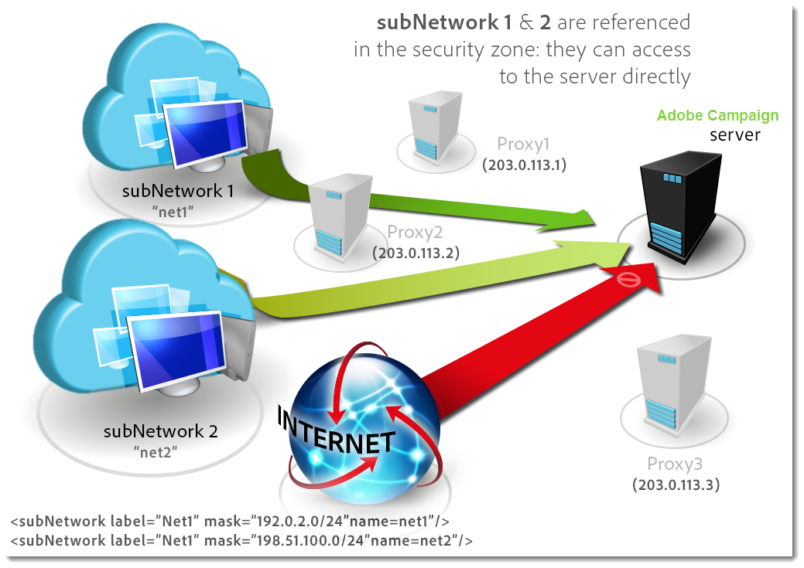

# 配置活动服务器{#configuring-campaign-server}

下节详细介绍了可根据您的需求和环境特性执行的服务器端配置。

>[!IMPORTANT]
>
>这些配置必须由管理员执行，并且仅 **适用于预置** 托管模型。
>
>对于 **托管部署** ，服务器端设置只能由Adobe配置。 但是，可以在控制面板中设置一些设置（例如，IP白名单或URL权限）。

有关详细信息，请参阅以下各节：

* [控制面板文档](https://docs.adobe.com/content/help/en/control-panel/using/control-panel-home.html)
* [托管模型](../../installation/using/hosting-models.md)
* [Campaign Classic内部部署和托管功能矩阵](https://helpx.adobe.com/campaign/kb/acc-on-prem-vs-hosted.html)
* [混合型号和托管型号配置步骤](https://docs.campaign.adobe.com/doc/AC/en/INS_Hybrid_and_Hosted_models_About_hybrid_and_hosted_models.html)

Campaign Classic配置文件存储在 **Adobe Campaign安装文件夹的** conf文件夹中。 配置分布在两个文件上：

* **serverConf.xml**:所有实例的常规配置。 此文件结合了Adobe Campaign服务器的技术参数：这些属性由所有实例共享。 下面详细介绍了其中一些参数。 本节中列出的不同节点和 [参数](../../installation/using/the-server-configuration-file.md)。
* **config-`<instance>`.xml** (其中 **instance是实例的名称** ):实例的特定配置。 如果在多个实例之间共享服务器，请在其相关文件中输入每个实例的特定参数。

## 定义安全区 {#defining-security-zones}

### 关于安全区域 {#about-security-zones}

每个运营商都需要链接到一个区域才能登录到一个实例，而运营商IP必须包含在安全区域中定义的地址或地址集中。 安全区配置在Adobe Campaign服务器的配置文件中执行。

操作符从控制台（节点）中的用户档案链接到安全 **[!UICONTROL Administration > Access management > Operators]** 区域。 在本节中了解如何将区域链接到活动 [运算符](#linking-a-security-zone-to-an-operator)。

### 创建安全区域 {#creating-security-zones}

区域由以下各项定义：

* 一个或多个IP地址范围（IPv4和IPv6）
* 链接到各种IP地址的技术名称

安全区域是互锁的，这意味着在另一个区域内定义新区域可以减少可以登录到该区域的操作员数，同时增加分配给每个操作员的权限。

在服务器配置过程中，必须在serverConf.xml文 **件中定义区域** 。 serverConf.xml中可用的所 **有参数都列在本节** 中 [](../../installation/using/the-server-configuration-file.md)。

每个区域定义权限，例如：

* HTTP连接而不是HTTPS
* 错误显示（Java错误、JavaScript、C++等）
* 报告和webApp预览
* 通过登录名／密码进行身份验证
* 非安全连接模式

>[!NOTE]
>
>**每个运算符都必须链接到一个区域**。 如果操作符的IP地址属于区域定义的范围，则操作符可以登录实例。\
>该运营商的IP地址可以在多个区域中定义。 在这种情况下，操作员会收到 **每个区** 域的可用权限集。

现成的serverConf.xml文 **件包括三个区** :公 **共、VPN和LAN**。

>[!NOTE]
>
>**开箱即用的配置是安全的**。 但是，在从较早版本的Adobe Campaign迁移之前，可能需要临时降低安全性以迁移和批准新规则。

如何在serverConf.xml文件中定义 **区域的示例** :

```
<securityZone allowDebug="false" allowHTTP="false" label="Public Network" name="public">
<subNetwork label="All addresses" mask="*" name="all"/>

<securityZone allowDebug="true" allowHTTP="false" label="Private Network (VPN)"
              name="vpn" showErrors="true">

  <securityZone allowDebug="true" allowEmptyPassword="true" allowHTTP="true"
                allowUserPassword="false" label="Private Network (LAN)" name="lan"
                sessionTokenOnly="true" showErrors="true">
    <subNetwork label="Lan 1" mask="192.168.0.0/16" name="lan1"/>
    <subNetwork label="Lan 2" mask="172.16.0.0/12" name="lan2"/>
    <subNetwork label="Lan 3" mask="10.0.0.0/8" name="lan3"/>
    <subNetwork label="Localhost" mask="127.0.0.1/16" name="locahost"/>
    <subNetwork label="Lan (IPv6)" mask="fc00::/7" name="lan6"/>
    <subNetwork label="Localhost (IPv6)" mask="::1/128" name="localhost6"/>
  </securityZone>

</securityZone>
</securityZone>
```

定义区域的所有权利如下：

* **allowDebug**:允许在“调试”模式下执行webApp
* **allowEmptyPassword**:授权在无密码的情况下连接实例
* **allowHTTP**:无需使用HTTPS协议即可创建会话
* **allowUserPassword**:会话令牌可以具有以下格式“`<login>/<password>`”
* **sessionTokenOnly**:连接URL中不需要安全令牌
* **showErrors**:转发并显示服务器端的错误

>[!IMPORTANT]
>
>在区域定义中，每个具有 **true** 值的属性都会降低安全性。

使用消息中心时，如果有多个执行实例，您需要创建一个额外的安全区，其 **sessionTokenOnly** 属性定义为 **true**，其中只需添加必要的IP地址。 有关配置实例的详细信息，请参阅 [此文档](../../message-center/using/creating-a-shared-connection.md)。

### 安全区的最佳实践 {#best-practices-for-security-zones}

在lan安全区的定 **义中** ，可以添加定义技术访问的IP地址掩码。 此添加将允许访问服务器上托管的所有实例。

```
<securityZone allowDebug="true" allowEmptyPassword="false" allowHTTP="true"
                    allowUserPassword="false" label="Private Network (LAN)" name="lan"
                    sessionTokenOnly="true" showErrors="true">
        <subNetwork label="Lan 1" mask="192.168.0.0/16" name="lan1"/>
        <subNetwork label="Lan 2" mask="172.16.0.0/12" name="lan2"/>
        <subNetwork label="Lan 3" mask="10.0.0.0/8" name="lan3"/>
        <subNetwork label="Localhost" mask="127.0.0.1/16" name="locahost"/>
        <subNetwork label="Lan (IPv6)" mask="fc00::/7" name="lan6"/>
        <subNetwork label="Localhost (IPv6)" mask="::1/128" name="localhost6"/>
  
        <!-- Customer internal IPs -->
        <subNetwork id="internalNetwork" mask="a.b.c.d/xx"/>

      </securityZone>
```

我们建议仅为仅访问特定实例的操作员直接在专用于该实例的配置文件中定义IP地址范围。

在文 **`config-<instance>.xml`** 件中：

```
  <securityZone name="public">
   ...
    <securityZone name="vpn">
      <subNetwork id="cus1" mask="a.b.c.d/xx"/>
```

### 安全区中的子网络和代理 {#sub-networks-and-proxies-in-a-security-zone}

代理 **参数可在subNetwork元** 素中使用 **** ，以指定在安全区域中的代理使用。

当引用代理并通过此代理进入连接时（通过HTTP X-Forwarded-For头可见），验证区域是代理客户端的区域，而不是代理客户端的区域。

>[!IMPORTANT]
>
>如果配置了代理并且可以覆盖它（或者如果不存在），则将测试的IP地址将能够被篡改。
>
>此外，中继现在也像代理一样生成。 因此，您可以将IP地址127.0.0.1添加到安全区配置中的代理列表。
>
>For example: &quot; `<subnetwork label="Lan 1" mask="192.168.0.0/16" name="lan1" proxy="127.0.0.1,10.100.2.135" />`&quot;.

可能会出现各种情况：

* 子网络在安全区中直接引用，并且未配置代理：子网用户可以直接连接到Adobe Campaign服务器。

   

* 为安全区域中的子网络指定代理：来自此子网络的用户可以通过此代理访问Adobe Campaign服务器。

   

* 代理包含在安全区子网络中：通过此代理具有访问权限的用户，无论其来源如何，都可以访问Adobe Campaign服务器。

   

可能访问Adobe Campaign服务器的代理的IP地址必须在相关网络和一级子网 **`<subnetwork>`** 络中输入 **`<subnetwork name="all"/>`**。 例如，此处用于IP地址为10.131.146.102的代理：

```
<securityZone allowDebug="false" allowHTTP="false" label="Public Network" 
                      name="public">
    <subNetwork label="All addresses" mask="*" name="all"
                      proxy="10.131.146.102,127.0.0.1, ::1"/>

    <securityZone allowDebug="true" allowHTTP="false" label="Private Network (VPN)" 
                      name="vpn" showErrors="true">
        <securityZone allowDebug="true" allowEmptyPassword="false" allowHTTP="true" 
                      allowUserPassword="false" label="Private Network (LAN)" 
                      name="lan" sessionTokenOnly="true" showErrors="true">
            <subNetwork label="Lan proxy" mask="10.131.193.182" name="lan3" 
                      proxy="10.131.146.102,127.0.0.1, ::1"/>
            <subNetwork label="Lan 1" mask="192.168.0.0/16" name="lan1" 
                      proxy="127.0.0.1, ::1"/>

        </securityZone>
    </securityZone>
</securityZone>
```

### 将安全区关联到运营商 {#linking-a-security-zone-to-an-operator}

定义区域后，必须将每个操作员链接到其中一个，以便能够登录到实例，并且该操作员的IP地址必须包含在区域中引用的地址或地址范围中。

区域的技术配置在活动服务器的配置文件中进行： **serverConf.xml**。

在此之前，您必须通过配置现成开始来明细列表标签，以将标签链接到 **[!UICONTROL Security zone]** serverConf.xml文件中定义的区域的内部名称 **** 。

此配置在活动资源管理器中完成：

1. 单击节 **[!UICONTROL Administration > Platform > Enumerations]** 点。
1. 选择系 **[!UICONTROL Security zone (securityZone)]** 统明细列表。

   

1. 对于在服务器配置文件中定义的每个安全区，单击按 **[!UICONTROL Add]** 钮。
1. 在字 **[!UICONTROL Internal name]** 段中，输入serverConf.xml文件中定 **义的区域名称** 。 它对应于元 **素的@name** 属 `<securityzone>` 性。 在标签字段中输入链接到内部名称的 ****&#x200B;标签。

   

1. 单击确定并保存修改。

定义区域并配置明细列表后， **[!UICONTROL Security zone]** 您需要将每个操作符链接到安全区域：

1. 单击节 **[!UICONTROL Administration > Access management > Operators]** 点。
1. 选择要将安全区域链接到的操作员，然后单击选 **[!UICONTROL Edit]** 项卡。
1. 转到选项卡 **[!UICONTROL Access rights]** 并单击该链 **[!UICONTROL Edit access parameters...]** 接。

   

1. 从下拉列表中 **[!UICONTROL Authorized connection zone]** 选择区域

   

1. 单击 **[!UICONTROL OK]** 并保存修改以应用这些更改。

## 配置Tomcat {#configuring-tomcat}

### Tomcat的默认端口 {#default-port-for-tomcat}

当Tomcat服务器的8080监听端口已忙于配置所需的其他应用程序时，您需要将8080端口替换为免费端口（例如8090）。 要更改它，请编 **辑保存在Adobe Campaign安装文件夹** /tomcat-7/conf目录中的server.xml **** 文件。

然后修改JSP中继页的端口。 为此，请更改保 **存在Adobe Campaign安装目录的** /conf目录中的serverConf.xml **** 文件。 serverConf.xml中可用的所 **有参数都列在本节** 中 [](../../installation/using/the-server-configuration-file.md)。

```
<serverConf>
   ...
   <web controlPort="8005" httpPort="8090"...
   <url ... targetUrl="http://localhost:8090"...
```

### 在Tomcat中映射文件夹 {#mapping-a-folder-in-tomcat}

要定义客户特定的设置，可以在 **/tomcat-7/conf文件夹中创建** user_上下文.xml **文件，该文件夹还包含** 上下文.xml **** 文件。

此文件将包含以下类型的信息：

```
 <Context path='/foo' docBase='../customers/foo'   crossContext='true' debug='0' reloadable='true' trusted='false'/>
```

如果需要，可以在服务器端重现此操作。

## 个性化投放参数 {#personalizing-delivery-parameters}

投放参数在serverConf.xml配 **置文件中定义** 。 serverConf.xml中可用的所 **有参数都列在本节** 中 [](../../installation/using/the-server-configuration-file.md)。

常规服务器配置和命令在活动服务器配 [置中有详细说明](../../installation/using/campaign-server-configuration.md)。

您还可以根据需要和设置执行以下配置。

### SMTP中继 {#smtp-relay}

MTA模块用作SMTP广播（端口25）的本机邮件传输代理。

但是，如果您的安全策略需要中继服务器来替换它，这是可能的。 在这种情况下，全局吞吐量将是中继吞吐量(前提是中继服务器吞吐量低于Adobe Campaign吞吐量)。

在这种情况下，通过在部分中配置SMTP服务器来设置这些参 **`<relay>`** 数。 必须指定用于传输邮件的SMTP服务器的IP地址（或主机）及其关联端口（默认为25）。

```
<relay address="192.0.0.3" port="25"/>
```

>[!IMPORTANT]
>
>此操作模式对投放的限制很严重，因为由于中继服务器的固有性能（延迟、带宽……），它可以大大降低吞吐量。 此外，限定同步投放错误（通过分析SMTP流量检测到）的容量将受到限制，如果中继服务器不可用，则发送将不可能。

### MTA子进程 {#mta-child-processes}

可以根据服务器的CPU功率和可用网络资源控制子进程（默认为2）的数量，以优化广播性能。 此配置将在每个单台计算 **`<master>`** 机上的MTA配置部分进行。

```
<master dataBasePoolPeriodSec="30" dataBaseRetryDelaySec="60" maxSpareServers="2" minSpareServers="0" startSpareServers="0">
```

另请参阅电子 [邮件发送优化](../../installation/using/email-deliverability.md#email-sending-optimization)。

### 使用关联管理出站SMTP流量 {#managing-outbound-smtp-traffic-with-affinities}

>[!IMPORTANT]
>
>关联配置需要从一台服务器到另一台服务器的一致性。 我们建议您与Adobe联系以进行关联配置，因为应在运行MTA的所有应用程序服务器上复制配置更改。

您可以通过具有IP地址的关联改善出站SMTP流量。

为此，请应用以下步骤：

1. 在serverConf.xml文 **`<ipaffinity>`** 件的一 **节中输入关联** 。

   一个关联可以有多个不同的名称：分离，使用 **;** 字符。

   例如：

   ```
    IPAffinity name="mid.Server;WWserver;local.Server">
             <IP address="XX.XXX.XX.XX" heloHost="myserver.us.campaign.net" publicId="123" excludeDomains="neo.*" weight="5"/
   ```

   要视图相关参数，请参阅 **serverConf.xml文件** 。

1. 要在下拉关联中启用明细列表选择，您需要在 **IPAfinity列表中添加关联名称** 。

   

   >[!NOTE]
   >
   >明细列表详见 [本文档](../../platform/using/managing-enumerations.md)。

   然后，您可以选择要使用的关联，如下面所示的类型：

   

   >[!NOTE]
   >
   >您还可以参考 [投放服务器配置](../../installation/using/email-deliverability.md#delivery-server-configuration)。

## URL权限 {#url-permissions}

可由JavaScript代码调用的URL的默认列表(工作流等)Campaign Classic实例有限。 这些URL允许实例正常工作。

默认情况下，实例不允许连接到外部URL。 但是，可以向授权URL的列表添加一些外部URL，这样您的实例就可以连接到它们。 这允许您将活动实例连接到外部系统（例如，SFTP服务器或网站），以便启用文件和／或数据传输。

添加URL后，该URL将在实例的配置文件(serverConf.xml)中引用。

它们取决于您的托管模型，您管理URL权限的方式如下：

* **混合** 或 **内部部署**:将允许的URL添加 **到serverConf.xml文件中**。 有关详细信息，请参阅以下部分。
* **托管**:通过控制面板添加允许 **的URL**。 有关详细信息，请参阅专 [用文档](https://docs.adobe.com/content/help/en/control-panel/using/instances-settings/url-permissions.html)。

使用 **Hybrid****和On-premise** 托管模型时，管理员需要在 **Conf.xml文件中引用新的urlConf****** 权限。 serverConf.xml中可用的所 **有参数都列在本节** 中 [](../../installation/using/the-server-configuration-file.md)。

存在三种连接保护模式：

* **阻止**:不属于白名单的所有URL都会被阻止，并显示一条错误消息。 这是配置升级后的默认模式。
* **权限**:允许所有不属于白名单的URL。
* **警告**:允许所有非白色URL，但JS解释程序会发出警告，以便管理员可以收集这些URL。 此模式添加JST-310027警告消息。

```
<urlPermission action="warn" debugTrace="true">
  <url dnsSuffix="abc.company1.com" urlRegEx=".*" />
  <url dnsSuffix="def.partnerA_company1.com" urlRegEx=".*" />
  <url dnsSuffix="xyz.partnerB_company1.com" urlRegEx=".*" />
</urlPermission>
```

>[!IMPORTANT]
>
>默认情况下，新客户的客户端使用阻 **止模式**。 如果他们需要允许新的URL，则应联系其管理员以将其列入白名单。
>
>来自迁移的现有客户可以在一段时间 **内使用警** 告模式。 同时，他们需要在授权URL之前分析出站流量。 定义授权URL的列表后，他们应联系其管理员以将URL列入白名单并激活阻 **止模式**。

## 动态页面安全性和中继 {#dynamic-page-security-and-relays}

默认情况下，所有动态页都自动与启动 **Web模块的计算机的本地** Tomcat服务器相关。 此配置在 **`<url>`** ServerConf.xml文件的查询中继配置部分中输入 **** 。 serverConf.xml中可用的所 **有参数都列在本节** 中 [](../../installation/using/the-server-configuration-file.md)。

在远程服务器上中继动态页的执 **行** ;如果计算机上未激活Web模块。 为此，必须将 **localhost** 替换为JSP和JSSP、Web 应用程序、报告和字符串的远程计算机的名称。

有关各种可用参数的详细信息，请参 **阅serverConf.xml配置文件** 。

对于JSP页，默认配置为：

```
<url relayHost="true" relayPath="true" targetUrl="http://localhost:8080" urlPath="*.jsp"/>
```

Adobe Campaign使用以下JSP页：

* /nl/jsp/**soaprouter.jsp**:客户端控制台和Web服务连接(SOAP API),
* /nl/jsp/**m.jsp**:镜像页面,
* /nl/jsp/**logon.jsp**:通过Web访问报告和客户端控制台的部署，
* /nl/jsp/**s.jsp** :使用病毒式营销（赞助和社交网络）。

用于移动应用程序渠道的JSSP如下：

* nms/mobile/1/registerIOS.jssp
* nms/mobile/1/registerAndroid.jssp

**例如：**

可以防止从外部连接客户端机器。 为此，只需限制 **soapruter.jsp的执行** ，并仅授权执行镜像页面、病毒式链接、Web表单和公共资源。

参数如下：

```
<url IPMask="<IP_addresses>" deny=""     hostMask="" relayHost="true"  relayPath="true"  targetUrl="http://localhost:8080" timeout="" urlPath="*.jsp"/>
<url IPMask="<IP_addresses>" deny=""     hostMask="" relayHost="true"  relayPath="true"  targetUrl="http://localhost:8080" timeout="" urlPath="*.jssp"/> 
<url IPMask=""               deny=""     hostMask="" relayHost="true" relayPath="true" targetUrl="http://localhost:8080" timeout="" urlPath="m.jsp"/>
<url IPMask=""               deny=""     hostMask="" relayHost="true" relayPath="true" targetUrl="http://localhost:8080" timeout="" urlPath="s.jsp"/>
<url IPMask=""               deny=""     hostMask="" relayHost="true" relayPath="true" targetUrl="http://localhost:8080" timeout="" urlPath="webForm.jsp"/>
<url IPMask=""               deny=""     hostMask="" relayHost="true"  relayPath="true"  targetUrl="http://localhost:8080" timeout="" urlPath="/webApp/pub*"/>
<url IPMask=""               deny=""     hostMask="" relayHost="true"  relayPath="true"  targetUrl="http://localhost:8080" timeout="" urlPath="/jssp/pub*"/>
<url IPMask=""               deny=""     hostMask="" relayHost="true"  relayPath="true"  targetUrl="http://localhost:8080" timeout="" urlPath="/strings/pub*"/>
<url IPMask=""               deny=""     hostMask="" relayHost="true"  relayPath="true"  targetUrl="http://localhost:8080" timeout="" urlPath="/interaction/pub*"/>
<url IPMask=""               deny="true" hostMask="" relayHost="false" relayPath="false" targetUrl="http://localhost:8080" timeout="" urlPath="*.jsp"/>
<url IPMask=""               deny="true" hostMask="" relayHost="false" relayPath="false" targetUrl="http://localhost:8080" timeout="" urlPath="*.jssp"/>
```

在此示例中，该值 **`<IP_addresses>`** 与授权使用此掩码的中继模块的IP地址的列表（用命令分隔）一致。

>[!NOTE]
>
>值应根据您的配置和网络限制而调整，特别是在为您的安装开发了特定配置时。

## 限制授权的外部命令 {#restricting-authorized-external-commands}

>[!NOTE]
>
>仅内部部署安装需要以下配置。

从构建8780开始，技术管理员可以限制列表可用于Adobe Campaign的授权外部命令。

为此，您需要创建一个文本文件，其中列表了您希望禁止使用的命令，例如：

```
ln
dd
openssl
curl
wget
python
python3
perl
ruby
sh
```

>[!IMPORTANT]
>
>此列表并非完全。

在服务 **器配置文件** exec节点中，您需要引用blacklistFile属性中先前创建的 **文件** 。

**仅适用于Linux**:在服务器配置文件中，我们重新命令您指定一个专用于执行外部命令的用户，以增强您的安全配置。 此用户在配置文件的 **exec** 节点中设置。 serverConf.xml中可用的所 **有参数都列在本节** 中 [](../../installation/using/the-server-configuration-file.md)。

>[!NOTE]
>
>如果未指定用户，则在Adobe Campaign实例的用户上下文中执行所有命令。 用户必须与运行Adobe Campaign的用户不同。

例如：

```
<serverConf>
 <exec user="theUnixUser" blacklistFile="/pathtothefile/blacklist"/>
</serverConf>
```

此用户需要添加到“neolane”Adobe Campaign运算符的用户列表。

>[!IMPORTANT]
>
>您不应使用自定义sudo。 系统上需要安装标准Sudo。

## 管理HTTP头 {#managing-http-headers}

默认情况下，不会中继所有HTTP头。 您可以在中继发送的回复中添加特定的标题。 操作步骤：

1. 转到 **serverConf.xml文件** 。 serverConf.xml中可用的所 **有参数都列在本节** 中 [](../../installation/using/the-server-configuration-file.md)。
1. 在节 **`<relay>`** 点中，转到中继HTTP头的列表。
1. 添加具 **`<responseheader>`** 有以下属性的元素：

   * **name**:标题名称
   * **value**:值名称。
   例如：

   ```
   <responseHeader name="Strict-Transport-Security" value="max-age=16070400; includeSubDomains"/>
   ```

## 冗余跟踪 {#redundant-tracking}

当多台服务器用于重定向时，它们必须能够通过SOAP调用相互通信，以共享来自要重定向的URL的信息。 在投放开始时，可能并非所有重定向服务器都可用；因此他们可能没有同等级别的信息。

>[!NOTE]
>
>使用标准或企业架构时，必须授权主应用程序服务器在每台计算机上上传跟踪信息。

必须通过serverConf.xml文件在重定向配置中指定冗余服 **务器的URL** 。 serverConf.xml中可用的所 **有参数都列在本节** 中 [](../../installation/using/the-server-configuration-file.md)。

**例如：**

```
<spareserver enabledIf="$(hostname)!='front_srv1'" id="1" url="http://front_srv1:8080" />
<spareserver enabledIf="$(hostname)!='front_srv2'" id="2" url="http://front_srv2:8080" />
```

enableIf **** 属性为可选属性（默认情况下为空），并且仅当结果为true时，才允许您启用连接；这样，您就可以在所有重定向服务器上获得相同的配置。

要获取计算机的主机名，请运行以下命令： **hostname -s**。

## 管理公共资源 {#managing-public-resources}

公共资源显示在管理 [公共资源中](../../installation/using/deploying-an-instance.md#managing-public-resources)。

它们存储在Adobe Campaign安 **装目录的/var/res/instance** 目录中。

匹配的URL为： **http://server/res/instance** ，其 **中instance** 是跟踪实例的名称。

可以通过向 **conf-`<instance>`** .xml文件添加节点来指定另一个目录，以在服务器上配置存储。 这意味着添加以下行：

```
<serverconf>
  <shared>
    <dataStore hosts="media*" lang="fra">
      <virtualDir name="images" path="/var/www/images"/>
     <virtualDir name="publicFileRes" path="$(XTK_INSTALL_DIR)/var/res/$(INSTANCE_NAME)/"/>
    </dataStore>
  </shared>
</serverconf>
```

在这种情况下，部署向导窗口上半部分中给定的公共资源的新URL应指向此文件夹。

## 高可用性工作流和关联 {#high-availability-workflows-and-affinities}

您可以配置多个工作流服务器(wfserver)，并将它们分发到两台或多台计算机上。 如果选择此类型的架构，请根据Adobe Campaign访问配置负载平衡器的连接模式。

要从Web访问，请选择负载平衡 **器模式** ，以限制连接时间。

如果通过Adobe Campaign控制台访问，请选择 **哈希** 或 **粘性ip** 模式。 这允许您维护富客户端与服务器之间的连接，并防止用户会话在导入或导出操作期间中断。

您可以选择强制在特定计算机上执行工作流或工作流活动。 为此，您必须为相关工作流或关联定义一个或多个活动。

1. 通过在字段中输入工作流或活动的关联，创建这些 **[!UICONTROL Affinity]** 。

   您可以自由选择关联名称。 但是，请确保不使用空格或标点符号。 如果使用不同的服务器，请指定不同的名称。

   

   

   下拉列表包含以前使用的关联。 它会随着时间推移而使用不同的输入值完成。

1. 打开 **nl6/conf/config-`<instance>.xml`**文件。
1. 修改与模块匹配的 **[!UICONTROL wfserver]** 行，如下所示：

   ```
   <wfserver autoStart="true" affinity="XXX,"/>
   ```

   如果定义多个关联，则必须用逗号分隔，不带空格：

   ```
   <wfserver autoStart="true" affinity="XXX,YYY,"/>
   ```

   执行未定义关联的工作流时，必须在关联名称后添加逗号。

   如果您希望仅执行定义了工作流的关联，请不要在关联的列表末尾添加逗号。 例如，按如下方式修改行：

   ```
   <wfserver autoStart="true" affinity="XXX"/>
   ```

## 自动进程重启 {#automatic-process-restart}

默认情况下，不同的Adobe Campaign进程每天在上午6点（服务器时间）自动重新启动。

但是，您可以更改此配置。

为此，请转到位于您 **安装的conf存储库中的serverConf****** .xml文件。 serverConf.xml中可用的所 **有参数都列在本节** 中 [](../../installation/using/the-server-configuration-file.md)。

在此文件中配置的每个进程都有一个 **processRestartTime** 属性。 您可以修改此属性的值，以根据您的需求调整每个进程的重新启动时间。

>[!IMPORTANT]
>
>请勿删除此属性。 必须每天重新启动所有进程。

## 限制可上载文件 {#limiting-uploadable-files}

通过新属 **性uploadWhiteList** ，可限制可在Adobe Campaign服务器上上传的文件类型。

此属性在serverConf.xml文 **件的dataStore** 元 **素中可用** 。 serverConf.xml中可用的所 **有参数都列在本节** 中 [](../../installation/using/the-server-configuration-file.md)。

此属性的默认值是 **。+** ，并且它允许您上传任何文件类型。

要限制可能的格式，必须用有效的java常规表达式替换属性值。 您可以通过用逗号分隔多个值来输入它们。

例如： **uploadWhiteList=&quot;。*.png,.*.jpg&quot;** ，允许您在服务器上上传PNG和JPG格式。 不接受其他格式。

>[!IMPORTANT]
>
>在Internet Explorer中，完整的文件路径必须由常规表达式验证。

## 代理连接配置 {#proxy-connection-configuration}

如果需要通过代理(例如使用文件传输工作流活动)将活动服务器连接到外部，则需要通过命令配置serverConf的proxyConfig部分。 可以使用以下代理连接：HTTP、HTTPS、FTP、SFTP。 serverConf.xml中可用的所 **有参数都列在本节** 中 [](../../installation/using/the-server-configuration-file.md)。

>[!NOTE]
>
>不支持SOCKS代理。

使用以下命令：

```
nlserver config -setproxy:[protocol]/[serverIP]:[port]/[login][:‘https’|'http’]
```

协议参数可以是“http”、“https”或“ftp”。

如果要将FTP设置为与HTTP/HTTPS通信相同的端口，则可以使用以下内容：

```
nlserver config -setproxy:http/198.51.100.0:8080/user
```

只有当协议参数为“ftp”时，才使用“http”和“https”选项，并指示指定端口上的通道是通过HTTPS还是通过HTTP执行。

如果对代理服务器上的FTP/SFTP和HTTP/HTTPS通信使用不同的端口，则应设置“ftp”协议参数。


例如：

```
nlserver config -setproxy:ftp/198.51.100.0:8080/user:’http’
```

然后输入密码。

HTTP连接在proxyHTTP参数中定义：

```
<proxyConfig enabled=“1” override=“localhost*” useSingleProxy=“0”>
<proxyHTTP address=“198.51.100.0" login=“user” password=“*******” port=“8080”/>
</proxyConfig>
```

HTTPS连接在proxyHTTPS参数中定义：

```
<proxyConfig enabled=“1" override=“localhost*” useSingleProxy=“0">
<proxyHTTPS address=“198.51.100.0” login=“user” password=“******” port=“8080"/>
</proxyConfig>
```

FTP/FTPS连接在proxyFTP参数中定义：

```
<proxyConfig enabled=“1" override=“localhost*” useSingleProxy=“0">
<proxyFTP address=“198.51.100.0” login=“user” password=“******” port=“5555" https=”true”/>
</proxyConfig>
```

如果对多种连接类型使用同一代理，则只定义proxyHTTP，并将useSingleProxy设置为“1”或“true”。

如果您有内部连接应通过代理，请在override参数中添加这些连接。

如果要临时禁用代理连接，请将enabled参数设置为“false”或“0”。
