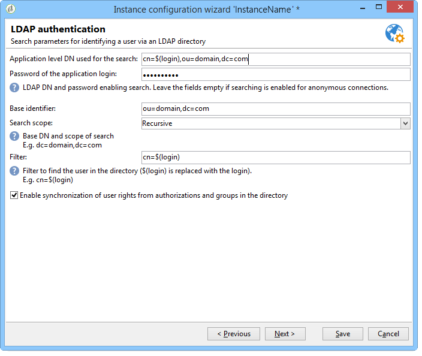

# 通过LDAP连接{#connecting-through-ldap}

## 配置Campaign和LDAP {#configuring-campaign-and-ldap}

>[!NOTE]
>
>LDAP配置仅适用于内部部署或混合安装。

LDAP配置在部署向导中执行。 此 **[!UICONTROL LDAP integration]** 必须在第一个配置步骤中选择选项。 请参阅 [部署向导](../../installation/using/deploying-an-instance.md#deployment-wizard).

通过窗口，您可以通过指定的LDAP目录配置Adobe Campaign用户的标识。

* 在中指定LDAP服务器的地址 **[!UICONTROL LDAP server]** 字段。 您可以添加端口号。 默认情况下，使用的端口为389。
* 在下拉列表中，选择用户的身份验证方法：

   * 加密的密码(**md5**)

     默认模式。

   * 纯文本密码+ SSL (**TLS**)

     整个身份验证过程（包括密码）都经过加密。 在此模式下不得使用安全端口636： Adobe Campaign会自动切换到安全模式。

     使用此身份验证模式时，在Linux中，证书由openLDAP客户端库验证。 我们建议使用有效的SSL证书，以便对身份验证过程进行加密。 否则，信息将以纯文本形式显示。

     该证书在Windows中也经过验证。

   * Windows NT LAN管理器(**NTLM**)

     专有Windows身份验证。 此 **[!UICONTROL Unique identifier]** 仅用于域名。

   * 分布式密码身份验证(**DPA**)

     专有Windows身份验证。 此 **[!UICONTROL Unique identifier]** 仅用于域名(domain.com)。

   * 纯文本密码

     不加密（仅用于测试阶段）。

* 选择用户身份验证模式： **[!UICONTROL Automatically compute the unique user identifier]** （请参阅步骤） [可分辨名称计算](#distinguished-name-calculation))或 **[!UICONTROL Search the unique user identifier in the directory]** （请参阅步骤） [搜索标识符](#searching-for-identifiers))。

## 兼容性 {#compatibility}

兼容的系统取决于所选的身份验证机制。 以下是操作系统和LDAP服务器的兼容性矩阵。

<table> 
 <thead> 
  <tr> 
   <th> </th> 
   <th> OpenLDAP  </th> 
   <th> 活动目录  </th> 
  </tr> 
 </thead> 
 <tbody> 
  <tr> 
   <td> md5  </td> 
   <td> Windows， Linux  </td> 
   <td> Linux  </td> 
  </tr> 
  <tr> 
   <td> TLS  </td> 
   <td> Linux  </td> 
   <td> Windows， Linux  </td> 
  </tr> 
  <tr> 
   <td> NTLM和DPA  </td> 
   <td> </td> 
   <td> Windows  </td> 
  </tr> 
  <tr> 
   <td> 纯文本  </td> 
   <td> Windows， Linux  </td> 
   <td> Windows， Linux  </td> 
  </tr> 
 </tbody> 
</table>

## 可分辨名称计算 {#distinguished-name-calculation}

如果要计算唯一判别名(DN)标识符，则部署向导的下一步允许您配置计算模式。

* 在中指定目录中的用户的唯一标识符（可分辨名称 — DN） **[!UICONTROL Distinguished Name]** 字段。

  **[!UICONTROL (login)]** 将替换为Adobe Campaign运算符的标识符。

  >[!CAUTION]
  >
  >此 **[!UICONTROL dc]** 设置必须为小写。

* 选择选项 **[!UICONTROL Enable synchronization of user rights from authorizations and groups in the directory]** 以同步LDAP目录中的组和用户关联以及Adobe Campaign中的组和用户关联。

  选择此选项时， **[!UICONTROL Application level DN used for the search]** 和 **[!UICONTROL Password of the application login]** 已启用。

  如果您填充这两个字段，Adobe Campaign将使用其自己的登录名和密码连接到LDAP服务器。 如果它们为空，Adobe Campaign将匿名连接到服务器。

## 搜索标识符 {#searching-for-identifiers}

如果选择搜索标识符，部署向导允许您配置搜索。

* 在 **[!UICONTROL Application level DN used for the search]** 和 **[!UICONTROL Password of the application login]** 字段中，提供Adobe Campaign连接以搜索标识符的标识符和密码。 如果它们为空，Adobe Campaign将匿名连接到服务器。
* 指定 **[!UICONTROL Base identifier]** 和 **[!UICONTROL Search scope]** 字段，以确定从中开始搜索的LDAP目录的子集。

  在下拉列表中选择所需的模式：

  

   1. **[!UICONTROL Recursive (default mode)]**.

      从给定级别开始完全搜索LDAP目录。

   1. **[!UICONTROL Limited to the base]**.

      所有属性都包含在搜索中。

   1. **[!UICONTROL Limited to the first sub-level of the base]**.

      对目录的所有属性执行搜索，并从属性的第一级开始。

* 此 **[!UICONTROL Filter]** 字段可让您指定元素以限定搜索范围。

## 配置LDAP授权 {#configuring-ldap-authorizations}

当您选择 **[!UICONTROL Enable synchronization of user rights from authorizations and groups in the directory]** 选项。

您必须指定几个参数才能查找用户所属的组或组及其相应权限，即：

* 该 **[!UICONTROL Database identifier]** 字段，
* 该 **[!UICONTROL Search scope]** 字段，

  >[!NOTE]
  >
  >如果已选择搜索DN，则可以选择 **[!UICONTROL Reuse the DN search parameters]** 以延续上个屏幕中为DN和搜索范围选择的值。

* 该 **[!UICONTROL Rights search filter]** 字段，根据登录名和用户的唯一判别名，
* 该 **[!UICONTROL Attribute containing the group or authorization name]** 有关用户的字段，
* 该 **[!UICONTROL Association mask]** 字段，用于在Adobe Campaign中提取组名称及其相关权限。 您可以使用正则表达式来搜索名称。
* 选择 **[!UICONTROL Enable the connection of users declared in the LDAP directory if the operator is not declared in Adobe Campaign]** 以便自动授予用户连接访问权限。

单击 **[!UICONTROL Save]** 以完成实例的配置。

## 管理操作员 {#managing-operators}

确认配置后，必须定义通过LDAP目录管理哪些Adobe Campaign运算符。

要使用LDAP目录来验证操作员，请编辑相应的配置文件并单击 **[!UICONTROL Edit the access parameters]** 链接。 选择 **[!UICONTROL Use LDAP for authentication]** 选项： **[!UICONTROL Password]** 字段对于此运算符显示为灰色。

## 用例 {#use-cases}

本节提供了一些简单的用例，帮助您根据需求实现最合适的配置。

1. 已在LDAP目录中创建用户，但未在Adobe Campaign中创建用户。

   可以配置Adobe Campaign，以便用户通过其LDAP身份验证访问平台。 Adobe Campaign需要能够控制LDAP目录中ID/密码组合的有效性，以便可以在Adobe Campaign中动态创建运算符。 要执行此操作，请查看 **[!UICONTROL Enable the connection of users declared in the LDAP directory if the operator is not declared in Adobe Campaign]** 选项。 在这种情况下，还需要配置组同步： **[!UICONTROL Enable synchronization of user rights from authorizations and groups in the directory]** 需要选择选项。

1. 用户已在Adobe Campaign中创建，但未在LDAP目录中创建。

   他们将无法登录到Adobe Campaign。

1. LDAP目录中存在一个在Adobe Campaign中不存在的组。

   此组将不会在Adobe Campaign中创建。 您需要创建组并同步这些组，以通过 **[!UICONTROL Enable synchronization of user rights from authorizations and groups in the directory]** 选项。

1. 组存在于Adobe Campaign中，并且在事件后激活LDAP目录： Adobe Campaign中的用户组不会自动替换为LDAP组的内容。 同样，如果某个组仅存在于Adobe Campaign中，则在该组已创建并在LDAP中同步之前，不能向该组添加LDAP用户。

   无论通过Adobe Campaign还是LDAP，组都不会动态创建。 它们需要在Adobe Campaign和LDAP目录中单独创建。

   LDAP目录中的组名称需要与Adobe Campaign组的名称一致。 它们的关联掩码是在部署向导的最后一个配置阶段定义的： Adobe Campaign_(。&#42;)，例如。
