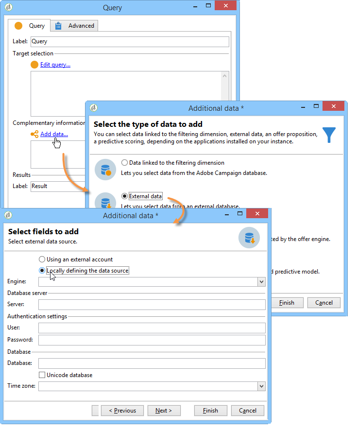

# 连接到数据库 {#connecting-to-the-database}

要启用与外部数据库的连接，必须指示连接参数，即目标数据源和需要加载数据的表的名称。

>[!CAUTION]
>
>Adobe Campaign用户需要外部Adobe Campaign库和应用程序服务器的特定权限才能处理来自外部数据库的数据。 有关详细信息，请参阅[远程数据库访问权限](../../installation/using/remote-database-access-rights.md)部分。
>
>要避免任何故障，访问远程共享数据的操作员必须从不同的空间工作。

## 创建共享连接 {#creating-a-shared-connection}

要启用与共享外部数据库的连接，只要此连接处于活动状态，就可以通过Adobe Campaign访问数据库。

1. 配置必须事先通过&#x200B;**[!UICONTROL Administration > Platform > External accounts]**&#x200B;节点进行定义。
1. 单击&#x200B;**[!UICONTROL New]**&#x200B;按钮并选择&#x200B;**[!UICONTROL External database]**&#x200B;类型。
1. 定义外部数据库的&#x200B;**[!UICONTROL Connection]**&#x200B;参数。

   对于与&#x200B;**ODBC**&#x200B;类型数据库的连接，**[!UICONTROL Server]**&#x200B;字段必须包含ODBC数据源的名称，而不是服务器名称。 此外，可能需要某些附加配置，具体取决于所使用的数据库。 请参阅[按数据库类型](../../installation/using/configure-fda.md)的特定配置部分。

1. 输入参数后，单击&#x200B;**[!UICONTROL Test the connection]**&#x200B;按钮进行批准。

   

1. 如有必要，请取消选中&#x200B;**[!UICONTROL Enabled]**&#x200B;选项，以禁用对此数据库的访问，而不删除其配置。
1. 要允许Adobe Campaign访问此数据库，必须部署SQL函数。 单击&#x200B;**[!UICONTROL Parameters]**&#x200B;选项卡，然后单击&#x200B;**[!UICONTROL Deploy functions]**&#x200B;按钮。

   

您可以在&#x200B;**[!UICONTROL Parameters]**&#x200B;选项卡中为表和索引定义特定工作表空间。

## 创建临时连接{#creating-a-temporary-connection}

您可以直接从工作流活动定义到外部数据库的连接。 在这种情况下，它将位于本地外部数据库上，保留用于当前工作流：它不会保存在外部帐户上。 此类型的准时连接可在工作流的不同活动上创建，尤其是&#x200B;**[!UICONTROL Query]**、**[!UICONTROL Data loading (RDBMS)]**、**[!UICONTROL Enrichment]**&#x200B;活动或&#x200B;**[!UICONTROL Split]**&#x200B;活动。

>[!CAUTION]
>
>不建议使用此类型的配置，但可定期用于收集数据。 但是，您应创建外部帐户，如[创建共享连接](#creating-a-shared-connection)部分中所示。

例如，在查询活动中，创建与外部数据库的定期连接的步骤如下：

1. 单击&#x200B;**[!UICONTROL Add data...]**&#x200B;并选择&#x200B;**[!UICONTROL External data]**&#x200B;选项。
1. 选择&#x200B;**[!UICONTROL Locally defining the data source]**&#x200B;选项。

   

1. 在下拉目标卡中选择列表库引擎。 输入服务器的名称并提供身份验证参数。

   还指定外部数据库的名称。

   

   单击 **[!UICONTROL Next]** 按钮。

1. 选择存储数据的表。

   您可以直接在相应字段中输入表的名称，或单击编辑图标以访问列表库表。

   

1. 单击&#x200B;**[!UICONTROL Add]**&#x200B;按钮，在外部数据库数据和Adobe Campaign库中的数据之间定义一个或多个对帐字段。 **[!UICONTROL Remote field]**&#x200B;和&#x200B;**[!UICONTROL Local field]**&#x200B;的&#x200B;**[!UICONTROL Edit expression]**&#x200B;图标允许您访问每个表的字段列表。

   

1. 如有必要，请指定过滤条件和数据排序模式。
1. 选择要在外部数据库中收集的其他数据。 为此，多次单击要添加的字段，以在&#x200B;**[!UICONTROL Output columns]**&#x200B;中显示这些字段。

   

   单击&#x200B;**[!UICONTROL Finish]**&#x200B;以确认此配置。

## 安全连接{#secure-connection}

>[!NOTE]
>
>安全连接仅对PostgreSQL可用。

在配置外部联合数据访问帐户时，可以保护对外部数据库的访问。

为此，请在使用的端口的服务器地址和地址后添加“**:ssl**”。 例如：**192.168.0.52:4501:ssl**。

数据随后将通过安全SSL协议发送。

## 其他配置 {#additional-configurations}

如有必要，您可以创建用于处理外部模式库中数据的。 同样，Adobe Campaign允许您定义外部表中数据的映射。 这些配置是常规配置，不仅适用于工作流。

>[!NOTE]
>
>有关在Adobe Campaign中创建模式和定义新数据映射的详细信息，请参阅[此页](../../configuration/using/about-schema-edition.md)。