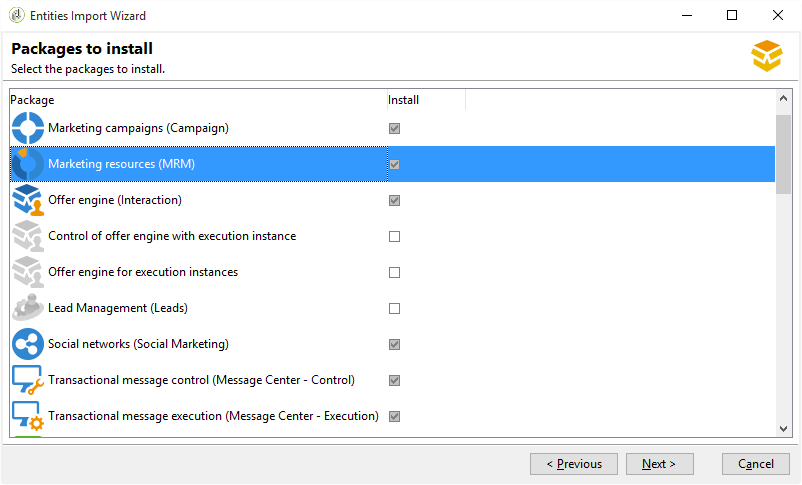

# 创建和配置数据库{#creating-and-configuring-the-database}

在创建数据库时，Adobe Campaign提供两种不同的选项：

1. 创建或回收数据库：如果要创建新数据库或重复使用现有数据库，请选择此选项。 请参阅[案例1：创建/回收数据库](#case-1--creating-recycling-a-database)。
1. 使用现有数据库：如果管理员已经创建了空数据库并且您想使用它，请选择此选项；或者扩展现有数据库的结构。 请参阅[案例2：使用现有数据库](#case-2--using-an-existing-database)。

配置步骤详见下文。

>[!CAUTION]
>
>数据库、用户和架构的名称不能以数字开头或包含特殊字符。
>
>只有&#x200B;**内部**&#x200B;标识符才能执行这些操作。 如需详细信息，请参阅[此小节](../../installation/using/configuring-campaign-server.md#internal-identifier)。

## 案例1：创建/回收数据库 {#case-1--creating-recycling-a-database}

下面介绍了创建数据库或回收现有数据库的步骤。 某些配置取决于所使用的数据库引擎：

涉及以下步骤：

* [步骤1 — 选择数据库引擎](#step-1---selecting-the-database-engine)，
* [步骤2 — 连接到服务器](#step-2---connecting-to-the-server)，
* [步骤3 — 数据库的连接和特性](#step-3---connection-and-characteristics-of-the-database)，
* [步骤4 — 要安装的包](#step-4---packages-to-install)，
* [步骤5 — 创建步骤](#step-5---creation-steps)，
* [步骤6 — 创建数据库](#step-6---creating-the-database)。

### 步骤1 — 选择数据库引擎 {#step-1---selecting-the-database-engine}

从下拉列表中的数据库引擎中选择数据库引擎。


Campaign [兼容性矩阵](../../rn/using/compatibility-matrix.md)中列出了支持的数据库。

识别服务器并选择要执行的操作类型。 在这种情况下，**[!UICONTROL Create or recycle a database]**。


根据所选数据库引擎，服务器标识信息可能会有所不同。

* 对于&#x200B;**Oracle**&#x200B;引擎，请填充为应用程序服务器定义的&#x200B;**TNS名称**。
* 对于&#x200B;**PostgreSQL**&#x200B;引擎，必须指定在应用程序服务器上定义的DNS名称（或IP地址）以访问数据库服务器。
* 对于&#x200B;**Microsoft SQL Server**&#x200B;引擎，必须定义：在应用程序服务器上定义的DNS名称（或IP地址）以访问数据库服务器： **DNS**&#x200B;或&#x200B;**DNS`\<instance>`**（实例模式），

  >[!CAUTION]
  >
  > 从20.3开始，Windows NT身份验证已停用。 **[!UICONTROL SQL Server authentication]**&#x200B;现在是Microsoft SQL Server唯一可用的身份验证模式。 [了解更多信息](../../rn/using/deprecated-features.md)

  

### 步骤2 — 连接到服务器 {#step-2---connecting-to-the-server}

在&#x200B;**[!UICONTROL Server access]**&#x200B;窗口中，定义数据库服务器访问。


为此，请输入有权访问数据库的&#x200B;**管理系统帐户**&#x200B;的名称和密码，即：

* oracle数据库的&#x200B;**system**，
* Microsoft SQL Server数据库的&#x200B;**sa**，
* PostgreSQL数据库的&#x200B;**postgres**，

### 步骤3 — 数据库的连接和特征 {#step-3---connection-and-characteristics-of-the-database}

以下步骤允许您配置登录到数据库的设置。


您需要定义以下设置：

* 指定要创建的数据库的名称。
* 输入链接到该数据库的帐户的密码。
* 指示数据库是否必须采用Unicode。

  通过&#x200B;**[!UICONTROL Unicode database]**&#x200B;选项，无论使用何种语言，都可以以Unicode存储所有字符类型。

  >[!NOTE]
  >
  >对于Oracle的数据库，**[!UICONTROL Unicode storage]**&#x200B;选项允许您使用&#x200B;**NCLOB**&#x200B;和&#x200B;**NVARCHAR**&#x200B;类型字段。
  > 
  >如果不选择此选项，则Oracle数据库的字符集(charset)必须启用所有语言的数据存储（建议使用AL32UTF8）。

* 选择数据库的时区，并指定是否希望数据库采用UTC时区（如果可用）。

  有关详情，请参阅[时区管理](../../installation/using/time-zone-management.md)。

### 步骤4 — 要安装的包 {#step-4---packages-to-install}

选择要安装的包。

请参阅您的许可协议，以查看您有权安装的解决方案和选项，例如“交互”或“社交营销”。



### 步骤5 — 创建步骤 {#step-5---creation-steps}

**[!UICONTROL Creation steps]**&#x200B;窗口允许您显示和编辑用于创建表的SQL脚本。


* 对于Oracle、Microsoft SQL Server或PostgreSQL数据库，管理员还可以定义创建数据库对象时要使用的&#x200B;**存储参数**。

  这些参数将收到准确的表空间名称（警告：区分大小写）。 它们分别存储在以下选项的&#x200B;**[!UICONTROL Administration > Platform > Options]**&#x200B;节点中（请参阅[此部分](../../installation/using/configuring-campaign-options.md#database)）：

   * **WdbcOptions_TableSpaceUser**：基于架构的用户表
   * **WdbcOptions_TableSpaceIndex**：基于架构的用户表的索引
   * **WdbcOptions_TableSpaceWork**：没有架构的工作表
   * **WdbcOptions_TableSpaceWorkIndex**：没有架构的工作表索引

* 对于Oracle数据库，Adobe Campaign用户必须有权访问Oracle库，通常作为&#x200B;**oinstall**&#x200B;组的成员。
* **[!UICONTROL Set or change the administrator password]**&#x200B;选项允许您输入链接到Adobe Campaign操作员的密码，该操作员具有管理员权限。

  出于安全考虑，我们建议您定义Adobe Campaign帐户管理员密码。

### 步骤6 — 创建数据库 {#step-6---creating-the-database}

利用该向导的最后一个阶段，可以创建数据库。 单击 **[!UICONTROL Start]** 确认。


创建数据库后，可以重新连接以完成实例配置。

现在必须启动部署向导才能完成实例配置。 请参阅[部署向导](../../installation/using/deploying-an-instance.md#deployment-wizard)。

链接到实例的数据库的连接设置存储在Adobe Campaign安装目录中的文件&#x200B;**`/conf/config-<instance>.xml`**&#x200B;中。

在base61数据库上链接到“campaign”帐户及其加密密码的Microsoft SQL Server配置示例：

```
<dbcnx encrypted="1" login="campaign:myBase" password="myPassword" provider="DB" server="dbServer"/>
```

## 案例2：使用现有数据库 {#case-2--using-an-existing-database}

数据库以及用户必须由数据库管理员创建，并且已正确配置访问权限。

例如，对于Oracle数据库，所需的最低权限为：GRANTCONNECT、RESOURCE和UNLIMITED TABLESPACE。

要使用现有数据库，配置步骤如下：

* [步骤1 — 选择数据库引擎](#step-1---choosing-the-database-engine)，
* [步骤2 — 数据库连接设置](#step-2---database-connection-settings)，
* [步骤3 — 要安装的包](#step-3---packages-to-install)，
* [步骤4 — 创建步骤](#step-4---creation-steps)，
* [步骤5 — 创建数据库](#step-5---creating-the-database)。

### 步骤1 — 选择数据库引擎 {#step-1---choosing-the-database-engine}

从下拉列表中选择数据库引擎。


确定服务器并选择要执行的操作类型。 在这种情况下，**[!UICONTROL Use an existing database]**。


根据所选数据库引擎，服务器标识信息可能会有所不同。

* 对于&#x200B;**Oracle**&#x200B;引擎，请填充为应用程序服务器定义的&#x200B;**TNS名称**。
* 对于&#x200B;**PostgreSQL**&#x200B;引擎，必须指定在应用程序服务器上定义的DNS名称（或IP地址）以访问数据库服务器。
* 对于&#x200B;**Microsoft SQL Server**&#x200B;引擎，您必须定义：

   1. 在应用程序服务器上定义用于访问数据库服务器的DNS名称（或IP地址），
   1. 用于访问Microsoft SQL Server的安全方法： **[!UICONTROL SQL Server authentication]**&#x200B;或&#x200B;**[!UICONTROL Windows NT authentication]**。

      

### 步骤2 — 数据库连接设置 {#step-2---database-connection-settings}

在&#x200B;**[!UICONTROL Database]**&#x200B;窗口中，定义数据库连接设置。


您需要定义以下设置：

* 输入要使用的数据库的名称，
* 输入与此数据库关联的帐户的名称和密码，

  >[!NOTE]
  >
  >确保架构名称和用户名匹配。 建议通过Campaign控制台客户端创建数据库。
  >对于Oracle数据库，无需输入帐户名。

* 指示数据库是否应为Unicode。

### 步骤3 — 要安装的包 {#step-3---packages-to-install}

选择要安装的包。

请参阅您的许可协议，查看您有权安装的解决方案和选项，如“互动”或“潜在客户”。


### 步骤4 — 创建步骤 {#step-4---creation-steps}

**[!UICONTROL Creation steps]**&#x200B;窗口允许您显示和编辑用于创建表的SQL脚本。


* 对于Oracle、Microsoft SQL Server或PostgreSQL数据库，管理员可以定义在创建数据库对象时要使用的&#x200B;**存储参数**。
* 对于Oracle数据库，Adobe Campaign用户必须有权访问Oracle库，通常作为&#x200B;**oinstall**&#x200B;组的成员。
* **[!UICONTROL Set or change the administrator password]**&#x200B;选项允许您输入链接到Adobe Campaign操作员的密码，该操作员具有管理员权限。

  出于安全考虑，我们建议您定义Adobe Campaign帐户管理员密码。

### 步骤5 — 创建数据库 {#step-5---creating-the-database}

利用该向导的最后一个阶段，可以创建数据库。 单击 **[!UICONTROL Start]** 确认。


数据库创建完成后，可以重新连接以完成实例配置。

现在必须启动部署向导才能完成实例配置。 请参阅[部署向导](../../installation/using/deploying-an-instance.md#deployment-wizard)。

链接到实例的数据库的连接设置存储在Adobe Campaign安装目录中的文件&#x200B;**`/conf/config-<instance>.xml`**&#x200B;中。

在base61数据库上链接到“campaign”帐户及其加密密码的Microsoft SQL Server配置示例：

```
<dbcnx encrypted="1" login="campaign:myBase" password="myPassword" provider="DB" server="dbServer"/>
```
