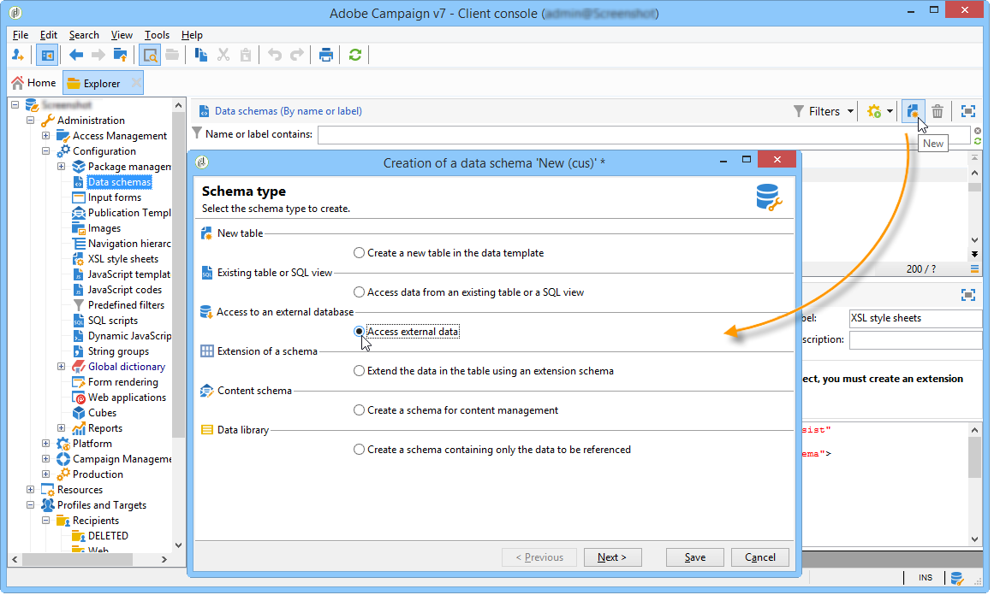
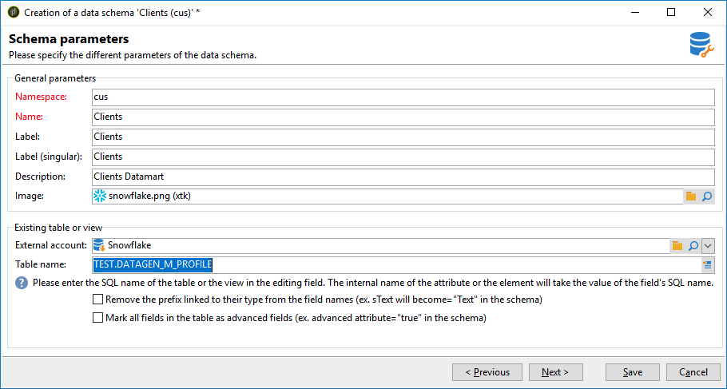

# 创建数据架构 {#creating-the-data-schema}

要在外部数据库上创建方案，请执行以下操作：

1. 单击数据架构列表上方的&#x200B;**[!UICONTROL New]**&#x200B;按钮，然后选择&#x200B;**[!UICONTROL Access external data]**。

   

1. 输入架构的&#x200B;**[!UICONTROL Namespace]**&#x200B;和&#x200B;**[!UICONTROL Name]**，然后选择将启用数据库连接的&#x200B;**[!UICONTROL External account]**。 这将允许访问外部库中可用的表列表。

   

1. 从&#x200B;**[!UICONTROL Table name]**&#x200B;字段中，选择包含要收集的数据的表。

   使用Snowflake，如果数据库用户已被授予正确的权限，则可以在此处选择您的视图。 请注意，在使用视图时，Adobe Campaign将无法自动生成XML架构，您必须自行创建。 有关视图的详细信息，请参阅[Snowflake文档](https://docs.snowflake.com/en/user-guide/views-introduction.html)。

   

1. 单击 **[!UICONTROL OK]** 确认。 Adobe Campaign会自动检测选定表的结构并生成逻辑架构。 请注意，Adobe Campaign不生成链接。

1. 单击&#x200B;**[!UICONTROL Save]**&#x200B;确认创建。

   >[!CAUTION]
   >
   >使用Snowflake时，主键是必需的。

   

映射表（标准或FDA映射）时会自动创建索引。
