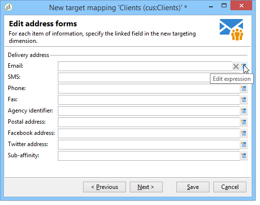

# 定义外部数据映射 {#defining-data-mapping}

Adobe Campaign允许您定义外部表中数据的映射。

要实现此目的，在创建外部表的架构后，您需要创建新的投放映射，以将此表中的数据用作投放目标。

要执行此操作，请应用以下步骤：

1. 创建新的投放映射，然后选择定向维度，例如您刚刚创建的架构。

   

1. 指示存储投放信息的字段（姓氏、名字、电子邮件、地址等）。

   

1. 指定用于信息存储的参数，包括扩展架构的后缀，以便它们易于识别。

   

   您可以选择是存储排除项(**excludelog**)、包含消息(**broadlog**)还是存储在单独的表中。

   您还可以选择是否管理此投放映射(**trackinglog**)的跟踪。

1. 然后，选择要考虑的扩展。 扩展类型取决于平台的参数和选项（查看您的许可合同）。

   

   单击&#x200B;**[!UICONTROL Save]**&#x200B;按钮以启动投放映射创建：根据所选参数自动创建所有链接表。
